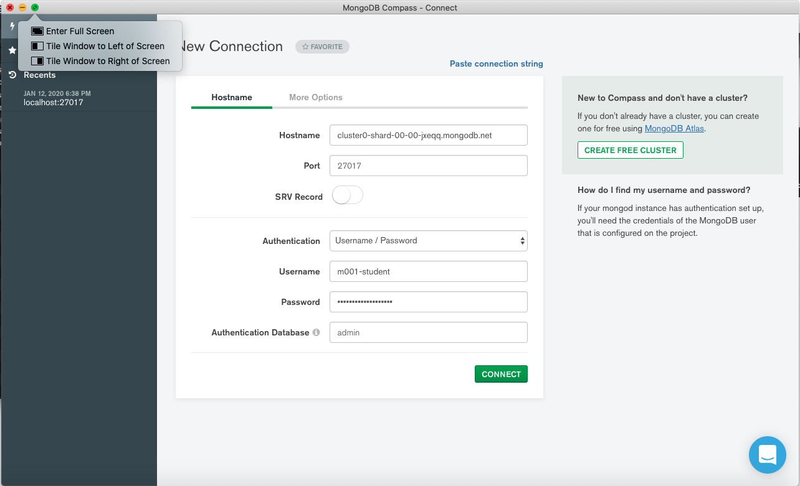
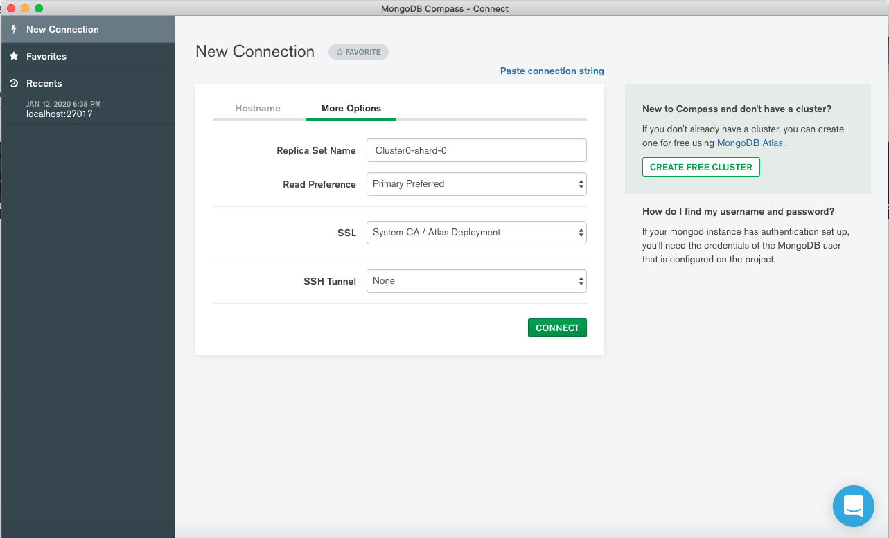
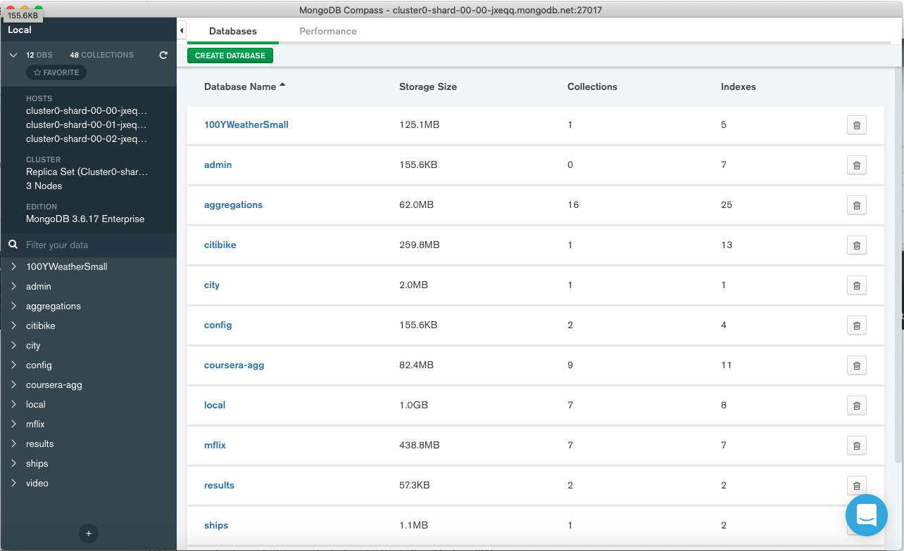

# Chapter 1: Introduction

## Lecture:  Welcome! (Quiz)

## Lecture: Granding and Logistics (Quiz)

A medida que comenzamos con este curso, me gustaría hablar sobre la calificación y algunos otros aspectos logísticos solo para asegurarme de que sepa cómo funciona este curso.

Verá tres tipos diferentes de ejercicios en este curso: cuestionarios, laboratorios, que también llamamos tarea, y un examen final.

Verá cuestionarios después de la mayoría de los videos de lecciones en este curso.

Todas las pruebas no están calificadas.

Están allí para permitirle evaluar su comprensión del material de la lección.

Verá laboratorios, o tareas, como a veces los llamamos, a lo largo de cada capítulo.

Los puntajes que obtiene en sus laboratorios representan el 50% de su calificación final.

Luego, al final del curso, hay un examen final.

Esto representa el otro 50% de su calificación.

En términos de un horario del curso, en la primera semana de este curso, lanzamos el capítulo uno.

Lanzamos el capítulo dos en la segunda semana, y luego en la tercera semana del curso, lanzamos tanto el capítulo tres como el examen final.

Y no te preocupes, estos dos juntos son lo suficientemente cortos como para que puedas completarlos todos en la semana tres.

Asegúrese de revisar el programa del curso para conocer las fechas exactas de lanzamiento de las semanas uno, dos y tres.

En el plan de estudios, también encontrará las fechas de vencimiento de cuándo deben entregarse los laboratorios o la tarea para cada semana.

Una vez que hayamos aprobado la fecha límite para el examen final, si ha logrado una calificación de 65% o más, recibirá una declaración de finalización de este curso.

Y nuevamente, generamos las declaraciones de finalización después de la fecha de vencimiento para el examen final.

Eso es todo para el curso esencial de logística.

Nos alegra que estés aprendiendo con nosotros y buena suerte.

## Lecture: Are you Behind a Firewall?

### ¿Estás detrás de un firewall?

Para continuar en este curso, debe poder realizar solicitudes salientes desde su computadora a los servidores de bases de datos que hemos configurado en MongoDB Atlas. Esos servidores se ejecutan en el puerto 27017 en Amazon AWS.

**Confirme que el puerto 27017 no está bloqueado haciendo clic en [http://portquiz.net:27017](http://portquiz.net:27017).**

Si tiene éxito, verá una carga de página que indica que puede realizar solicitudes salientes en el puerto 27017.

Si una página no se carga y su solicitud finalmente agota el tiempo, el tráfico saliente al puerto 27017 probablemente esté bloqueado en su red local. Si este es el caso, comuníquese con su departamento de TI para ver si hay una solución o intente realizar la solicitud desde otra ubicación.

Otras pruebas útiles para realizar si parece que tiene dificultades para conectarse serían:

1. Conéctese al host y al puerto del clúster Atlas con:

```sh
telnet cluster0-shard-00-00-jxeqq.mongodb.net 27017
```

2. Conéctese al host y al puerto del clúster Atlas con:

```sh
ping cluster0-shard-00-00-jxeqq.mongodb.net
```

## Lecture: Connecting to MongoDB Using Compass

### Lecture Notes

En este curso haremos un uso extensivo de MongoDB Compass para aprender a usar MongoDB.

1. Descargue Compass del [MongoDB Download Center](https://www.mongodb.com/download-center/compass). Si ya instaló Compass, asegúrese de estar utilizando la **última versión (estable) de Compass** y actualice si es necesario. Asegúrese de **no** descargar la versión "Community Edition Stable".

2. Instale Compass en su computadora desde la descarga.
3. Lance Compass.

Cuando se abra Compass, verá una página titulada "Connect to Host".


4. Use la siguiente información para completar este formulario, pero no haga clic en "Connect" todavía.

   **Hostname**: cluster0-shard-00-00-jxeqq.mongodb.net

   **Username**: m001-student

   **Password**: m001-mongodb-basics

   **Replica Set Name**: Cluster0-shard-0

   **Read Preference**: Primary Preferred

5. Haga clic en "Add to Favorites" e ingrese `M001 RS` como el **Favorite Name**. Agregar esta conexión como favorita le permitirá volver a conectarse fácilmente a nuestra implementación MongoDB de clase después de cerrar y reiniciar Compass.

6. Ahora, haga clic en "Connect" y cargue las bases de datos en la implementación de MongoDB clase M001.

### Transcript

En esta lección, comenzaremos nuestra exploración de MongoDB.

Para hacer esto, usaremos Compass, que es el cliente MongoDB GUI.

Si aún no lo ha hecho, abra Compass y siga mientras avanzamos en esta lección.

He incluido instrucciones para descargar y lanzar Compass en las notas de esta lección.

Compass proporciona una interfaz de usuario para ver las bases de datos MongoDB y los documentos que contienen.

También es compatible con el lenguaje de consulta MongoDB, y nos permite leer y escribir datos utilizando una serie de comodidades para crear consultas.

Aquí estamos mirando la pantalla de conexión de Compass.


En el lado izquierdo, debería ver una barra de navegación, con secciones para Favoritos y Conexiones recientes.

En la vista central aquí, debería ver un formulario que podemos usar para establecer una conexión a un clúster MongoDB.

Tenga en cuenta que Compass se desarrolla activamente.

Puede haber diferencias entre la IU que muestro aquí y lo que está viendo ahora.

En un momento, nos conectaremos a un clúster MongoDB que hemos configurado para esta clase.

Este clúster se ejecuta en [MongoDB Atlas](https://www.mongodb.com/cloud/atlas), alojado en MongoDB como plataforma de servicio.


Consulte las notas de la conferencia para obtener más información sobre MongoDB Atlas.

Tampoco se preocupe por mi uso del término clúster,  si no te es familiar. Por ahora, no es importante.

En una lección posterior, profundizaremos en lo que es un clúster MongoDB. 

Bien, ahora estamos listos para conectarnos.

Puede ver el nombre de host de nuestro clúster aquí.

También lo he incluido en las notas de clase a continuación.

Nos conectaremos en el puerto predeterminado de 27017.

Como método de autenticación, utilizaremos la contraseña del nombre de usuario.

Utilice el nombre de usuario **`m001-student`**.

Y la contraseña **`m001-mongodb-basics`

Utilizaremos **`admin`** como la base de datos de autenticación.

Y especificaremos para el campo SSL la opción **`System CA / Atlas Deployment`** .

Esto simplemente significa que encriptaremos el tráfico entre Compass y nuestro clúster Atlas.

Finalmente, antes de presionar el botón `CONNECT`, cree un favorito para esta conexión al que pueda volver fácilmente.

Ahora haga clic en el botón `CONNECT` y cargue las bases de datos en la implementación de MongoDB clase M001.





## Lecture: Databases, Collections, and Documents (Quiz)

### Transcript

Una vez conectado, debería ver una pantalla que se ve así.



Aquí en el panel principal, podemos ver una lista de las bases de datos contenidas en este clúster.

En MongoDB, una **base de datos** sirve como espacio de nombres para **colecciones**.

Las colecciones almacenan registros individuales llamados **documentos**.

Este gráfico ilustra la relación entre bases de datos, colecciones y documentos.


Esta jerarquía nos permite agrupar registros de elementos similares dentro de colecciones, y agrupar colecciones requeridas para la misma aplicación dentro de la misma base de datos.

También podemos establecer políticas de seguridad que autoricen a los usuarios con diferentes roles y diferentes niveles de acceso a la base de datos, o nivel de recopilación.

MongoDB actualmente no admite configuraciones de autorización específicas para documentos individuales.

Cada combinación de base de datos y colección define un espacio de nombres.

Por lo general, hacemos referencia a una colección específica expresando el nombre de la base de datos, seguido de un punto, seguido del nombre de la colección.


Volviendo a Compass, aquí tenemos una lista de todas las bases de datos en este clúster.


Con un poco de información sobre el tamaño de la base de datos, la cantidad de colecciones que contiene y la cantidad de índices en estas colecciones.

No diremos demasiado sobre los índices en este curso.

Querrás tomar el curso de **MongoDB performance course** (rendimiento MongoDB) para eso. Simplemente busque **M201** en el sitio web de la universidad MongoDB.

Por cierto, si la lista de bases de datos que está viendo difiere un poco de lo que estoy mostrando aquí, no se preocupe por eso.

Actualizamos este clúster de vez en cuando con nuevos conjuntos de datos.

## Lecture: Exploring Datasets in Compass

Bien, ahora examinemos algunas de las colecciones en este clúster.

Si mira a la izquierda en la interfaz de Compass, verá un panel de navegación que contiene una lista de todas las bases de datos en el clúster al que estamos conectados, con las colecciones que esas bases de datos contienen anidadas debajo de ellas.

Tenga en cuenta que puede volver a esta vista en cualquier momento haciendo clic en el icono de Inicio.

Sin embargo, ahora queremos sumergirnos en las colecciones aquí.

Tenemos bastantes bases de datos aquí.

Estas son las colecciones que usaremos a lo largo del curso.

Contienen una variedad de tipos de datos y una gama de modelos de datos, para que podamos ilustrar diferentes características de MongoDB.

Para acceder a los documentos dentro de cualquier colección, simplemente ubique la colección en este panel de navegación y haga clic.

Como ejemplo, echemos un vistazo a la colección de movies (películas) de la base de datos de videos.

Al hacer clic en esta colección, debería ver una vista de esquema para la colección que aparece en el panel principal.


La vista de esquema proporciona una lista de los campos encontrados en documentos dentro de esta colección.

Como es de esperar para las películas, tenemos campos para director, género, trama y una serie de otras características relevantes para las películas.

A medida que avanzamos, podemos ver todos los campos encontrados en los documentos de esta colección.


Nuevamente, esta vista proporciona un resumen del esquema, o modelo de datos, para los documentos de esta colección.

Tenemos la lista de campos, sus tipos de datos y un resumen del rango de valores para cada campo que se encuentra en todos los documentos de la colección.

Volveremos a un tutorial más detallado de esta información en una lección posterior.

Por ahora, profundicemos un poco en esta colección y veamos algunos documentos específicos.

Si hacemos clic en la pestaña Documentos, debería ver una lista de documentos dentro de esta colección.


Esta vista nos brinda la posibilidad de examinar los datos reales encontrados en esta colección.

Aquí podemos ver un documento que registra los detalles de una película de un minuto de duración llamada Carmencita que se produjo en 1894.

A medida que nos desplazamos por esta vista, podemos ver otros documentos en esta colección.

En lecciones posteriores, veremos cómo consultar estos datos para encontrar documentos que coincidan con un conjunto específico de criterios de filtro.

También aprenderemos cómo insertar nuevos documentos y actualizar los existentes, con nuevos datos.

Continúe y explore un poco estos datos y eche un vistazo a las otras colecciones en este grupo de Atlas.

Y luego, pase a la siguiente lección.

## Lab 1.1: Install Compass and Connect

Problema:

Si aún no ha descargado Compass, siga estas instrucciones antes de responder la siguiente pregunta.

1. Descargue Compass del [MongoDB Download Center](https://www.mongodb.com/download-center/compass).
2. Instale Compass en su computadora desde la descarga.
   Asegúrese de estar utilizando la **última versión (estable) de Compass** y actualice si es necesario. Asegúrese de **no** descargar la versión "Community Edition Stable".
3. Lance Compass.


4. Use la siguiente información para completar este formulario, pero no haga clic en "Connect" todavía.

   **Hostname**: cluster0-shard-00-00-jxeqq.mongodb.net

   **Username**: m001-student

   **Password**: m001-mongodb-basics

   **Replica Set Name**: Cluster0-shard-0

   **Read Preference**: Primary Preferred

5. Ingrese `M001 RS` como **Favorite Name** y haga clic en "CREATE FAVORITE". Agregar esta conexión como favorita le permitirá volver a conectarse fácilmente a nuestra implementación MongoDB de clase después de cerrar y reiniciar Compass.

6. Ahora, haga clic en "Connect".

Pregunta ¿Cuál de los siguientes nombres de campo aparecen en los documentos de la colección de **movies** de la base de datos de video? Marque todo lo que corresponda.

Intentos restantes: quedan 3 intentos

Marque todas las respuestas que apliquen:

Cuando se abra Compass, verá una página titulada "Connect to Host".

## Lecture: Documents: Scalar Value Types (Quiz)

### Lecture Notes

**Nota** : Tenga en cuenta que el campo `lastUpdated` es mencionado por Shannon en el video pero no está presente en el conjunto de datos.

### Transcript

En esta lección, exploraremos algunos de los tipos de datos escalares que admite MongoDB y cómo determinar el tipo de valor de un campo en particular utilizando la vista de esquema de Compass.

Observamos el array, el documento y lo que a menudo llamo tipos de valores especiales en otras lecciones.

Aquí, estamos viendo la vista de esquema para la colección movies de video.


Ahora, he colapsado el panel de navegación a la izquierda usando este control para que tengamos un poco más de espacio en pantalla para trabajar.


A medida que nos desplazamos por el panel principal, debería ver una serie de campos aquí.

En la vista de esquema, un campo está representado por su nombre (**genre**), su tipo (**string**) y un gráfico que refleja el rango de valores para ese campo en esta colección y qué fracción de documentos tiene un valor dado.


Como ejemplo, echemos un vistazo con más detalle al campo de género.

Para este campo, vemos el nombre **genre*.

Inmediatamente a continuación hay una descripción del tipo de valor para este campo **string** según lo determinado por los documentos de muestra en esta colección.

A lo largo de la vista de esquema de Compass, al pasar el cursor sobre los elementos se proporcionan más detalles.

Si pasamos el cursor sobre la barra inmediatamente debajo del especificador de tipo de valor, debería ver el valor 100%.

Esto nos dice que el 100% de los documentos en esta colección contienen un valor de cadena para este campo.

A la derecha del nombre y tipo hay un gráfico que muestra un rango de valores para este campo y qué fracción de documentos en esta colección contiene valores específicos.

Examinar los valores nos da una idea de todos los valores que tiene este campo en los documentos de esta colección.

Y si pasamos el cursor sobre cualquier elemento específico de este gráfico, podemos ver qué fracción de documentos tiene un valor específico.

Aquí podemos ver que el 5% de los documentos de esta colección describen películas en el género de comedia.


Es importante tener en cuenta que el rango de valores y la fracción de documentos con un valor dado, según lo informado por Compass, se basa en una muestra de documentos en la colección.

En este ejemplo, la muestra es lo suficientemente grande como para que vea un resumen preciso, pero existe la posibilidad de que el resumen cambie ligeramente de una vista a otra.

A medida que nos desplazamos por el resto de la vista de esquema para esta colección, puede ver que Compass proporciona el nombre, una descripción del tipo de valor y un resumen del rango y fracción de documentos que tienen un valor específico para todos los campos encontrados dentro de los documentos en un colección.

Además de las strings, otros valores comunes para documentos MongoDB incluyen integers, floating point values, y dates.

Veamos el campo **year**.


Puede ver desde la vista de esquema que los valores para este campo son int32, lo que significa que son enteros de 32 bits.

Mirando el gráfico de valores, podemos ver que el valor mínimo es 1.897 y el valor máximo es 2.017.

También podemos ver que la cantidad de películas en esta colección para los años más recientes es mucho mayor que para los períodos de hace 100 años o más.

Mientras hojeamos las barras aquí, podemos ver que cada una representa un período de aproximadamente cinco años.


Ahora veamos algunos valores de coma flotante por ejemplo el campo **viewerRating**.


Si nos desplazamos hacia el campo de calificación del espectador, verá un rango de valores de 1.4 a 9.6, lo que parece razonable para una escala de calificación del espectador para películas.

Y nuevamente, podemos ver que la mayoría de los valores están en algún lugar en este rango mediocre, con muchas menos calificaciones extremadamente bajas o muy, muy altas.

El tipo de datos double es una opción para representar valores de coma flotante.

Como probablemente sepa, la aritmética de coma flotante, aunque es lo suficientemente buena para muchas aplicaciones, es imprecisa.

MongoDB también proporciona un **tipo de datos decimales** para transacciones financieras y otras aplicaciones que requieren aritmética de coma flotante precisa.

Ahora puede que se pregunte por qué estamos viendo varios tipos de valores listados para la calificación del espectador.

De hecho, tenemos algunos valores dobles y algunos valores int32, así como una proporción de documentos para los que este campo no está definido (**undefined**).


Una de las ventajas reales de la vista de esquema de Compass es que le da una idea de qué valores tienen realmente los campos en su colección.

Y para una colección que es tan grande, esto puede ser extremadamente útil cuando realiza tareas como la limpieza de datos.

Esto indica que podríamos tener un poco de trabajo por hacer para asegurarnos de que todas las calificaciones de los espectadores sean del mismo tipo de datos.

El hecho de que, para muchas películas, la calificación del espectador no esté definida, no es necesariamente un problema porque simplemente podríamos no tener datos sobre las calificaciones del espectador para una fracción considerable de nuestro conjunto de datos.

La conclusión importante aquí es que Compass identifica campos para los que hay una combinación de tipos de valores.

Esto es valioso para los desarrolladores o administradores que podrían estar tratando de depurar un problema que tiene que ver con el tipo de datos para un campo en particular.

También es útil para considerar lo que se debe hacer desde un punto de vista de secuencias de comandos, por ejemplo, cuando se hace necesario migrar un modelo de datos de un esquema a otro.

En esta lección, hemos analizado los tipos de valores escalares en MongoDB y cómo usar Compass para determinar los tipos de valores para un campo y tener una idea del rango de valores en ese campo para documentos en una colección.

Los ejemplos que hemos visto en la lección no brindan una descripción completa de los tipos de valores escalares que admite MongoDB.

Sin embargo, son los más comunes.

Antes de cerrar esta lección, echemos un vistazo a un tipo de valor adicional.

Me gustaría ver un campo que nos muestra un ejemplo de fechas.

El campo **last updated** proporciona un registro de cuándo se actualizaron por última vez los datos (clasificaciones y demás) de un documento de película determinado, es decir, cuándo se escribió por última vez un documento en la colección.


Para los valores de fecha, Compass hace algo realmente valioso.

Puede ver aquí que Compass proporciona el rango de valores de fecha de una manera que indica algo así como la densidad de valores en cada fecha del rango.

Justo encima de esto, puede ver un informe de qué fracción de valores de fecha para el campo en cuestión cae cada día, aquí y a qué hora del día, aquí.

En esta lección, hemos analizado los tipos de valores escalares en MongoDB y cómo usar Compass para determinar los tipos de valores para un campo y tener una idea del rango de valores en ese campo para documentos en una colección.

Los ejemplos que hemos visto en esta lección no proporcionan una descripción general completa de los tipos de valores escalares que admite MongoDB.

Sin embargo, estos son los más comunes: int32, double, string y date.

Completamos una revisión más completa de los tipos de datos de MongoDB en otra lección sobre el formato binario en el que MongoDB almacena documentos.

## Lecture: MongoDB Documents: Fields with Documents as Values

En esta lección, veremos los tipos de valores agregados que admite MongoDB y también analizaremos el soporte para datos geoespaciales.

En Compass, veamos el conjunto de datos meteorológicos de 100 años **100YWeatherSmall**, navegando al espacio de nombre de datos de punto de 100 años en nuestro clúster Atlas.

Podemos hacer eso de la siguiente manera.

Primero hacemos clic en la base de datos, y luego en la colección.

Veamos la vista de esquema para esta colección.


Ahora, este conjunto de datos proporciona lecturas del clima para ubicaciones en todo el mundo.

Para este conjunto de datos, es importante comprender que todas las lecturas se registran tanto con una evaluación de valor como de calidad, para dar una idea de cuán confiable se determinó que era la medición cuando se tomó.

Como ejemplo, vamos a desplazarnos hacia abajo y mirar el campo de temperatura del aire **airTemperature**.

Tenga en cuenta que el tipo especificado para este campo en la interfaz de usuario de Compass es **document**.

A la derecha del nombre del campo, debería ver una descripción que dice **Document with 2 nestedd fields**.

Además de los valores escalares, como cadenas, enteros y dobles, MongoDB admite anidar un documento como el valor de un campo dentro de otro documento.

La temperatura del aire es un ejemplo.

Cuando se expande, podemos ver los campos anidados para la calidad y el valor de la temperatura del aire.

Así que aquí he expandido la temperatura del aire haciendo clic en este cursor.


El valor de la temperatura del aire es en realidad un **document** anidado con dos campos, **quality** (calidad) y **value** (valor).

La calidad es un **string** y el valor es un **double**.

Para muchas aplicaciones, es importante poder modelar datos, no solo como un conjunto plano de claves y valores, sino como estructuras de datos jerárquicas que reflejan la forma en que un desarrollador necesita trabajar con los datos en su aplicación.

Si es apropiado para su aplicación, puede anidar documentos con dos o más niveles de profundidad.

Como ejemplo, echemos un vistazo al campo de observación de la presión atmosférica **atmosphericPressureObservation**.

La presión atmosférica nos dice el peso del aire en un lugar determinado.

Por otro lado, la presión atmosférica afecta la forma en que los sistemas climáticos se mueven a través de la superficie de la Tierra.

Es un factor que usan los meteorólogos para predecir el clima del día siguiente.

Si ampliamos el campo de observación de la presión atmosférica, podemos ver que este campo tiene un valor que es un documento con dos campos.

* **altimeterSetting**
* **stationPressure**


Cada uno de esos campos son documentos anidados, como podemos ver en el tipo de dato que Compass nos proporciona.

Si ampliamos cada uno de ellos, vemos una lectura (**value**) y una medida de calidad (**quality**) para la altura sobre el nivel del mar a la que se tomó la medida, designada como la configuración del altímetro, y la lectura real de la presión atmosférica (**value**) y la medida de calidad (**quality**).


Con estos documentos expandidos de esta manera, podemos ver que la presión atmosférica se modela utilizando dos niveles de documentos anidados.

El lenguaje de consulta de MongoDB proporciona soporte completo para filtrar documentos en función de los valores de los campos en documentos anidados.

MongoDB está diseñado para proporcionar una gran flexibilidad en el modelado de sus datos, para que pueda diseñar un esquema que sea eficaz para los patrones de acceso a datos de su aplicación.

Su modelo de datos debe admitir un manejo eficiente de las lecturas y escrituras que requiere su aplicación.

Ahora, abordamos estos aspectos del modelado de datos y el lenguaje de consulta MongoDB en detalle en otras lecciones.

En este punto, simplemente estoy sentando las bases para la flexibilidad que tiene en el diseño de modelos de datos.

## Lecture: MongoDB Documents: Fields with Arrays as Values

Además de los documentos anidados, MongoDB también admite valores de array para campos.

En este conjunto de datos, podemos ver un ejemplo de array en el campo de la sección.

Para este ejemplo, será mejor si miramos la pestaña Documentos, en Compass.

En esta pestaña, no solo vemos una vista resumida del esquema de los documentos de una colección, sino que también podemos ver los documentos reales que contiene nuestra colección de 100 años.

Los documentos en este conjunto de datos contienen mediciones para un conjunto consistente de lecturas meteorológicas.

Estos incluyen temperatura del aire, presión, viento, etc.

Pero también hay más de 100 lecturas disponibles, según la estación meteorológica.

Los valores suplementarios, como estos, se etiquetan utilizando un código de tres a cuatro caracteres siguiendo un estándar establecido para datos meteorológicos.

Como MongoDB tiene un modelo de datos flexible, todos los documentos no tienen que contener exactamente los mismos campos.

Entonces, en este conjunto de datos, las lecturas complementarias disponibles en un documento específico se almacenan en el campo de la sección en este conjunto de datos.

Dado que las lecturas disponibles variarán de un documento a otro, tiene sentido proporcionar una lista resumida de las lecturas complementarias disponibles en un documento determinado.

Una matriz es una buena opción para esto en MongoDB.

El lenguaje de consulta MongoDB admite consultas en campos de matriz que nos facilitan el filtrado de documentos que contienen un conjunto particular de campos suplementarios.

Y la ventaja de observar los datos suplementarios de esta manera es que simplemente necesitamos construir un índice en las secciones, y luego podemos buscar rápidamente documentos que contienen un conjunto específico de datos complementarios.


## Lab 1.2: Determine the Value Type, Part 1

## Lab 1.3: Determine the Value Type, Part 2

## Lab 1.4: Determine the Value Type, Part 3

## Lecture: MongoDB Documents: Geospatial Data (Quiz)

## Lecture: Filtering Collections with Queries (Quiz)

## Lab 1.5: Scavenger Hunt, Part 1

## Lab 1.6: Scavenger Hunt, Part 2

## Lecture: Understanding JSON (Quiz)
