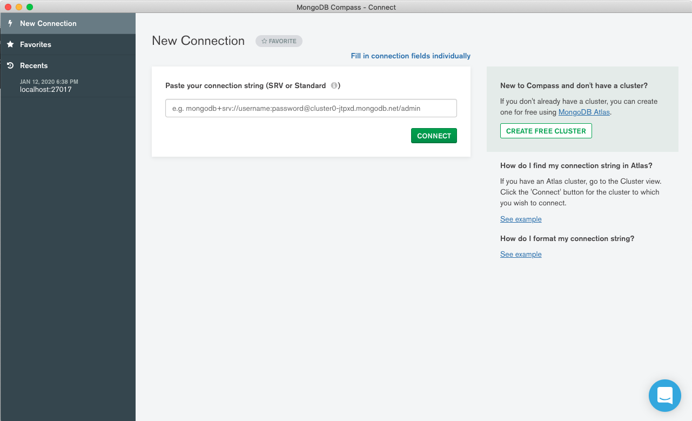

# Chapter 1: Introduction

## Lecture:  Welcome!

## Lecture: Granding and Logistics

A medida que comenzamos con este curso, me gustaría hablar sobre la calificación y algunos otros aspectos logísticos solo para asegurarme de que sepa cómo funciona este curso.

Verá tres tipos diferentes de ejercicios en este curso: cuestionarios, laboratorios, que también llamamos tarea, y un examen final.

Verá cuestionarios después de la mayoría de los videos de lecciones en este curso.

Todas las pruebas no están calificadas.

Están allí para permitirle evaluar su comprensión del material de la lección.

Verá laboratorios, o tareas, como a veces los llamamos, a lo largo de cada capítulo.

Los puntajes que obtiene en sus laboratorios representan el 50% de su calificación final.

Luego, al final del curso, hay un examen final.

Esto representa el otro 50% de su calificación.

En términos de un horario del curso, en la primera semana de este curso, lanzamos el capítulo uno.

Lanzamos el capítulo dos en la segunda semana, y luego en la tercera semana del curso, lanzamos tanto el capítulo tres como el examen final.

Y no te preocupes, estos dos juntos son lo suficientemente cortos como para que puedas completarlos todos en la semana tres.

Asegúrese de revisar el programa del curso para conocer las fechas exactas de lanzamiento de las semanas uno, dos y tres.

En el plan de estudios, también encontrará las fechas de vencimiento de cuándo deben entregarse los laboratorios o la tarea para cada semana.

Una vez que hayamos aprobado la fecha límite para el examen final, si ha logrado una calificación de 65% o más, recibirá una declaración de finalización de este curso.

Y nuevamente, generamos las declaraciones de finalización después de la fecha de vencimiento para el examen final.

Eso es todo para el curso esencial de logística.

Nos alegra que estés aprendiendo con nosotros y buena suerte.

## Lecture: Are you Behind a Firewall?

### ¿Estás detrás de un firewall?

Para continuar en este curso, debe poder realizar solicitudes salientes desde su computadora a los servidores de bases de datos que hemos configurado en MongoDB Atlas. Esos servidores se ejecutan en el puerto 27017 en Amazon AWS.

**Confirme que el puerto 27017 no está bloqueado haciendo clic en [http://portquiz.net:27017](http://portquiz.net:27017).**

Si tiene éxito, verá una carga de página que indica que puede realizar solicitudes salientes en el puerto 27017.

Si una página no se carga y su solicitud finalmente agota el tiempo, el tráfico saliente al puerto 27017 probablemente esté bloqueado en su red local. Si este es el caso, comuníquese con su departamento de TI para ver si hay una solución o intente realizar la solicitud desde otra ubicación.

Otras pruebas útiles para realizar si parece que tiene dificultades para conectarse serían:

1. Conéctese al host y al puerto del clúster Atlas con:

```sh
telnet cluster0-shard-00-00-jxeqq.mongodb.net 27017
```

2. Conéctese al host y al puerto del clúster Atlas con:

```sh
ping cluster0-shard-00-00-jxeqq.mongodb.net
```

## Lecture: Connecting to MongoDB Using Compass

### Lecture Notes

En este curso haremos un uso extensivo de MongoDB Compass para aprender a usar MongoDB.

1. Descargue Compass del [MongoDB Download Center](https://www.mongodb.com/download-center/compass). Si ya instaló Compass, asegúrese de estar utilizando la **última versión (estable) de Compass** y actualice si es necesario. Asegúrese de **no** descargar la versión "Community Edition Stable".

2. Instale Compass en su computadora desde la descarga.
3. Lance Compass.

Cuando se abra Compass, verá una página titulada "Connect to Host".


4. Use la siguiente información para completar este formulario, pero no haga clic en "Connect" todavía.

   **Hostname**: cluster0-shard-00-00-jxeqq.mongodb.net

   **Username**: m001-student

   **Password**: m001-mongodb-basics

   **Replica Set Name**: Cluster0-shard-0

   **Read Preference**: Primary Preferred

5. Haga clic en "Add to Favorites" e ingrese `M001 RS` como el **Favorite Name**. Agregar esta conexión como favorita le permitirá volver a conectarse fácilmente a nuestra implementación MongoDB de clase después de cerrar y reiniciar Compass.

6. Ahora, haga clic en "Connect" y cargue las bases de datos en la implementación de MongoDB clase M001.

### Transcript

En esta lección, comenzaremos nuestra exploración de MongoDB.

Para hacer esto, usaremos Compass, que es el cliente MongoDB GUI.

Si aún no lo ha hecho, abra Compass y siga mientras avanzamos en esta lección.

He incluido instrucciones para descargar y lanzar Compass en las notas de esta lección.

Compass proporciona una interfaz de usuario para ver las bases de datos MongoDB y los documentos que contienen.

También es compatible con el lenguaje de consulta MongoDB, y nos permite leer y escribir datos utilizando una serie de comodidades para crear consultas.

Aquí estamos mirando la pantalla de conexión de Compass.



En el lado izquierdo, debería ver una barra de navegación, con secciones para Favoritos y Conexiones recientes.

En la vista central aquí, debería ver un formulario que podemos usar para establecer una conexión a un clúster MongoDB.

Tenga en cuenta que Compass se desarrolla activamente.

Puede haber diferencias entre la IU que muestro aquí y lo que está viendo ahora.

En un momento, nos conectaremos a un clúster MongoDB que hemos configurado para esta clase.

Este clúster se ejecuta en Atlas, que es MongoDB alojado en MongoDB como plataforma de servicio.


Consulte las notas de la conferencia para obtener más información sobre MongoDB Atlas.

Tampoco se preocupe por mi uso del término clúster.

Si no te es familiar.

Por ahora, no es importante.

En una lección posterior, profundizaremos en lo que es un clúster MongoDB.

Bien, ahora estamos listos para conectarnos.

Puede ver el nombre de host de nuestro clúster aquí.

También lo he incluido en las notas de clase a continuación.

Nos conectaremos en el puerto predeterminado de 27017.

Como método de autenticación, utilizaremos la contraseña del nombre de usuario.

Utilice el nombre de usuario m001-student.

Y la contraseña m001-mongodb-basics Utilizaremos admin como la base de datos de autenticación y especificaremos Usar el sistema CA slash Atlas Deployment para el campo SSL.

Esto simplemente significa que encriptaremos el tráfico entre Compass y nuestro clúster Atlas.

Finalmente, antes de presionar el botón de conexión, cree un favorito para esta conexión al que pueda volver fácilmente.

Ahora haga clic en Conectar y cargue las bases de datos en la implementación de MongoDB clase M001.


