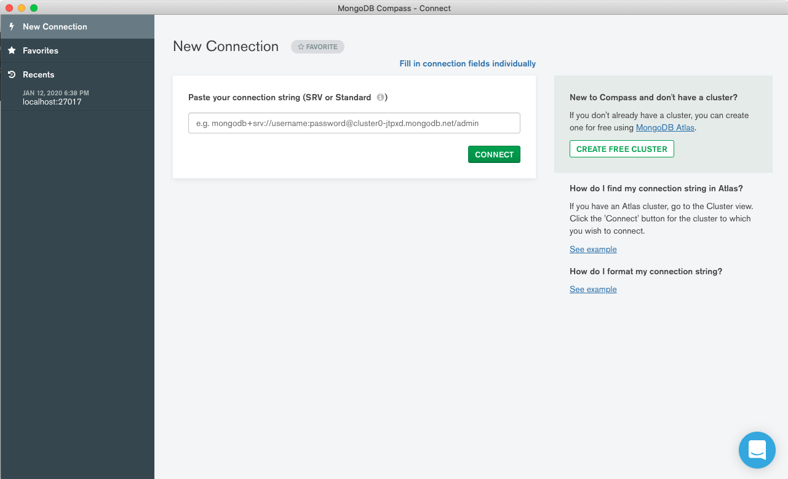
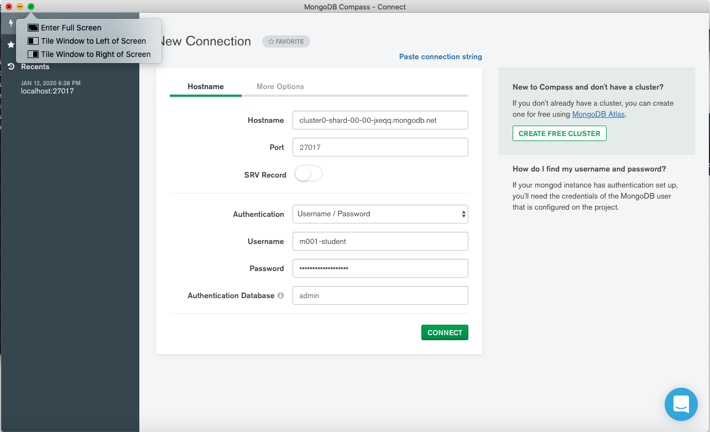
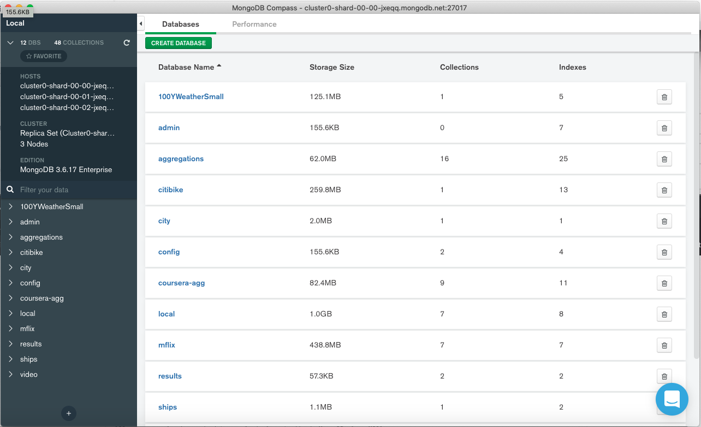

# Chapter 1: Introduction

Introducción a MongoDB, Compass, y Basic Queries (25 Items)

## Lessons

1. Lecture: Welcome!
2. Quiz
3. Lecture: Grading and Logistics
4. Quiz
5. Lecture: Are you Behind a Firewall?
6. Lecture: Connecting to MongoDB Using Compass
7. Lecture: Databases, Collections, and Documents
8. Quiz
9. Lecture: Exploring Datasets in Compass
10. Lab 1.1: Install Compass and Connect
11. Lecture: Documents: Scalar Value Types
12. Quiz
13. Lecture: MongoDB Documents: Fields with Documents as Values
14. Lecture: MongoDB Documents: Fields with Arrays as Values
15. Lab 1.2: Determine the Value Type, Part 1
16. Lab 1.3: Determine the Value Type, Part 2
17. Lab 1.4: Determine the Value Type, Part 3
18. Lecture: MongoDB Documents: Geospatial Data
19. Quiz
20. Lecture: Filtering Collections with Queries
21. Quiz
22. Lab 1.5: Scavenger Hunt, Part 1
23. Lab 1.6: Scavenger Hunt, Part 2
24. Lecture: Understanding JSON
25. Quiz

## Lecture:  Welcome! (Quiz)

Temas que se verán en este capítulo:

* Fundamentos de MongoDB
* Compass
* Flexible Schema
* Query Language
* MongoDB Atlas
* Discusión Forum

## Lecture: Granding and Logistics (Quiz)

A medida que comenzamos con este curso, me gustaría hablar sobre la calificación y algunos otros aspectos logísticos solo para asegurarme de que sepa cómo funciona este curso.

Verá tres tipos diferentes de ejercicios en este curso: cuestionarios, laboratorios, que también llamamos tarea, y un examen final.

Verá cuestionarios después de la mayoría de los videos de lecciones en este curso.

Todas las pruebas no están calificadas.

Están allí para permitirle evaluar su comprensión del material de la lección.

Verá laboratorios, o tareas, como a veces los llamamos, a lo largo de cada capítulo.

Los puntajes que obtiene en sus laboratorios representan el 50% de su calificación final.

Luego, al final del curso, hay un examen final.

Esto representa el otro 50% de su calificación.

En términos de un horario del curso, en la primera semana de este curso, lanzamos el capítulo uno.

Lanzamos el capítulo dos en la segunda semana, y luego en la tercera semana del curso, lanzamos tanto el capítulo tres como el examen final.

Y no te preocupes, estos dos juntos son lo suficientemente cortos como para que puedas completarlos todos en la semana tres.

Asegúrese de revisar el programa del curso para conocer las fechas exactas de lanzamiento de las semanas uno, dos y tres.

En el plan de estudios, también encontrará las fechas de vencimiento de cuándo deben entregarse los laboratorios o la tarea para cada semana.

Una vez que hayamos aprobado la fecha límite para el examen final, si ha logrado una calificación de 65% o más, recibirá una declaración de finalización de este curso.

Y nuevamente, generamos las declaraciones de finalización después de la fecha de vencimiento para el examen final.

Eso es todo para el curso esencial de logística.

Nos alegra que estés aprendiendo con nosotros y buena suerte.

### Quiz

**Problem:**

What resources are available to help you complete this course?

Check all answers that apply:

* An in-class discussion forum where you can ask questions and help your fellow learners :+1:

* Teaching assistants to field questions and provide guidance on the course :+1:

* A personal chef

* Laundry service

## Lecture: Are you Behind a Firewall?

### ¿Estás detrás de un firewall?

Para continuar en este curso, debe poder realizar solicitudes salientes desde su computadora a los servidores de bases de datos que hemos configurado en MongoDB Atlas. Esos servidores se ejecutan en el puerto 27017 en Amazon AWS.

**Confirme que el puerto 27017 no está bloqueado haciendo clic en [http://portquiz.net:27017](http://portquiz.net:27017).**

Si tiene éxito, verá una carga de página que indica que puede realizar solicitudes salientes en el puerto 27017.

Si una página no se carga y su solicitud finalmente agota el tiempo, el tráfico saliente al puerto 27017 probablemente esté bloqueado en su red local. Si este es el caso, comuníquese con su departamento de TI para ver si hay una solución o intente realizar la solicitud desde otra ubicación.

Otras pruebas útiles para realizar si parece que tiene dificultades para conectarse serían:

1. Conéctese al host y al puerto del clúster Atlas con:

```sh
telnet cluster0-shard-00-00-jxeqq.mongodb.net 27017
```

2. Conéctese al host y al puerto del clúster Atlas con:

```sh
ping cluster0-shard-00-00-jxeqq.mongodb.net
```

### Quiz

**Problem:**

Which of the following count toward your final grade?

Check all answers that apply:

* Quizzes

* Labs (also called homework) :+1:

* Final exam :+1:

## Lecture: Connecting to MongoDB Using Compass

### Lecture Notes

En este curso haremos un uso extensivo de MongoDB Compass para aprender a usar MongoDB.

1. Descargue Compass del [MongoDB Download Center](https://www.mongodb.com/download-center/compass). Si ya instaló Compass, asegúrese de estar utilizando la **última versión (estable) de Compass** y actualice si es necesario. Asegúrese de **no** descargar la versión "Community Edition Stable".

2. Instale Compass en su computadora desde la descarga.
3. Lance Compass.

Cuando se abra Compass, verá una página titulada "Connect to Host".


4. Use la siguiente información para completar este formulario, pero no haga clic en "Connect" todavía.

   **Hostname**: cluster0-shard-00-00-jxeqq.mongodb.net

   **Username**: m001-student

   **Password**: m001-mongodb-basics

   **Replica Set Name**: Cluster0-shard-0

   **Read Preference**: Primary Preferred

5. Haga clic en "Add to Favorites" e ingrese `M001 RS` como el **Favorite Name**. Agregar esta conexión como favorita le permitirá volver a conectarse fácilmente a nuestra implementación MongoDB de clase después de cerrar y reiniciar Compass.

6. Ahora, haga clic en "Connect" y cargue las bases de datos en la implementación de MongoDB clase M001.

### Transcript

En esta lección, comenzaremos nuestra exploración de MongoDB.

Para hacer esto, usaremos Compass, que es el cliente MongoDB GUI.

Si aún no lo ha hecho, abra Compass y siga mientras avanzamos en esta lección.

He incluido instrucciones para descargar y lanzar Compass en las notas de esta lección.

Compass proporciona una interfaz de usuario para ver las bases de datos MongoDB y los documentos que contienen.

También es compatible con el lenguaje de consulta MongoDB, y nos permite leer y escribir datos utilizando una serie de comodidades para crear consultas.

Aquí estamos mirando la pantalla de conexión de Compass.



En el lado izquierdo, debería ver una barra de navegación, con secciones para Favoritos y Conexiones recientes.

En la vista central aquí, debería ver un formulario que podemos usar para establecer una conexión a un clúster MongoDB.

Tenga en cuenta que Compass se desarrolla activamente.

Puede haber diferencias entre la IU que muestro aquí y lo que está viendo ahora.

En un momento, nos conectaremos a un clúster MongoDB que hemos configurado para esta clase.

Este clúster se ejecuta en [MongoDB Atlas](https://www.mongodb.com/cloud/atlas), alojado en MongoDB como plataforma de servicio.


Consulte las notas de la conferencia para obtener más información sobre MongoDB Atlas.

Tampoco se preocupe por mi uso del término clúster,  si no te es familiar. Por ahora, no es importante.

En una lección posterior, profundizaremos en lo que es un clúster MongoDB. 

Bien, ahora estamos listos para conectarnos.

Puede ver el nombre de host de nuestro clúster aquí.

También lo he incluido en las notas de clase a continuación.

Nos conectaremos en el puerto predeterminado de 27017.

Como método de autenticación, utilizaremos la contraseña del nombre de usuario.

Utilice el nombre de usuario **`m001-student`**.

Y la contraseña **`m001-mongodb-basics`

Utilizaremos **`admin`** como la base de datos de autenticación.

Y especificaremos para el campo SSL la opción **`System CA / Atlas Deployment`** .

Esto simplemente significa que encriptaremos el tráfico entre Compass y nuestro clúster Atlas.

Finalmente, antes de presionar el botón `CONNECT`, cree un favorito para esta conexión al que pueda volver fácilmente.

Ahora haga clic en el botón `CONNECT` y cargue las bases de datos en la implementación de MongoDB clase M001.




## Lecture: Databases, Collections, and Documents (Quiz)

### Transcript

Una vez conectado, debería ver una pantalla que se ve así.



Aquí en el panel principal, podemos ver una lista de las bases de datos contenidas en este clúster.

En MongoDB, una **base de datos** sirve como espacio de nombres para **colecciones**.

Las colecciones almacenan registros individuales llamados **documentos**.

Este gráfico ilustra la relación entre bases de datos, colecciones y documentos.


Esta jerarquía nos permite agrupar registros de elementos similares dentro de colecciones, y agrupar colecciones requeridas para la misma aplicación dentro de la misma base de datos.

También podemos establecer políticas de seguridad que autoricen a los usuarios con diferentes roles y diferentes niveles de acceso a la base de datos, o nivel de recopilación.

MongoDB actualmente no admite configuraciones de autorización específicas para documentos individuales.

Cada combinación de base de datos y colección define un espacio de nombres.

Por lo general, hacemos referencia a una colección específica expresando el nombre de la base de datos, seguido de un punto, seguido del nombre de la colección.


Volviendo a Compass, aquí tenemos una lista de todas las bases de datos en este clúster.


Con un poco de información sobre el tamaño de la base de datos, la cantidad de colecciones que contiene y la cantidad de índices en estas colecciones.

No diremos demasiado sobre los índices en este curso.

Querrás tomar el curso de **MongoDB performance course** (rendimiento MongoDB) para eso. Simplemente busque **M201** en el sitio web de la universidad MongoDB.

Por cierto, si la lista de bases de datos que está viendo difiere un poco de lo que estoy mostrando aquí, no se preocupe por eso.

Actualizamos este clúster de vez en cuando con nuevos conjuntos de datos.

### Quiz

**Problem:**

Which of the following statements are true?

Check all answers that apply:

* Documents are stored in collections. :+1:

* A database may contain one or more collections. :+1:

* Each database and collection combination define a namespace. :+1:

* We reference a namespace using the name of the database, followed by a comma, followed by the name of the collection, e.g., city,neighborhoods.

* We won't talk about indexes too much in the course, but you can learn about indexes in M201: MongoDB Performance. :+1:

## Lecture: Exploring Datasets in Compass

Bien, ahora examinemos algunas de las colecciones en este clúster.

Si mira a la izquierda en la interfaz de Compass, verá un panel de navegación que contiene una lista de todas las bases de datos en el clúster al que estamos conectados, con las colecciones que esas bases de datos contienen anidadas debajo de ellas.

Tenga en cuenta que puede volver a esta vista en cualquier momento haciendo clic en el icono de Inicio.

Sin embargo, ahora queremos sumergirnos en las colecciones aquí.

Tenemos bastantes bases de datos aquí.

Estas son las colecciones que usaremos a lo largo del curso.

Contienen una variedad de tipos de datos y una gama de modelos de datos, para que podamos ilustrar diferentes características de MongoDB.

Para acceder a los documentos dentro de cualquier colección, simplemente ubique la colección en este panel de navegación y haga clic.

Como ejemplo, echemos un vistazo a la colección de movies (películas) de la base de datos de videos.

Al hacer clic en esta colección, debería ver una vista de esquema para la colección que aparece en el panel principal.


La vista de esquema proporciona una lista de los campos encontrados en documentos dentro de esta colección.

Como es de esperar para las películas, tenemos campos para director, género, trama y una serie de otras características relevantes para las películas.

A medida que avanzamos, podemos ver todos los campos encontrados en los documentos de esta colección.


Nuevamente, esta vista proporciona un resumen del esquema, o modelo de datos, para los documentos de esta colección.

Tenemos la lista de campos, sus tipos de datos y un resumen del rango de valores para cada campo que se encuentra en todos los documentos de la colección.

Volveremos a un tutorial más detallado de esta información en una lección posterior.

Por ahora, profundicemos un poco en esta colección y veamos algunos documentos específicos.

Si hacemos clic en la pestaña Documentos, debería ver una lista de documentos dentro de esta colección.


Esta vista nos brinda la posibilidad de examinar los datos reales encontrados en esta colección.

Aquí podemos ver un documento que registra los detalles de una película de un minuto de duración llamada Carmencita que se produjo en 1894.

A medida que nos desplazamos por esta vista, podemos ver otros documentos en esta colección.

En lecciones posteriores, veremos cómo consultar estos datos para encontrar documentos que coincidan con un conjunto específico de criterios de filtro.

También aprenderemos cómo insertar nuevos documentos y actualizar los existentes, con nuevos datos.

Continúe y explore un poco estos datos y eche un vistazo a las otras colecciones en este grupo de Atlas.

Y luego, pase a la siguiente lección.

## Lab 1.1: Install Compass and Connect

Problema:

Si aún no ha descargado Compass, siga estas instrucciones antes de responder la siguiente pregunta.

1. Descargue Compass del [MongoDB Download Center](https://www.mongodb.com/download-center/compass).
2. Instale Compass en su computadora desde la descarga.
   Asegúrese de estar utilizando la **última versión (estable) de Compass** y actualice si es necesario. Asegúrese de **no** descargar la versión "Community Edition Stable".
3. Lance Compass.


4. Use la siguiente información para completar este formulario, pero no haga clic en "Connect" todavía.

   **Hostname**: cluster0-shard-00-00-jxeqq.mongodb.net

   **Username**: m001-student

   **Password**: m001-mongodb-basics

   **Replica Set Name**: Cluster0-shard-0

   **Read Preference**: Primary Preferred

5. Ingrese `M001 RS` como **Favorite Name** y haga clic en "CREATE FAVORITE". Agregar esta conexión como favorita le permitirá volver a conectarse fácilmente a nuestra implementación MongoDB de clase después de cerrar y reiniciar Compass.

6. Ahora, haga clic en "Connect".

Pregunta ¿Cuál de los siguientes nombres de campo aparecen en los documentos de la colección de **movies** de la base de datos de video? Marque todo lo que corresponda.

Intentos restantes: quedan 3 intentos

Marque todas las respuestas que apliquen:

Cuando se abra Compass, verá una página titulada "Connect to Host".

## Lecture: Documents: Scalar Value Types (Quiz)

### Lecture Notes

**Nota** : Tenga en cuenta que el campo `lastUpdated` es mencionado por Shannon en el video pero no está presente en el conjunto de datos.

### Transcript

En esta lección, exploraremos algunos de los tipos de datos escalares que admite MongoDB y cómo determinar el tipo de valor de un campo en particular utilizando la vista de esquema de Compass.

Observamos el array, el documento y lo que a menudo llamo tipos de valores especiales en otras lecciones.

Aquí, estamos viendo la vista de esquema para la colección movies de video.


Ahora, he colapsado el panel de navegación a la izquierda usando este control para que tengamos un poco más de espacio en pantalla para trabajar.


A medida que nos desplazamos por el panel principal, debería ver una serie de campos aquí.

En la vista de esquema, un campo está representado por su nombre (**genre**), su tipo (**string**) y un gráfico que refleja el rango de valores para ese campo en esta colección y qué fracción de documentos tiene un valor dado.


Como ejemplo, echemos un vistazo con más detalle al campo de género.

Para este campo, vemos el nombre **genre*.

Inmediatamente a continuación hay una descripción del tipo de valor para este campo **string** según lo determinado por los documentos de muestra en esta colección.

A lo largo de la vista de esquema de Compass, al pasar el cursor sobre los elementos se proporcionan más detalles.

Si pasamos el cursor sobre la barra inmediatamente debajo del especificador de tipo de valor, debería ver el valor 100%.

Esto nos dice que el 100% de los documentos en esta colección contienen un valor de cadena para este campo.

A la derecha del nombre y tipo hay un gráfico que muestra un rango de valores para este campo y qué fracción de documentos en esta colección contiene valores específicos.

Examinar los valores nos da una idea de todos los valores que tiene este campo en los documentos de esta colección.

Y si pasamos el cursor sobre cualquier elemento específico de este gráfico, podemos ver qué fracción de documentos tiene un valor específico.

Aquí podemos ver que el 5% de los documentos de esta colección describen películas en el género de comedia.


Es importante tener en cuenta que el rango de valores y la fracción de documentos con un valor dado, según lo informado por Compass, se basa en una muestra de documentos en la colección.

En este ejemplo, la muestra es lo suficientemente grande como para que vea un resumen preciso, pero existe la posibilidad de que el resumen cambie ligeramente de una vista a otra.

A medida que nos desplazamos por el resto de la vista de esquema para esta colección, puede ver que Compass proporciona el nombre, una descripción del tipo de valor y un resumen del rango y fracción de documentos que tienen un valor específico para todos los campos encontrados dentro de los documentos en un colección.

Además de las strings, otros valores comunes para documentos MongoDB incluyen integers, floating point values, y dates.

Veamos el campo **year**.


Puede ver desde la vista de esquema que los valores para este campo son int32, lo que significa que son enteros de 32 bits.

Mirando el gráfico de valores, podemos ver que el valor mínimo es 1.897 y el valor máximo es 2.017.

También podemos ver que la cantidad de películas en esta colección para los años más recientes es mucho mayor que para los períodos de hace 100 años o más.

Mientras hojeamos las barras aquí, podemos ver que cada una representa un período de aproximadamente cinco años.


Ahora veamos algunos valores de coma flotante por ejemplo el campo **viewerRating**.


Si nos desplazamos hacia el campo de calificación del espectador, verá un rango de valores de 1.4 a 9.6, lo que parece razonable para una escala de calificación del espectador para películas.

Y nuevamente, podemos ver que la mayoría de los valores están en algún lugar en este rango mediocre, con muchas menos calificaciones extremadamente bajas o muy, muy altas.

El tipo de datos double es una opción para representar valores de coma flotante.

Como probablemente sepa, la aritmética de coma flotante, aunque es lo suficientemente buena para muchas aplicaciones, es imprecisa.

MongoDB también proporciona un **tipo de datos decimales** para transacciones financieras y otras aplicaciones que requieren aritmética de coma flotante precisa.

Ahora puede que se pregunte por qué estamos viendo varios tipos de valores listados para la calificación del espectador.

De hecho, tenemos algunos valores dobles y algunos valores int32, así como una proporción de documentos para los que este campo no está definido (**undefined**).


Una de las ventajas reales de la vista de esquema de Compass es que le da una idea de qué valores tienen realmente los campos en su colección.

Y para una colección que es tan grande, esto puede ser extremadamente útil cuando realiza tareas como la limpieza de datos.

Esto indica que podríamos tener un poco de trabajo por hacer para asegurarnos de que todas las calificaciones de los espectadores sean del mismo tipo de datos.

El hecho de que, para muchas películas, la calificación del espectador no esté definida, no es necesariamente un problema porque simplemente podríamos no tener datos sobre las calificaciones del espectador para una fracción considerable de nuestro conjunto de datos.

La conclusión importante aquí es que Compass identifica campos para los que hay una combinación de tipos de valores.

Esto es valioso para los desarrolladores o administradores que podrían estar tratando de depurar un problema que tiene que ver con el tipo de datos para un campo en particular.

También es útil para considerar lo que se debe hacer desde un punto de vista de secuencias de comandos, por ejemplo, cuando se hace necesario migrar un modelo de datos de un esquema a otro.

En esta lección, hemos analizado los tipos de valores escalares en MongoDB y cómo usar Compass para determinar los tipos de valores para un campo y tener una idea del rango de valores en ese campo para documentos en una colección.

Los ejemplos que hemos visto en la lección no brindan una descripción completa de los tipos de valores escalares que admite MongoDB.

Sin embargo, son los más comunes.

Antes de cerrar esta lección, echemos un vistazo a un tipo de valor adicional.

Me gustaría ver un campo que nos muestra un ejemplo de fechas.

El campo **last updated** proporciona un registro de cuándo se actualizaron por última vez los datos (clasificaciones y demás) de un documento de película determinado, es decir, cuándo se escribió por última vez un documento en la colección.


Para los valores de fecha, Compass hace algo realmente valioso.

Puede ver aquí que Compass proporciona el rango de valores de fecha de una manera que indica algo así como la densidad de valores en cada fecha del rango.

Justo encima de esto, puede ver un informe de qué fracción de valores de fecha para el campo en cuestión cae cada día, aquí y a qué hora del día, aquí.

En esta lección, hemos analizado los tipos de valores escalares en MongoDB y cómo usar Compass para determinar los tipos de valores para un campo y tener una idea del rango de valores en ese campo para documentos en una colección.

Los ejemplos que hemos visto en esta lección no proporcionan una descripción general completa de los tipos de valores escalares que admite MongoDB.

Sin embargo, estos son los más comunes: int32, double, string y date.

Completamos una revisión más completa de los tipos de datos de MongoDB en otra lección sobre el formato binario en el que MongoDB almacena documentos.

### Quiz

**Problem:**

Based on the field depicted below, which of the following are true?


Check all answers that apply:

* Not all documents in this collection have the same value type for this field. :+1:

* Most of the documents in this collection contain int32 values for this field. :+1:

* Some documents in this field have the value type Year

## Lecture: MongoDB Documents: Fields with Documents as Values

En esta lección, veremos los tipos de valores agregados que admite MongoDB y también analizaremos el soporte para datos geoespaciales.

En Compass, veamos el conjunto de datos meteorológicos de 100 años **100YWeatherSmall**, navegando al espacio de nombre de datos de punto de 100 años en nuestro clúster Atlas.

Podemos hacer eso de la siguiente manera.

Primero hacemos clic en la base de datos, y luego en la colección.

Veamos la vista de esquema para esta colección.


Ahora, este conjunto de datos proporciona lecturas del clima para ubicaciones en todo el mundo.

Para este conjunto de datos, es importante comprender que todas las lecturas se registran tanto con una evaluación de valor como de calidad, para dar una idea de cuán confiable se determinó que era la medición cuando se tomó.

Como ejemplo, vamos a desplazarnos hacia abajo y mirar el campo de temperatura del aire **airTemperature**.

Tenga en cuenta que el tipo especificado para este campo en la interfaz de usuario de Compass es **document**.

A la derecha del nombre del campo, debería ver una descripción que dice **Document with 2 nestedd fields**.

Además de los valores escalares, como cadenas, enteros y dobles, MongoDB admite anidar un documento como el valor de un campo dentro de otro documento.

La temperatura del aire es un ejemplo.

Cuando se expande, podemos ver los campos anidados para la calidad y el valor de la temperatura del aire.

Así que aquí he expandido la temperatura del aire haciendo clic en este cursor.


El valor de la temperatura del aire es en realidad un **document** anidado con dos campos, **quality** (calidad) y **value** (valor).

La calidad es un **string** y el valor es un **double**.

Para muchas aplicaciones, es importante poder modelar datos, no solo como un conjunto plano de claves y valores, sino como estructuras de datos jerárquicas que reflejan la forma en que un desarrollador necesita trabajar con los datos en su aplicación.

Si es apropiado para su aplicación, puede anidar documentos con dos o más niveles de profundidad.

Como ejemplo, echemos un vistazo al campo de observación de la presión atmosférica **atmosphericPressureObservation**.

La presión atmosférica nos dice el peso del aire en un lugar determinado.

Por otro lado, la presión atmosférica afecta la forma en que los sistemas climáticos se mueven a través de la superficie de la Tierra.

Es un factor que usan los meteorólogos para predecir el clima del día siguiente.

Si ampliamos el campo de observación de la presión atmosférica, podemos ver que este campo tiene un valor que es un documento con dos campos.

* **altimeterSetting**
* **stationPressure**


Cada uno de esos campos son documentos anidados, como podemos ver en el tipo de dato que Compass nos proporciona.

Si ampliamos cada uno de ellos, vemos una lectura (**value**) y una medida de calidad (**quality**) para la altura sobre el nivel del mar a la que se tomó la medida, designada como la configuración del altímetro, y la lectura real de la presión atmosférica (**value**) y la medida de calidad (**quality**).


Con estos documentos expandidos de esta manera, podemos ver que la presión atmosférica se modela utilizando dos niveles de documentos anidados.

El lenguaje de consulta de MongoDB proporciona soporte completo para filtrar documentos en función de los valores de los campos en documentos anidados.

MongoDB está diseñado para proporcionar una gran flexibilidad en el modelado de sus datos, para que pueda diseñar un esquema que sea eficaz para los patrones de acceso a datos de su aplicación.

Su modelo de datos debe admitir un manejo eficiente de las lecturas y escrituras que requiere su aplicación.

Ahora, abordamos estos aspectos del modelado de datos y el lenguaje de consulta MongoDB en detalle en otras lecciones.

En este punto, simplemente estoy sentando las bases para la flexibilidad que tiene en el diseño de modelos de datos.

## Lecture: MongoDB Documents: Fields with Arrays as Values

Además de los documentos anidados, MongoDB también admite valores de array para campos.

En este conjunto de datos, podemos ver un ejemplo de array en el campo de la **sections** secciones.


Para este ejemplo, será mejor si miramos la pestaña Documentos, en Compass.


En esta pestaña, no solo vemos una vista resumida del esquema de los documentos de una colección, sino que también podemos ver los documentos reales que contiene nuestra colección de 100 años.

Los documentos en este conjunto de datos contienen mediciones para un conjunto consistente de lecturas meteorológicas.

Estos incluyen temperatura del aire, presión, viento, etc.

Pero también hay más de 100 lecturas disponibles, según la estación meteorológica.

Los valores suplementarios, como estos, se etiquetan utilizando un código de tres a cuatro caracteres siguiendo un estándar establecido para datos meteorológicos.

Como MongoDB tiene un modelo de datos flexible, todos los documentos no tienen que contener exactamente los mismos campos.

Entonces, en este conjunto de datos, las lecturas complementarias disponibles en un documento específico se almacenan en el campo de la sección en este conjunto de datos.

Dado que las lecturas disponibles variarán de un documento a otro, tiene sentido proporcionar una lista resumida de las lecturas complementarias disponibles en un documento determinado.

Un array es una buena opción para esto en MongoDB.

El lenguaje de consulta MongoDB admite consultas en campos de array que nos facilitan el filtrado de documentos que contienen un conjunto particular de campos suplementarios.

Y la ventaja de observar los datos suplementarios de esta manera es que simplemente necesitamos construir un índice en las secciones, y luego podemos buscar rápidamente documentos que contienen un conjunto específico de datos complementarios.

## Lab 1.2: Determine the Value Type, Part 1

**Problem:**

What is the value type of the ts field for documents in the **100YWeatherSmall.data** collection?

Choose the best answer:


* array

* coordinates

* date :+1:

* document

* double

* int32

* mixed string and int32

* mixed string and double

* string

## Lab 1.3: Determine the Value Type, Part 2

**Problem:**

What is the value type of the **airTemperature** field for documents in the **100YWeatherSmall.data** collection?

Choose the best answer:

* array

* coordinates

* date

* document :+1:

* double

* int32

* mixed string and int32

* mixed string and double

* string

## Lab 1.4: Determine the Value Type, Part 3

**Problem:**

What is the value type of the **year** field for documents in the **video.movies** collection?

Choose the best answer:

* array

* coordinates

* date

* document

* double

* int32 :+1:

* mixed string and int32

* mixed string and double

* string

## Lecture: MongoDB Documents: Geospatial Data (Quiz)

### Lecture Notes

**Habilitar visualizaciones geográficas**

MongoDB Compass utiliza un complemento de terceros para la visualización geográfica de campos geoespaciales en sus documentos.

Si no puede ver un cuadro de mapa en la pestaña Schema, al analizar el campo de coordenadas de **ships.shipwrecks** naves naufragadas, debe marcar la opción para habilitar la visualización geográfica.

Para hacerlo, deberá hacer clic en el menú:

```
Help -> Privacy Settings
```

y luego habilite esta función.


### Transcript

Bien, hasta ahora hemos examinado los campos con valor de documento y los campos con valor de array.

Una última cosa que me gustaría mostrar, con respecto a este tipo de estructuras de datos agregados, es un ejemplo de mezclar los dos.

Para hacer eso, veamos este documento.

Y quiero señalar que este documento contiene un campo llamado **skyCoverLayer** capa de cobertura del cielo.

Este es uno de esos datos complementarios que pueden aparecer en nuestros documentos en esta colección.

**skyCoverLayer** es un campo con valor de array.

Pero en contraste con nuestro ejemplo anterior, si expandimos **skyCoverLayer**, vemos que este array contiene, como sus elementos, documentos anidados.


Entonces, para este documento en particular, **skyCoverLayer** tiene un valor que es una array que contiene tres elementos, donde cada elemento es un **document**.

Y cada uno de esos **documents** contiene un valor y una medida de calidad.


Algo que debe tener en cuenta al trabajar con Compass, y en general con MongoDB, es que tendemos a **usar los términos objeto y documento de manera intercambiable**.

La razón de esta terminología es algo en lo que nos sumergimos en otras lecciones.

Como otro ejemplo de mezcla de documentos y array, echemos un vistazo al campo **position** de posición para este documento.

Ahora aquí, tenemos un documento anidado que tiene dos campos, y uno de esos campos es un array.


Entonces, en el ejemplo anterior, vimos un campo array que tenía documentos anidados como sus elementos.

En este caso, tenemos un objeto anidado que tiene un array como el valor de uno de sus campos.

Para este documento, el campo **type** tiene un tipo string.

Y como hemos dicho, **coordinates** son un array que contiene dos elementos.

MongoDB admite una variedad de tipos de valores escalares, que incluyen **string**, **null**, **integer**, **double**, y **decimal**, así como valores de **document* y valores de array.

Puede usar cualquier tipo de valor compatible para cualquier valor de campo o elemento de array en un document MongoDB.

Una última cosa antes de concluir esta lección.

Como probablemente haya adivinado, el campo de posición en este ejemplo almacena un punto en un sistema de coordenadas geoespaciales.

Si bien el geoespacial no es un tipo de valor per se, el uso de estructuras de documentos, como el que estamos viendo aquí, MongoDB proporciona un amplio soporte para datos geoespaciales, lo que le permite almacenar una variedad de formas, calcular la distancia entre puntos , filtre los documentos que se encuentren dentro de un radio especificado de otro punto y realice otras operaciones.

Compass proporciona algunas conveniencias agradables para trabajar con datos geoespaciales.

Podemos ver un ejemplo con esta colección, si visitamos la pestaña Schema y nos desplazamos hacia abajo hasta el campo de posición.

Volviendo a la pestaña Esquema, si nos desplazamos hacia abajo a la posición, podemos ver que Compass traza las posiciones de las lecturas en un mapa de la Tierra.


Tenemos la funcionalidad de panorámica completa, zoom aquí.

En otras lecciones, consideramos el uso de esta interfaz de usuario para filtrar colecciones de documentos que expresan ubicaciones dentro de una distancia especificada de un punto de referencia.

### Quiz

**Problem:**

Which of the following are types of data Compass (and MongoDB) recognizes and specifically supports?
Attempts Remaining:Correct Answer

Check all answers that apply:

* documents :+1:

* arrays :+1:

* geospatial data :+1:

* rainfall

* air pressure

## Lecture: Filtering Collections with Queries (Quiz)

### Transcript

Ahora veamos cómo consultar MongoDB para que podamos localizar solo aquellos documentos que coinciden con un conjunto específico de filtros.

Al hacer esto, enviaremos una solicitud a nuestro clúster MongoDB y MongoDB encontrará a cambio solo aquellos documentos que cumplan con nuestros criterios establecidos.

Compass proporciona una rica interfaz de apuntar y hacer clic para filtrar colecciones.

Veamos algunos ejemplos de colecciones de filtros usando la colección citibike.trips.


Este conjunto de datos contiene documentos que registran los viajes realizados dentro de la ciudad de Nueva York utilizando la red Citi Bike de bicicletas y estaciones de acceso público.

Los documentos de esta colección proporcionan detalles sobre las estaciones de inicio y finalización, la duración, el día y la hora de inicio y finalización de los viajes realizados con una bicicleta urbana.

También hay una cantidad muy pequeña de información demográfica, incluido el año de nacimiento y el género.

Ahora, como ya sabe, el gráfico a la derecha de cada campo en la vista de esquema de Compass proporciona un resumen del rango de valores encontrados dentro de un campo determinado para los documentos de la colección.

Si pasamos el cursor sobre un elemento gráfico, podemos ver qué valores representa ese elemento.

Ahora, si hacemos clic en un elemento gráfico, abrimos un área completamente nueva de funcionalidad de Compass.

Como ejemplo, hice clic en esta barra dentro del gráfico del nombre de la estación final.

Al principio solo puede notar que la barra cambió de color.


Pero si mira aquí, en la vista de esquema de Compass, debería ver que el elemento de formulario de filtro en esta vista se ha actualizado.

Tomemos un minuto para hablar de esto.

Lo más probable es que ya estés familiarizado con JavaScript Object Notation, también conocido por su acrónimo JSON.

Eso es J-S-O-N.

A medida que tenga más experiencia en el uso de MongoDB, gran parte de su interacción con la base de datos será a través de documentos JSON de un tipo u otro.

Aunque Compass es un cliente GUI, un poco de la orientación JSON de MongoDB aparece en este aspecto de la interfaz de Compass.

Exploramos JSON con mayor detalle en otra lección.

Por ahora, solo necesita conocer algunos hechos simples sobre los documentos JSON.

Primero, los documentos JSON comienzan y terminan con llaves.

En segundo lugar, los documentos JSON están compuestos de campos.

En el ejemplo que estamos viendo aquí, este documento tiene un campo.

Y finalmente, los campos tienen dos partes.

Una clave y un valor (key/value) `{'end station name': 'Broadway & W 49 St'}`.

La clave es un string y debe estar entre comillas, como vemos aquí `'end station name'`.

El valor puede ser cualquier tipo de datos de JavaScript válido, incluido un documento JSON anidado.

El valor del campo en este documento es `'Broadway & W 49 St'`.

Dentro de un campo, la clave y el valor están separados por dos puntos.

Por ahora, eso es todo lo que realmente necesita saber sobre JSON.

En esta lección, veremos un par de ejemplos diferentes de documentos JSON a medida que veamos el filtrado de colecciones.

Ahora, apliquemos nuestro filtro.

El filtro que acabamos de aplicar se puede expresar de la siguiente manera.

Muéstrame todos los documentos para los que el nombre de la estación final tiene el valor `'Broadway & W 49 St'`.


Tenga en cuenta que, en lugar de los casi 2 millones de documentos informados por Compass para toda la colección, al aplicar el filtro, Compass informa un poco más de 8,404 documentos que coinciden con nuestra consulta.

Antes de continuar, es importante para mí mencionar que el tipo de filtro que hemos aplicado aquí se llama **filtro de igualdad**.

Esto simplemente significa que estamos buscando **documentos con este valor exacto** en el campo **emd station location** nombre de la estación final.

Ahora veamos un tipo diferente de filtro para situaciones en las que queremos seleccionar documentos que se encuentren en un rango particular de valores.

Un buen ejemplo para trabajar aquí es el campo **birth year** año de nacimiento de la colección de bicicletas de la ciudad.

Tenga en cuenta que al pasar el mouse sobre cualquiera de las barras del gráfico de resumen, cada barra representa un rango de valores.

En el extremo izquierdo están los años de nacimiento menores de 1940, y las otras barras representan un rango de cinco años cada una.

Hagamos clic en la barra de 1985 a 1990.


Tenga en cuenta el documento de filtro creado para nosotros aquí `{'birth year': {$gte: 1985,$lt: 1990}}`.

Este filtro estipula una restricción que se puede expresar de la siguiente manera.

Muéstrame todos los documentos para los que el campo del año de nacimiento tiene un valor mayor o igual que 1985 y menor que 1990.

En lugar de un solo valor, como teníamos para el filtro de igualdad, este filtro especifica un rango de valores.

Hay dos cosas a tener en cuenta aquí.

* Una es que el valor para el campo del año de nacimiento en nuestro documento filtrado es un documento JSON anidado.

   Sigue todas las reglas de los documentos JSON con respecto a los campos, y los pares de valores clave que contiene este documento.

* La segunda cosa a tener en cuenta es que los campos se unen para encontrar un rango de valores debido al uso de un par de claves especiales.

`$gte` y `$lt`.

En MongoDB, este tipo de clave se llama **operador**.

MongoDB define muchos operadores en su lenguaje de consulta.

En otras lecciones, entraremos en detalles sobre los operadores y todos los demás aspectos del lenguaje de consulta MongoDB.

Al aplicar este filtro, podemos ver que alrededor de 343,000 documentos coinciden con el rango que hemos especificado aquí para el año de nacimiento.

Ahora que tenemos una mejor comprensión de los filtros de rango, experimentemos un poco para tener una idea de lo que es posible con Compass y los filtros de rango.

En lugar de hacer clic en una sola barra en el gráfico de resumen para el año de nacimiento, haga clic y mantenga presionado el botón del mouse y seleccione varias barras en este gráfico.


Tenga en cuenta que el documento de filtro ahora expresa un rango mucho más amplio de años de nacimiento `{'birth year': {$gte: 1960,$lt: 1980}}`.

Si aplicamos este filtro, MongoDB devolverá todos los documentos que tengan un valor de año de nacimiento mayor o igual a 1960, y menor a 1980.


Antes de pasar de los filtros de rango, echemos un vistazo a un último ejemplo.

Después de restablecer nuestro filtro, bajemos hasta la parte inferior de la vista de esquema.

Aquí encontraremos un campo llamado **tripduration** duración del viaje.

La duración del viaje almacena la duración del viaje en segundos.

Simplemente seleccionemos una región de este gráfico y apliquemos el filtro.

Aquí he seleccionado una duración de viaje en el rango de 2,000 a 4,000 `{tripduration: {$gte: 2000,$lt: 4000}}`.


En este ejemplo, podemos ver una razón por la cual Compass, a pesar de que es una herramienta visual, proporciona un filtro JSON para trabajar, además de la interfaz de apuntar, hacer clic y arrastrar.

Para los campos que tienen valores tan granulares, a veces es más rápido editar el filtro JSON directamente para obtener lo que queremos.


Por ejemplo, supongamos que queremos filtrar los viajes que tienen una duración de entre 10 y 20 minutos.

Simplemente podemos editar el filtro JSON directamente para que sea mayor de 600 segundos y menor de 1,200 segundos, de esta manera `{tripduration: {$gte: 600,$lt: 1200}}`.

Y si aplicamos este filtro, podemos ver que más de 600,000 documentos coinciden con nuestra consulta.

Desplazándonos hacia el campo de duración del viaje, podemos ver que el rango de valores en la vista de esquema ahora refleja solo aquellos documentos que coinciden con nuestra consulta.

El mínimo es 600, y el máximo es 1,195.


En esta lección hemos revisado cómo usar la interfaz de Compass para completar consultas que involucran filtros de igualdad y filtros de rango.

También hemos echado un vistazo a los documentos JSON que representan estos filtros, a medida que comenzamos a sentirnos cómodos interactuando con MongoDB usando la sintaxis JSON.

En otras lecciones de este curso, profundizamos mucho en JSON, consultas y una serie de otras operaciones esenciales para usar MongoDB.

### Quiz

**Problem:**

Which of statements below best describes the following filter?

```sh
{"age": {"$gte": 21, "$lt": 70}}
```

Choose the best answer:

* Find all documents for which the age field has a value that is >= 21 and <= 70.

* Find all documents for which the age field has a value that is either equal to 21 or equal to 70.

* Find all documents for which the age field has a value that is >= 21 and < 70. :+1:

* Find all documents for which the age field is < 70.

* None of the above.

## Lab 1.5: Scavenger Hunt, Part 1

**Problem:**

How many movies in the video collection were directed by Patty Jenkins. Stated more precisely, how many documents in the video.movies collection have a value of "Patty Jenkins" for the director field?

Choose the best answer:


* 6 :+1:

* 13

* 47

* 98

* 143

## Lab 1.6: Scavenger Hunt, Part 2

**Problem:**

How many documents in the citibike.trips collection have a tripduration that is greater than or equal to 60 and less than 65?

Choose the best answer:

* 0

* 94

* 216

* 355

* 754 :+1:

## Lecture: Understanding JSON (Quiz)

### Lecture Notes

Revise la [especificación JSON](https://www.json.org/json-en.html) para obtener más detalles sobre los tipos de datos directamente compatibles con JSON.

A las 4:50, el campo de conversión contiene una array de strings y object como valor. Sin embargo, tenga en cuenta que el nuevo conjunto de datos proporcionado en el clúster de atlas de clase solo tiene un Array of Strings.

### Transcript

Gran parte de nuestra interacción con MongoDB requerirá una comprensión de JSON.

MongoDB es una base de datos de documentos, y con frecuencia discutimos modelos de datos mirando representaciones JSON de documentos.

Además, el lenguaje de consulta MongoDB, y gran parte de la administración de MongoDB, requiere cierto nivel de comprensión de JSON.

JSON, que es un acrónimo de JavaScript Object Notation, es un formato popular para representar documentos.

Como ejemplo, aquí hay un documento que representa una película popular.

```js
{
   "title": "Titanic",
   "year": 1997,
   "imdbId": "tt0120338",
   "mpaaRating": "PG-13",
   "genre": "Drama, Romance",
   "viewerRating": 7.7,
   "viewerVotes": 716392,
   "runtime": 194,
   "director": "James Cameron",
   "cast": [
      "Leonardo DiCaprio",
      "Kate Winslet",
      "Billy Zane",
      "Kathy Bates",
      {
         "name": "Billy Zane",
         "birthName": "William George Zane, Jr."
      }
   ],
   "plot: "A seventeen-year-old aristocrat falls in love with a kind, but poor ar..."
   "language": "English, French, German, Swedish, Italian, Russian",
   "lastUpdated": "2015-09-13 00:41:42.117"
}
```

Cuando hablamos de MongoDB, generalmente usamos el término documento JSON para referirnos a tales estructuras.

Pero el objeto JSON es igualmente correcto.

JSON es un formato de datos ampliamente utilizado porque es fácil de leer y editar para los humanos y fácil de analizar y generar para las computadoras.

Los documentos JSON comienzan y terminan con llaves.

Están compuestos de campos, y cada campo tiene una clave y un valor.

En otros lenguajes de programación, los documentos JSON son análogos a objetos, estructuras, mapas o diccionarios.

Una gran ventaja de usar MongoDB es que el modelo de datos utilizado por la base de datos se parece mucho a las estructuras de datos con las que trabaja en el lenguaje de programación que elija.

Esto tiene una serie de ventajas, que discutimos con cierta extensión en otras lecciones.

Volviendo a nuestro documento de ejemplo, podemos ver que hay campos para título, año, reparto, calificación del espectador y gráfico, además de varios otros.

Este ejemplo ilustra algunos requisitos adicionales de la gramática JSON.

La primera es que todas las claves deben estar entre comillas dobles.

Puede ver que todas las claves aquí tienen comillas dobles alrededor de ellas.

Las claves y los valores deben estar separados por dos puntos.

Y nuevamente, vemos eso para cada campo aquí.

Los campos están separados entre sí por comas, como vemos al final de cada campo en este documento.

Los documentos JSON admiten varios tipos de valores.

Hay string que deben estar entre comillas dobles.

Además, tenga en cuenta que las cadenas internas es el único momento en que el espacio en blanco es significativo dentro de un documento JSON.

Las nuevas líneas y otros espacios en blanco fuera de las comillas no son realmente parte del documento JSON.

Además de los strings, los valores JSON pueden ser números de coma flotante, valores booleanos y el valor null.

Finalmente, los arrays y los objetos pueden ser valores y anidados en cualquier combinación.

Los arrays JSON se definen entre corchetes.

Los arrays contienen una lista ordenada de valores separados por comas.

Los arrays JSON son análogas a las listas de matrices, vectores o secuencias que se encuentran en otros lenguajes de programación, como Java, Python, C Sharp, etc.

Este ejemplo incluye un array como el valor para el campo de conversión.

Este array contiene un elemento para cada miembro del reparto de nota en esta película o, debería decir, cada miembro del reparto capturado en esta colección en particular.

Tenga en cuenta que tres de los elementos son strings, pero el cuarto es en realidad un documento incrustado.

Esto registra el nombre artístico de Billy Zane, así como su nombre de nacimiento.

Este conjunto ilustra lo último sobre JSON con el que realmente quiero que se vaya, ya que los documentos de JSON admiten cualquier nivel de jerarquía que sea apropiado para el modelo de datos de su aplicación.

MongoDB está diseñado desde cero para respaldar esto.

El lenguaje de consulta, los índices y las estructuras de datos internas están diseñados para admitir una amplia variedad de modelos de datos.

Ahora, echemos un vistazo a la representación de Compass para documentos como estos.

Aquí estamos viendo la colección video.movies y la pestaña Documentos para esta colección.

Y si nos desplazamos por aquí, podemos ver varios documentos en esta colección.

Usando la funcionalidad de filtro y Compass, podemos construir un filtro que encontrará todas las películas donde el título es Titanic.

Aplicando este filtro, veremos que tenemos ocho documentos con el título Titanic.

Desplazándonos hacia abajo, podemos encontrar el documento que acabamos de ver en su forma JSON sin procesar como se representa en Compass.

Ahora, a diferencia de la vista de esquema en Compass, esta no es una representación resumida de los datos en esta colección, sino los documentos individuales en sí.

En aras de una interfaz de usuario más limpia, Compass no representa documentos como JSON.

En cambio, para cada documento, simplemente enumera los campos.

Para valores agregados, como arrays y documentos incrustados, muestra una vista de árbol en la que puede hacer clic para expandir el valor del campo, como vemos para la conversión.

Utiliza este mecanismo para cualquier nivel de jerarquía dentro de los documentos.

Puede ampliar los valores sucesivos para reducirlos a los documentos que desee.

Aquí, expandiremos el elemento Billy Zane de esta matriz para ver el documento completo u objeto tal como está almacenado en este documento.

Y con eso, hemos concluido nuestra visión general de JSON y su importancia en MongoDB.

Para obtener más información sobre el formato de documento JSON, no dude en leerlo en detalle en [www.json.org](www.json.org)

### Quiz

Understanding JSON

**Problem:**

According to the JSON spec, which of the following data types are directly supported by JSON?

Check all answers that apply:

* String :+1:

* Array :+1:

* Object :+1:

* Date

* Decimal number :+1:
