# Capítulo 2: Replicación

### 30 Items

Conceptos básicos de replicación y administración de conjuntos de réplicas

## Lecciones

1. Tema: ¿Qué es la replicación?
2. Examen
3. Tema: Conjunto de réplicas MongoDB
4. Examen
5. Tema: Configuración de un conjunto de réplicas
6. Examen
7. Laboratorio: iniciar un conjunto de réplicas localmente
8. Tema: Documento de configuración de replicación
9. Examen
10. Tema: Comandos de replicación
11. Examen
12. Tema: DB local: Parte 1
13. Tema: DB local: Parte 2
14. Examen
15. Tema: reconfigurar un conjunto de réplicas en ejecución
16. Examen
17. Laboratorio: eliminar y volver a agregar un nodo
18. Tema: Lee y escribe en un conjunto de réplicas
19. Examen
20. Tema: conmutación por error y elecciones
21. Examen
22. Tema: Escribir inquietudes: Parte 1
23. Tema: Escribir inquietudes: Parte 2
24. Examen
25. Laboratorio: escribe con conmutación por error
26. Tema: Leer preocupaciones
27. Examen
28. Tema: Leer preferencias
29. Examen
30. Laboratorio - Preocupación de lectura y preferencias de lectura

## 1. Tema: ¿Qué es la replicación?

### Transcripción

En esta lección, cubriremos la replicación y cómo hace que sus datos sean más duraderos.

MongoDB utiliza asíncrona, replicación basada en sentencias porque es independiente de la plataforma y permite una mayor flexibilidad dentro de un **replica set**(conjunto de réplicas).

Pero primero, hablemos sobre qué es la replicación.


**La replicación es el concepto de mantener múltiples copias de sus datos.**


Este es un concepto realmente importante en MongoDB, pero realmente en cualquier sistema de base de datos.

La razón principal por la que es necesaria la replicación es porque nunca puede asumir que todos sus servidores siempre estarán disponibles.

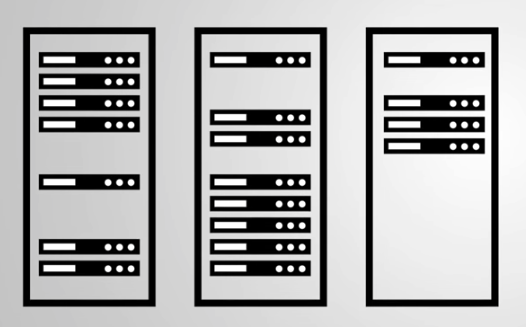

Si tiene que realizar tareas de mantenimiento en un centro de datos o un desastre borra sus datos por completo, sus servidores experimentarán tiempo de inactividad en algún momento.

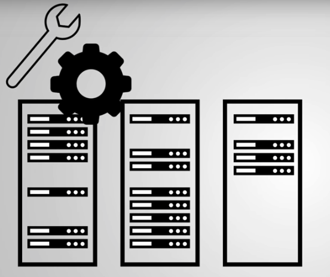


El punto de replicación es asegurarse de que en caso de que su servidor se caiga, aún puede acceder a sus datos.

Este concepto se llama **disponibilidad**(availability).


Una base de datos que no usa replicación solo tiene un único servidor de base de datos, y nos referimos a estos como nodos independientes (standalone nodes).

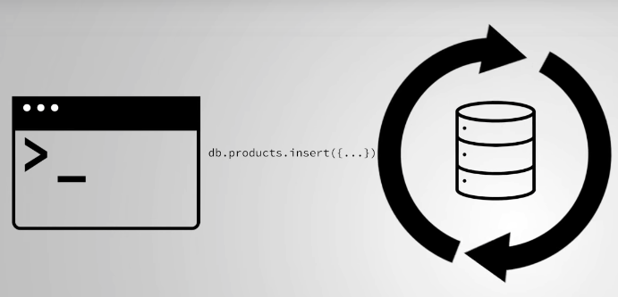

En una configuración independiente, las bases de datos pueden atender lecturas y escrituras solo mientras ese nodo único está en funcionamiento.

Pero si el nodo se cae, perdemos todo el acceso a esos datos.


Nuestras lecturas y escrituras no llegarán al servidor.

Ahora en una solución replicada, tenemos un par de nodos adicionales a la mano, y contienen copias de nuestros datos.

En MongoDB, un grupo de nodos que tienen copias de los mismos datos se denomina **replica set** conjunto de réplicas.


Y en un replica set, todos los datos se manejan de manera predeterminada en uno de los nodos, 

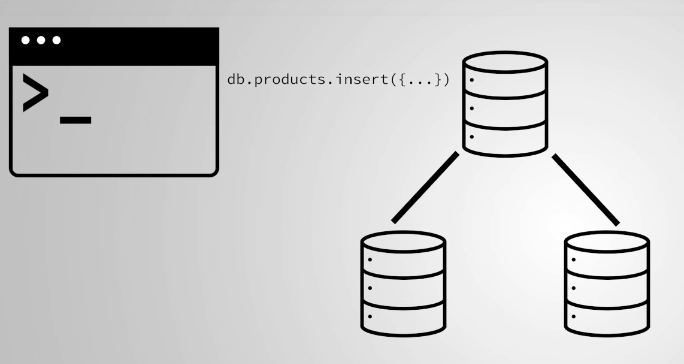

y depende de los nodos restantes del conjunto sincronizarse con él y replicar cualquier dato nuevo que se haya escrito a través de un mecanismo asíncrono.

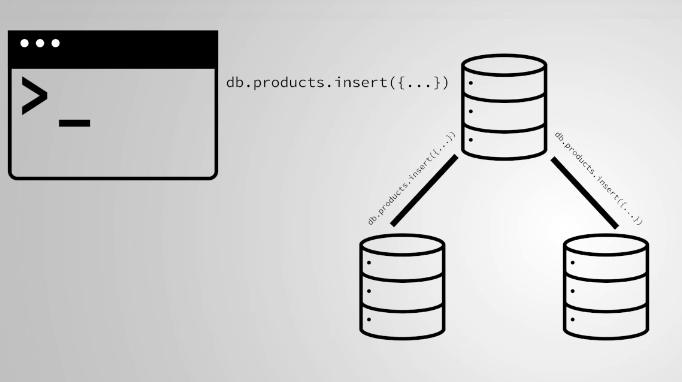

El nodo donde se envían los datos se denomina **nodo primario**, y todos los demás nodos se denominan **nodos secundarios**.

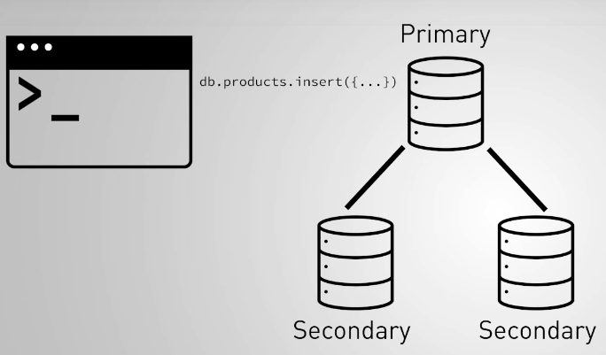

El objetivo aquí es que todos los nodos se mantengan consistentes entre sí.

Entonces, si nuestra aplicación está usando la base de datos y el nodo primario se cae, 

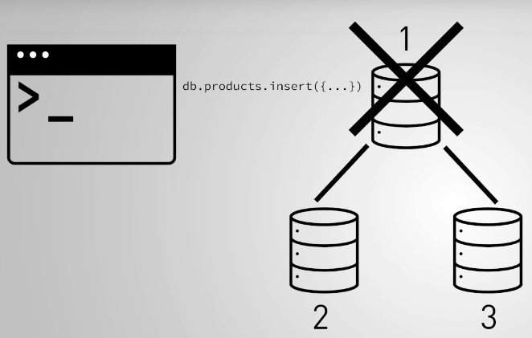

uno de los nodos secundarios puede tomar su lugar como primario en un proceso conocido como **failover** (conmutación por error).

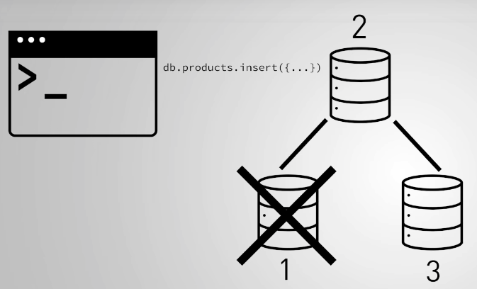


Los nodos deciden específicamente qué secundaria se convertirá en primaria a través de una **elección**.


Y este nombre no es una coincidencia.

Los nodos secundarios en realidad votan entre sí para decidir qué secundaria se convertirá en la primaria.


En un replica set duradero, la **failover** (conmutación por error) puede tener lugar rápidamente, de modo que no se pierdan datos, y las aplicaciones que usan los datos continuarán comunicándose con el replica set como si nunca hubiera pasado nada.

Y una vez que el nodo vuelve a funcionar, y es seguro que puede ponerse al día y sincronizarse en la última copia de los datos, se unirá al replica set automáticamente.

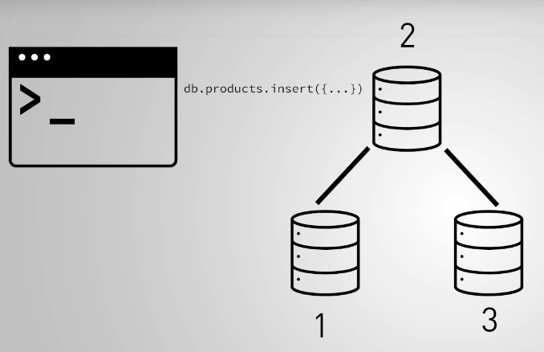

La **disponibilidad** y la **redundancia de datos** son propiedades típicas de una solución de base de datos duradera.

La replicación de datos puede tomar una de dos formas.


Hay replicación binaria y replicación basada en sentencias (binary replication and statement-based replication).

Echaremos un vistazo a las diferencias entre estos dos enfoques, y comenzaremos con la replicación binaria.


Digamos que insertamos este documento en nuestra base de datos.

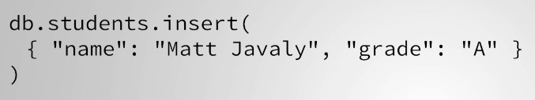

Una vez completada la escritura, tenemos unos pocos bytes en el disco que se escribieron para contener algunos datos nuevos.


La forma en que funciona la replicación binaria es examinando los bytes exactos que cambiaron en los archivos de datos y registrando esos cambios en un **binary log** (registro binario).

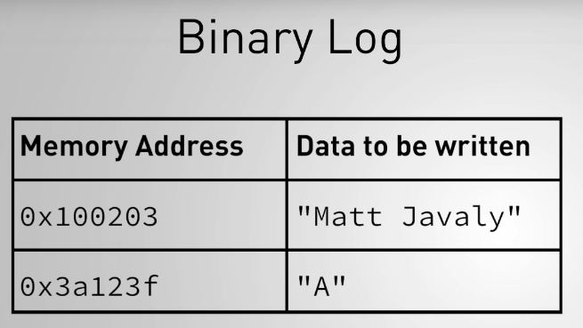

Los nodos secundarios reciben una copia del **binary log** (registro binario) y escriben los datos especificados que cambiaron a las ubicaciones exactas de bytes que se especifican en el **binary log** (registro binario).

La replicación de datos de esta manera es bastante fácil en las secundarias porque obtienen instrucciones realmente específicas sobre qué bytes cambiar y a qué cambiarlos.

Y, de hecho, los secundarios ni siquiera son conscientes de las declaraciones que están replicando.

Esto puede ser bueno porque no hay contexto sobre los datos necesarios para replicar una escritura.

Sin embargo, el uso de la binary replication (replicación binaria) supone que el sistema operativo es coherente en todo el conjunto de réplicas.

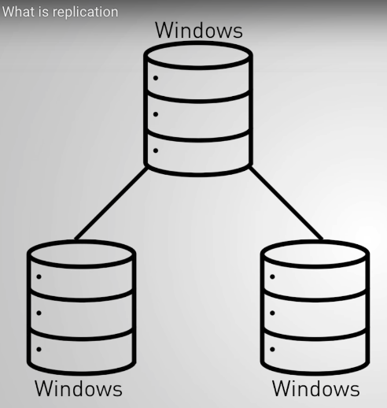

Por ejemplo, si nuestro nodo primario ejecuta Windows, los secundarios no pueden usar el mismo registro binario si ejecutan Linux.

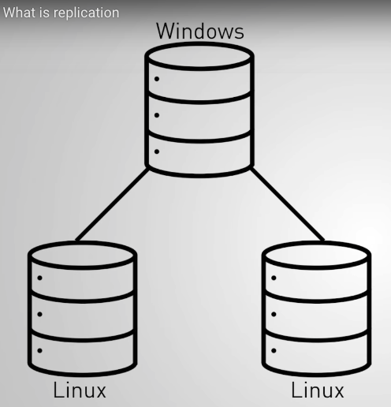

Y si tienen el mismo sistema operativo, todas las máquinas en el conjunto de réplicas deben tener el mismo conjunto de instrucciones.

Entonces, Windows x86 o x64 y la misma versión del servidor de base de datos que se ejecuta en cada máquina.

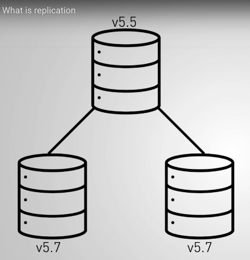

En otras palabras, el uso de la binary replication (replicación binaria) requiere una consistencia muy estricta en todas las máquinas que se ejecutan en un conjunto de réplicas.

Incluso olvidarse de actualizar el servidor de la base de datos en uno de los nodos podría generar datos corruptos.

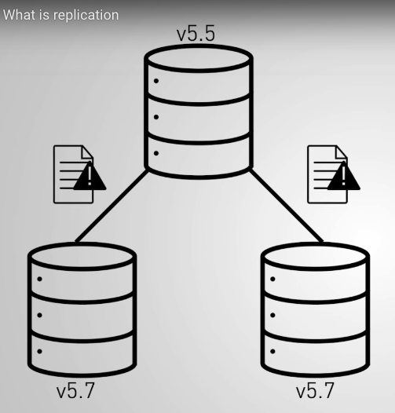

La Statement-based replication (replicación basada en declaraciones) es más o menos lo que parece.


Después de que se completa una escritura en el nodo primario, la declaración de escritura en sí misma se almacena en el **oplog** (registro de operaciones), 

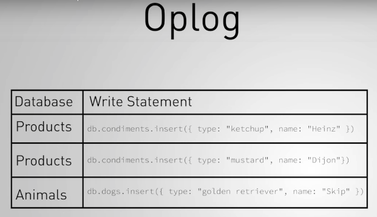

y los secundarios luego sincronizan sus **oplog** (registro de operaciones) con el **oplog** (registro de operaciones) primario y reproducen cualquier declaración nueva en sus propios datos.

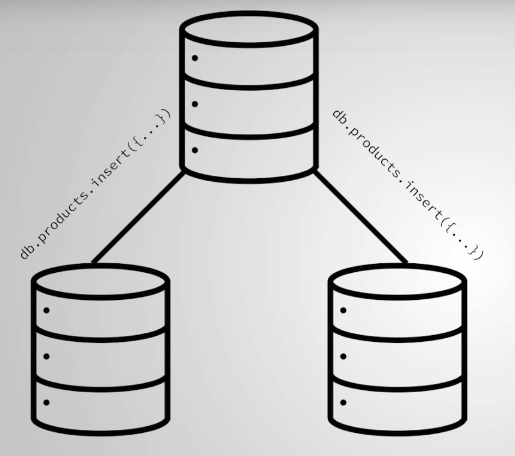

Este enfoque funciona independientemente del sistema operativo o el conjunto de instrucciones de los nodos en el conjunto de réplica.

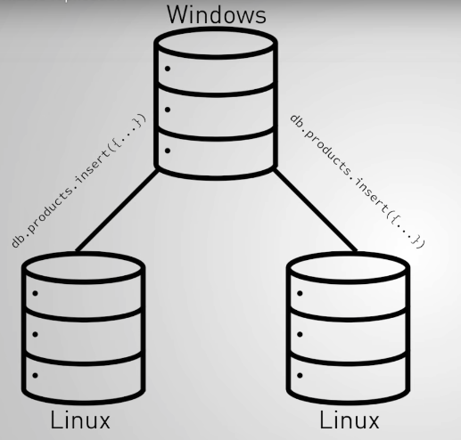

MongoDB utiliza la statement-based replication (replicación basada en instrucciones), pero los comandos correctos en realidad sufren una pequeña transformación antes de almacenarse en el **oplog** (registro de operaciones).

Y el objetivo aquí de la transformación es asegurarse de que las declaraciones almacenadas en el oplog se puedan aplicar un número indefinido de veces sin dejar de generar el mismo estado de datos.

Esta propiedad se llama **idempotencia**.


Por ejemplo, supongamos que tenemos una declaración que incrementó las paid views (vistas pagas) en un sitio web en 1.

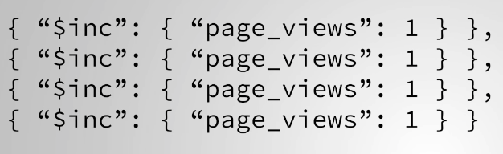

El primario ya aplicó esta declaración a sus datos, por lo que sabe que después de incrementar el uso de la página en 1, el total de visitas de la página pasó de 1,000 a 1,001.

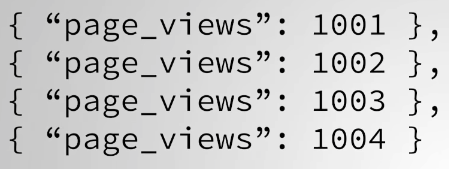

En realidad, transformaría esta declaración en una declaración que establece vistas de página en 1.001 y luego la almacena en el oplog registro de operaciones.

Cuando las declaraciones se replican de esta manera, podemos reproducir el registro de operaciones tantas veces como queramos sin preocuparnos por la consistencia de los datos.


Ahora echemos un vistazo a los pros y los contras de la replicación binaria y basada en sentencias.

El enfoque binario requiere que se almacenen menos datos en el registro binario, lo que significa que se pasan menos datos del primario al secundario.

La replicación binaria puede ser mucho más rápida que la replicación basada en sentencias porque los secundarios requieren menos trabajo al replicar realmente desde el registro binario.

Los datos que deben cambiarse se escriben directamente en el registro en ese caso.

Por otro lado, la replicación basada en sentencias en MongoDB escribe los comandos reales de MongoDB en el oplog, por lo que el oplog es un poco más grande.

Sin embargo, las declaraciones no están vinculadas a un sistema operativo específico ni a ninguna dependencia a nivel de máquina.

Por lo tanto, existen pocas restricciones en las máquinas en un replica set en MongoDB.

Esto es valioso para cualquier solución multiplataforma que requiera múltiples sistemas operativos en el mismo conjunto de réplicas.

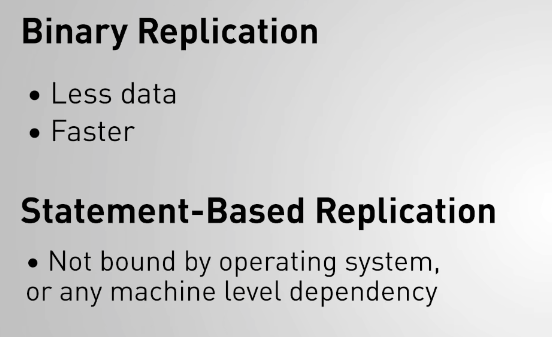

## 2. Examen What is Replication?

**Problem:**

Which of the following are true about binary replication and statement-based replication?

Check all answers that apply:

* Statement-based replication is platform independent. :+1:

* MongoDB uses statement-based replication, not binary replication. :+1:

* Binary replication is more accurate than statement-based replication.

**Correct answers:**

**Statement-based replication is platform independent.**

Statement-based replication is agnostic of operating system, because statements do not depend on a specific byte makeup or instruction set.

**MongoDB uses statement-based replication, not binary replication.**

MongoDB uses a small variation of statement-based replication which reduces statements to idempotent versions so they can be repeated.

**Incorrect answer:**

**Binary replication is more accurate than statement-based replication.**

Both methods of replication are accurate; however they do vary in speed and variability across operating systems.


## 3. Tema: Conjunto de réplicas MongoDB

### Notas de lectura

Lea más sobre el [Simple Raft Protocol](http://thesecretlivesofdata.com/raft/) y el  [Raft Consensus Algorithm](https://raft.github.io/).

### Transcripción

Ahora que hemos visto por qué la replicación es importante, profundicemos rápidamente en los detalles de los conjuntos de réplicas.

Conjuntos de réplicas o grupos de mongods que comparten copias de la misma información entre ellos.

Los miembros del conjunto de réplicas pueden tener uno de dos roles diferentes.

El nodo puede ser primario donde este nodo sirve todas las lecturas y todas las escrituras.

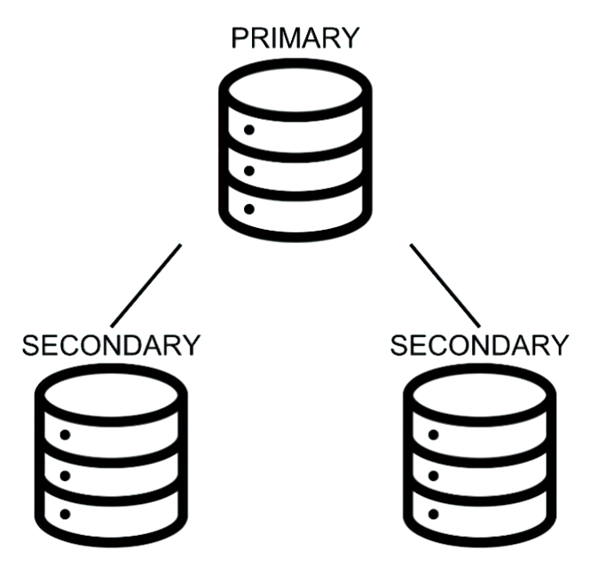

O nodo secundario donde la responsabilidad de este nodo es replicar toda la información, y luego servir como una alta disponibilidad para el nodo en caso de falla del primario.

Los secundarios obtendrán los datos del primario a través de un mecanismo de replicación asincrónica.

Cada vez que una aplicación escribe algunos datos en el replica set, ese derecho lo maneja el nodo primario.

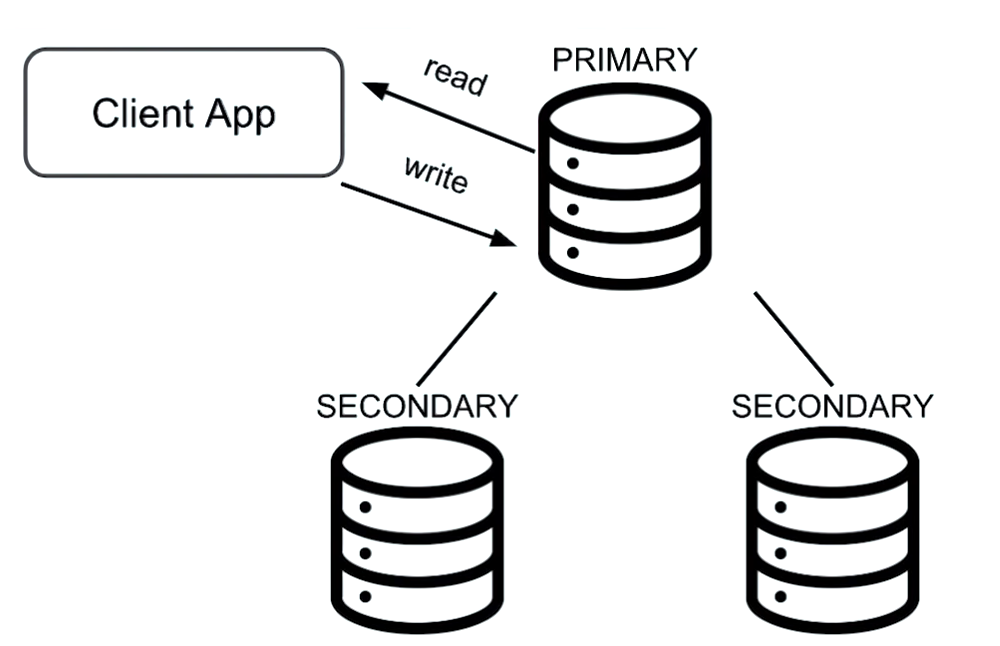

Y luego los datos se replican en los nodos secundarios.

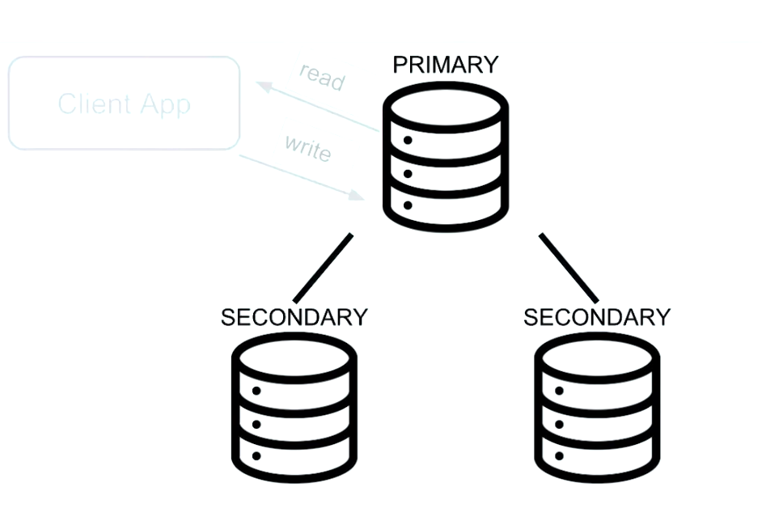

Ahora este mecanismo de replicación se basa en un protocolo que gestiona la forma en que los secundarios deben leer los datos del primario.

En MongoDB, este protocolo de replicación síncrona puede tener diferentes versiones.

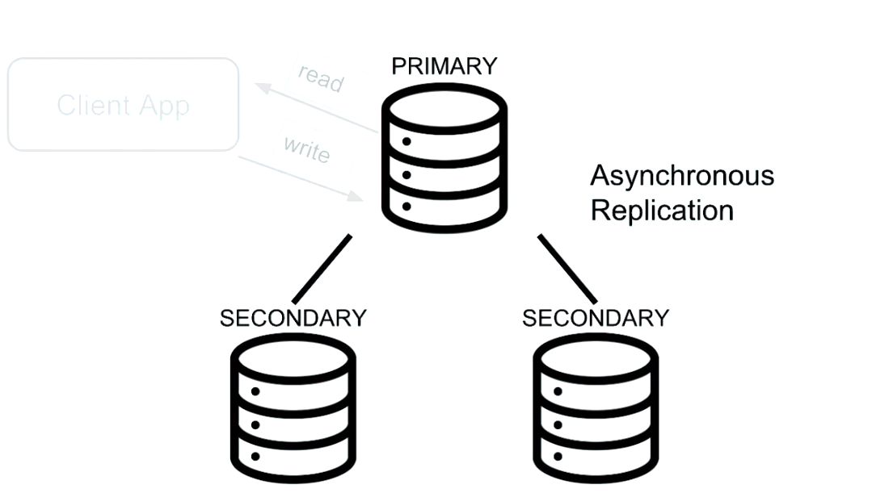

Tenemos **PV1** y **PV0**.

Las diferentes versiones del protocolo de replicación variarán ligeramente en la forma en que la durabilidad y la disponibilidad se verán forzadas en todo el conjunto.

Actualmente, la versión 1 del protocolo, o PV1, es la versión predeterminada.

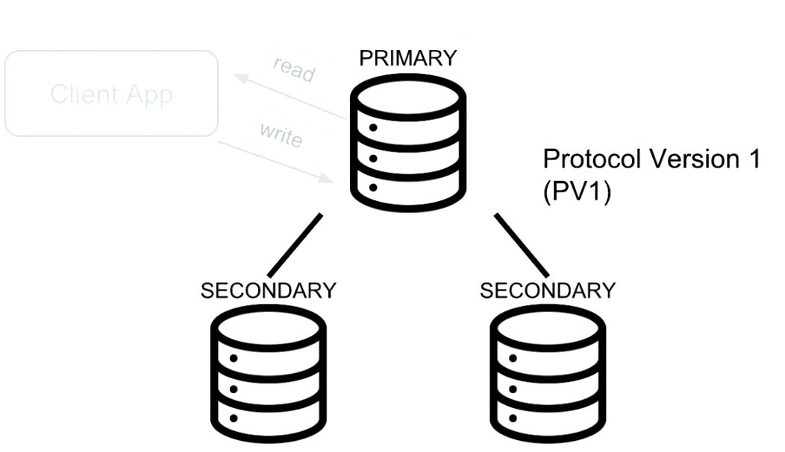

Este protocolo se basa en el protocolo **RAFT**.

Si no está familiarizado con el protocolo RAFT, en las notas de esta lección, encontrará información detallada sobre RAFT.

Solo tenga en cuenta por ahora que las versiones anteriores de MongoDB usaban la versión anterior del protocolo PV0, y que podría haber algunos detalles de configuración entre ambos protocolos.

Por ahora, nos centraremos en PV1.

En el corazón de este mecanismo de replicación está nuestro registro de operaciones, u **oplog** para abreviar.

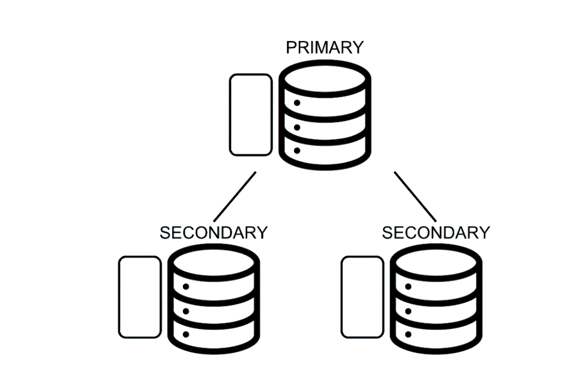

El oplog es un bloqueo basado en segmentos que realiza un seguimiento de todas las operaciones de escritura reconocidas por los conjuntos de réplica.

Cada vez que una escritura se aplica con éxito al nodo primario, se registrará en el oplog en su forma idempotente.

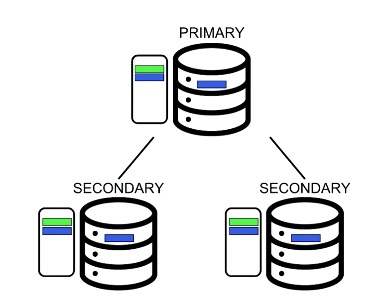

Analizaremos los detalles de idempotencia más adelante.

Pero tenga en cuenta que una operación idempotente se puede aplicar varias veces.

Y el resultado final de esa operación siempre dará como resultado el mismo resultado final.

Más sobre esto más adelante.

Además de un rol primario o secundario, un miembro del conjunto de réplicas también se puede configurar como **árbitro**.

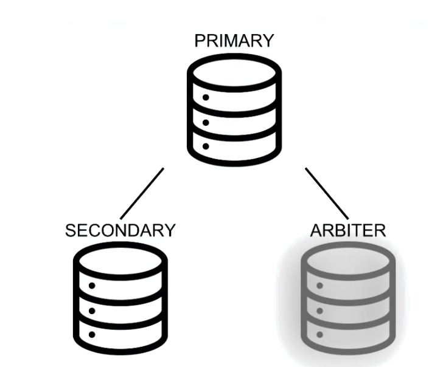

Un árbitro es un miembro que no tiene datos.

Su mera existencia es servir como un desempate entre los secundarios en una elección.

Y, obviamente, si no tiene datos, nunca puede convertirse en primario.

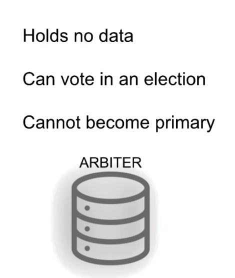

Los replica sets son resistentes a fallas.

Eso significa que tienen un mecanismo de conmutación por error (failover) que requiere que la mayoría de los nodos en un replica set estén disponibles para que se elija una primaria.

En este caso particular, supongamos que perdemos el acceso a nuestro primario.

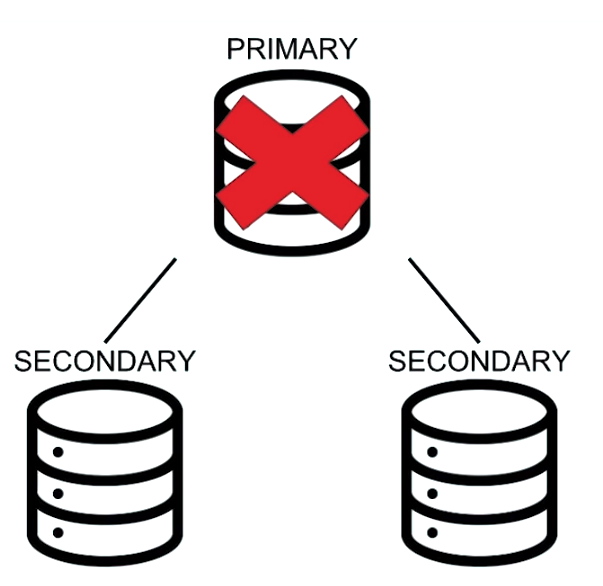

Si no tenemos un primario, no podremos escribir, y eso no es bueno.

Entonces, necesitamos despejar entre los nodos restantes del conjunto, ¿cuál podría convertirse en el nuevo primario?

Eso es a través de una elección, que se incrusta en los detalles de la versión política.

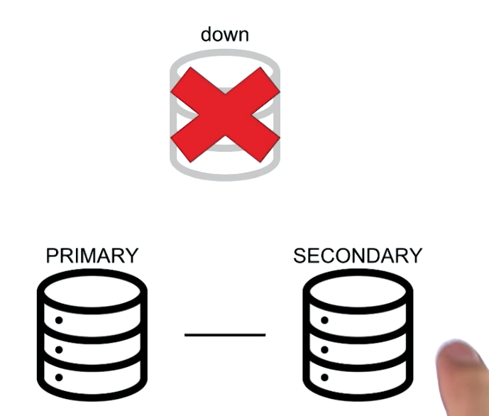

Cómo se elige una primaria o por qué esto: un nodo particular se convierte en primario en lugar de otro.

Está fuera de alcance por ahora, pero tenga en cuenta que los detalles de estos estarán relacionados con la versión de protocolo que pueda tener su sistema.

Por ahora, solo tenga en cuenta que existe un mecanismo de conmutación por error (failover mechanism).

Es importante tener en cuenta que siempre debe tener al menos un **número impar de nodos en su replica set**.

En caso de un número par de nodos, asegúrese de que la mayoría esté constantemente disponible.

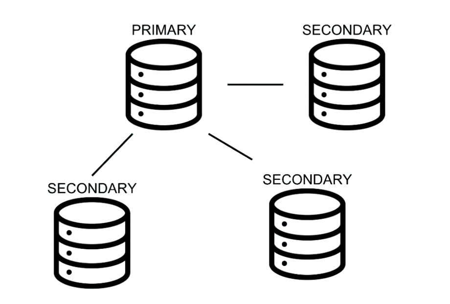

En esta forma de conjunto de réplicas, necesitará tener al menos tres nodos para estar disponibles.

La lista de los miembros del conjunto de réplica en sus opciones de configuración define la topología del conjunto de réplica.

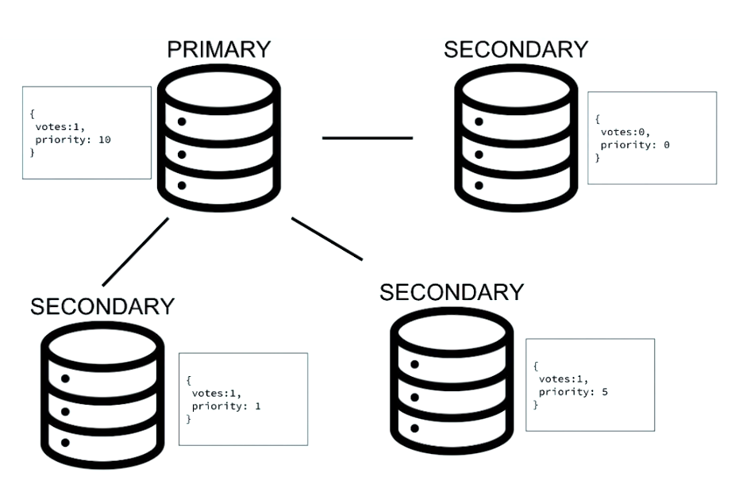

Cualquier cambio de topología desencadenará una elección.

Agregar miembros al conjunto, fallas en miembros o cambiar cualquiera de los aspectos de configuración del conjunto de réplica se percibirá como un cambio de topología.

La topología de un replica set se define en la configuración del replica set.

La configuración del replica set se define en uno de los nodos y luego se comparte entre todos los miembros a través del mecanismo de replicación.

Examinaremos los documentos de configuración de replicación en detalle más adelante.

En este caso, tenemos cuatro miembros y necesito llamar su atención sobre una situación específica.

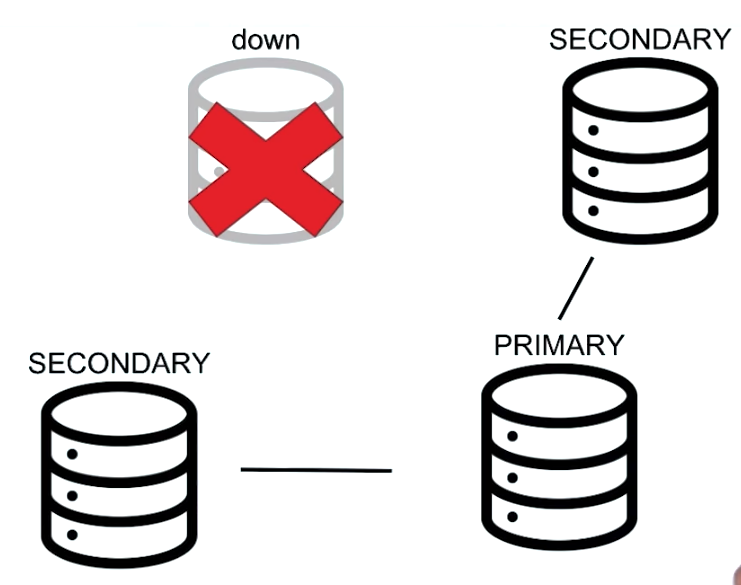

Esta topología ofrece exactamente el mismo número de fallas que un replica set de tres nodos.

Solo puede permitirse perder un miembro.

En caso de perder dos de ellos, no tendremos mayoría disponible fuera de los sets.

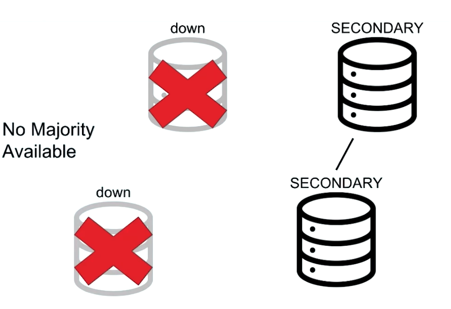

¿Por qué?

Bueno, la mayoría de 4 es 3.

Por lo tanto, los dos nodos restantes no podrán elegir un primario entre ellos.

Tener ese nodo adicional no proporcionará disponibilidad adicional del servicio.

Solo otra copia redundante de nuestros datos, lo cual es bueno, pero no necesariamente por razones de disponibilidad.

Ahora, los replica sets pueden llegar hasta 50 miembros.

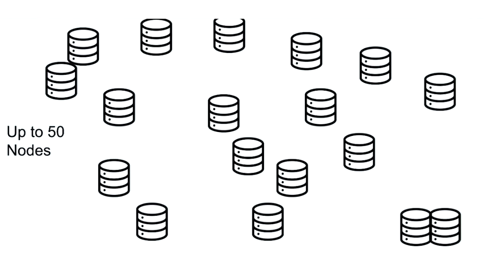

Y esto podría ser útil, especialmente para la distribución geográfica de nuestros datos donde queremos copias de nuestros datos más cerca de nuestros usuarios y aplicaciones, o simplemente en múltiples ubicaciones para la redundancia.


Pero solo un máximo de siete de esos miembros pueden ser miembros con derecho a voto.

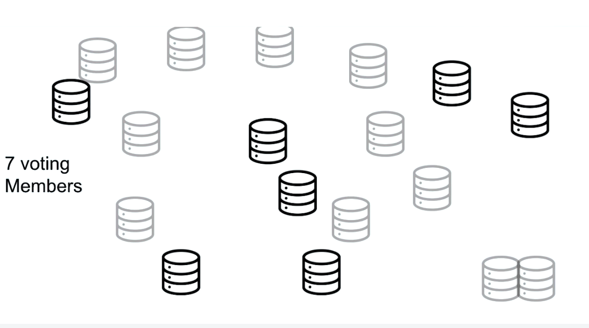

Más de siete miembros pueden hacer que las rondas electorales tomen demasiado tiempo, con poco o ningún beneficio por motivos de disponibilidad y coherencia.

Entonces, entre esos siete nodos, uno de ellos se convertirá en el primario y los restantes serán elegibles como primarios si en caso de que cambie su política, o en caso de que se active una nueva elección.

Ahora, si por alguna razón no podemos o no queremos tener un nodo con datos, pero aún así podemos realizar una conmutación por error entre nodos, podemos agregar un miembro del conjunto de réplicas como árbitro.


Dicho esto, **los árbitros causan importantes problemas de consistencia en los sistemas de datos distribuidos**.

Por lo tanto, le recomendamos que los use con cuidado.


En mi opinión personal, el uso de árbitros es una opción muy sensible y potencialmente dañina en muchas implementaciones.

Así que desanimo ociosamente el uso de árbitros.

Dentro de los nodos secundarios, estos también se pueden configurar para que tengan propiedades específicas o especiales definidas.

Podemos definir nodos ocultos, por ejemplo.

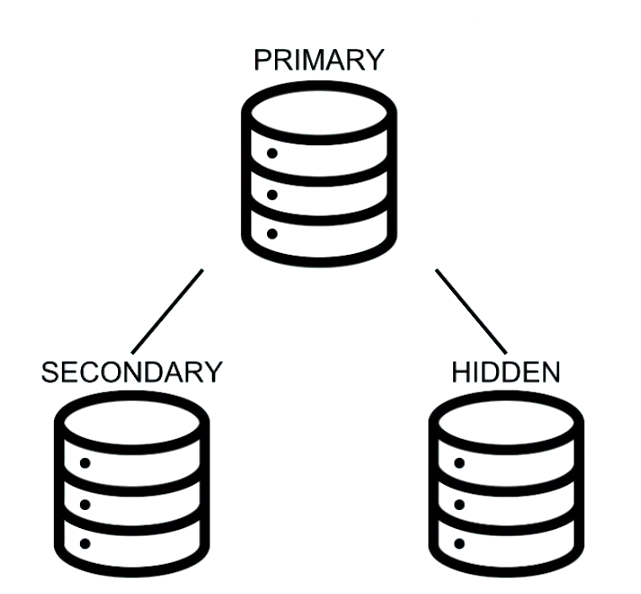

El propósito de un nodo oculto es proporcionar cargas de trabajo específicas de solo lectura, o tener copias sobre sus datos que están ocultos de la aplicación.

Los nodos ocultos también se pueden configurar con un retraso en su proceso de replicación.

Llamamos a estos nodos **delayed** (retrasados).

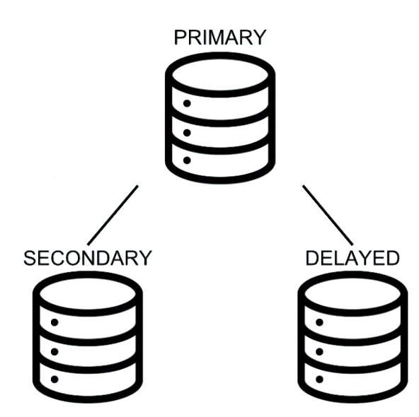

El propósito de tener nodos delayed es permitir la resistencia a la corrupción a nivel de aplicación, sin depender de archivos de copia de seguridad en frío para recuperarse de tal evento.

Si tenemos un nodo delayed, digamos una hora, y si su DBA pierde accidentalmente una colección, tenemos una hora para recuperar todos los datos del nodo delayed sin necesidad de volver al archivo de copia de seguridad para recuperar en cualquier momento que se creó una copia de seguridad.

Permitiéndonos tener copias de seguridad en caliente.

Recapitulemos lo que acabamos de aprender en esta conferencia.

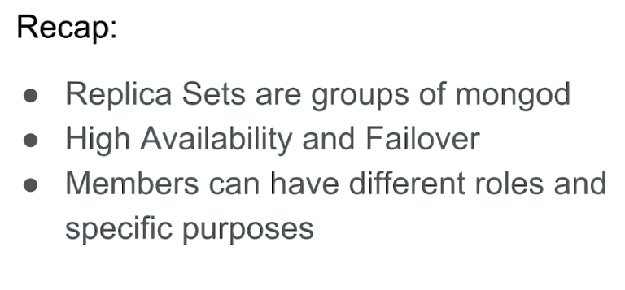

Los creplica sets son grupos de procesos mongod que comparten los mismos datos entre todos los miembros del conjunto.

Proporcionan un mecanismo de alta disponibilidad y conmutación por error (failover) para nuestra aplicación, lo que hace que el servicio no caiga en caso de falla.

La conmutación por error(failover) es compatible con la mayoría de los nodos que eligen entre ellos quién debería ser el nuevo nodo primario en cada momento.

Los replica sets son un sistema dinámico, significa que los miembros pueden tener diferentes roles en diferentes momentos y pueden configurarse para abordar un propósito funcional específico, como abordar la lectura en las cargas de trabajo, o configurarse para retrasarse a tiempo para permitir copias de seguridad en caliente.

## 4. Examen MongoDB Replica Set

**Problem:**

Which of the following are true for replica sets in MongoDB?

Check all answers that apply:

* We can have up to 50 voting members in a replica set.

* Replica set members have a fixed role assigned.

* We should always use arbiters.

* Replica sets provide high availability. :+1:


## 5. Tema: Configuración de un conjunto de réplicas

### Notas de lectura

Lea más sobre los [comandos VI](http://www.lagmonster.org/docs/vi.html).

**Errata**

En el minuto 1:08, Matt muestra cómo cambiar los permisos del archivo de clave para permitir que el proceso `mongod` lea el archivo usando el modo demasiado permisivo, 600. Un conjunto de permisos más correcto sería usar **400**. Hemos reflejado eso en el instrucciones de lectura a continuación.

**Instrucciones de lectura**

*Nota: En el video, utilizamos el antiguo nombre de host* `"m103.mongodb.university"` que se ha cambiado a `"m103"`. *Hemos actualizado todos los siguientes comandos en consecuencia*.

El archivo de configuración para el primer nodo (`node1.conf`):

```sh
storage:
  dbPath: /var/mongodb/db/node1
net:
  bindIp: 192.168.103.100,localhost
  port: 27011
security:
  authorization: enabled
  keyFile: /var/mongodb/pki/m103-keyfile
systemLog:
  destination: file
  path: /var/mongodb/db/node1/mongod.log
  logAppend: true
processManagement:
  fork: true
replication:
  replSetName: m103-example
```

Crear el archivo de claves y establecer permisos en él:

```sh
sudo mkdir -p /var/mongodb/pki/
sudo chown vagrant:vagrant /var/mongodb/pki/
openssl rand -base64 741 > /var/mongodb/pki/m103-keyfile
chmod 400 /var/mongodb/pki/m103-keyfile
```

Crear el dbpath para **node1**:

```sh
mkdir -p /var/mongodb/db/node1
```

Iniciar una `mongod` con `node1.conf`:

```sh
mongod -f node1.conf
```

Copiando `node1.conf` a `node2.conf` y `node3.conf`:

```sh
cp node1.conf node2.conf
cp node2.conf node3.conf
```

Editar `node2.conf` usando `vi`:

```sh
vi node2.conf
```

Guardar el archivo y salir de `vi`:

```sh
:wq
```

`node2.conf`, después de cambiar `dbpath`, `port` y `logpath`:

```sh
storage:
  dbPath: /var/mongodb/db/node2
net:
  bindIp: 192.168.103.100,localhost
  port: 27012
security:
  keyFile: /var/mongodb/pki/m103-keyfile
systemLog:
  destination: file
  path: /var/mongodb/db/node2/mongod.log
  logAppend: true
processManagement:
  fork: true
replication:
  replSetName: m103-example
```

`node3.conf`, después de cambiar `dbpath`, `port`, y `logpath`:

```sh
storage:
  dbPath: /var/mongodb/db/node3
net:
  bindIp: 192.168.103.100,localhost
  port: 27013
security:
  keyFile: /var/mongodb/pki/m103-keyfile
systemLog:
  destination: file
  path: /var/mongodb/db/node3/mongod.log
  logAppend: true
processManagement:
  fork: true
replication:
  replSetName: m103-example
```

Crear los directorios de datos para `node2` y `node3`:

```sh
mkdir /var/mongodb/db/{node2,node3}
```

Inicio de procesos mongod con `node2.conf` y `node3.conf`:

```sh
mongod -f node2.conf
mongod -f node3.conf
```

Cononectarse a `node1`:

```sh
mongo --port 27011
```

Inicializando el replica set:

```sh
rs.initiate()
```

Crear un user:

```sh
use admin
db.createUser({
  user: "m103-admin",
  pwd: "m103-pass",
  roles: [
    {role: "root", db: "admin"}
  ]
})
```

Saliendo del Shell Mongo y conectándose a todo el replica set:

```sh
exit
mongo --host "m103-example/192.168.103.100:27011" -u "m103-admin"
-p "m103-pass" --authenticationDatabase "admin"
```

Obtención del estado del replica set:

```sh
rs.status()
```

Agregar otros miembros al replica set:

```sh
rs.add("m103:27012")
rs.add("m103:27013")
```

Obtención de una descripción general de la topología del replica set:

```sh
rs.isMaster()
```

Dar de baja el primario actual:

```sh
rs.stepDown()
```

Comprobación de la descripción general del replica set después de la elección:

```sh
rs.isMaster()
```

### Transcripción

Muy bien, así que en esta lección, vamos a iniciar un replica set local.

Comenzaremos lanzando independientemente tres procesos mongod y no podrán comunicarse entre sí hasta que los conectemos, en ese momento podrán replicar datos para nosotros.

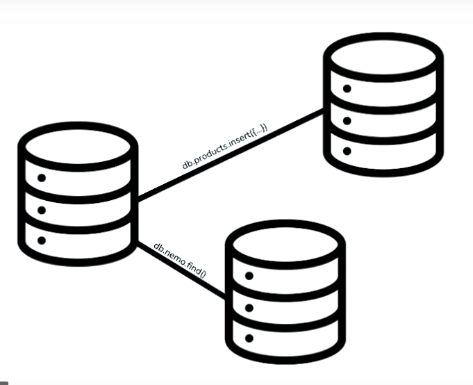

Entonces este es el archivo de configuración para el nodo independiente.


```sh
storage:
  dbPath: /var/mongodb/db/node1
net:
  bindIp: 192.168.103.100,localhost
  port: 27011
security:
  authorization: enabled  
systemLog:
  destination: file
  path: /var/mongodb/db/node1/mongod.log
  logAppend: true
processManagement:
  fork: true
```

Lo hemos llamado node 1.

Y esta configuración debería resultarle bastante familiar si ha seguido las lecciones anteriores.

En realidad, no necesitamos cambiar ninguna de estas configuraciones para habilitar la replicación, solo necesitamos agregar algunas líneas.

Entonces, esta línea `keyFile: /var/mongodb/pki/m103-keyfile` permite la autenticación de archivos clave en nuestro clúster, lo que exige que todos los miembros del replica set se autentiquen entre sí utilizando un archivo clave que creamos aquí.

```sh
storage:
  dbPath: /var/mongodb/db/node1
net:
  bindIp: 192.168.103.100,localhost
  port: 27011
security:
  authorization: enabled
  keyFile: /var/mongodb/pki/m103-keyfile
systemLog:
  destination: file
  path: /var/mongodb/db/node1/mongod.log
  logAppend: true
processManagement:
  fork: true
```

Y crearemos este en un minuto.

Esto se suma a la autenticación del cliente que habilitamos en la línea anterior `authorization: enabled`.

Entonces creamos este archivo de clave usando OpenSSL, y lo colocamos en el directorio que especificamos en nuestro archivo de configuración.

```sh
vagrant@m103:~$ sudo mkdir -p /var/mongodb/pki/
vagrant@m103:~$ sudo chown vagrant:vagrant /var/mongodb/pki/
vagrant@m103:~$ openssl rand -base64 741 > /var/mongodb/pki/m103-keyfile
vagrant@m103:~$ chmod 400 /var/mongodb/pki/m103-keyfile
```

Pero en este momento, nuestros procesos mongod en realidad no pueden usar este archivo de clave porque no tienen los permisos para leerlo.

Entonces, lo que vamos a hacer es cambiar los permisos usando `chmod` para permitirles leer el archivo.

600 (400) aquí solo especifica nuevos permisos.

Entonces, habilitar la autenticación de archivos clave aquí `keyFile: /var/mongodb/pki/m103-keyfile` habilita implícitamente la autenticación del cliente que habilitamos en la línea anterior `authorization: enabled`, pero voy a dejar ambos aquí por el momento solo por claridad.


```sh
storage:
  dbPath: /var/mongodb/db/node1
net:
  bindIp: 192.168.103.100,localhost
  port: 27011
security:
  authorization: enabled
  keyFile: /var/mongodb/pki/m103-keyfile
systemLog:
  destination: file
  path: /var/mongodb/db/node1/mongod.log
  logAppend: true
processManagement:
  fork: true
```

Este es un recordatorio de que, además de autenticarse con el cliente, nuestros nodos también se autentican entre sí.

Entonces esta es la última línea que tenemos que agregar a nuestro archivo de configuración para permitir la replicación en este nodo.

```sh
replication:
  replSetName: m103-example
```

Y todo lo que hace es especificar el nombre del conjunto de réplicas del que este nodo formará parte.

```sh
storage:
  dbPath: /var/mongodb/db/node1
net:
  bindIp: 192.168.103.100,localhost
  port: 27011
security:
  authorization: enabled
  keyFile: /var/mongodb/pki/m103-keyfile
systemLog:
  destination: file
  path: /var/mongodb/db/node1/mongod.log
  logAppend: true
processManagement:
  fork: true
replication:
  replSetName: m103-example
```

Ahora todo lo que tenemos que hacer es crear la ruta de DB que nombramos aquí `dbPath: /var/mongodb/db/node1`.

Y en realidad podemos usar este archivo para iniciar un mongod.

Así que aquí solo estoy creando mi ruta de DB, y ahora puedo iniciar el mongod usando nuestro archivo de configuración.

```sh
vagrant@m103:~$ mkdir -p /var/mongodb/db/node1
vagrant@m103:~$ sudo chown vagrant:vagrant /var/mongodb/db/node1/
vagrant@m103:~$ mongod -f ./node1.conf
about to fork child process, waiting until server is ready for connections.
forked process: 2404
child process started successfully, parent exiting
vagrant@m103:~$ 
```

Y hemos comenzado con éxito nuestro primer nodo.

Así que ahora tenemos un nodo y solo nos quedan dos más.

Entonces, este comando simplemente está copiando el archivo que acabamos de crear en un nuevo archivo llamado `node2.conf` porque los otros dos nodos tendrán configuraciones muy similares.

```sh
vagrant@m103:~$ cp node1.conf node2.conf
```

Básicamente podemos copiar este, cambiar tres líneas y lanzar un nuevo nodo.

Nunca subestimes el poder de copiar y pegar.

Voy a hacer lo mismo para nuestro tercer nodo aquí

```sh
vagrant@m103:~$ cp node2.conf node3.conf
```

, y luego editaré el segundo.


```sh
vi node2.conf
```

Entonces, las tres cosas que necesitamos cambiar en este archivo son la ruta de la base de datos, el número de puerto y la ruta del registro.

```sh
storage:
  dbPath: /var/mongodb/db/node2
net:
  bindIp: 192.168.103.100,localhost
  port: 27012
security:
  keyFile: /var/mongodb/pki/m103-keyfile
systemLog:
  destination: file
  path: /var/mongodb/db/node2/mongod.log
  logAppend: true
processManagement:
  fork: true
replication:
  replSetName: m103-example
```

Guardar el archivo y salir de vi:

```sh
:wq
```

Una vez que hacemos eso, en realidad estamos bien para comenzar un nuevo nodo.

Así que aquí acabo de crear la ruta para el nodo 2 y la estoy iniciando con mongod.

```sh
vagrant@m103:~$ mkdir /var/mongodb/db/node2

vagrant@m103:~$ sudo chown vagrant:vagrant /var/mongodb/db/node2

vagrant@m103:~$ mongod -f node2.conf
about to fork child process, waiting until server is ready for connections.
forked process: 2455
child process started successfully, parent exiting
vagrant@m103:~$ 
```

Y ahora tenemos dos nodos en nuestro conjunto.

Solo voy a hacer lo mismo para nuestro tercer archivo de configuración, y notaré que los tres nodos en el conjunto de réplica hacen referencia al mismo archivo de clave.

```sh
vi node3.conf

storage:
  dbPath: /var/mongodb/db/node3
net:
  bindIp: 192.168.103.100,localhost
  port: 27013
security:
  keyFile: /var/mongodb/pki/m103-keyfile
systemLog:
  destination: file
  path: /var/mongodb/db/node3/mongod.log
  logAppend: true
processManagement:
  fork: true
replication:
  replSetName: m103-example
```

```sh
vagrant@m103:~$ mkdir /var/mongodb/db/node3

vagrant@m103:~$ sudo chown vagrant:vagrant /var/mongodb/db/node2

vagrant@m103:~$ mongod -f node3.conf
about to fork child process, waiting until server is ready for connections.
forked process: 2495
child process started successfully, parent exiting
vagrant@m103:~$ 
```

Por lo general, estas instancias mongod se estarían ejecutando en diferentes máquinas, pero debido a que se están ejecutando en la misma máquina, todas compartirán el mismo archivo de clave `keyFile: /var/mongodb/pki/m103-keyfile` y usarán el mismo para autenticarse entre sí.

Normalmente, este archivo de clave se copiará en cada máquina donde se ejecuta cada mongod.

Entonces, en este punto, comenzamos tres procesos mongod que eventualmente formarán un conjunto de réplicas.

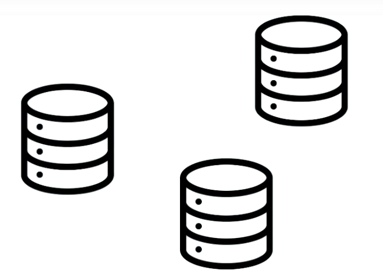

Pero en este momento, no pueden replicar datos.

Y, de hecho, no saben que hay otros nodos por ahí.

Son ciegos al mundo que los rodea.

Necesitamos habilitar la comunicación entre los nodos para que puedan permanecer sincronizados.

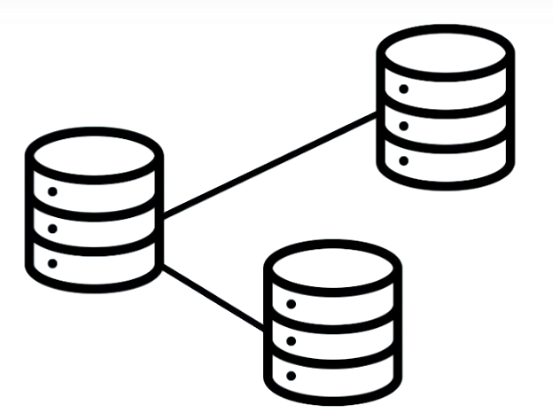

Así que solo voy a conectarme al nodo uno aquí.

```sh
vagrant@m103:~$ mongo --port 27011
MongoDB shell version v3.6.17
connecting to: mongodb://127.0.0.1:27011/?gssapiServiceName=mongodb
Implicit session: session { "id" : UUID("e3080836-f968-458b-a416-41bb33d46053") }
MongoDB server version: 3.6.17
MongoDB Enterprise > 

```

Entonces uso este comando `rs.initiate` para iniciar el conjunto de réplicas.

```sh
MongoDB Enterprise m103-example:PRIMARY> rs.initiate()
{
	"info2" : "no configuration specified. Using a default configuration for the set",
	"me" : "192.168.103.100:27011",
	"info" : "try querying local.system.replset to see current configuration",
	"ok" : 0,
	"errmsg" : "already initialized",
	"code" : 23,
	"codeName" : "AlreadyInitialized",
	"operationTime" : Timestamp(1582567520, 1),
	"$clusterTime" : {
		"clusterTime" : Timestamp(1582567520, 1),
		"signature" : {
			"hash" : BinData(0,"dz+tLQF1l21yDuvszF08KAkSn64="),
			"keyId" : NumberLong("6797075527363461121")
		}
	}
}
MongoDB Enterprise m103-example:PRIMARY> 
```

Y en realidad necesitamos ejecutarlo en uno de los nodos.

Como lo ejecutamos aquí, solo tenemos que agregar los otros dos nodos desde este nodo.

Sin embargo, tenemos habilitada la autenticación del cliente, por lo que no podemos agregar otros nodos al conjunto hasta que creamos un usuario y luego nos conectamos como ese usuario.

Muy bien, entonces con el siguiente comando creó nuestro súper usuario `m103`, llamado `m103-admin`, que tiene acceso de root y se autentica en la base de datos `admin`.

```sh
MongoDB Enterprise m103-example:PRIMARY> use admin
switched to db admin

MongoDB Enterprise m103-example:PRIMARY> db.createUser({
...   user: "m103-admin",
...   pwd: "m103-pass",
...   roles: [
...     {role: "root", db: "admin"}
...   ]
... })
Successfully added user: {
	"user" : "m103-admin",
	"roles" : [
		{
			"role" : "root",
			"db" : "admin"
		}
	]
}
MongoDB Enterprise m103-example:PRIMARY> 
```

Ahora voy a salir de este mongod y luego volver a iniciar sesión como ese usuario.

```sh
MongoDB Enterprise m103-example:PRIMARY> exit
bye

vagrant@m103:~$ mongo --host "m103-example/192.168.103.100:27011" -u "m103-admin" -p "m103-pass" --authenticationDatabase "admin"
MongoDB shell version v3.6.17
connecting to: mongodb://192.168.103.100:27011/?authSource=admin&gssapiServiceName=mongodb&replicaSet=m103-example
2020-02-24T18:10:39.096+0000 I NETWORK  [thread1] Starting new replica set monitor for m103-example/192.168.103.100:27011
2020-02-24T18:10:39.097+0000 I NETWORK  [thread1] Successfully connected to 192.168.103.100:27011 (1 connections now open to 192.168.103.100:27011 with a 5 second timeout)
Implicit session: session { "id" : UUID("5d9da307-cdec-4eee-93b1-58be6e987724") }
MongoDB server version: 3.6.17
Server has startup warnings: 
2020-02-24T17:43:17.073+0000 I STORAGE  [initandlisten] 
2020-02-24T17:43:17.073+0000 I STORAGE  [initandlisten] ** WARNING: Using the XFS filesystem is strongly recommended with the WiredTiger storage engine
2020-02-24T17:43:17.073+0000 I STORAGE  [initandlisten] **          See http://dochub.mongodb.org/core/prodnotes-filesystem
2020-02-24T17:43:17.847+0000 I CONTROL  [initandlisten] 
2020-02-24T17:43:17.847+0000 I CONTROL  [initandlisten] ** WARNING: /sys/kernel/mm/transparent_hugepage/enabled is 'always'.
2020-02-24T17:43:17.847+0000 I CONTROL  [initandlisten] **        We suggest setting it to 'never'
2020-02-24T17:43:17.847+0000 I CONTROL  [initandlisten] 
2020-02-24T17:43:17.847+0000 I CONTROL  [initandlisten] ** WARNING: /sys/kernel/mm/transparent_hugepage/defrag is 'always'.
2020-02-24T17:43:17.847+0000 I CONTROL  [initandlisten] **        We suggest setting it to 'never'
2020-02-24T17:43:17.847+0000 I CONTROL  [initandlisten] 
MongoDB Enterprise m103-example:PRIMARY> 
```

Entonces este es el comando que vamos a usar para conectarnos al conjunto de réplicas.

Y además de autenticar aquí con una contraseña de nombre de usuario, tenemos que especificar el nombre de la réplica establecida en el nombre del host.

Esto le indicará al Shell Mongo que se conecte directamente al replica set, en lugar de solo este nodo que especificamos.

Lo que va a hacer el shell es usar este nodo para descubrir cuál es el primario actual del conjunto de réplicas y luego conectarse a ese nodo.

En este caso, obviamente solo hay un nodo en el conjunto y ese nodo es el primario.

Entonces esa es la que nos conectó el shell.

Entonces este comando, `rs.status` es una forma útil de obtener un informe de estado en nuestro conjunto de réplicas.

```sh
MongoDB Enterprise m103-example:PRIMARY> rs.status()
{
	"set" : "m103-example",
	"date" : ISODate("2020-02-24T18:12:55.931Z"),
	"myState" : 1,
	"term" : NumberLong(1),
	"syncingTo" : "",
	"syncSourceHost" : "",
	"syncSourceId" : -1,
	"heartbeatIntervalMillis" : NumberLong(2000),
	"optimes" : {
		"lastCommittedOpTime" : {
			"ts" : Timestamp(1582567970, 1),
			"t" : NumberLong(1)
		},
		"readConcernMajorityOpTime" : {
			"ts" : Timestamp(1582567970, 1),
			"t" : NumberLong(1)
		},
		"appliedOpTime" : {
			"ts" : Timestamp(1582567970, 1),
			"t" : NumberLong(1)
		},
		"durableOpTime" : {
			"ts" : Timestamp(1582567970, 1),
			"t" : NumberLong(1)
		}
	},
	"members" : [
		{
			"_id" : 0,
			"name" : "192.168.103.100:27011",
			"health" : 1,
			"state" : 1,
			"stateStr" : "PRIMARY",
			"uptime" : 1779,
			"optime" : {
				"ts" : Timestamp(1582567970, 1),
				"t" : NumberLong(1)
			},
			"optimeDate" : ISODate("2020-02-24T18:12:50Z"),
			"syncingTo" : "",
			"syncSourceHost" : "",
			"syncSourceId" : -1,
			"infoMessage" : "",
			"electionTime" : Timestamp(1582567469, 2),
			"electionDate" : ISODate("2020-02-24T18:04:29Z"),
			"configVersion" : 1,
			"self" : true,
			"lastHeartbeatMessage" : ""
		}
	],
	"ok" : 1,
	"operationTime" : Timestamp(1582567970, 1),
	"$clusterTime" : {
		"clusterTime" : Timestamp(1582567970, 1),
		"signature" : {
			"hash" : BinData(0,"doEUCG+b9bZOJWbWCxB3hbFLDM0="),
			"keyId" : NumberLong("6797075527363461121")
		}
	}
}
MongoDB Enterprise m103-example:PRIMARY> 
```

Mira, nos da el nombre del set `"set" : "m103-example"`.

Nos da cuánto tiempo son los intervalos entre latidos `"heartbeatIntervalMillis" : NumberLong(2000)`.

Por defecto, son 2000 milisegundos, lo que significa que los nodos están hablando entre sí cada dos segundos.

Podemos desplazarnos hacia abajo para obtener una lista de los miembros del conjunto.

En este caso, es solo un miembro, al cual estamos conectados, el primario actual.


```sh
"members" : [
		{
			"_id" : 0,
			"name" : "192.168.103.100:27011",
			"health" : 1,
			"state" : 1,
			"stateStr" : "PRIMARY",
			"uptime" : 1779,
			"optime" : {
				"ts" : Timestamp(1582567970, 1),
				"t" : NumberLong(1)
			},
			"optimeDate" : ISODate("2020-02-24T18:12:50Z"),
			"syncingTo" : "",
			"syncSourceHost" : "",
			"syncSourceId" : -1,
			"infoMessage" : "",
			"electionTime" : Timestamp(1582567469, 2),
			"electionDate" : ISODate("2020-02-24T18:04:29Z"),
			"configVersion" : 1,
			"self" : true,
			"lastHeartbeatMessage" : ""
		}
	],
```

Entonces, este es el comando que usamos para agregar nuevos nodos a nuestro conjunto de réplicas, `rs.add`, y todo lo que tenemos que especificar aquí es el nombre de host, que es solo el nombre de host del cuadro Vagrant y el puerto que ese nodo está ejecutando.

```sh
MongoDB Enterprise m103-example:PRIMARY> rs.add("m103:27012")
{
	"ok" : 1,
	"operationTime" : Timestamp(1582571070, 1),
	"$clusterTime" : {
		"clusterTime" : Timestamp(1582571070, 1),
		"signature" : {
			"hash" : BinData(0,"L+ddF1hw5wdj2EMhxP+VhQzDrac="),
			"keyId" : NumberLong("6797075527363461121")
		}
	}
}
MongoDB Enterprise m103-example:PRIMARY> 
```

Ahora que funcionó.

Solo voy a hacer lo mismo para nuestro tercer nodo.

```sh
MongoDB Enterprise m103-example:PRIMARY> rs.add("m103:27013")
{
	"ok" : 1,
	"operationTime" : Timestamp(1582571128, 1),
	"$clusterTime" : {
		"clusterTime" : Timestamp(1582571128, 1),
		"signature" : {
			"hash" : BinData(0,"LY/2N0LMnI1pj6B7bd20tOd6aZY="),
			"keyId" : NumberLong("6797075527363461121")
		}
	}
}
MongoDB Enterprise m103-example:PRIMARY> 
```

Solo voy a verificar con `rs.isMaster`.

```sh
MongoDB Enterprise m103-example:PRIMARY> rs.isMaster()
{
	"hosts" : [
		"192.168.103.100:27011",
		"m103:27012",
		"m103:27013"
	],
	"setName" : "m103-example",
	"setVersion" : 3,
	"ismaster" : true,
	"secondary" : false,
	"primary" : "192.168.103.100:27011",
	"me" : "192.168.103.100:27011",
	"electionId" : ObjectId("7fffffff0000000000000001"),
	"lastWrite" : {
		"opTime" : {
			"ts" : Timestamp(1582571181, 1),
			"t" : NumberLong(1)
		},
		"lastWriteDate" : ISODate("2020-02-24T19:06:21Z"),
		"majorityOpTime" : {
			"ts" : Timestamp(1582571181, 1),
			"t" : NumberLong(1)
		},
		"majorityWriteDate" : ISODate("2020-02-24T19:06:21Z")
	},
	"maxBsonObjectSize" : 16777216,
	"maxMessageSizeBytes" : 48000000,
	"maxWriteBatchSize" : 100000,
	"localTime" : ISODate("2020-02-24T19:06:29.251Z"),
	"logicalSessionTimeoutMinutes" : 30,
	"minWireVersion" : 0,
	"maxWireVersion" : 6,
	"readOnly" : false,
	"ok" : 1,
	"operationTime" : Timestamp(1582571181, 1),
	"$clusterTime" : {
		"clusterTime" : Timestamp(1582571181, 1),
		"signature" : {
			"hash" : BinData(0,"pYBSJ9iA5h080WPeTcIGDzL5HwE="),
			"keyId" : NumberLong("6797075527363461121")
		}
	}
}
MongoDB Enterprise m103-example:PRIMARY> 
```

Y podemos ver que nuestro replica set ahora tiene tres nodos.

```sh
"hosts" : [
		"192.168.103.100:27011",
		"m103:27012",
		"m103:27013"
	],
```

Entonces, ahora que hemos agregado esos dos nodos a nuestro replica set y los hemos conectado, pueden replicar datos entre sí.

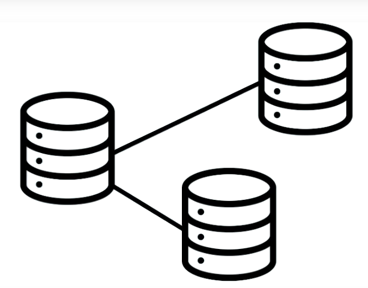

Una cosa que quiero señalar en este momento es que el primario actual se está ejecutando en el puerto 27011.

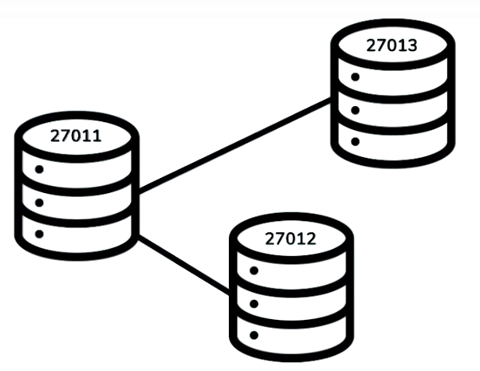

Y podríamos verificar eso a partir de la salida de `rs.isMaster`, donde dice que primario es `"primary" : "192.168.103.100:27011",`, de hecho, el nodo que se ejecuta en 27011.

```sh
MongoDB Enterprise m103-example:PRIMARY> rs.isMaster()
{
	"hosts" : [
		"192.168.103.100:27011",
		"m103:27012",
		"m103:27013"
	],
	"setName" : "m103-example",
	"setVersion" : 3,
	"ismaster" : true,
	"secondary" : false,
	"primary" : "192.168.103.100:27011",
	"me" : "192.168.103.100:27011",
	"electionId" : ObjectId("7fffffff0000000000000001"),
	"lastWrite" : {
		"opTime" : {
			"ts" : Timestamp(1582571181, 1),
			"t" : NumberLong(1)
		},
		"lastWriteDate" : ISODate("2020-02-24T19:06:21Z"),
		"majorityOpTime" : {
			"ts" : Timestamp(1582571181, 1),
			"t" : NumberLong(1)
		},
		"majorityWriteDate" : ISODate("2020-02-24T19:06:21Z")
	},
	"maxBsonObjectSize" : 16777216,
	"maxMessageSizeBytes" : 48000000,
	"maxWriteBatchSize" : 100000,
	"localTime" : ISODate("2020-02-24T19:06:29.251Z"),
	"logicalSessionTimeoutMinutes" : 30,
	"minWireVersion" : 0,
	"maxWireVersion" : 6,
	"readOnly" : false,
	"ok" : 1,
	"operationTime" : Timestamp(1582571181, 1),
	"$clusterTime" : {
		"clusterTime" : Timestamp(1582571181, 1),
		"signature" : {
			"hash" : BinData(0,"pYBSJ9iA5h080WPeTcIGDzL5HwE="),
			"keyId" : NumberLong("6797075527363461121")
		}
	}
}
MongoDB Enterprise m103-example:PRIMARY> 
```

Sin embargo, podemos forzar una elección para que un nodo diferente se vuelva primario.

Y el comando que usamos para hacer eso se llama `rs.stepDown`.

```sh
MongoDB Enterprise m103-example:PRIMARY> rs.stepDown()
2020-02-24T19:09:48.251+0000 E QUERY    [thread1] Error: error doing query: failed: network error while attempting to run command 'replSetStepDown' on host '192.168.103.100:27011'  :
DB.prototype.runCommand@src/mongo/shell/db.js:168:1
DB.prototype.adminCommand@src/mongo/shell/db.js:186:16
rs.stepDown@src/mongo/shell/utils.js:1397:12
@(shell):1:1
2020-02-24T19:09:48.251+0000 I NETWORK  [thread1] Marking host 192.168.103.100:27011 as failed :: caused by :: Location40657: Last known master host cannot be reached
2020-02-24T19:09:48.251+0000 I NETWORK  [thread1] Socket closed remotely, no longer connected (idle 9 secs, remote host 192.168.103.100:27011)
2020-02-24T19:09:48.254+0000 I NETWORK  [thread1] Successfully connected to 192.168.103.100:27011 (1 connections now open to 192.168.103.100:27011 with a 5 second timeout)
2020-02-24T19:09:48.255+0000 W NETWORK  [thread1] Unable to reach primary for set m103-example
2020-02-24T19:09:48.759+0000 W NETWORK  [thread1] Unable to reach primary for set m103-example
2020-02-24T19:09:49.262+0000 W NETWORK  [thread1] Unable to reach primary for set m103-example
MongoDB Enterprise m103-example:PRIMARY> 

```
Ahora, el comando `rs.stepDown()` es lo que usamos para reducir de forma segura el primario actual a un secundario y forzar una elección.

El error que estamos obteniendo aquí es porque el shell está tratando de conectarnos con el primario, pero los secundarios todavía están en el proceso de elegir un primario, por lo que no hay un primario en este momento.

Tan pronto como uno sea elegido, el shell nos conectará con él, lo que acaba de hacer.

Si volvemos a ejecutar `rs.isMaster`, podemos verificar que ahora este nodo `"primary" : "m103:27012"` es el primario actual, a diferencia de 27011, que era el primario antes.

```sh
MongoDB Enterprise m103-example:PRIMARY> rs.isMaster()
{
	"hosts" : [
		"192.168.103.100:27011",
		"m103:27012",
		"m103:27013"
	],
	"setName" : "m103-example",
	"setVersion" : 3,
	"ismaster" : true,
	"secondary" : false,
	"primary" : "m103:27012",
	"me" : "m103:27012",
	"electionId" : ObjectId("7fffffff0000000000000002"),
	"lastWrite" : {
		"opTime" : {
			"ts" : Timestamp(1582571489, 1),
			"t" : NumberLong(2)
		},
		"lastWriteDate" : ISODate("2020-02-24T19:11:29Z"),
		"majorityOpTime" : {
			"ts" : Timestamp(1582571489, 1),
			"t" : NumberLong(2)
		},
		"majorityWriteDate" : ISODate("2020-02-24T19:11:29Z")
	},
	"maxBsonObjectSize" : 16777216,
	"maxMessageSizeBytes" : 48000000,
	"maxWriteBatchSize" : 100000,
	"localTime" : ISODate("2020-02-24T19:11:29.645Z"),
	"logicalSessionTimeoutMinutes" : 30,
	"minWireVersion" : 0,
	"maxWireVersion" : 6,
	"readOnly" : false,
	"ok" : 1,
	"operationTime" : Timestamp(1582571489, 1),
	"$clusterTime" : {
		"clusterTime" : Timestamp(1582571489, 1),
		"signature" : {
			"hash" : BinData(0,"lTtGNn5lVOQu5xV7I3QcAveGgQM="),
			"keyId" : NumberLong("6797075527363461121")
		}
	}
}
MongoDB Enterprise m103-example:PRIMARY> 
```

Entonces, para resumir, hemos cubierto cómo iniciar un conjunto de réplicas, cómo puede agregar nodos al conjunto de réplicas y cómo verificar el estado del conjunto de réplicas.


Usamos `rs.status` y `rs.isMaster` en esta lección, y esos comandos tienen diferentes salidas para diferentes casos de uso.

Y le instaría a explorarlos para descubrir cuál se ajusta a su caso de uso.

## 6. Examen Setting Up a Replica Set

**Problem:**

Which of the following is/are true about setting up a replica set?

Check all answers that apply:

* All nodes in a replica set must be run on the same port.

* When connecting to a replica set, the mongo shell will redirect the connection to the primary node. :+1:

* rs.initiate() must be run on every node in the replica set.

* Enabling internal authentication in a replica set implicitly enables client authentication. :+1:

**Correct answers:**

* **Enabling internal authentication in a replica set implicitly enables client authentication.**

This is true; if nodes authenticate to each other, clients must authenticate to the cluster.

* **When connecting to a replica set, the mongo shell will redirect the connection to the primary node.**

This is true; even if an election is held and there is temporarily no primary, the shell will wait to connect until a primary is elected.

**Incorrect answers:**

* **All nodes in a replica set must be run on the same port.**

This is incorrect; in fact, the nodes should be run on different ports. Ideally, they would each run on different machines.

* **`rs.initiate()` must be run on every node in the replica set.**

This is incorrect; rs.initiate() should only be run on one node in the replica set.

## 7. Laboratorio: iniciar un conjunto de réplicas localmente

### Lab - Initiate a Replica Set Locally

**Problem:**

In this lab you will launch a replica set with three members from within your Vagrant environment. To secure this replica set, you will create a keyfile for your nodes to use when communicating with each other.

For this lab, you must place this keyfile in the `/var/mongodb/pki` directory and change the permissions so only the owner of the file can read it or write to it:

```sh
sudo mkdir -p /var/mongodb/pki
sudo chown vagrant:vagrant -R /var/mongodb
openssl rand -base64 741 > /var/mongodb/pki/m103-keyfile
chmod 600 /var/mongodb/pki/m103-keyfile
```

Your three mongod processes will each have their own configuration file, and now those config files can reference the keyfile you just made. These config files will be similar to the config file from the previous lab, but with the following adjustments:


type | PRIMARY | SECONDARY	 | SECONDARY
-----|---------|-------------|----------
config filename |	mongod-repl-1.conf | mongod-repl-2.conf |	mongod-repl-3.conf
port | 27001 | 27002 | 27003
dbPath | /var/mongodb/db/1 | /var/mongodb/db/2 | /var/mongodb/db/3
logPath | /var/mongodb/db/mongod1.log | /var/mongodb/db/mongod2.log | /var/mongodb/db/mongod3.log
replSet | m103-repl | m103-repl	| m103-repl
keyFile | /var/mongodb/pki/m103-keyfile | /var/mongodb/pki/m103-keyfile |	/var/mongodb/pki/m103-keyfile
bindIP | localhost,192.168.103.100 | localhost,192.168.103.100 | localhost,192.168.103.100

Note that the mongod does **not** automatically create the `dbPath` directory. You will need to create this yourself:

```sh
mkdir /var/mongodb/db/{1,2,3}
```

Once your configuration files are complete, you can start up the replica set:

1. Start a mongod process with the first config file (on port **27001**). This mongod process will act as the primary node in your replica set (at least, until an election occurs).

2. Now use the mongo shell to connect to this node. On this node, and **only** this node, initiate your replica set with `rs.initiate()`. Remember that this will only work if you are connected from `localhost`.

3. Once you run `rs.initiate()`, the node automatically configures a default replication configuration and elects itself as a primary. Use `rs.status()` to check the status of the replica set. The shell prompt will read `PRIMARY` once the initiation process completes successfully.

4. Because the replica set uses a keyfile for internal authentication, clients must authenticate before performing any actions.

   While still connected to the primary node, create an admin user for your cluster using the `localhost` exception. As a reminder, here are the requirements for this user:

   * Role: `root` on `admin` database
   * Username: `m103-admin`
   * Password: `m103-pass`

5. Now exit the mongo shell and start the other two mongod processes with their respective configuration files.

6. Reconnect to your primary node as `m103-admin` and add the other two nodes to your replica set. Remember to use the IP address of the Vagrant box `192.168.103.100` when adding these nodes.

7. Once your other two members have been successfully added, run `rs.status()` to check that the `members` array has three nodes - one labeled `PRIMARY` and two labeled `SECONDARY`.

Now run the validation script in your vagrant and outside the mongo shell and enter the validation key you receive below. If you receive an error, it should give you some idea of what went wrong.

```sh
vagrant@m103:~$ validate_lab_initialize_local_replica_set
```

Enter answer here: 5a4d32f979235b109001c7bc


## 8. Tema: Documento de Configuración de Replicación

### Transcripción

En esta lección, vamos a diseccionar la configuración de replicación.

En particular, analizaremos qué opciones de configuración de replica set tenemos y cómo se reflejan esas opciones en el documento de opciones de configuración.

El documento de configuración del replica set es un documento BSON simple que gestionamos utilizando una representación JSON donde la configuración o nuestros replica set se definen y se comparten en todos los nodos que están configurados en los conjuntos.

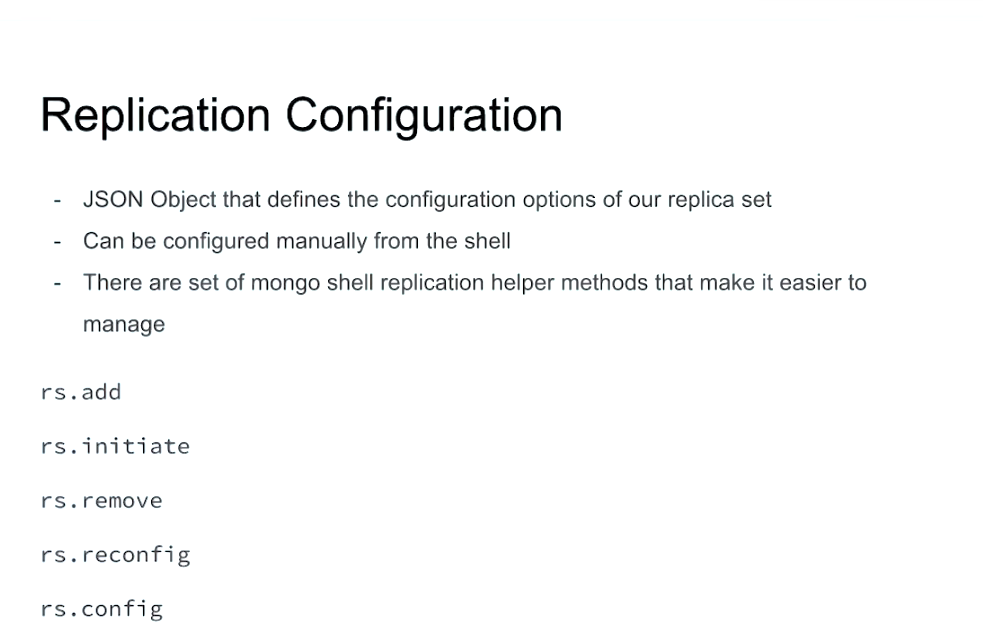

Podemos establecer cambios manualmente en este documento para configurar un replica set de acuerdo con la topología esperada y las opciones generales de replicación.

Aunque podemos hacer esto simplemente editando dichos documentos usando el shell `mongo.db`, también podemos usar un conjunto de ayudantes de shell como `rs.add`, `initiate`, `remove`, etc. 

Eso nos ayudará a facilitar la configuración y administración de esta misma configuración.

Hay una buena cantidad de opciones de configuración diferentes a nuestra disposición, como puede ver en el documento de opciones de configuración de línea de base.

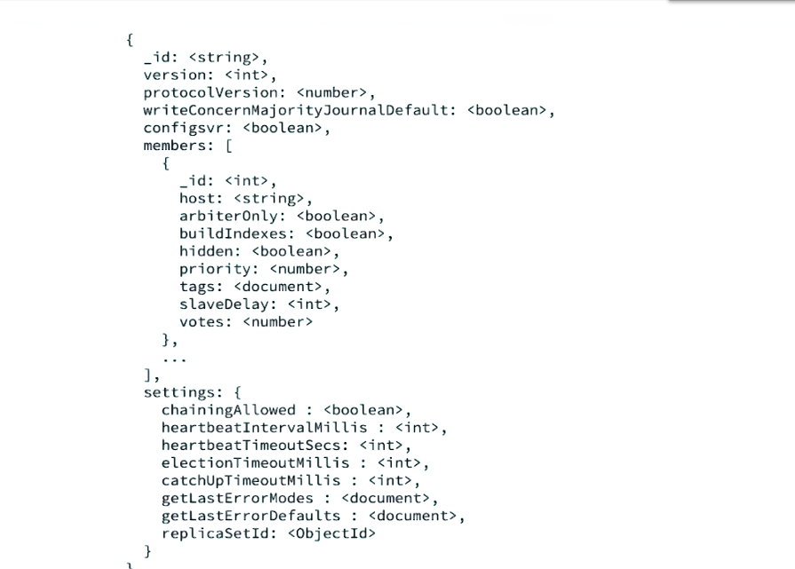

Esto puede sonar un poco desalentador, pero en realidad, es un conjunto de opciones bastante sencillo.

Y para esta lección, en particular, vamos a ver solo un conjunto de estas opciones de configuración: las básicas y fundamentales y las que vamos a utilizar a lo largo del curso.

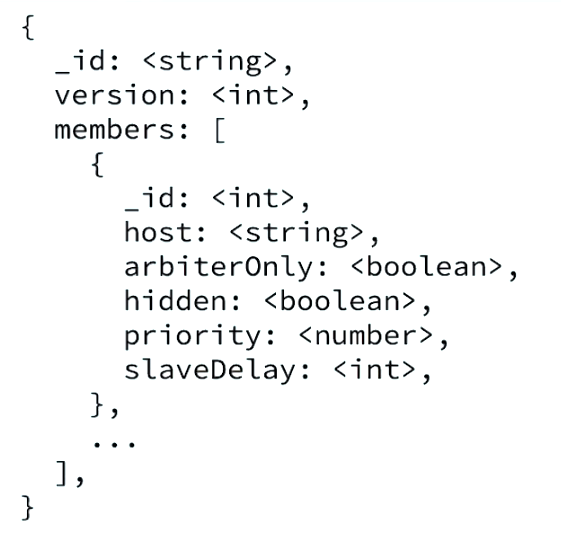

Todas las otras opciones están fuera del alcance de este curso.

Pero comencemos con el campo **`_id`**.

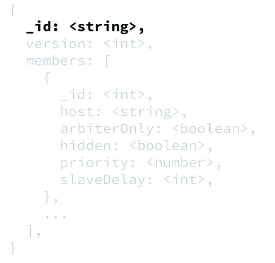

Este campo se establece con el nombre del replica set.

Este es un valor de cadena que coincide con el replica set definido por el servidor.

Cada vez que comenzamos nuestro mongoD y proporcionamos un nombre `--replSet` a nuestro mongoD, lo que significa que este mongoD pertenecerá al conjunto, o estableciendo ese mismo nombre en el archivo de configuración, por ejemplo, nuestro archivo `etc/mongodb.conf`

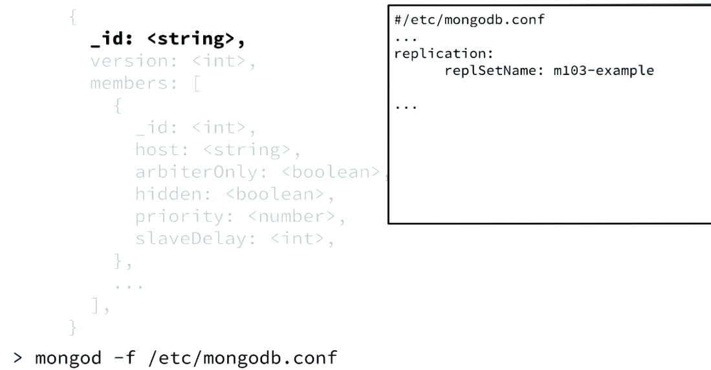

Estamos estableciendo un valor específico para ser utilizado como un nombre de replica set.

El mismo valor debe coincidir con el campo `_id` de nuestro documento de configuración del replica set.

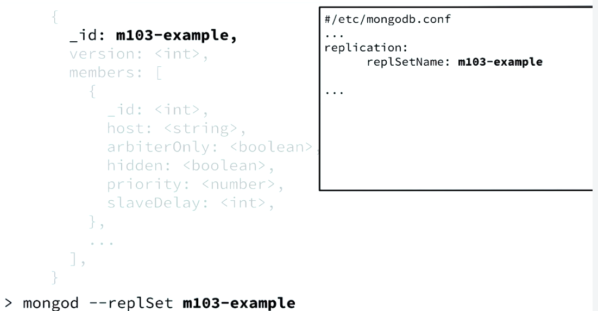

En caso de que tengamos valores diferentes de la configuración `_id` y el nombre del replica set definidas, terminamos con un mensaje de error.

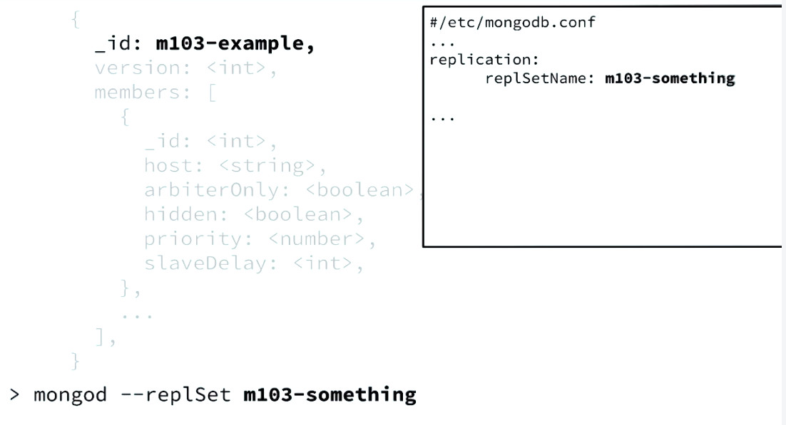

Obtenemos una configuración de replica set incorrecta, indicando que estamos intentando iniciar el replica set con un nombre diferente desde el que se ha establecido como `--replSet` o en el archivo de configuración.

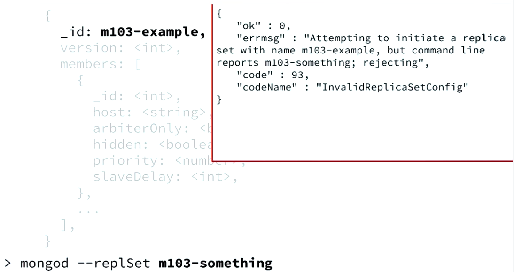

Esta es una protección contra configuraciones incorrectas o la adición incorrecta del servidor a los replica sets incorrectos.

El siguiente campo es la **`version`**.


Ahora, una versión es solo un número entero que se incrementa cada vez que cambia la configuración actual de nuestro replica set.

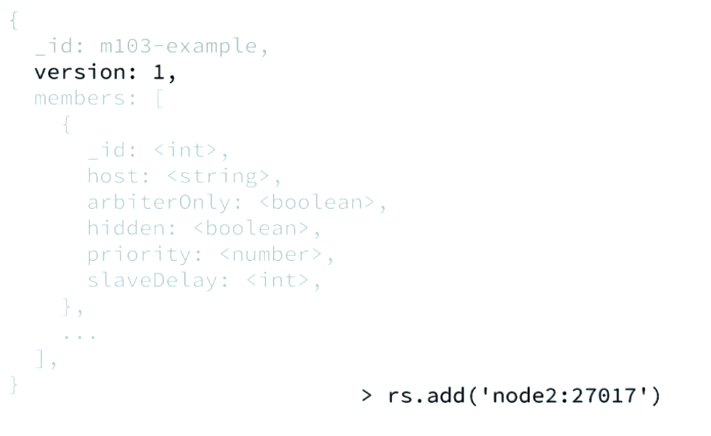

Si, por ejemplo, agregamos un nodo a nuestro replica set y si nuestra versión solía ser la número 1, incrementamos el valor.

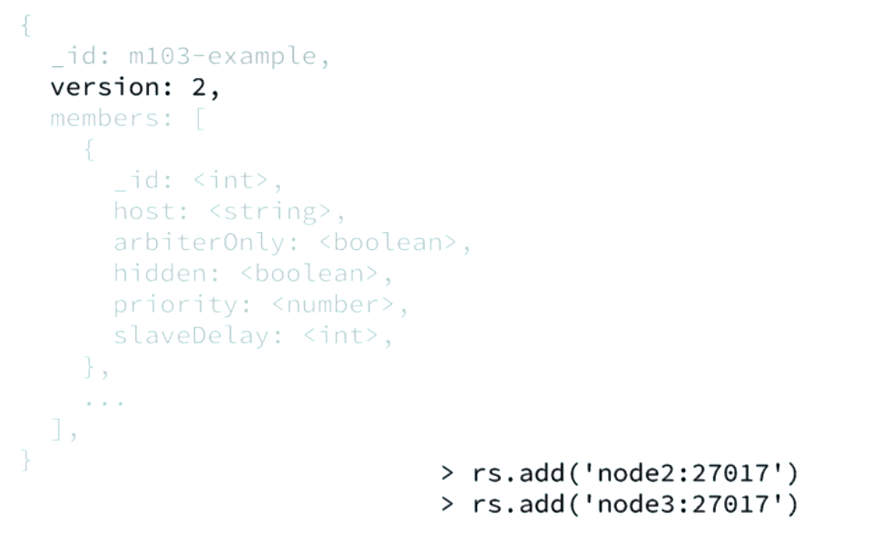

Cada vez que cambiamos una topología, cambiamos la configuración de un replica set o hacemos algo como cambiar el número de votos de un host dado, eso incrementará automáticamente el número de versión.

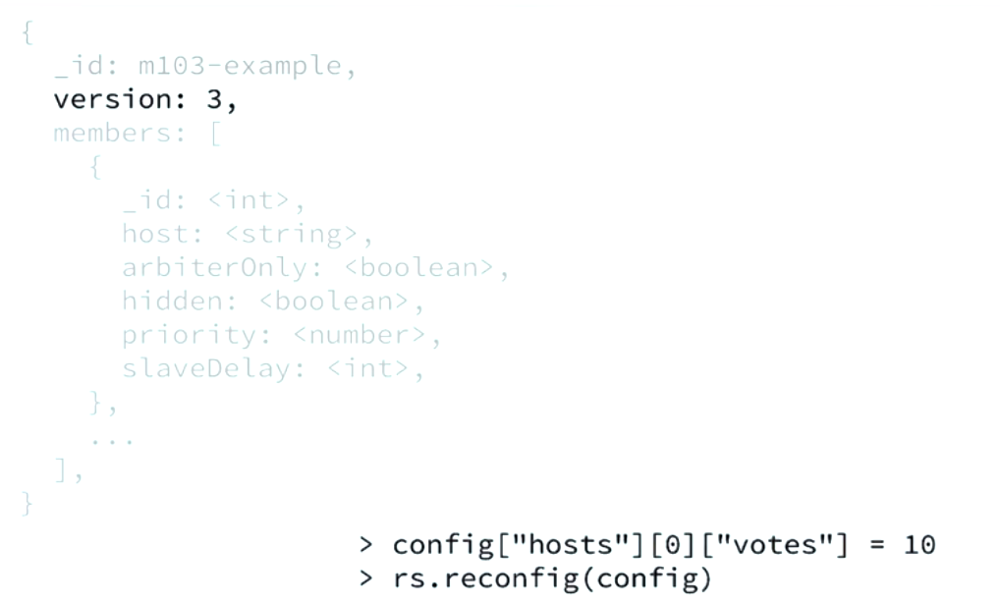

El siguiente campo en línea es **members**.

Y los members es donde se define la topología de nuestro replica set.

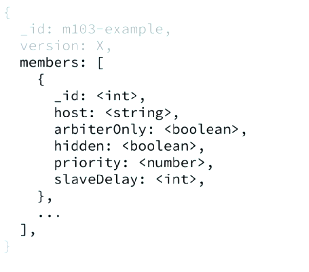

Cada elemento del array de miembros es un subdocumento que contiene los miembros del nodo del replica set.

Cada uno tiene un host compuesto por el host name y port.

En este caso, por ejemplo, tenemos `m103:27017`.

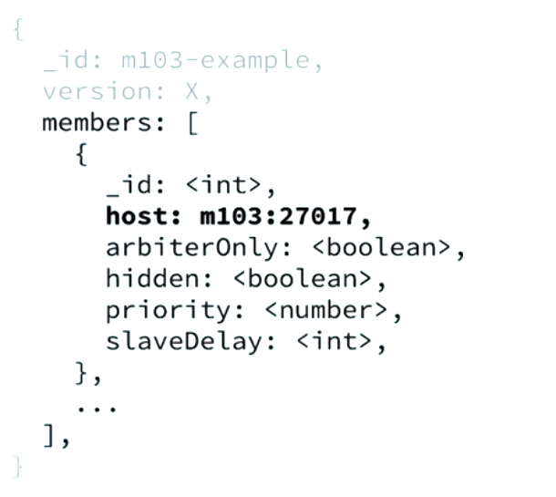

Luego tenemos un conjunto de indicadores que determinan el papel de los nodos dentro del replica set.

El `arbiterOnly` se explica por sí mismo.

Esto significa que el nodo no retendrá ningún dato, y su contribución al conjunto es asegurar el quórum en las elecciones.

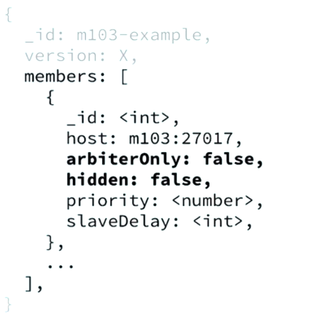

`hidden--` es otro indicador que establece el nodo en función oculta.

Un nodo oculto no es visible para la aplicación, lo que significa que cada vez que emitimos algo como un `RS` es un comando maestro, este nodo no aparecerá en la lista.

Los nodos `int` son útiles para situaciones en las que queremos que un nodo particular admita operaciones específicas.

No están relacionados con la naturaleza operativa de su aplicación.

Por ejemplo, tener un nodo que maneje todos los informes o lecturas de BI.

Ambos indicadores están configurados en `false` de forma predeterminada.

**`priority`** la prioridad es un valor entero que nos permite establecer una jerarquía dentro del replica set.

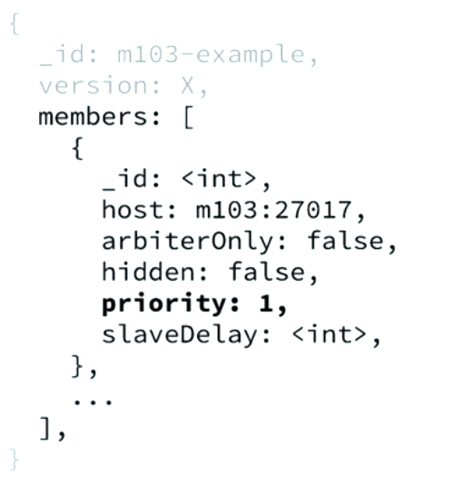

Podemos establecer prioridades entre 0 y 1,000.

Los miembros con mayor prioridad tienden a ser elegidos en las primarias con mayor frecuencia.

Un cambio en la prioridad de un nodo desencadenará una elección porque se percibirá como un cambio de topología.

Establecer la prioridad en 0 efectivamente excluye a ese miembro de convertirse en primario.

En el caso, estamos configurando un miembro para que sea solo árbitro, eso implica que la prioridad debe establecerse en 0.

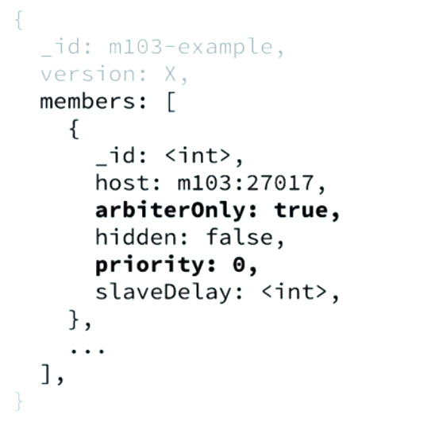

Lo mismo se aplicaría para hidden.

La prioridad aquí también debe convertirse en 0.

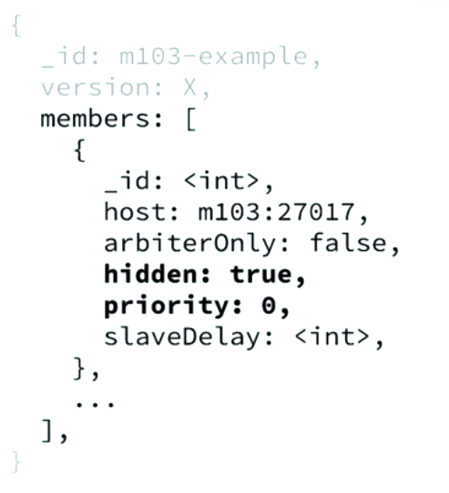

Si la nota está oculta, nunca puede volverse primaria porque la aplicación no la verá.

De lo contrario, se producirá un error en el que una nueva configuración del replica set es incompatible.

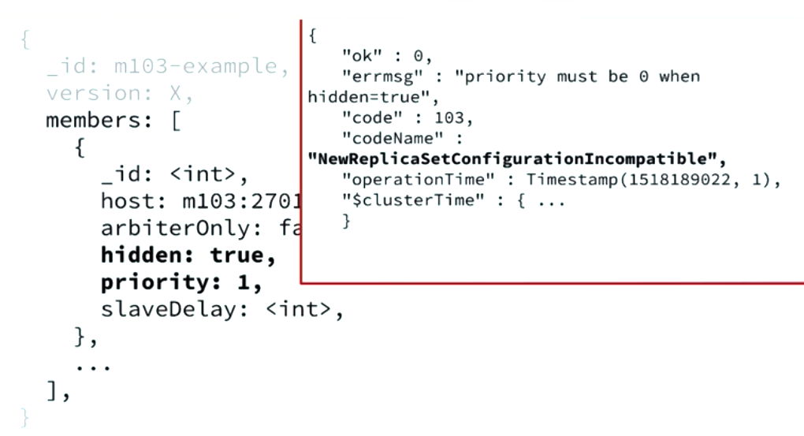

La prioridad debe ser 0 cuando oculto es igual a verdadero.

Y finalmente, tenemos **`slaveDelay`**.

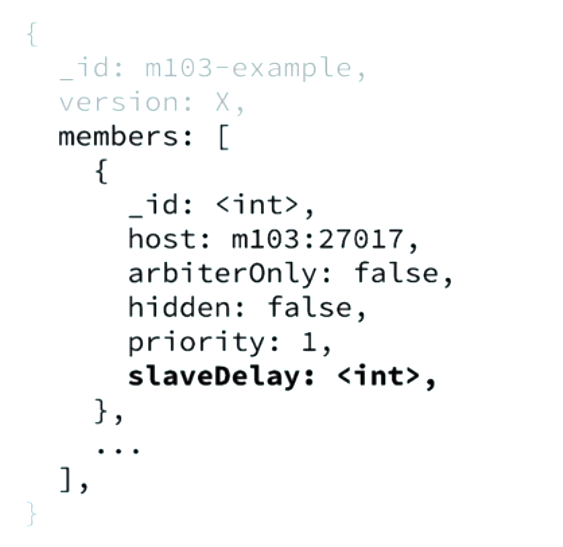

slaveDelay es un valor entero que determina un intervalo de demora de replicación en segundos.

El valor predeterminado es 0.

Esta opción habilitará delayed nodes.

Estos miembros retrasados mantienen una copia de los datos que reflejan un estado en algún momento en el pasado, aplicando ese retraso en segundos.

Por ejemplo, si tenemos nuestra opción slaveDelay a 3.600 segundos, lo que significa 1 hora, eso significará que dicho miembro replicará datos de los otros nodos en los conjuntos que ocurrieron hace 1 hora.

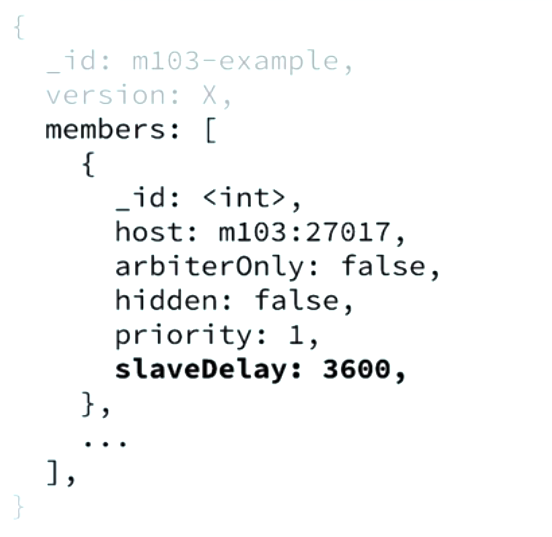

Al configurar esta opción como esclavo, también implica que su nodo estará oculto y la prioridad se establecerá en 0.

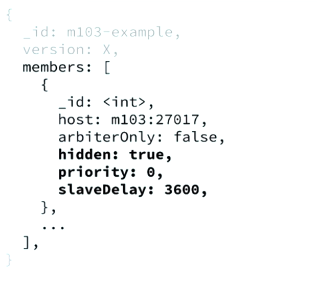

Ah sí, y casi lo olvido.

También tenemos el campo `_id` dentro del subdocumento de miembros.

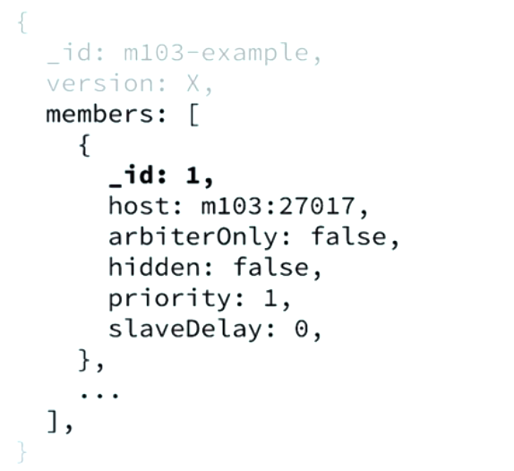

Esto es solo un identificador único de cada elemento en el array.

Es un campo entero simple que se establece una vez que tenemos un miembro para el replica set.

Una vez establecido, este valor no se puede cambiar.

Ahora, de nuevo, hay mucho más que podemos configurar dentro de los documentos de configuración del replica set.

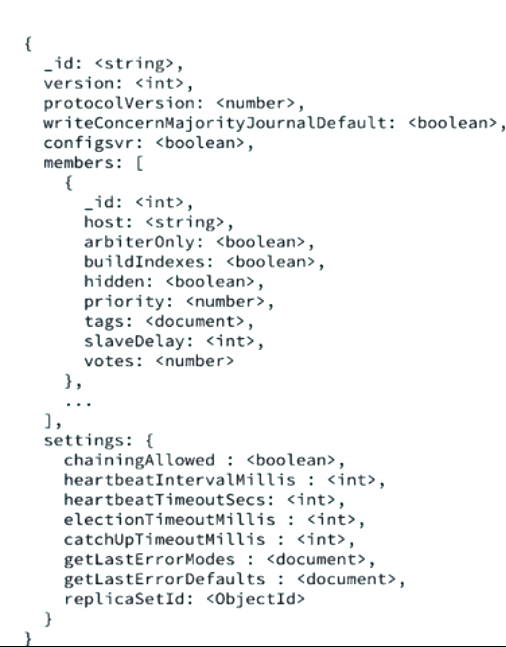

**`settings`** en la que podemos definir varios atributos de protocolo de replicación diferentes 


o cosas como la **`protocolVersion`** y **`configsvr`** que se verán más adelante en este curso.

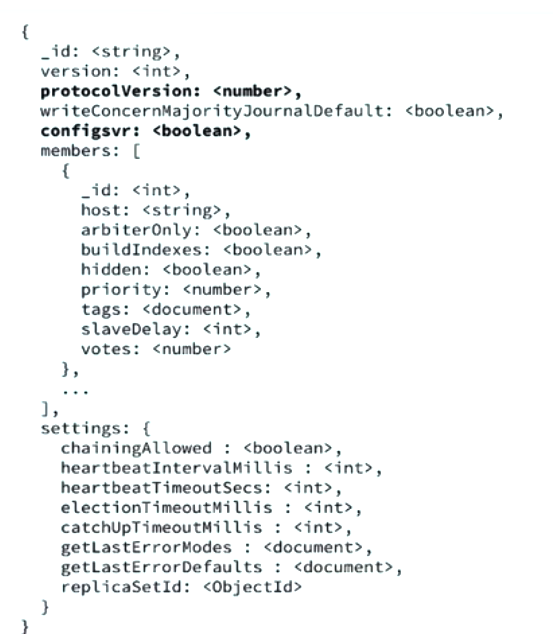

Pero los usos reales de estas opciones para el curso básico de administración están fuera de alcance.

Recapitulemos.

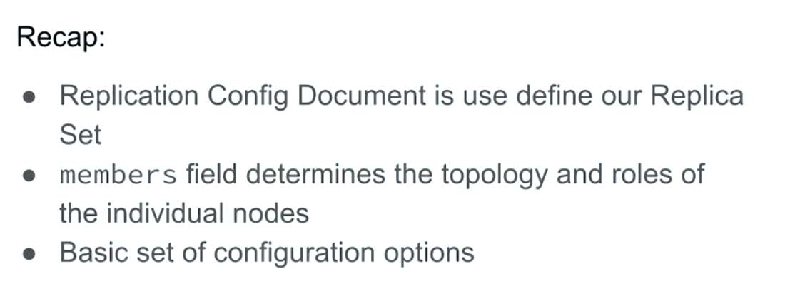

El documento de configuración de replicación se utiliza para configurar nuestros replica set.

Aquí es donde se definen las propiedades de nuestros replica set, y el documento se comparte entre todos los miembros del conjunto.

El campo de miembros es donde se determinará un montón de nuestra configuración básica: qué nodos son parte del conjunto, qué roles tienen y qué tipo de topología queremos definir se establece en este campo.

Hay una gran cantidad de otras opciones de configuración que tratan con mecanismos de replicación internos o configuraciones generales de los conjuntos.

Estamos fuera de alcance en eso, pero tenga en cuenta que hay mucho más en el documento de replica set que puede configurar.

## 9. Examen Replication Configuration Document

**Problem:**

Which of the following fields are included in the replica set configuration document?

Check all answers that apply:

* `_id` :+1:

* `version` :+1:

* `members` :+1:

## 10. Tema: Comandos de replicación

### Instrucción de este tema

Comandos cubiertos en este tema:

```sh
rs.status()
rs.isMaster()
db.serverStatus()['repl']
rs.printReplicationInfo()
```

### Transcripción

## 11. Examen

## 12. Tema: DB local: Parte 1

### Transcripción

## 13. Tema: DB local: Parte 2

### Transcripción

## 14. Examen

## 15. Tema: reconfigurar un conjunto de réplicas en ejecución

### Transcripción

## 16. Examen

## 17. Laboratorio: eliminar y volver a agregar un nodo

## 18. Tema: Lee y escribe en un conjunto de réplicas

### Transcripción

## 19. Examen

## 20. Tema: conmutación por error y elecciones

### Transcripción

## 21. Examen

## 22. Tema: Escribir inquietudes: Parte 1

### Transcripción

## 23. Tema: Escribir inquietudes: Parte 2

### Transcripción

## 24. Examen

## 25. Laboratorio: escribe con conmutación por error

## 26. Tema: Leer preocupaciones

### Transcripción

## 27. Examen

## 28. Tema: Leer preferencias

### Transcripción

## 29. Examen

## 30. Laboratorio - Preocupación de lectura y preferencias de lectura

