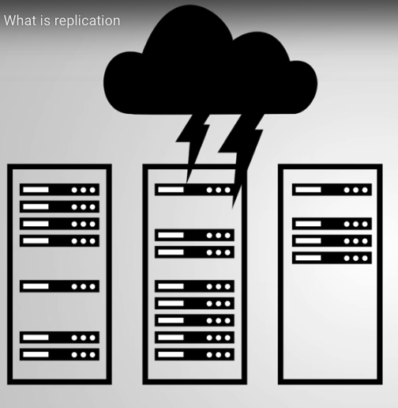

# Capítulo 2: Replicación

### 30 Items

Conceptos básicos de replicación y administración de conjuntos de réplicas

## Lecciones

1. Tema: ¿Qué es la replicación?
2. Examen
3. Tema: Conjunto de réplicas MongoDB
4. Examen
5. Tema: Configuración de un conjunto de réplicas
6. Examen
7. Laboratorio: iniciar un conjunto de réplicas localmente
8. Tema: Documento de configuración de replicación
9. Examen
10. Tema: Comandos de replicación
11. Examen
12. Tema: DB local: Parte 1
13. Tema: DB local: Parte 2
14. Examen
15. Tema: reconfigurar un conjunto de réplicas en ejecución
16. Examen
17. Laboratorio: eliminar y volver a agregar un nodo
18. Tema: Lee y escribe en un conjunto de réplicas
19. Examen
20. Tema: conmutación por error y elecciones
21. Examen
22. Tema: Escribir inquietudes: Parte 1
23. Tema: Escribir inquietudes: Parte 2
24. Examen
25. Laboratorio: escribe con conmutación por error
26. Tema: Leer preocupaciones
27. Examen
28. Tema: Leer preferencias
29. Examen
30. Laboratorio - Preocupación de lectura y preferencias de lectura

## 1. Tema: ¿Qué es la replicación?

### Transcripción

En esta lección, cubriremos la replicación y cómo hace que sus datos sean más duraderos.

MongoDB utiliza asíncrona, replicación basada en sentencias porque es independiente de la plataforma y permite una mayor flexibilidad dentro de un **replica set**(conjunto de réplicas).

Pero primero, hablemos sobre qué es la replicación.

**La replicación es el concepto de mantener múltiples copias de sus datos.**

Este es un concepto realmente importante en MongoDB, pero realmente en cualquier sistema de base de datos.

La razón principal por la que es necesaria la replicación es porque nunca puede asumir que todos sus servidores siempre estarán disponibles.

Si tiene que realizar tareas de mantenimiento en un centro de datos o un desastre borra sus datos por completo, sus servidores experimentarán tiempo de inactividad en algún momento.

El punto de replicación es asegurarse de que en caso de que su servidor se caiga, aún puede acceder a sus datos.

Este concepto se llama **disponibilidad**(availability).

Una base de datos que no usa replicación solo tiene un único servidor de base de datos, y nos referimos a estos como nodos independientes (standalone nodes).

En una configuración independiente, las bases de datos pueden atender lecturas y escrituras solo mientras ese nodo único está en funcionamiento.

Pero si el nodo se cae, perdemos todo el acceso a esos datos.

Nuestras lecturas y escrituras no llegarán al servidor.

Ahora en una solución replicada, tenemos un par de nodos adicionales a la mano, y contienen copias de nuestros datos.

En MongoDB, un grupo de nodos que tienen copias de los mismos datos se denomina **replica set** conjunto de réplicas.

Y en un replica set, todos los datos se manejan de manera predeterminada en uno de los nodos, 

y depende de los nodos restantes del conjunto sincronizarse con él y replicar cualquier dato nuevo que se haya escrito a través de un mecanismo asíncrono.

El nodo donde se envían los datos se denomina **nodo primario**, y todos los demás nodos se denominan **nodos secundarios**.

El objetivo aquí es que todos los nodos se mantengan consistentes entre sí.

Entonces, si nuestra aplicación está usando la base de datos y el nodo primario se cae, 

uno de los nodos secundarios puede tomar su lugar como primario en un proceso conocido como **failover** (conmutación por error).

Los nodos deciden específicamente qué secundaria se convertirá en primaria a través de una **elección**.

Y este nombre no es una coincidencia.

Los nodos secundarios en realidad votan entre sí para decidir qué secundaria se convertirá en la primaria.

En un replica set duradero, la **failover** (conmutación por error) puede tener lugar rápidamente, de modo que no se pierdan datos, y las aplicaciones que usan los datos continuarán comunicándose con el replica set como si nunca hubiera pasado nada.

Y una vez que el nodo vuelve a funcionar, y es seguro que puede ponerse al día y sincronizarse en la última copia de los datos, se unirá al replica set automáticamente.

La **disponibilidad** y la **redundancia de datos** son propiedades típicas de una solución de base de datos duradera.

La replicación de datos puede tomar una de dos formas.

Hay replicación binaria y replicación basada en sentencias (binary replication and statement-based replication).

Echaremos un vistazo a las diferencias entre estos dos enfoques, y comenzaremos con la replicación binaria.

Digamos que insertamos este documento en nuestra base de datos.

Una vez completada la escritura, tenemos unos pocos bytes en el disco que se escribieron para contener algunos datos nuevos.

La forma en que funciona la replicación binaria es examinando los bytes exactos que cambiaron en los archivos de datos y registrando esos cambios en un **binary log** (registro binario).

Los nodos secundarios reciben una copia del **binary log** (registro binario) y escriben los datos especificados que cambiaron a las ubicaciones exactas de bytes que se especifican en el **binary log** (registro binario).

La replicación de datos de esta manera es bastante fácil en las secundarias porque obtienen instrucciones realmente específicas sobre qué bytes cambiar y a qué cambiarlos.

Y, de hecho, los secundarios ni siquiera son conscientes de las declaraciones que están replicando.

Esto puede ser bueno porque no hay contexto sobre los datos necesarios para replicar una escritura.

Sin embargo, el uso de la binary replication (replicación binaria) supone que el sistema operativo es coherente en todo el conjunto de réplicas.

Por ejemplo, si nuestro nodo primario ejecuta Windows, los secundarios no pueden usar el mismo registro binario si ejecutan Linux.

Y si tienen el mismo sistema operativo, todas las máquinas en el conjunto de réplicas deben tener el mismo conjunto de instrucciones.

Entonces, Windows x86 o x64 y la misma versión del servidor de base de datos que se ejecuta en cada máquina.

En otras palabras, el uso de la binary replication (replicación binaria) requiere una consistencia muy estricta en todas las máquinas que se ejecutan en un conjunto de réplicas.

Incluso olvidarse de actualizar el servidor de la base de datos en uno de los nodos podría generar datos corruptos.

La Statement-based replication (replicación basada en declaraciones) es más o menos lo que parece.

Después de que se completa una escritura en el nodo primario, la declaración de escritura en sí misma se almacena en el **oplog** (registro de operaciones), 

y los secundarios luego sincronizan sus **oplog** (registro de operaciones) con el **oplog** (registro de operaciones) primario y reproducen cualquier declaración nueva en sus propios datos.

Este enfoque funciona independientemente del sistema operativo o el conjunto de instrucciones de los nodos en el conjunto de réplica.

MongoDB utiliza la statement-based replication (replicación basada en instrucciones), pero los comandos correctos en realidad sufren una pequeña transformación antes de almacenarse en el **oplog** (registro de operaciones).

Y el objetivo aquí de la transformación es asegurarse de que las declaraciones almacenadas en el oplog se puedan aplicar un número indefinido de veces sin dejar de generar el mismo estado de datos.

Esta propiedad se llama **idempotencia**.

Por ejemplo, supongamos que tenemos una declaración que incrementó las paid views (vistas pagas) en un sitio web en 1.

El primario ya aplicó esta declaración a sus datos, por lo que sabe que después de incrementar el uso de la página en 1, el total de visitas de la página pasó de 1,000 a 1,001.

En realidad, transformaría esta declaración en una declaración que establece vistas de página en 1.001 y luego la almacena en el oplog registro de operaciones.

Cuando las declaraciones se replican de esta manera, podemos reproducir el registro de operaciones tantas veces como queramos sin preocuparnos por la consistencia de los datos.

Ahora echemos un vistazo a los pros y los contras de la replicación binaria y basada en sentencias.

El enfoque binario requiere que se almacenen menos datos en el registro binario, lo que significa que se pasan menos datos del primario al secundario.

La replicación binaria puede ser mucho más rápida que la replicación basada en sentencias porque los secundarios requieren menos trabajo al replicar realmente desde el registro binario.

Los datos que deben cambiarse se escriben directamente en el registro en ese caso.

Por otro lado, la replicación basada en sentencias en MongoDB escribe los comandos reales de MongoDB en el oplog, por lo que el oplog es un poco más grande.

Sin embargo, las declaraciones no están vinculadas a un sistema operativo específico ni a ninguna dependencia a nivel de máquina.

Por lo tanto, existen pocas restricciones en las máquinas en un replica set en MongoDB.

Esto es valioso para cualquier solución multiplataforma que requiera múltiples sistemas operativos en el mismo conjunto de réplicas.

## 2. Examen

## 3. Tema: Conjunto de réplicas MongoDB

### Transcripción

## 4. Examen

## 5. Tema: Configuración de un conjunto de réplicas

### Transcripción

## 6. Examen

## 7. Laboratorio: iniciar un conjunto de réplicas localmente

## 8. Tema: Documento de configuración de replicación

### Transcripción

## 9. Examen

## 10. Tema: Comandos de replicación

### Transcripción

## 11. Examen

## 12. Tema: DB local: Parte 1

### Transcripción

## 13. Tema: DB local: Parte 2

### Transcripción

## 14. Examen

## 15. Tema: reconfigurar un conjunto de réplicas en ejecución

### Transcripción

## 16. Examen

## 17. Laboratorio: eliminar y volver a agregar un nodo

## 18. Tema: Lee y escribe en un conjunto de réplicas

### Transcripción

## 19. Examen

## 20. Tema: conmutación por error y elecciones

### Transcripción

## 21. Examen

## 22. Tema: Escribir inquietudes: Parte 1

### Transcripción

## 23. Tema: Escribir inquietudes: Parte 2

### Transcripción

## 24. Examen

## 25. Laboratorio: escribe con conmutación por error

## 26. Tema: Leer preocupaciones

### Transcripción

## 27. Examen

## 28. Tema: Leer preferencias

### Transcripción

## 29. Examen

## 30. Laboratorio - Preocupación de lectura y preferencias de lectura

