# Capítulo 3: Sharding

### 28 Items

Asignaciones calificadas

## Contenido

1. Tema: ¿Qué es Sharding?
2. Tema: Cuándo fragmentar
3. Examen
4. Tema: Arquitectura de fragmentación
5. Examen
6. Tema: Configuración de un grupo fragmentado
7. Examen
8. Laboratorio: configurar un clúster fragmentado
9. Tema: Config DB
10. Examen
11. Tema: Shard Keys
12. Examen
13. Tema: Escoger una buena clave de fragmento
14. Examen
15. Tema: Hashed Shard Keys
16. Examen
17. Lab - Shard a Collection
18. Tema: trozos
19. Examen
20. Laboratorio - Documentos en trozos
21. Tema: Equilibrio
22. Examen
23. Tema: Consultas en un grupo fragmentado
24. Examen
25. Tema: Consultas enrutadas vs Scatter Gather: Parte 1
26. Tema: Consultas enrutadas vs Scatter Gather: Parte 2
27. Examen
28. Laboratorio: detección de consultas de recopilación de dispersión

## 1. Tema: ¿Qué es Sharding?

### Transcripción

Entonces, hasta este punto, hemos aprendido sobre las implementaciones de MongoDB de tamaños pequeños y medios.

Por lo tanto, es factible almacenar un conjunto de datos completo en un servidor.

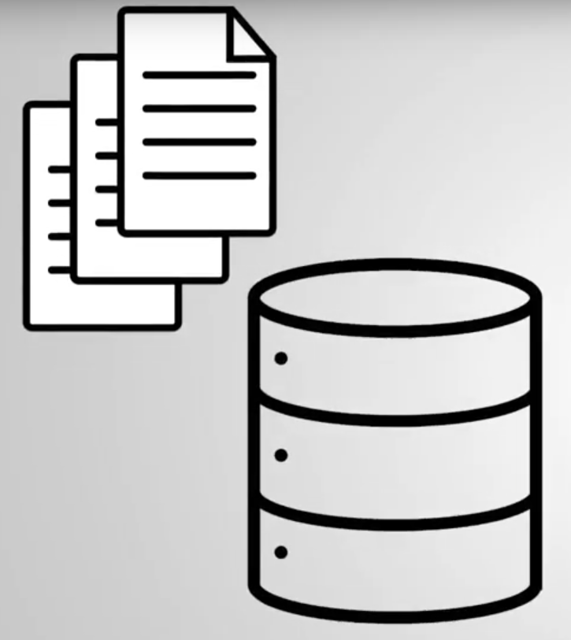

En un replica set, tenemos más de un servidor en nuestra base de datos.

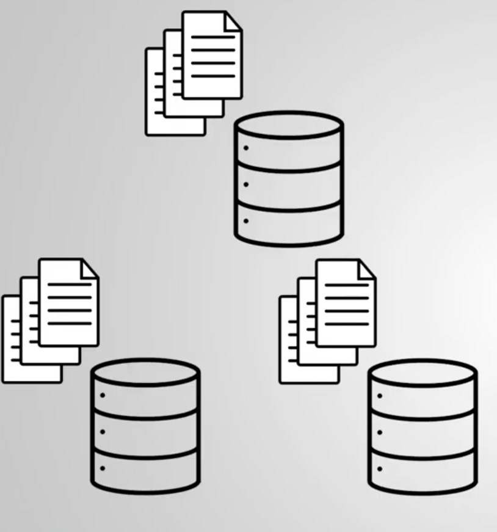

Pero cada servidor todavía tiene que contener todo el conjunto de datos.

A medida que nuestro conjunto de datos crece hasta el punto en que nuestras máquinas no pueden atender adecuadamente las aplicaciones de los clientes, una de nuestras opciones es mejorar las máquinas.

Podríamos aumentar la capacidad de las máquinas individuales para que tengan más RAM, o espacio en disco, o tal vez una CPU más potente.


Esto se conoce como **escala vertical**.


Pero esto podría llegar a ser muy costoso.


Y además, los proveedores basados en la nube no nos permitirán escalar verticalmente para siempre.


Eventualmente pondrán un límite a las posibles configuraciones de hardware, lo que limitaría efectivamente nuestra capa de almacenamiento.

**En MongoDB, el escalado se realiza horizontalmente,**


**lo que significa que, en lugar de mejorar las máquinas individuales, **


**simplemente agregamos más máquinas**

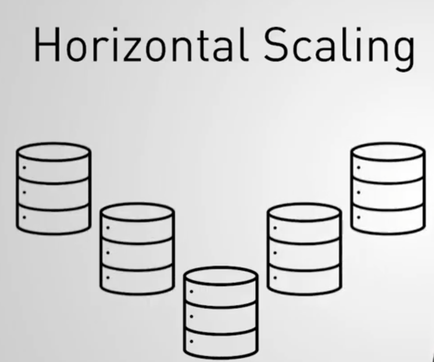

**y luego distribuimos el conjunto de datos entre esas máquinas.**


La forma en que distribuimos datos en MongoDB se llama **Sharding**.


Y Sharding nos permite hacer crecer nuestro conjunto de datos sin preocuparnos de poder almacenarlo todo en un servidor.

En su lugar, dividimos el conjunto de datos en partes 


y luego las distribuimos en tantos fragmentos como queramos.

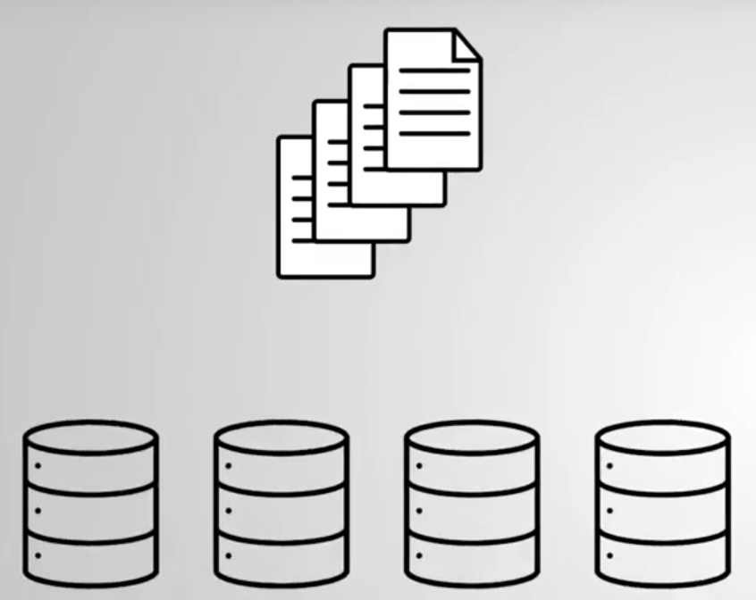

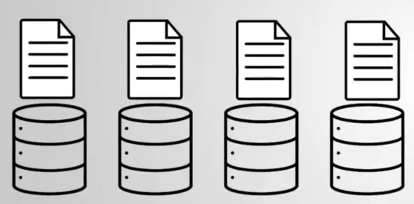

Juntos, los fragmentos forman un Sharded Cluster (clúster fragmentado).

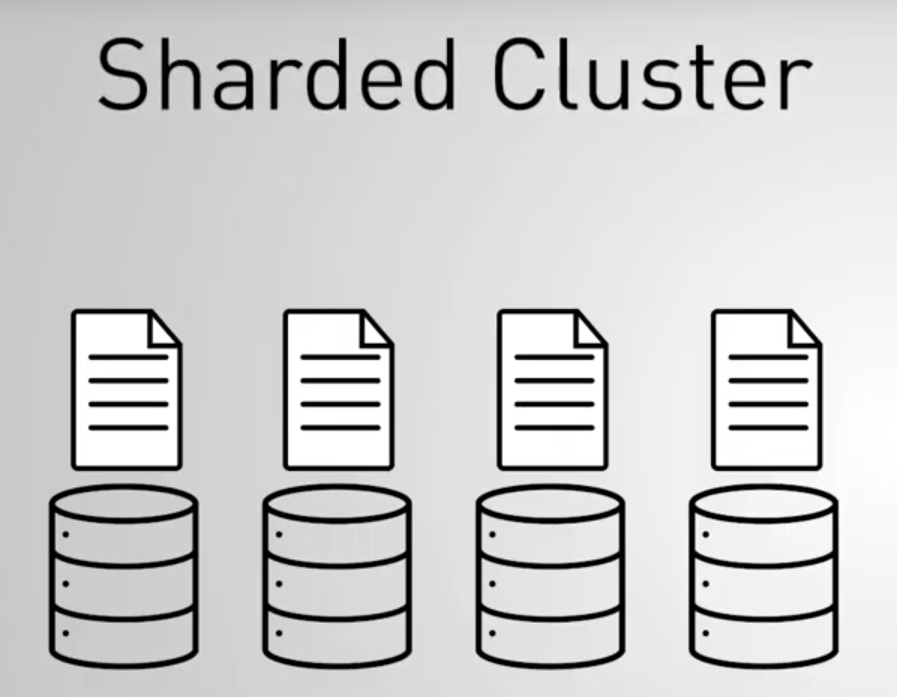

Para garantizar una alta disponibilidad en nuestro Sharded Cluster, implementamos cada fragmento como un replica set.

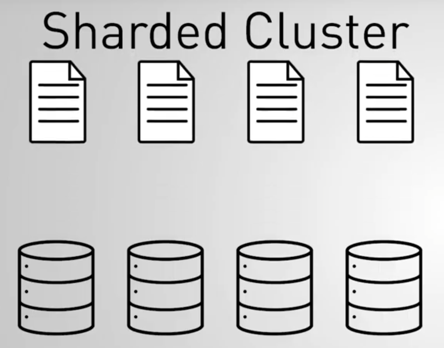

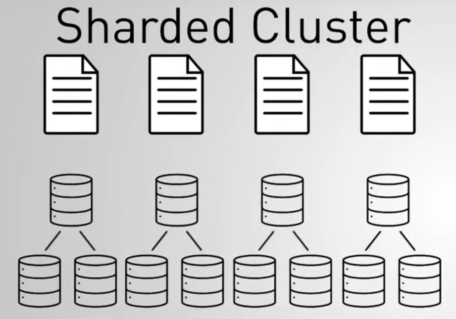

De esta manera, podemos garantizar un nivel de tolerancia a fallos contra cada pieza de datos, independientemente de qué fragmento contenga realmente esos datos.

Entonces, con nuestros datos distribuidos en varios servidores, las consultas pueden volverse un poco complicadas.

Consultamos nuestra base de datos buscando un documento específico.


Al principio no es obvio dónde buscarlo.

Entonces, entre un Sharded Cluster (clúster fragmentado) y sus clientes, configuramos un tipo de proceso de enrutador que acepta consultas de los clientes y luego determina qué fragmento debe recibir esa consulta.

Ese proceso de enrutador se llama **Mongos**.


Y los clientes se conectan a Mongos en lugar de conectarse a cada fragmento individualmente.

Y tenemos cualquier cantidad de procesos de Mongos para que podamos atender muchas solicitudes o solicitudes diferentes al mismo Sharded Cluster(Clúster fragmentado).


¿Entonces Mongos debe ser bastante pequeño, correcto, para saber dónde está cada dato en un momento dado en un Sharded Cluster masivo?

Pero en realidad, Mongos no sabe nada.

Utiliza los metadatos sobre qué datos están contenidos en cada fragmento.


Y esos metadatos se almacenan en los servidores de configuración.

Pero los datos en los Servidores de Configuración son utilizados muy a menudo por Mongos.


Por lo tanto, debemos asegurarnos de que los datos permanezcan altamente disponibles.

Y probablemente pueda adivinar cómo garantizamos la alta disponibilidad aquí.

Sí, usamos replicación.


Replicamos los datos en los servidores de configuración.

Entonces, en lugar de un único Config Server (servidor de configuración), implementamos un Replica Set del Config Server (servidor de configuración).


Así que esa es una descripción general de alto nivel de Sharding en MongoDB: el Cluster Sharded contiene los fragmentos donde residen los datos; 


los Config Servers (servidores de configuración), que contienen los metadatos de cada fragmento; 


y los Mongos, que encamina las consultas a los fragmentos correctos.


## 2. Tema: Cuándo Fragmentar

### Transcripción

OK, entonces MongoDB puede escalar.


Increíble.

Hagamoslo entonces.

Avancemos y construyamos el clúster escalable desde el principio.

OK.


No tan rápido joven Padawan.


Veamos cuándo definitivamente deberías considerar fragmentar.


Primero, comprendamos qué indicadores debemos verificar para ver si realmente llegamos al momento de fragmentar.

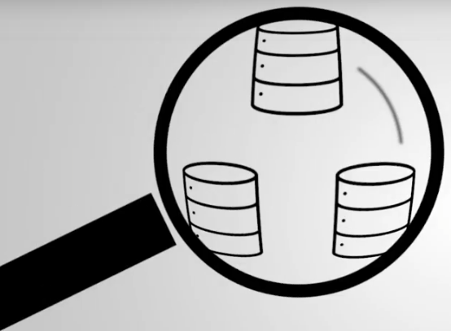

Una de las primeras cosas que debe hacer es verificar si aún es económicamente viable a escala vertical.


Cuando necesitamos abordar un rendimiento de rendimiento o un cuello de botella de volumen, que generalmente son los impulsores técnicos para agregar más recursos a su sistema, 


el primer paso sería verificar si aún podemos agregar más recursos y escalar.

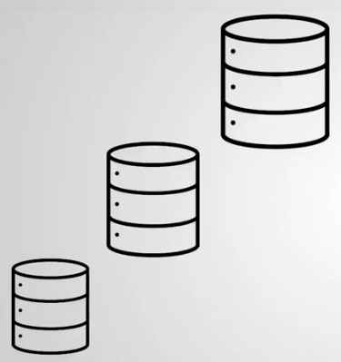

Genial, pero debemos validar que agregar más de esos recursos verticales, como agregar más CPU, red, memoria o disco a sus servidores existentes

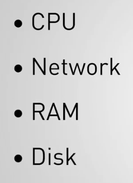

, sea económicamente viable y posible.


Entonces, en caso de que tengamos un pequeño conjunto de servidores, 


comprobar que, al aumentar los recursos de la unidad de ese servidor, 


en cualquiera de los cuellos de botella de recursos identificados, 

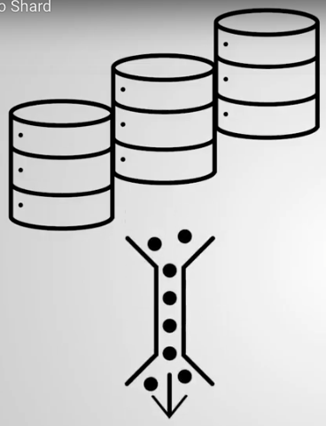

se obtiene un mayor rendimiento 

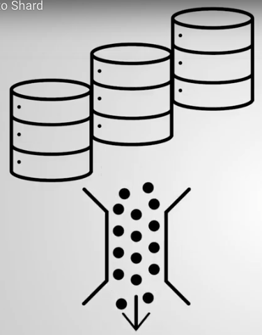

con muy poco tiempo de inactividad de una manera económica.

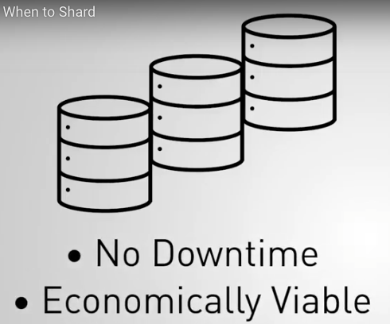

Agregar 10 veces más RAM para resolver un cuello de botella de asignación de memoria no le costará 100 veces más, si ese es el caso, excelente.


Ese debería ser su razonamiento para continuar escalando.

Aún puede hacerlo de manera económica y viable, pero eventualmente llegará a un punto en el que el escalado vertical ya no es económicamente viable o es muy difícil decir que es imposible de lograr.


Digamos que su arquitectura actual depende de servidores que cuestan $100 por hora.

Tiene tres miembros rep cassettes(casetes de representantes), por lo que está sentado encima de $300 por hora.

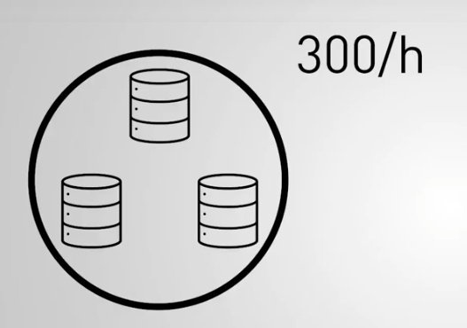

El siguiente tipo de servidor disponible cuesta $1,000 por hora, 

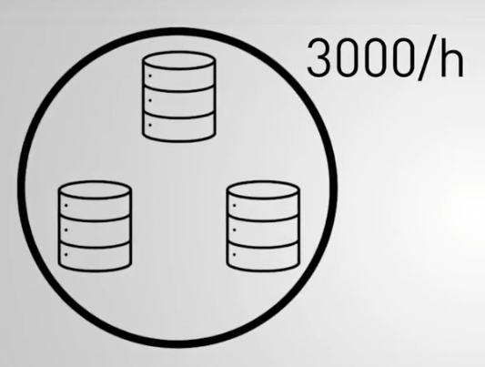

pero donde su impacto general en el rendimiento es solo de 2x, probablemente no sea una decisión muy acertada.


10 veces el costo por servidor por solo dos veces el rendimiento general.


Probablemente estará mucho mejor con una escala horizontal donde el aumento en el costo será, digamos, tres veces.


Tres servidores más para otro casete de repetición, más tres más para sus servidores de configuración, con un aumento potencial de rendimiento de 2x.

$900 por hora es más aceptable que $3,000 por la misma mejora de rendimiento.

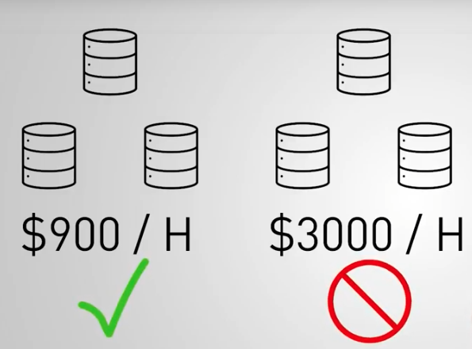

La economía aquí tendrá un peso considerable en su decisión.

Otro aspecto a considerar es el impacto en sus tareas operativas.


Digamos que actualmente está considerando aumentar el tamaño de su discos para permitir pasar de un espacio en disco de 1 terabytes a 20 discos de terabytes.


El propósito de esto es escalar verticalmente sus capacidades de almacenamiento, lo cual está totalmente bien.

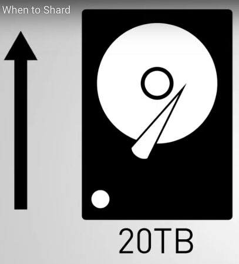

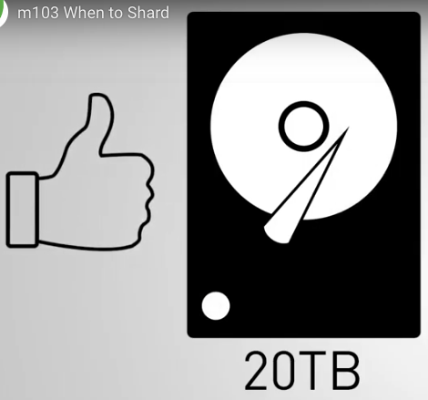

Pero si esperamos ejecutarlos al 75% de su capacidad, esto significará cargar hasta 15 terabytes de datos.

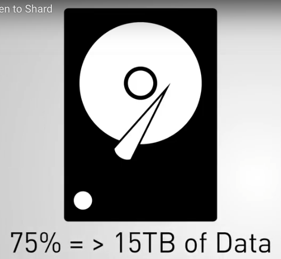

Lo que significa 15 veces más datos para respaldar.

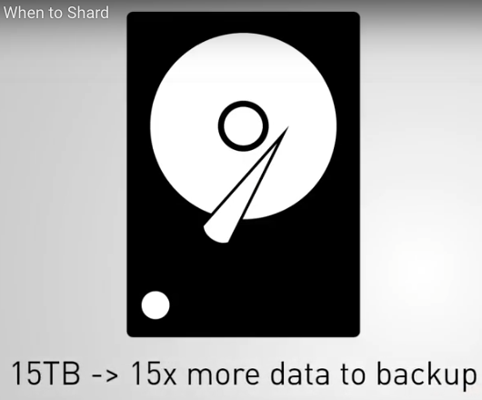

Al igual que una cantidad bastante significativa de otros aspectos, esto probablemente significará que tomará 15 veces más tiempo para hacer una copia de seguridad de esos servidores, probablemente una penalización aún mayor al restaurar servidores tan grandes, así como realizar sincronizaciones iniciales entre replica sets.

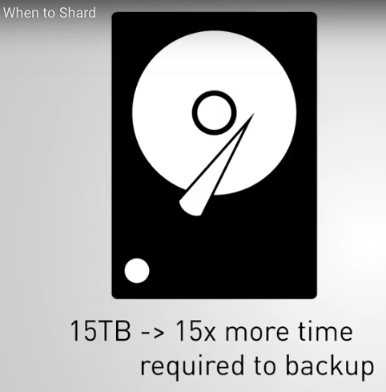

Y ahora tenemos que tener en cuenta el impacto en la red al hacer una copia de seguridad de esos 15 terabytes de datos.

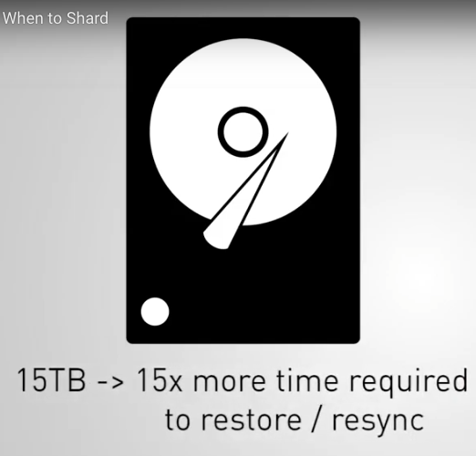

En tal escenario, tener una escala horizontal y distribuir esa cantidad de datos a través de diferentes shards(fragmentos), 


permitirá obtener ganancias de rendimiento horizontal como la paralelización de los procesos de copia de seguridad, restauración y sincronización inicial.


Recuerde que aunque estas pueden ser operaciones infrecuentes, pueden convertirse en problemas serios de escalabilidad para manejar desde el lado operativo.

Este mismo escenario también afectará su carga de trabajo operativa.


Un conjunto de datos 15 veces mayor 


por MongoDB probablemente se traducirá en índices al menos 15 veces mayores.

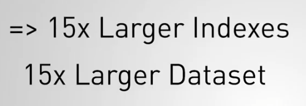

Como sabemos, los índices son esenciales para el desempeño de nuestras consultas en una base de datos.

Si ocupan 15 veces más espacio por unidad de procesamiento o servidor, requerirán más RAM para que los índices puedan mantenerse en la memoria.

Una parte muy importante de su conjunto de datos de trabajo.


El aumento del tamaño de sus discos probablemente implicará un aumento eventual del tamaño de su RAM, lo que trae costos adicionales u otros cuellos de botella a su sistema.


En este escenario de fragmentación, la paralelización de su carga de trabajo entre fragmentos podría ser mucho más 


beneficiosa para su aplicación y presupuesto que la cascada de posibles actualizaciones costosas.


Una regla general indica que los servidores individuales deben contener de dos a 5 terabytes de datos.


Más que eso se vuelve demasiado lento para operar.

Finalmente, hay cargas de trabajo que intrínsecamente funcionan mejor en implementaciones distribuidas que comparten ofertas, 


como operaciones de un solo subproceso que pueden ser datos paralelos y distribuidos geográficamente.


Los datos que deben almacenarse en ubicaciones regionales específicas o se beneficiarán de la ubicación conjunta con los clientes que consumen dichos datos.

Como ejemplo de un solo hilo, las operaciones serán los comandos del marco de agregación.


Si su aplicación depende en gran medida de los comandos del marco de agregación 


y si el tiempo de respuesta de esos comandos se vuelve más lento con el tiempo, debería considerar fragmentar(sharding) su clúster.

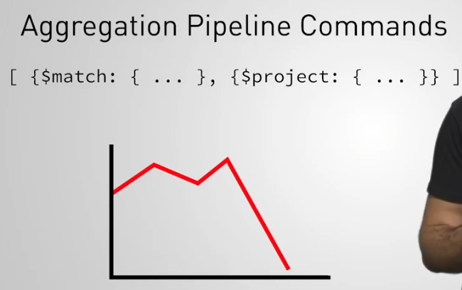

Dicho esto, no todas las etapas de la tubería de agregación son paralelizables.

Por lo tanto, se requiere una comprensión más profunda de su cartera antes de tomar esa decisión.

Puede aprender todo sobre esto en nuestro curso **M121 MongoDB Aggregation Course**.

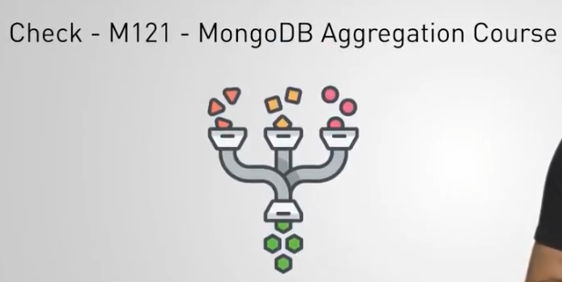

Así que estad atentos para eso.

Finalmente, los datos geodistribuidos son significativamente simples de administrar usando el Zone Sharding(fragmentación de zona).

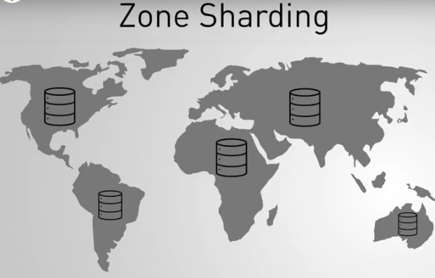

El fragmentación de zonas nos permite distribuir fácilmente los datos que deben ubicarse conjuntamente.

La división de zonas está fuera del alcance de este curso, pero tenga en cuenta que esta es una manera eficiente de administrar conjuntos de datos distribuidos geográficamente.

## 3. Examen When to Shard

**Problem:**

Which of the following scenarios drives us to shard our cluster?

Check all answers that apply:

* When we reach the most powerful servers available, maximizing our vertical scale options. :+1:

* When we start a new project with MongoDB.

* Data sovereignty laws require data to be located in a specific geography. :+1:

* When holding more than 5TB per server and operational costs increase dramatically. :+1:

* When our server disks are full.

See detailed answer

**Correct answers:**

**When we reach the most powerful servers available, maximizing our vertical scale options.**

Sharding can provide an alternative to vertical scaling.

**Data sovereignty laws require data to be located in a specific geography.**

Sharding allows us to store different pieces of data in specific countries or regions.

**When holding more than 5TB per server and operational costs increase dramatically.**

Generally, when our deployment reaches 2-5TB per server, we should consider sharding.

**Incorrect answers:**

**When we start a new project with MongoDB.**

We should carefully consider if we need to have a sharding system out of the start. This might be required for some projects, but certainly not always the ideal moment to address scalability needs.

**When our server disks are full.**

Maxing out the capacity of our disks is not a reason for sharding. Scaling up might make more sense than to add complexity to our system.

## 4. Tema: Sharding Architecture (Arquitectura de Fragmentación)

### Notas de lectura

Alrededor de las 3:25, Matt menciona la etapa `SHARD_MERGE` que tiene lugar en mongos. Esto no es necesariamente cierto: esta etapa puede tener lugar en mongos **o** en un fragmento elegido al azar en el clúster.

### Transcripción

Entonces, en esta lección, vamos a caminar hacia la arquitectura de un sharded cluster.

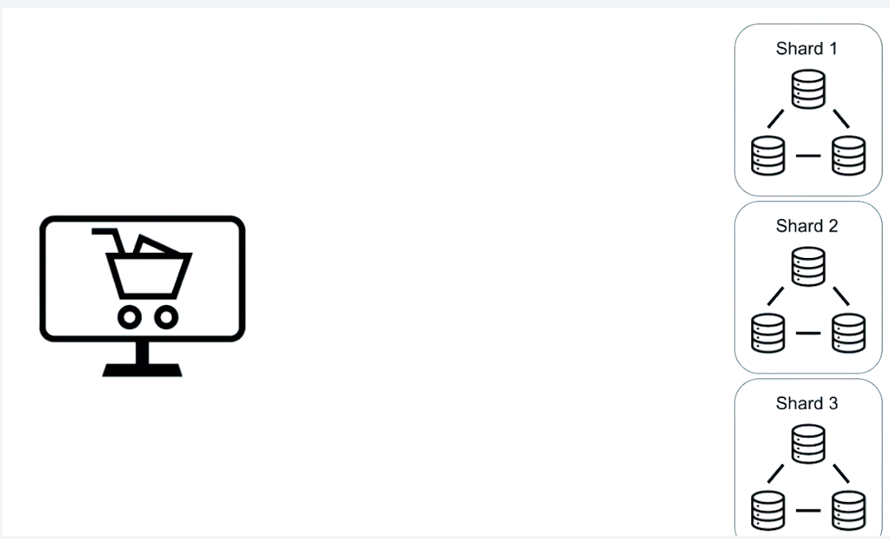

El aspecto más importante de un sharded cluster es que podemos agregar cualquier cantidad de fragmentos.


Y debido a que podría ser una gran cantidad de fragmentos diferentes, las aplicaciones del cliente no se van a comunicar directamente con los fragmentos.

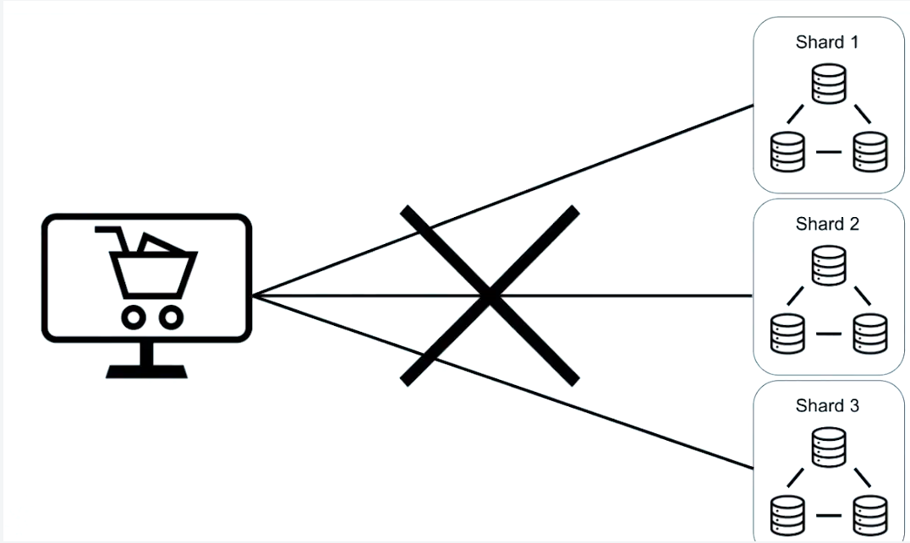

En cambio, configuramos un tipo de proceso de enrutador llamado mongos.

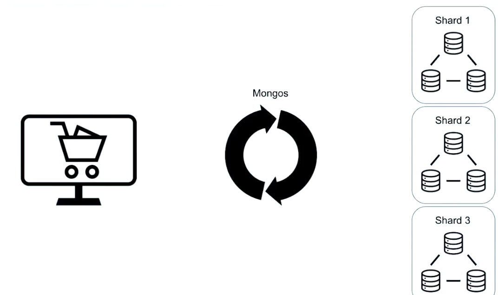

Luego, el cliente se conecta a mongos, y mongos dirige las consultas a los fragmentos correctos.

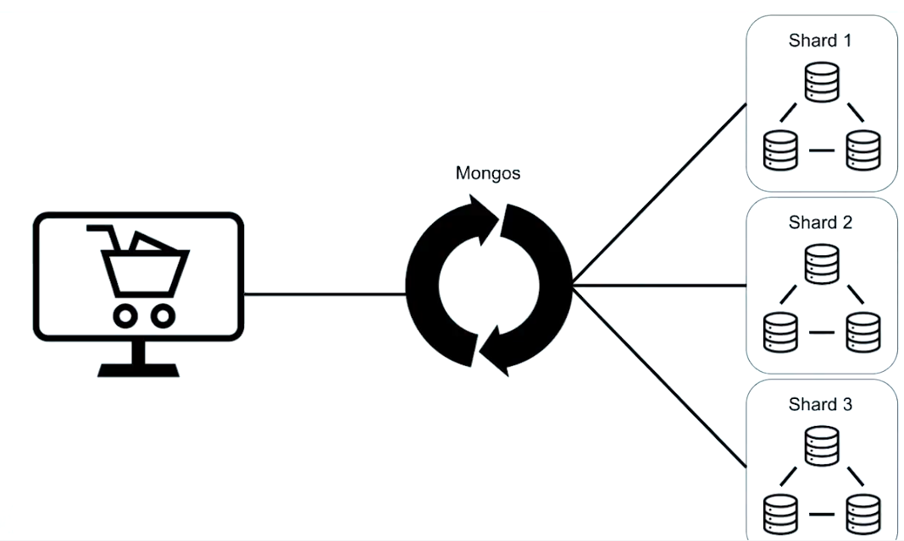

Entonces, ¿cómo descubren los mongos exactamente dónde está todo?

Bueno, tiene que entender exactamente cómo se distribuyen los datos.

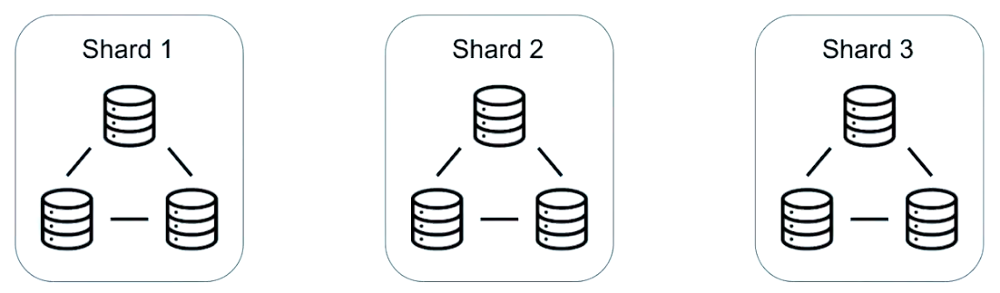

Entonces, digamos que esta información está en jugadores de fútbol.

Algunos de ustedes pueden conocerlos como jugadores de fútbol.

Dividimos nuestro conjunto de datos en el apellido de cada jugador.

Por lo tanto, los jugadores con apellidos entre A y J se almacenan en el primer fragmento, entre K y Q en el segundo fragmento, y entre R y Z en el tercer fragmento.

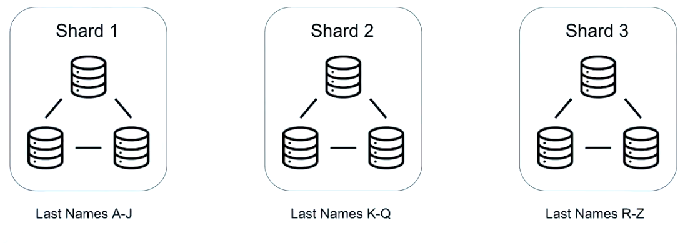

Mongos va a necesitar esta información para enrutar consultas al cliente.

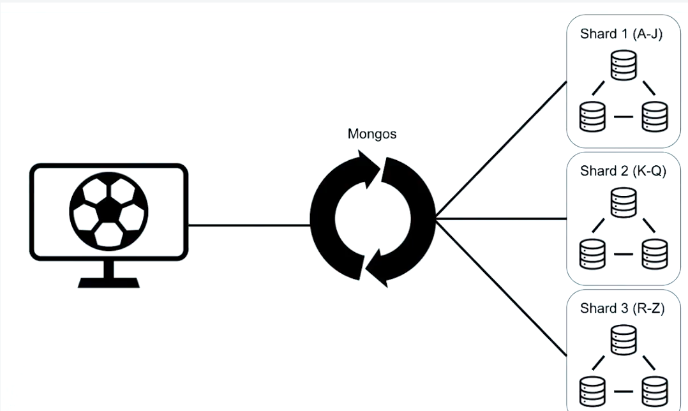

Por ejemplo, si el cliente envía una consulta a mongos sobre Luis Suárez, mongos puede usar el apellido Suárez 

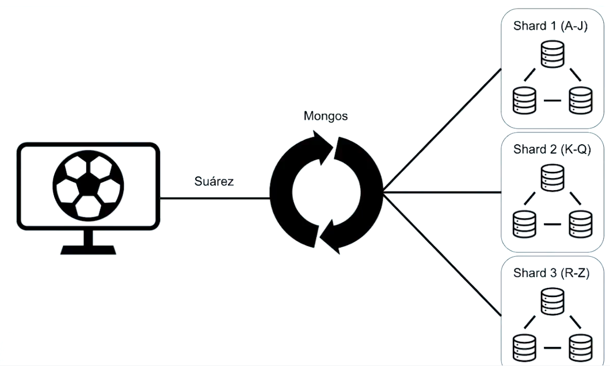

para averiguar exactamente qué fragmento contiene el documento de ese jugador y luego enrutar esa consulta al fragmento correcto.


También podemos tener múltiples procesos mongos desde alta disponibilidad con mongos, 

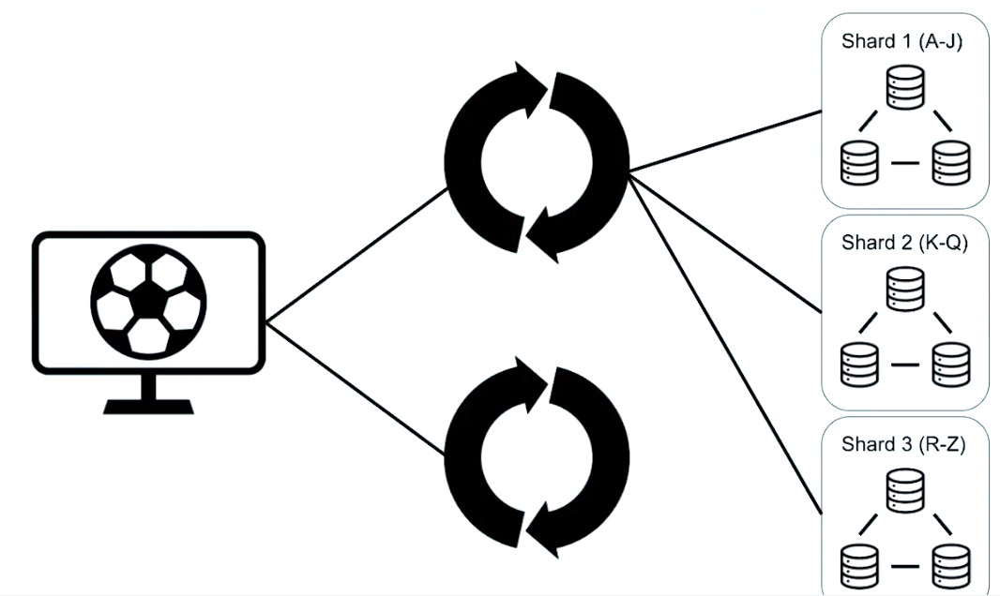

o para dar servicio a múltiples aplicaciones a la vez.

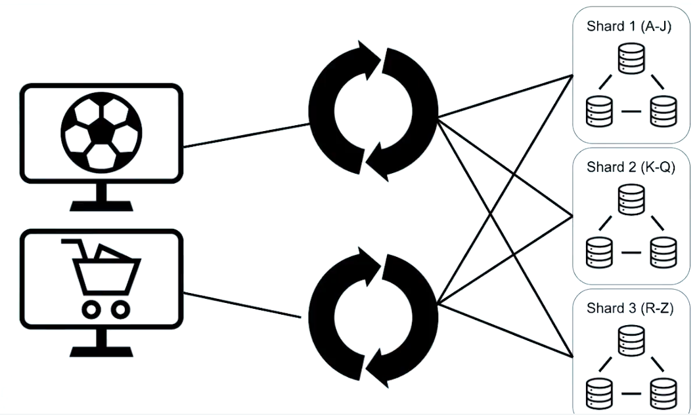

Los procesos mongos utilizarán los metadatos alrededor de las colecciones que se han fragmentado para determinar exactamente dónde enrutar las consultas.

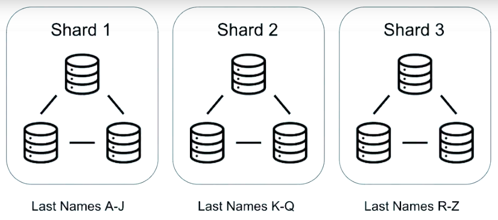

Los metadatos para esta colección se verán así.

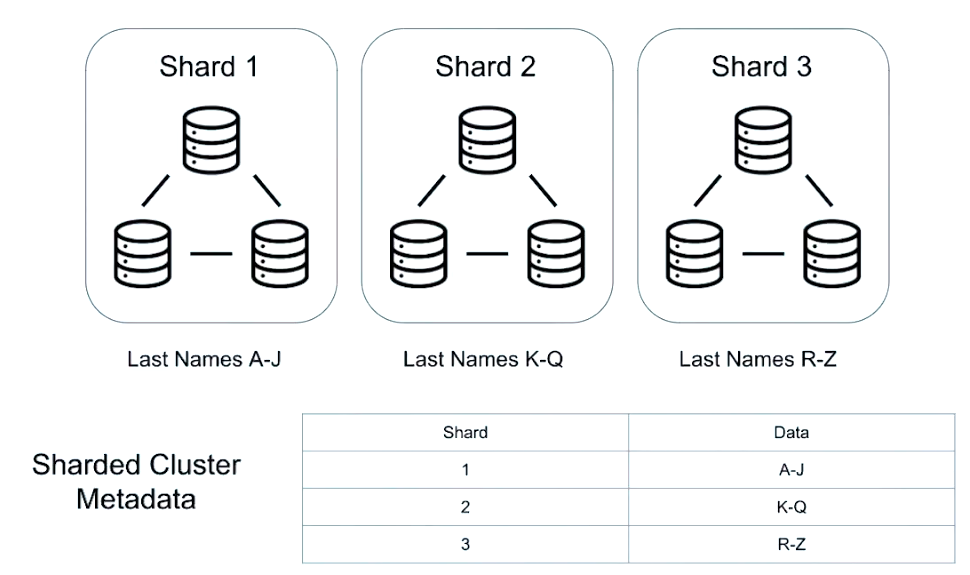

Pero los datos no se almacenan en mongos.

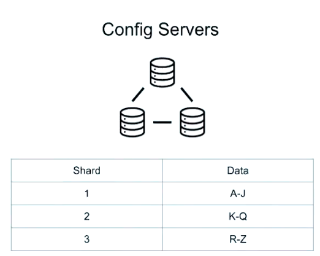

En cambio, los metadatos de la colección se almacenan en servidores de configuración, que constantemente realizan un seguimiento de dónde reside cada pieza de datos en el clúster.

Esto es especialmente importante porque la información contenida en cada fragmento puede cambiar con el tiempo.

Entonces mongos consulta los servidores de configuración a menudo, en caso de que se mueva una pieza de datos.


Pero, ¿por qué podría tener que moverse un dato?

Bueno, los servidores de configuración deben asegurarse de que haya una distribución uniforme de los datos en cada parte.

Por ejemplo, si hay muchas personas en nuestra base de datos con el apellido Smith, el tercer fragmento contendrá una cantidad desproporcionadamente grande de datos.

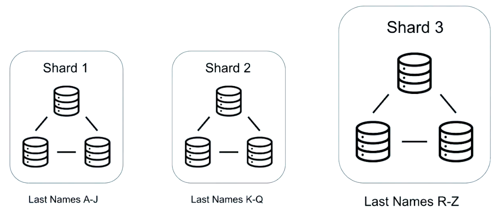

Cuando esto sucede, los servidores de configuración tienen que decidir qué datos se deben mover para que los fragmentos tengan una distribución más uniforme.

En este ejemplo, todos los nombres que comienzan con R no se han movido al segundo fragmento del tercer fragmento, para hacer espacio y tercer fragmento para todas aquellas personas llamadas Smith.

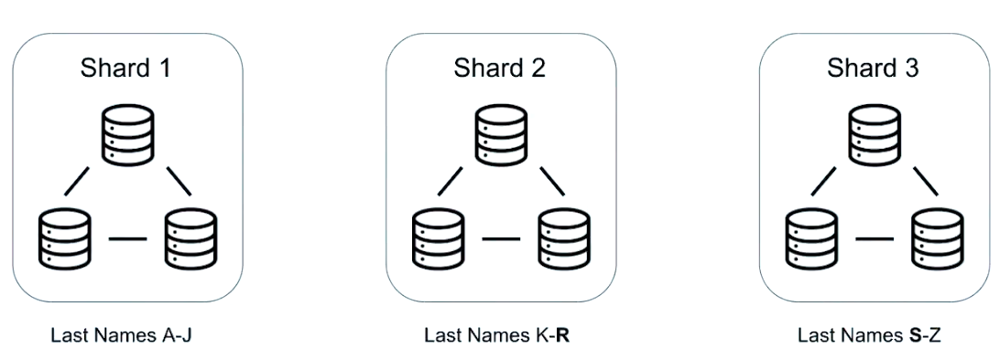

Los servidores de configuración actualizarán los datos que contienen y luego enviarán los datos a los fragmentos correctos.


También existe la posibilidad de que un fragmento crezca demasiado y deba dividirse.

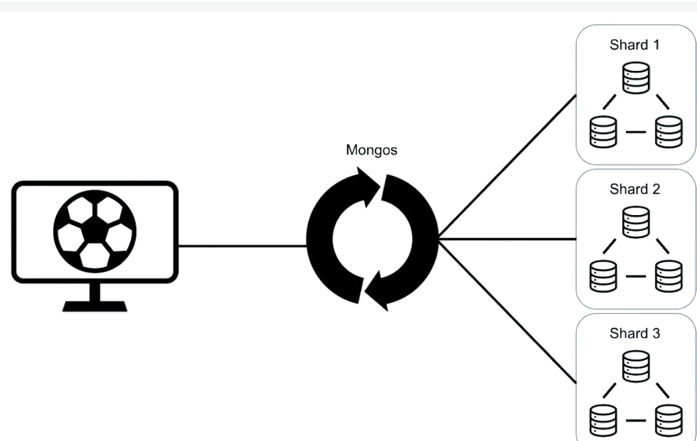

En ese caso, los mongos se partirían la porción.

Hablaremos más sobre esto en la lección sobre **chunks** (trozos).

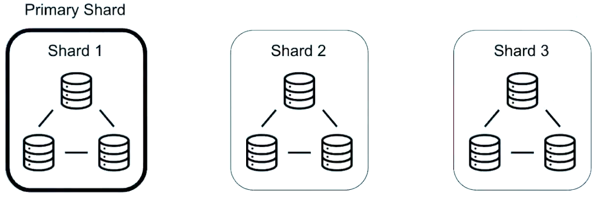

En el grupo fragmentado, también tenemos esta noción de un fragmento primario.

A cada base de datos se le asignará un Shard primario, y todas las colecciones no fragmentadas en esa base de datos permanecerán en ese Shard.

Recuerde, no todas las colecciones en un clúster fragmentado necesitan ser distribuidas.

Los servidores de configuración asignarán un Shard primario a cada base de datos una vez que se hayan creado.

Pero también podemos cambiar el Shard primario de una base de datos.

Simplemente no vamos a cubrir eso en este curso.

El Shard primario también tiene algunas otras responsabilidades, específicamente en torno a las operaciones de fusión para los comandos de agregación.

Entonces, mientras hablamos de fusionar resultados, solo quiero señalar algo aquí.

En nuestro ejemplo, los datos se organizan en fragmentos por el nombre de cada jugador.

Entonces, si el cliente recibe una consulta sobre la edad de un jugador, no sabe exactamente dónde buscar.

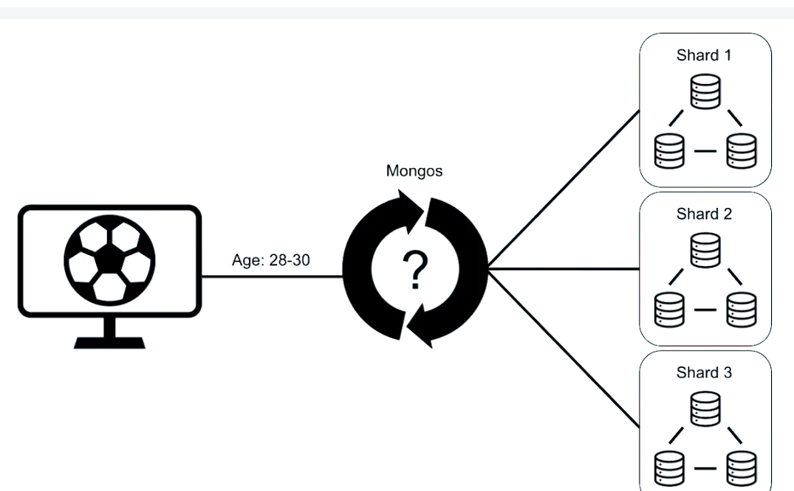

Así que solo va a verificar cada fragmento.

Enviará esta consulta a cada fragmento del clúster.

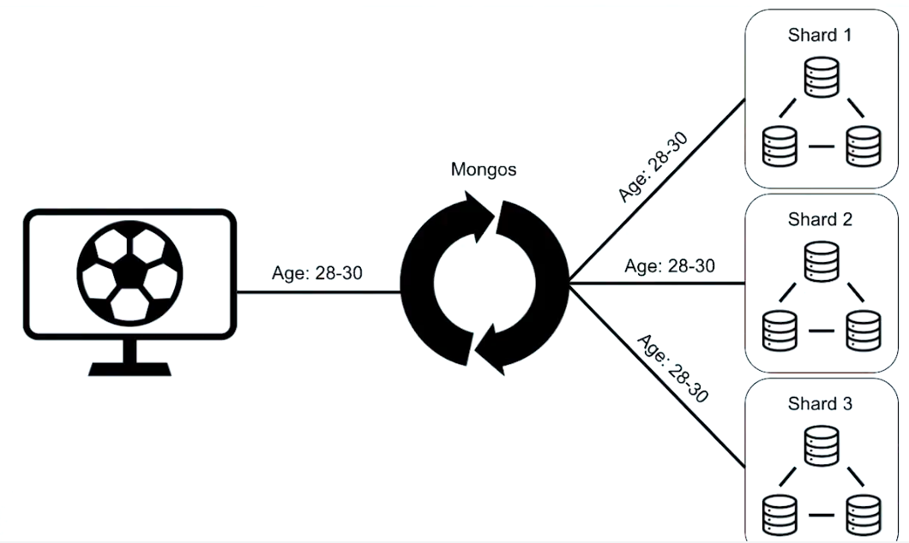

Y puede encontrar algunos documentos en los diferentes Shards.

Y cada fragmento individual enviará sus resultados a mongos.

Los mongos recopilarán resultados, y luego tal vez los clasifiquen si la consulta así lo exige.

Esta etapa se llama Shard Merge (fusión de fragmentos), y tiene lugar en los mongos.

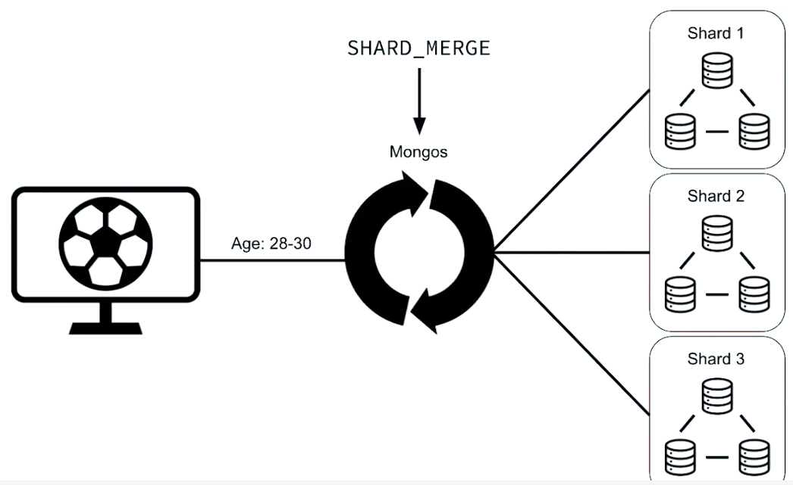

Una vez que se completa la Shard Merge (fusión de fragmentos), los mongos devolverán los resultados al cliente, pero el cliente no se dará cuenta de nada de esto.

Consultará este proceso como un mongoD normal.

En resumen, en esta lección cubrimos las responsabilidades básicas de los mongos, los metadatos contenidos en los servidores de contacto, y definimos el concepto de un fragmento primario.

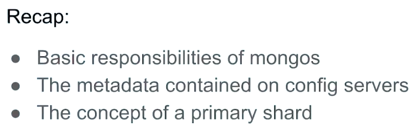

## 5. Examen Sharding Architecture

**Problem:**

What is true about the primary shard in a cluster?

Check all answers that apply:

* The role of primary shard is subject to change. :+1:

* Non-sharded collections are placed on the primary shard. :+1:

* Client applications communicate directly with the primary shard.

* The primary shard always has more data than the other shards.

* Shard merges are performed by the mongos. :+1:

**See detailed answer**

**Correct answers:**

**The role of primary shard is subject to change.**

We can manually change the primary shard of a database, if we need to.

**Non-sharded collections are placed on the primary shard.**

Until the collection is sharded, mongos will place it on the primary shard of its database.

**Shard merges are performed by the mongos.**

When documents are fetched from multiple shards, mongos has to gather and organize those documents in a shard_merge.

**Incorrect answers:**

**The primary shard always has more data than the other shards.**

The primary shard may have more data, because non-sharded collections will only exist on the primary shard. But this is not necessarily the case.

**Client applications communicate directly with the primary shard.**

Clients communicate with the mongos, which communicates to the shards in a cluster - this includes the primary shard.

## 6. Tema: Configuración de un Sharded Cluster (Grupo Fragmentado)

### Notas de lectura

Instrucciones de lectura

Archivo de configuración para el primer config server `csrs_1.conf`:

```sh
sharding:
  clusterRole: configsvr
replication:
  replSetName: m103-csrs
security:
  keyFile: /var/mongodb/pki/m103-keyfile
net:
  bindIp: localhost,192.168.103.100
  port: 26001
systemLog:
  destination: file
  path: /var/mongodb/db/csrs1/csrs1.log
  logAppend: true
processManagement:
  fork: true
storage:
  dbPath: /var/mongodb/db/csrs1
```

`csrs_2.conf`:

```sh
sharding:
  clusterRole: configsvr
replication:
  replSetName: m103-csrs
security:
  keyFile: /var/mongodb/pki/m103-keyfile
net:
  bindIp: localhost,192.168.103.100
  port: 26002
systemLog:
  destination: file
  path: /var/mongodb/db/csrs2/csrs2.log
  logAppend: true
processManagement:
  fork: true
storage:
  dbPath: /var/mongodb/db/csrs2
```

`csrs_3.conf`:

```sh
sharding:
  clusterRole: configsvr
replication:
  replSetName: m103-csrs
security:
  keyFile: /var/mongodb/pki/m103-keyfile
net:
  bindIp: localhost,192.168.103.100
  port: 26003
systemLog:
  destination: file
  path: /var/mongodb/db/csrs3/csrs3.log
  logAppend: true
processManagement:
  fork: true
storage:
  dbPath: /var/mongodb/db/csrs3

```

Crear el dbpath para node1:

```sh
vagrant@m103:~$ mkdir -p /var/mongodb/db/csrs1
```


Inicio de los tres servidores de configurados:

```sh
mongod -f csrs_1.conf
mongod -f csrs_2.conf
mongod -f csrs_3.conf
```

Conéctese a uno de los servidores de configuración:

```sh
mongo --port 26001
```

Iniciando el CSRS:

```sh
rs.initiate()
```

Creación de superusuario en CSRS:

```sh
use admin
db.createUser({
  user: "m103-admin",
  pwd: "m103-pass",
  roles: [
    {role: "root", db: "admin"}
  ]
})
```

Autenticando como el super usuario:

```sh
db.auth("m103-admin", "m103-pass")
```

Agregue el segundo y tercer nodo al CSRS:

```sh
rs.add("192.168.103.100:26002")
rs.add("192.168.103.100:26003")
```

Mongos config (mongos.conf):

```sh
sharding:
  configDB: m103-csrs/192.168.103.100:26001,192.168.103.100:26002,192.168.103.100:26003
security:
  keyFile: /var/mongodb/pki/m103-keyfile
net:
  bindIp: localhost,192.168.103.100
  port: 26000
systemLog:
  destination: file
  path: /var/mongodb/db/mongos.log
  logAppend: true
processManagement:
  fork: true
```

Conéctate a mongos:

```sh
vagrant@m103:~$ mongo --port 26000 --username m103-admin --password m103-pass --authenticationDatabase admin
```

Verificar estado del sharding:

```sh
MongoDB Enterprise mongos> sh.status()
```

Actualizar configuración para `node1.conf`:

```sh
sharding:
  clusterRole: shardsvr
storage:
  dbPath: /var/mongodb/db/node1
  wiredTiger:
    engineConfig:
      cacheSizeGB: .1
net:
  bindIp: 192.168.103.100,localhost
  port: 27011
security:
  keyFile: /var/mongodb/pki/m103-keyfile
systemLog:
  destination: file
  path: /var/mongodb/db/node1/mongod.log
  logAppend: true
processManagement:
  fork: true
replication:
  replSetName: m103-repl
```

Actualizar configuración para `node2.conf`:

```sh
sharding:
  clusterRole: shardsvr
storage:
  dbPath: /var/mongodb/db/node2
  wiredTiger:
    engineConfig:
      cacheSizeGB: .1
net:
  bindIp: 192.168.103.100,localhost
  port: 27012
security:
  keyFile: /var/mongodb/pki/m103-keyfile
systemLog:
  destination: file
  path: /var/mongodb/db/node2/mongod.log
  logAppend: true
processManagement:
  fork: true
replication:
  replSetName: m103-repl
```

Actualizar configuración para `node3.conf`:

```sh
sharding:
  clusterRole: shardsvr
storage:
  dbPath: /var/mongodb/db/node3
  wiredTiger:
    engineConfig:
      cacheSizeGB: .1
net:
  bindIp: 192.168.103.100,localhost
  port: 27013
security:
  keyFile: /var/mongodb/pki/m103-keyfile
systemLog:
  destination: file
  path: /var/mongodb/db/node3/mongod.log
  logAppend: true
processManagement:
  fork: true
replication:
  replSetName: m103-repl
```

Conectando directamente al nodo secundario (tenga en cuenta que si se ha realizado una elección en su replica set, el nodo especificado puede haberse convertido en primario):

```sh
mongo --port 27012 -u "m103-admin" -p "m103-pass" --authenticationDatabase "admin"
```

Apagar nodo:

```sh
use admin
db.shutdownServer()
```

Reinicio de nodo con nueva configuración:

```sh
mongod -f node2.conf
```

Deteniendo el primario actual:

```sh
rs.stepDown()
```

Agregar nuevo fragmento al clúster desde mongos:

```sh
sh.addShard("m103-repl/192.168.103.100:27012")
```

### Transcripción

Entonces, ahora que hemos revisado la arquitectura de un sharded cluster (clúster fragmentado) básico MongoDB, en realidad vamos a construir uno en nuestro entorno virtual de curso.

Entonces, en este momento, todo lo que tenemos es un replica set M103 repel.

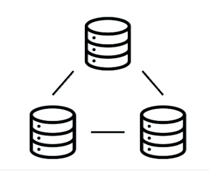

Este es solo un replica set normal, pero eventualmente se convertirá en el primer shard(fragmento) de nuestro clúster.

Este diagrama es el mínimo requerido para iniciar un sharded cluster(clúster fragmentado), esencialmente, solo los mongos, un config server replica set y al menos un shard.

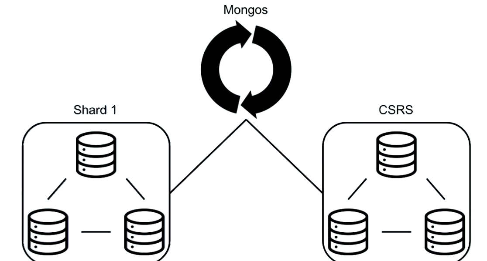

Las cosas principales que tenemos que construir son el CSRS y los mongos.

El resto del trabajo solo conectará todo junto.

Lo primero que vamos a construir son nuestros config servers(servidores de configuración) **CSRS**.

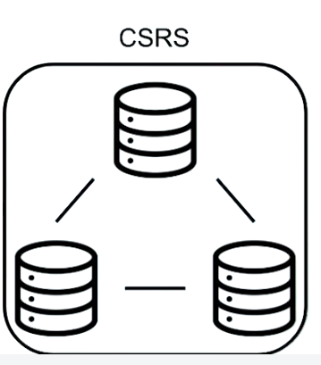

Entonces este es el archivo de configuración `csrs_1.conf` para uno de nuestros servidores de configuración.

`csrs_1.conf`:

```sh
sharding:
  clusterRole: configsvr
replication:
  replSetName: m103-csrs
security:
  keyFile: /var/mongodb/pki/m103-keyfile
net:
  bindIp: localhost,192.168.103.100
  port: 26001
systemLog:
  destination: file
  path: /var/mongodb/db/csrs1/csrs1.log
  logAppend: true
processManagement:
  fork: true
storage:
  dbPath: /var/mongodb/db/csrs1
```

Será uno de los nodos en los CSR's, pero es solo un MongoD normal, por lo que seguirá teniendo un puerto(port), una ruta de DB(dbPath) y una log path(ruta de registro).

Ahora los config servers(servidores de configuración) tienen un papel muy importante en el shard cluster(clúster de fragmentos).

Entonces tenemos que especificar, en la configuración `clusterRole: configsvr`, que este es de hecho un servidor de configuración.

Hacemos lo mismo para los otros dos nodos:

`csrs_2.conf`:

```sh
sharding:
  clusterRole: configsvr
replication:
  replSetName: m103-csrs
security:
  keyFile: /var/mongodb/pki/m103-keyfile
net:
  bindIp: localhost,192.168.103.100
  port: 26002
systemLog:
  destination: file
  path: /var/mongodb/db/csrs2/csrs2.log
  logAppend: true
processManagement:
  fork: true
storage:
  dbPath: /var/mongodb/db/csrs2
```

`csrs_3.conf`:

```sh
sharding:
  clusterRole: configsvr
replication:
  replSetName: m103-csrs
security:
  keyFile: /var/mongodb/pki/m103-keyfile
net:
  bindIp: localhost,192.168.103.100
  port: 26003
systemLog:
  destination: file
  path: /var/mongodb/db/csrs3/csrs3.log
  logAppend: true
processManagement:
  fork: true
storage:
  dbPath: /var/mongodb/db/csrs3
```

Crear el dbpath para node1:

```sh
vagrant@m103:~$ mkdir -p /var/mongodb/db/csrs1
vagrant@m103:~$ mkdir -p /var/mongodb/db/csrs2
vagrant@m103:~$ mkdir -p /var/mongodb/db/csrs3
```

Entonces, aquí, solo voy a usar ese archivo para iniciar un proceso mongoD.

```sh
vagrant@m103:~$ mongod -f csrs_1.conf
about to fork child process, waiting until server is ready for connections.
forked process: 23820
child process started successfully, parent exiting
```

Y, aquí, voy a hacer lo mismo para los otros dos nodos en el CSRS.

```sh
Inicio de los tres servidores de configurados:

```sh
vagrant@m103:~$ mongod -f csrs_2.conf
about to fork child process, waiting until server is ready for connections.
forked process: 24785
child process started successfully, parent exiting
vagrant@m103:~$ 

vagrant@m103:~$ mongod -f csrs_3.conf
about to fork child process, waiting until server is ready for connections.
forked process: 25267
child process started successfully, parent exiting
vagrant@m103:~$ 
```

Y puede encontrar esos archivos de configuración en las notas de clase.

Se ven muy similares al primero.

Entonces, habilitamos este replica set para usar la autenticación, y la autenticación del archivo de clave está bien porque ya creamos nuestro archivo de clave.

```sh
vagrant@m103:~$ mongo --port 26001
MongoDB shell version v3.6.17
connecting to: mongodb://127.0.0.1:26001/?gssapiServiceName=mongodb
Implicit session: session { "id" : UUID("9ba99b2a-8668-492b-ae34-fc736d5ab37e") }
MongoDB server version: 3.6.17
MongoDB Enterprise > 
```

Vamos a compartir el mismo archivo de clave en esta configuración ya que todas las instancias de mongoD se ejecutan en la misma máquina virtual.

Pero en un entorno de producción real, los certificados X509 serían el camino a seguir.

Tener una contraseña compartida como el archivo de clave, cuando se comparte en varias máquinas, aumenta el riesgo de que ese archivo se vea comprometido.

Así que tenlo en cuenta.

Aquí, solo estoy iniciando el replica set del servidor de configuración.

```sh
MongoDB Enterprise > rs.initiate()
{
	"info2" : "no configuration specified. Using a default configuration for the set",
	"me" : "192.168.103.100:26001",
	"ok" : 1,
	"$gleStats" : {
		"lastOpTime" : Timestamp(1583068629, 1),
		"electionId" : ObjectId("000000000000000000000000")
	}
}
MongoDB Enterprise m103-csrs:OTHER> 
```

Y aquí, solo uso la excepción localhost para crear nuestro súper usuario.

```sh
MongoDB Enterprise m103-csrs:PRIMARY> use admin
switched to db admin
MongoDB Enterprise m103-csrs:PRIMARY> db.createUser({
...   user: "m103-admin",
...   pwd: "m103-pass",
...   roles: [
...     {role: "root", db: "admin"}
...   ]
... })
Successfully added user: {
	"user" : "m103-admin",
	"roles" : [
		{
			"role" : "root",
			"db" : "admin"
		}
	]
}
MongoDB Enterprise m103-csrs:PRIMARY> 
```

Entonces, ahora me voy a autenticar como el superusuario.

```sh
MongoDB Enterprise m103-csrs:PRIMARY> db.auth("m103-admin", "m103-pass")
1
MongoDB Enterprise m103-csrs:PRIMARY> 
```

Uno significa que funcionó.

Y ahora podemos comenzar a agregarlos al conjunto.

```sh
MongoDB Enterprise m103-csrs:PRIMARY> rs.add("192.168.103.100:26002")
{
	"ok" : 1,
	"operationTime" : Timestamp(1583069850, 2),
	"$gleStats" : {
		"lastOpTime" : {
			"ts" : Timestamp(1583069850, 2),
			"t" : NumberLong(1)
		},
		"electionId" : ObjectId("7fffffff0000000000000001")
	},
	"$clusterTime" : {
		"clusterTime" : Timestamp(1583069850, 2),
		"signature" : {
			"hash" : BinData(0,"4gQCAeG6ZTMTf49+vReijJJ/35c="),
			"keyId" : NumberLong("6799227993173524506")
		}
	}
}
MongoDB Enterprise m103-csrs:PRIMARY> 

MongoDB Enterprise m103-csrs:PRIMARY> rs.add("192.168.103.100:26003")
{
	"ok" : 1,
	"operationTime" : Timestamp(1583069880, 1),
	"$gleStats" : {
		"lastOpTime" : {
			"ts" : Timestamp(1583069880, 1),
			"t" : NumberLong(1)
		},
		"electionId" : ObjectId("7fffffff0000000000000001")
	},
	"$clusterTime" : {
		"clusterTime" : Timestamp(1583069880, 1),
		"signature" : {
			"hash" : BinData(0,"BJQuGcvFnhCPsioKuvAsaMcR/H8="),
			"keyId" : NumberLong("6799227993173524506")
		}
	}
}
MongoDB Enterprise m103-csrs:PRIMARY> 
```

Aquí está nuestro segundo nodo, y nuestro tercero, y ahora tenemos un conjunto completo de réplicas del servidor de configuración.

Solo voy a verificar eso con `rs.ismaster`.

```sh
MongoDB Enterprise m103-csrs:PRIMARY> rs.isMaster()
{
	"hosts" : [
		"192.168.103.100:26001",
		"192.168.103.100:26002",
		"192.168.103.100:26003"
	],
	"setName" : "m103-csrs",
	"setVersion" : 3,
	"ismaster" : true,
	"secondary" : false,
	"primary" : "192.168.103.100:26001",
	"me" : "192.168.103.100:26001",
	"electionId" : ObjectId("7fffffff0000000000000001"),
	"lastWrite" : {
		"opTime" : {
			"ts" : Timestamp(1583069920, 1),
			"t" : NumberLong(1)
		},
		"lastWriteDate" : ISODate("2020-03-01T13:38:40Z"),
		"majorityOpTime" : {
			"ts" : Timestamp(1583069920, 1),
			"t" : NumberLong(1)
		},
		"majorityWriteDate" : ISODate("2020-03-01T13:38:40Z")
	},
	"configsvr" : 2,
	"maxBsonObjectSize" : 16777216,
	"maxMessageSizeBytes" : 48000000,
	"maxWriteBatchSize" : 100000,
	"localTime" : ISODate("2020-03-01T13:38:42.801Z"),
	"logicalSessionTimeoutMinutes" : 30,
	"minWireVersion" : 0,
	"maxWireVersion" : 6,
	"readOnly" : false,
	"ok" : 1,
	"operationTime" : Timestamp(1583069920, 1),
	"$gleStats" : {
		"lastOpTime" : {
			"ts" : Timestamp(1583069880, 1),
			"t" : NumberLong(1)
		},
		"electionId" : ObjectId("7fffffff0000000000000001")
	},
	"$clusterTime" : {
		"clusterTime" : Timestamp(1583069920, 1),
		"signature" : {
			"hash" : BinData(0,"vo/KQB3r4KYXefi3c4pzBW842yw="),
			"keyId" : NumberLong("6799227993173524506")
		}
	}
}
MongoDB Enterprise m103-csrs:PRIMARY> 
```

Y parece que el conjunto tiene tres nodos.

Entonces, ahora que tenemos nuestro CSRS en funcionamiento, podemos iniciar mongos y luego apuntar mongos en la dirección de nuestro replica set del servidor de configuración.

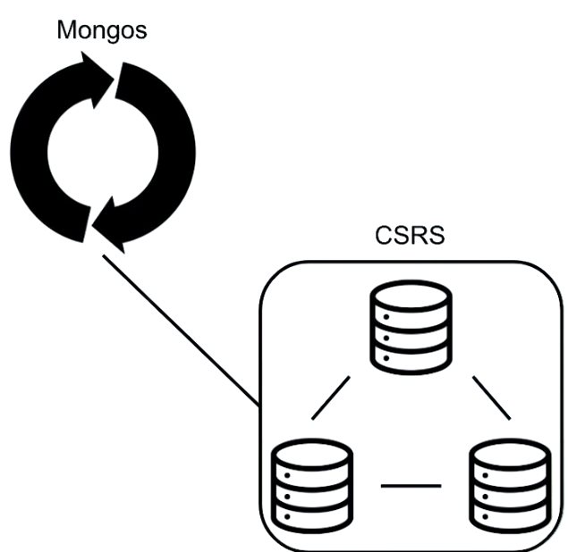

Este es el archivo de configuración para mongos `mongos.conf`, y lo primero que notará es que **no hay una ruta de acceso a la base de datos**.

`mongos.conf`:

```sh
sharding:
  configDB: m103-csrs/192.168.103.100:26001,192.168.103.100:26002,192.168.103.100:26003
security:
  keyFile: /var/mongodb/pki/m103-keyfile
net:
  bindIp: localhost,192.168.103.100
  port: 26000
systemLog:
  destination: file
  path: /var/mongodb/db/mongos.log
  logAppend: true
processManagement:
  fork: true
```

Eso es porque mongos no necesita almacenar ningún dato.

Todos los datos utilizados por mongos se almacenan en los servidores de configuración.

Entonces, en la sección de fragmentación, los hemos especificado.

Y tenga en cuenta que especificamos el conjunto completo de réplicas `configDB: m103-csrs/192.168.103.100:26001,192.168.103.100:26002,192.168.103.100:26003` en lugar de los miembros individuales.

También habilitamos la autenticación de archivos clave `keyFile: /var/mongodb/pki/m103-keyfile`, por lo que vamos a necesitar autenticarnos en mongos.

Pero heredará los mismos usuarios que sus servidores de configuración, y lo veremos en un minuto.

Entonces este es el comando que usamos para iniciar mongos.

```sh
vagrant@m103:~$ mongos -f mongos.conf
about to fork child process, waiting until server is ready for connections.
forked process: 29582
child process started successfully, parent exiting
vagrant@m103:~$ 
```

Pasamos el archivo de configuración, como lo hicimos antes.

Pero, tenga en cuenta que este no es un proceso mongoD.

Mongos es un proceso diferente con diferentes propiedades.

Así que tenlo en cuenta.

Entonces, como vimos antes, mongos ha habilitado la autenticación, y también heredará los usuarios que creamos en los servidores de configuración.

Entonces, este usuario está realmente listo para comenzar.

```sh
vagrant@m103:~$ mongo --port 26000 --username m103-admin --password m103-pass --authenticationDatabase admin
MongoDB shell version v3.6.17
connecting to: mongodb://127.0.0.1:26000/?authSource=admin&gssapiServiceName=mongodb
Implicit session: session { "id" : UUID("fa332c4d-5748-4fe3-bcc7-43531428eb31") }
MongoDB server version: 3.6.17
MongoDB Enterprise mongos> 
```

Y parece que estamos dentro.

Solo voy a verificar el estado aquí.

```sh
MongoDB Enterprise mongos> sh.status()
--- Sharding Status --- 
  sharding version: {
  	"_id" : 1,
  	"minCompatibleVersion" : 5,
  	"currentVersion" : 6,
  	"clusterId" : ObjectId("5e5bb5d636841bd554585640")
  }
  shards:
  active mongoses:
        "3.6.17" : 1
  autosplit:
        Currently enabled: yes
  balancer:
        Currently enabled:  yes
        Currently running:  no
        Failed balancer rounds in last 5 attempts:  0
        Migration Results for the last 24 hours: 
                No recent migrations
  databases:
        {  "_id" : "config",  "primary" : "config",  "partitioned" : true }

MongoDB Enterprise mongos> 
```

Entonces, `sh.status` es la forma más básica de obtener datos de fragmentación de mongos.

Y si echamos un vistazo a la salida, podemos ver que tenemos la cantidad de mongos actualmente conectados, y también tenemos la cantidad de fragmentos.

```sh
shards:
active mongoses:
      "3.6.17" : 1
```

En este momento, esto está vacío porque no tenemos fragmentos.

Pero, probablemente puedas ver a dónde va esto.

En este momento, tenemos un mongos ejecutándose con los servidores de configuración.

Y en realidad también tenemos un replica set que podemos usar.

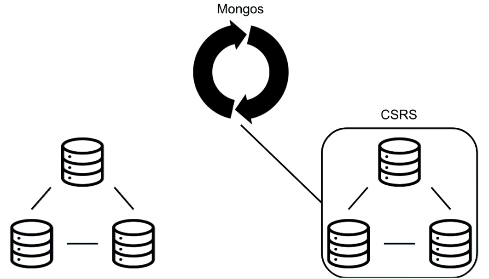

Solo necesitamos ajustar la configuración para poder usarla como un nodo de fragmento.


Este es el archivo de configuración para el primer nodo en nuestro replica set `node1.conf`, y lo he cambiado ligeramente.

`node1.conf`:

```sh
sharding:
  clusterRole: shardsvr
storage:
  dbPath: /var/mongodb/db/node1
  wiredTiger:
    engineConfig:
      cacheSizeGB: .1
net:
  bindIp: 192.168.103.100,localhost
  port: 27011
security:
  authorization: enabled (ESTA EN MI PREVIO ARCHIVO CONFIGURADO )
  keyFile: /var/mongodb/pki/m103-keyfile
systemLog:
  destination: file
  path: /var/mongodb/db/node1/mongod.log
  logAppend: true
processManagement:
  fork: true
replication:
  replSetName: m103-repl
```

He agregado esta restricción 


```js
wiredTiger:
    engineConfig:
      cacheSizeGB: .1
```
en el tamaño de caché y gigabytes, porque Vagrant solo tiene permiso para usar dos gigabytes de memoria.


Así que quería reducir el estrés en el entorno general.

Generalmente, esta no es una buena práctica en producción, pero será necesaria una vez que comencemos a agrupar colecciones en este clúster.

Entonces, esta es la línea que tenemos que agregar si queremos habilitar el fragmentación en este nodo.

```js
sharding:
  clusterRole: shardsvr
```

Esta línea `clusterRole: shardsvr` le dirá a los mongos, oye, sabes que puedes usarme como un nodo de fragmento en tu clúster.

Tenemos que agregar esta línea a cada nodo en la réplica.


`node2.conf`:

```sh
sharding:
  clusterRole: shardsvr
storage:
  dbPath: /var/mongodb/db/node2
  wiredTiger:
    engineConfig:
      cacheSizeGB: .1
net:
  bindIp: 192.168.103.100,localhost
  port: 27012
security:
  authorization: enabled (ESTA EN MI PREVIO ARCHIVO CONFIGURADO )
  keyFile: /var/mongodb/pki/m103-keyfile
systemLog:
  destination: file
  path: /var/mongodb/db/node2/mongod.log
  logAppend: true
processManagement:
  fork: true
replication:
  replSetName: m103-repl
```

`node3.conf`:

```sh
sharding:
  clusterRole: shardsvr
storage:
  dbPath: /var/mongodb/db/node3
  wiredTiger:
    engineConfig:
      cacheSizeGB: .1
net:
  bindIp: 192.168.103.100,localhost
  port: 27013
security:
  authorization: enabled (ESTA EN MI PREVIO ARCHIVO CONFIGURADO )
  keyFile: /var/mongodb/pki/m103-keyfile
systemLog:
  destination: file
  path: /var/mongodb/db/node3/mongod.log
  logAppend: true
processManagement:
  fork: true
replication:
  replSetName: m103-repl
```

Así que acabo de cambiar los archivos de configuración para los tres nodos en nuestro conjunto, pero los nodos aún deben reiniciarse para dar cuenta de esos cambios.

Vamos a hacer una actualización continua para hacerlo.

Lo que significa que vamos a actualizar primero los secundarios, luego volver a subirlos, bajar el primario actual y luego actualizar ese último nodo.

Aquí, solo me estoy conectando a uno de los nodos secundarios.

```sh
vagrant@m103:~$ mongo --port 27011 -u "m103-admin" -p "m103-pass" --authenticationDatabase "admin"
MongoDB shell version v3.6.17
connecting to: mongodb://127.0.0.1:27011/?authSource=admin&gssapiServiceName=mongodb
Implicit session: session { "id" : UUID("6248f37e-22ef-46cb-b903-d0f8913ecadf") }
MongoDB server version: 3.6.17
Server has startup warnings: 
2020-03-01T18:02:10.271+0000 I STORAGE  [initandlisten] 
2020-03-01T18:02:10.271+0000 I STORAGE  [initandlisten] ** WARNING: Using the XFS filesystem is strongly recommended with the WiredTiger storage engine
2020-03-01T18:02:10.271+0000 I STORAGE  [initandlisten] **          See http://dochub.mongodb.org/core/prodnotes-filesystem
2020-03-01T18:02:11.328+0000 I CONTROL  [initandlisten] 
2020-03-01T18:02:11.328+0000 I CONTROL  [initandlisten] ** WARNING: /sys/kernel/mm/transparent_hugepage/enabled is 'always'.
2020-03-01T18:02:11.328+0000 I CONTROL  [initandlisten] **        We suggest setting it to 'never'
2020-03-01T18:02:11.328+0000 I CONTROL  [initandlisten] 
2020-03-01T18:02:11.328+0000 I CONTROL  [initandlisten] ** WARNING: /sys/kernel/mm/transparent_hugepage/defrag is 'always'.
2020-03-01T18:02:11.328+0000 I CONTROL  [initandlisten] **        We suggest setting it to 'never'
2020-03-01T18:02:11.328+0000 I CONTROL  [initandlisten] 
MongoDB Enterprise m103-example:SECONDARY> 
```

Solo voy a cambiar a la base de datos admin-- y cerrar este nodo.

```sh
MongoDB Enterprise m103-example:SECONDARY> use admin
switched to db admin
MongoDB Enterprise m103-example:SECONDARY> db.shutdownServer()
server should be down...
2020-03-01T18:15:47.661+0000 I NETWORK  [thread1] trying reconnect to 127.0.0.1:27011 (127.0.0.1) failed
2020-03-01T18:15:47.662+0000 W NETWORK  [thread1] Failed to connect to 127.0.0.1:27011, in(checking socket for error after poll), reason: Connection refused
2020-03-01T18:15:47.663+0000 I NETWORK  [thread1] reconnect 127.0.0.1:27011 (127.0.0.1) failed failed 
2020-03-01T18:15:47.668+0000 I NETWORK  [thread1] trying reconnect to 127.0.0.1:27011 (127.0.0.1) failed
2020-03-01T18:15:47.669+0000 W NETWORK  [thread1] Failed to connect to 127.0.0.1:27011, in(checking socket for error after poll), reason: Connection refused
2020-03-01T18:15:47.670+0000 I NETWORK  [thread1] reconnect 127.0.0.1:27011 (127.0.0.1) failed failed 
MongoDB Enterprise > 
```

Y aquí, solo estoy comenzando una copia de seguridad con la nueva configuración.

```sh
vagrant@m103:~$ mongod -f node1.conf
about to fork child process, waiting until server is ready for connections.
forked process: 4574
child process started successfully, parent exiting
vagrant@m103:~$ 
```

Haga lo mismo para nuestro tercer nodo.

```sh
vagrant@m103:~$ mongo --port 27013 -u "m103-admin" -p "m103-pass" --authenticationDatabase "admin"
MongoDB shell version v3.6.17
connecting to: mongodb://127.0.0.1:27013/?authSource=admin&gssapiServiceName=mongodb
Implicit session: session { "id" : UUID("ee3683e8-290c-4020-9228-68994f5f6879") }
MongoDB server version: 3.6.17
Server has startup warnings: 
2020-03-01T18:02:44.154+0000 I STORAGE  [initandlisten] 
2020-03-01T18:02:44.154+0000 I STORAGE  [initandlisten] ** WARNING: Using the XFS filesystem is strongly recommended with the WiredTiger storage engine
2020-03-01T18:02:44.154+0000 I STORAGE  [initandlisten] **          See http://dochub.mongodb.org/core/prodnotes-filesystem
2020-03-01T18:02:45.506+0000 I CONTROL  [initandlisten] 
2020-03-01T18:02:45.506+0000 I CONTROL  [initandlisten] ** WARNING: /sys/kernel/mm/transparent_hugepage/enabled is 'always'.
2020-03-01T18:02:45.506+0000 I CONTROL  [initandlisten] **        We suggest setting it to 'never'
2020-03-01T18:02:45.506+0000 I CONTROL  [initandlisten] 
2020-03-01T18:02:45.506+0000 I CONTROL  [initandlisten] ** WARNING: /sys/kernel/mm/transparent_hugepage/defrag is 'always'.
2020-03-01T18:02:45.506+0000 I CONTROL  [initandlisten] **        We suggest setting it to 'never'
2020-03-01T18:02:45.506+0000 I CONTROL  [initandlisten] 
MongoDB Enterprise m103-example:SECONDARY> 

MongoDB Enterprise m103-example:SECONDARY> use admin
switched to db admin

MongoDB Enterprise m103-example:SECONDARY> db.shutdownServer()
server should be down...
2020-03-01T18:18:41.632+0000 I NETWORK  [thread1] trying reconnect to 127.0.0.1:27013 (127.0.0.1) failed
2020-03-01T18:18:41.632+0000 W NETWORK  [thread1] Failed to connect to 127.0.0.1:27013, in(checking socket for error after poll), reason: Connection refused
2020-03-01T18:18:41.632+0000 I NETWORK  [thread1] reconnect 127.0.0.1:27013 (127.0.0.1) failed failed 
2020-03-01T18:18:41.634+0000 I NETWORK  [thread1] trying reconnect to 127.0.0.1:27013 (127.0.0.1) failed
2020-03-01T18:18:41.635+0000 W NETWORK  [thread1] Failed to connect to 127.0.0.1:27013, in(checking socket for error after poll), reason: Connection refused
2020-03-01T18:18:41.635+0000 I NETWORK  [thread1] reconnect 127.0.0.1:27013 (127.0.0.1) failed failed 
MongoDB Enterprise > 
```

Y aquí, estoy iniciando el tercer nodo con una nueva configuración.

```sh
vagrant@m103:~$ mongod -f node3.conf
about to fork child process, waiting until server is ready for connections.
forked process: 4918
child process started successfully, parent exiting
vagrant@m103:~$ 

```
Entonces, ahora que ambos secundarios han sido actualizados para la nueva configuración, voy a conectarme al primario y luego lo bajaré para poder actualizar ese también.

```sh
vagrant@m103:~$ mongo --port 27012 -u "m103-admin" -p "m103-pass" --authenticationDatabase "admin"
MongoDB shell version v3.6.17
connecting to: mongodb://127.0.0.1:27012/?authSource=admin&gssapiServiceName=mongodb
Implicit session: session { "id" : UUID("04a1c6cc-19ea-4ef1-ab90-86f5843b7d21") }
MongoDB server version: 3.6.17
Server has startup warnings: 
2020-03-01T14:15:23.187+0000 I STORAGE  [initandlisten] 
2020-03-01T14:15:23.187+0000 I STORAGE  [initandlisten] ** WARNING: Using the XFS filesystem is strongly recommended with the WiredTiger storage engine
2020-03-01T14:15:23.187+0000 I STORAGE  [initandlisten] **          See http://dochub.mongodb.org/core/prodnotes-filesystem
2020-03-01T14:15:24.175+0000 I CONTROL  [initandlisten] 
2020-03-01T14:15:24.175+0000 I CONTROL  [initandlisten] ** WARNING: /sys/kernel/mm/transparent_hugepage/enabled is 'always'.
2020-03-01T14:15:24.175+0000 I CONTROL  [initandlisten] **        We suggest setting it to 'never'
2020-03-01T14:15:24.175+0000 I CONTROL  [initandlisten] 
2020-03-01T14:15:24.175+0000 I CONTROL  [initandlisten] ** WARNING: /sys/kernel/mm/transparent_hugepage/defrag is 'always'.
2020-03-01T14:15:24.175+0000 I CONTROL  [initandlisten] **        We suggest setting it to 'never'
2020-03-01T14:15:24.175+0000 I CONTROL  [initandlisten] 
MongoDB Enterprise m103-example:PRIMARY> 
```

Voy a forzar una elección para que este nodo se convierta en secundario

```sh
MongoDB Enterprise m103-example:PRIMARY> rs.stepDown()
2020-03-01T18:20:44.010+0000 E QUERY    [thread1] Error: error doing query: failed: network error while attempting to run command 'replSetStepDown' on host '127.0.0.1:27012'  :
DB.prototype.runCommand@src/mongo/shell/db.js:168:1
DB.prototype.adminCommand@src/mongo/shell/db.js:186:16
rs.stepDown@src/mongo/shell/utils.js:1397:12
@(shell):1:1
2020-03-01T18:20:44.015+0000 I NETWORK  [thread1] trying reconnect to 127.0.0.1:27012 (127.0.0.1) failed
2020-03-01T18:20:44.017+0000 I NETWORK  [thread1] reconnect 127.0.0.1:27012 (127.0.0.1) ok
MongoDB Enterprise m103-example:SECONDARY> 
```

, y funcionó.

```sh
MongoDB Enterprise m103-example:SECONDARY> 
```

Ahora voy a cerrar este nodo también.

```sh
MongoDB Enterprise m103-example:SECONDARY> use admin
switched to db admin
MongoDB Enterprise m103-example:SECONDARY> db.shutdownServer()
server should be down...
2020-03-01T18:21:36.339+0000 I NETWORK  [thread1] trying reconnect to 127.0.0.1:27012 (127.0.0.1) failed
2020-03-01T18:21:36.341+0000 I NETWORK  [thread1] Socket recv() Connection reset by peer 127.0.0.1:27012
2020-03-01T18:21:36.341+0000 I NETWORK  [thread1] SocketException: remote: (NONE):0 error: SocketException socket exception [RECV_ERROR] server [127.0.0.1:27012] 
2020-03-01T18:21:36.341+0000 I NETWORK  [thread1] reconnect 127.0.0.1:27012 (127.0.0.1) failed failed 
2020-03-01T18:21:36.343+0000 I NETWORK  [thread1] trying reconnect to 127.0.0.1:27012 (127.0.0.1) failed
2020-03-01T18:21:36.343+0000 W NETWORK  [thread1] Failed to connect to 127.0.0.1:27012, in(checking socket for error after poll), reason: Connection refused
2020-03-01T18:21:36.343+0000 I NETWORK  [thread1] reconnect 127.0.0.1:27012 (127.0.0.1) failed failed 
MongoDB Enterprise > 
```

Así que ahora estoy comenzando nuestro último nodo con la nueva configuración, y funcionó.

```sh
vagrant@m103:~$ mongod -f node2.conf
about to fork child process, waiting until server is ready for connections.
forked process: 5300
child process started successfully, parent exiting
vagrant@m103:~$ 
```

Así que ahora hemos habilitado con éxito el fragmentación en este conjunto de réplicas.

Ahora me voy a conectar de nuevo a mongos.

```sh
vagrant@m103:~$ mongo --port 26000 --username m103-admin --password m103-pass --authenticationDatabase admin
MongoDB shell version v3.6.17
connecting to: mongodb://127.0.0.1:26000/?authSource=admin&gssapiServiceName=mongodb
Implicit session: session { "id" : UUID("672e54a5-fdc1-4509-ac1c-f0457e456ce1") }
MongoDB server version: 3.6.17
MongoDB Enterprise mongos> 
```

Entonces, una vez que me conecte de nuevo a mongos, puedo agregar el fragmento en el que solo habilitamos el fragmento.

Y especificamos todo el conjunto de réplicas, por lo que solo necesitamos especificar un nodo para que los mongos descubran el primario actual de este replica set.

```sh
MongoDB Enterprise mongos> sh.addShard("m103-repl/192.168.103.100:27012")
{
	"ok" : 0,
	"errmsg" : "Could not find host matching read preference { mode: \"primary\" } for set m103-repl",
	"code" : 133,
	"codeName" : "FailedToSatisfyReadPreference",
	"operationTime" : Timestamp(1583087372, 1),
	"$clusterTime" : {
		"clusterTime" : Timestamp(1583087372, 1),
		"signature" : {
			"hash" : BinData(0,"xbXWfgCMRsOcpqQjg23UAsIApYQ="),
			"keyId" : NumberLong("6799227993173524506")
		}
	}
}
MongoDB Enterprise mongos> 
(ME DEBERIA MARCAR "ok" : 1, ALGO ME FALLA)
```

Y, parece que funcionó.

Solo voy a verificar `sh.status`, y nuestra lista de fragmentos ahora tiene un fragmento.

```sh
MongoDB Enterprise mongos> sh.status()
--- Sharding Status --- 
  sharding version: {
  	"_id" : 1,
  	"minCompatibleVersion" : 5,
  	"currentVersion" : 6,
  	"clusterId" : ObjectId("5e5bb5d636841bd554585640")
  }
  shards:
  active mongoses:
        "3.6.17" : 1
  autosplit:
        Currently enabled: yes
  balancer:
        Currently enabled:  yes
        Currently running:  no
        Failed balancer rounds in last 5 attempts:  0
        Migration Results for the last 24 hours: 
                No recent migrations
  databases:
        {  "_id" : "config",  "primary" : "config",  "partitioned" : true }

MongoDB Enterprise mongos> 
(ME DEBERIA MARCAR EL shards: XXXXXXXX PERO ME LO PONE VACIO!!!!!)
```

Y como podemos ver, solo especificamos un nodo, pero Mongo pudo descubrir todos los nodos del conjunto.

Entonces, para recapitular aquí, cubrimos cómo iniciar mongos y un replica set del servidor de configuración.

Aprendimos cómo habilitar el fragmentación en un replica set, y lo hicimos a través de una actualización continua.

Y agregamos fragmentos a nuestro grupo.

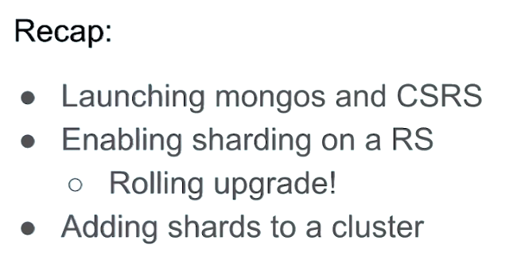

## 7. Examen Setting Up a Sharded Cluster

**Problem:**

What is true about the mongos?

Check all answers that apply:

* The mongos configuration file doesn't need to have a port.

* The mongos configuration file doesn't need to have a dbpath. :+1:

* Users must be created on mongos when auth is enabled.

* The config server configuration files need to specify mongos.

* The mongos configuration file needs to specify the config servers. :+1:

**See detailed answer**

**Correct answers:**

**The mongos configuration file needs to specify the config servers.**

Mongos uses the data from the config servers, so it cannot function without communicating with the CSRS.

**The mongos configuration file doesn't need to have a dbpath.**

Mongos doesn't store any data itself, because all the data it uses is stored on the config servers.

**Incorrect answers:**

**The config server configuration files need to specify mongos.**

Mongos' configuration file references the CSRS or standalone config server; not the other way around.

**Users must be created on mongos when auth is enabled.**

Mongos inherits its users from the config servers.

**The mongos configuration file doesn't need to have a port.**

Every mongos (and mongod) process needs to be assigned a port to run on.

## 8. Laboratorio: configurar un clúster fragmentado

Lab - Configure a Sharded Cluster

**Problem:**

In this lab, you will turn your replica set into one shard in a sharded cluster. To begin your sharded cluster configuration in MongoDB, you will need to do the following:

1. Bring up config servers
2. Bring up mongos
3. Enable sharding on `m103-repl`
4. Add `m103-repl` as the primary shard in the cluster

### 1. Bring up the config server replica set (CSRS)

Config servers store all of the metadata for a sharded cluster, making them a necessary part of any sharded cluster. In this lab you will bring up a replica set of **three** config servers (`m103-csrs`) to store this metadata.

Here are the requirements for all three config servers:

Type | Primary | Secondary | Secondary
-----|---------|-----------|----------
Port | 26001   | 26002     | 26003
DBPath | /var/mongodb/db/csrs1 | /var/mongodb/db/csrs2 | /var/mongodb/db/csrs3
LogPath | /var/mongodb/db/csrs1/mongod.log | /var/mongodb/db/csrs2/mongod.log | /var/mongodb/db/csrs3/mongod.log
replSetName | m103-csrs | m103-csrs | m103-csrs
clusterRole | configsvr | configsvr | configsvr
keyFile | /var/mongodb/pki/m103-keyfile | /var/mongodb/pki/m103-keyfile | /var/mongodb/pki/m103-keyfile

Here is the config file for the **primary** config server:

```sh
sharding:
  clusterRole: configsvr
replication:
  replSetName: m103-csrs
security:
  keyFile: /var/mongodb/pki/m103-keyfile
net:
  bindIp: localhost,192.168.103.100
  port: 26001
systemLog:
  destination: file
  path: /var/mongodb/db/csrs1/mongod.log
  logAppend: true
processManagement:
  fork: true
storage:
  dbPath: /var/mongodb/db/csrs1
```

You may use this config file for your primary config server, but you will need to make two more to complete the replica set.

Notice that the CSRS has the same `keyFile` as the data-bearing replica set `m103-repl`. Because `m103-repl` uses internal keyfile authentication, all other mongod and mongos processes in your cluster must use internal keyfile authentication with the same keyfile.

When initializing `m103-csrs`, remember that keyfile authentication implies client authentication. This means that while no users are configured, the CSRS will only allow connections through the `localhost`.

As a reminder, here are the login credentials of the admin user from previous labs:

* Role: `root` on `admin` database
* Username: `m103-admin`
* Password: `m103-pass`

### 2. Bring up the mongos

Once the CSRS is running, you can start up the mongos process. Here is the config file for the mongos:

```sh
sharding:
  configDB: m103-csrs/192.168.103.100:26001
security:
  keyFile: /var/mongodb/pki/m103-keyfile
net:
  bindIp: localhost,192.168.103.100
  port: 26000
systemLog:
  destination: file
  path: /var/mongodb/db/mongos.log
  logAppend: true
processManagement:
  fork: true
```

If your CSRS already has the `m103-admin` user when mongos is started, mongos will inherit that user. You will be able to authenticate to mongos immediately as `m103-admin`.

### 3. Reconfigure m103-repl

**Note**: Please use the (m103-repl) replica set that you created in *Chapter 2 : Lab - Initiate a Replica Set Locally*

To enable `m103-repl` to be a shard, you must reconfigure the nodes in your replica set with the following lines added to each of their config files:

```sh
sharding:
  clusterRole: shardsvr
storage:
  wiredTiger:
     engineConfig:
        cacheSizeGB: .1
```

The `clusterRole: shardsvr` section tells mongod that the node can be used in a sharded cluster.

The `cacheSizeGB: .1` section restricts the memory usage of each running mongod. Note that this is **not good practice**. However, in order to run a sharded cluster inside a virtual machine with only 2GB of memory, certain adjustments must be made.

All three nodes of the `m103-repl` replica set will need to be restarted with sharding enabled, but given that this is a replica set, you can do this operation without any downtime. This replica set will become the **primary shard** in your sharded cluster.

### 4. Add `m103-repl` as the first shard

Once `m103-repl` has sharding enabled, you can add it as the primary shard with:

```sh
sh.addShard("m103-repl/192.168.103.100:27001")
```

Check the output of `sh.status()` to make sure it's included as a shard.

Now run the validation script in your vagrant and outside the mongo shell and enter the validation key you receive below. If you receive an error, it should give you some idea of what went wrong.

```sh
vagrant@m103:~$ validate_lab_first_sharded_cluster
```

Enter answer here:

## 9. Tema: Config DB

### Notas de lectura

Instrucciones de lectura

Cambie a la configuración DB:

```sh
use config
```

Query `config.databases`:

```sh
db.databases.find().pretty()
```

Query `config.collections`:

```sh
db.collections.find().pretty()
```

Query `config.shards`:

```sh
db.shards.find().pretty()
```

Query `config.chunks`:

```sh
db.chunks.find().pretty()
```

Query `config.mongos`:

```sh
db.mongos.find().pretty()
```

### Transcripción

Muy bien, así que en esta lección, vamos a hablar sobre una base de datos muy importante en el sharded cluster, config database (la base de datos de configuración).

Lo primero que debe saber sobre config database (la base de datos de configuración) es que, por lo general, nunca debe escribirle ningún dato.

MongoDB lo mantiene internamente y se usa internamente.

Por lo tanto, en general, nunca necesitará escribir datos en él.

Sin embargo, tiene información útil, por lo que vamos a leerlo.

Entonces, solo estoy conectado a mongos y estoy ejecutando un rápido `sh.status` en él solo para ver la tipología del grupo fragmentado.

Así que esto nos dará mucha información sobre algunos de los fragmentos, sobre los mongos activos.

Nos dará información sobre la base de datos en nuestro clúster fragmentado.

Pero todos estos datos se almacenan en la base de datos de configuración.

Aquí, y simplemente cambiando a la base de datos de configuración.

Voy a echar un vistazo a las colecciones que tenemos allí.

Estas son todas las colecciones a las que tenemos acceso en la base de datos de configuración.

El primero que veremos es la colección de bases de datos.

Así que aquí, solo estoy imprimiendo los resultados de nuestra consulta de bases de datos.

Entonces esto devolverá cada base de datos en nuestro clúster como un documento.

Nos dará el fragmento primario para cada base de datos, y la partición aquí solo nos dice si se ha habilitado o no el fragmentación en esta base de datos.

En este caso, la base de datos m103 tiene habilitado el fragmentación.

Ahora, eche un vistazo a las colecciones.

Así que esto solo nos dará información sobre colecciones que han sido fragmentadas.

Pero para esas colecciones, nos dirá la clave de fragmento que usamos.

En este caso, la colección de productos m103 fue fragmentada en el precio de venta.

Y también nos dice si esa clave fue única o no.

Este nos va a contar sobre los fragmentos en nuestro grupo.

Y aquí, puede ver que el nombre de host contiene el nombre del conjunto de réplica porque estos fragmentos se implementan como conjuntos de réplica.

La colección de fragmentos es posiblemente la colección más interesante de toda esta base de datos.

Por lo tanto, cada parte de cada colección en esta base de datos se nos devuelve como un documento.

El mínimo inclusivo y el máximo exclusivo definen el rango de fragmentos de los valores de clave de fragmento.

Eso significa que cualquier documento en la colección asociada cuyo valor de clave de fragmento caiga en este rango de fragmentos terminará en este fragmento, y solo en este fragmento.

Entonces esta colección está fragmentada en el precio de venta.

Y vemos que esta porción tiene documentos con valores de precio de venta para una clave minKey de aproximadamente $ 15.

MinKey, aquí, significa el valor más bajo posible del precio de venta o infinito negativo, si desea pensarlo de esa manera.

Esta porción tiene documentos con precios de venta de al menos $ 14.99, pero inferiores a $ 33.99.

Por ejemplo, si tuviera que insertar un documento en esta colección que tuviera un precio de venta de $ 20, terminaría en esta porción.

La base de datos de configuración también contiene información sobre el proceso mongos actualmente conectado a este clúster, porque podemos tener cualquier número de ellos.

Como podemos ver en este momento, solo tenemos uno.

Pero nos dará mucha información al respecto, incluida la versión mongos que se ejecuta en los mongos.

Entonces, para resumir, en esta lección hemos cubierto las colecciones que tenemos en la base de datos de configuración, incluidos, entre otros, fragmentos, fragmentos y mongos.

Pero recuerde, nunca escriba en esta base de datos a menos que se lo indique el soporte de MongoDB o nuestra documentación oficial.

Tiene información útil, pero generalmente está destinada únicamente para uso interno de MongoDB.

## 10. Examen Config DB

**Problem:**

When should you manually write data to the Config DB?

Check all answers that apply:

* When sharding a collection

* When adding a shard

* When removing a shard

* When directed to by MongoDB documentation or Support Engineers :+1:

* When importing a new dataset

**See detailed answer**

The config database is used and maintained internally by MongoDB, and you shouldn't write to it unless directed to by MongoDB Documentation or Support Engineers.

## 11. Tema: Shard Keys

### Notas de lectura

A las 2:35, Ravind menciona que el valor de la shard key(clave de fragmento) es inmutable.

A partir de MongoDB 4.2, el *valor* de la shard key (clave de fragmento) es mutable, aunque la shard key en sí es inmutable. Si está interesado, puede leer más en el [Shard Key documentation](https://docs.mongodb.com/manual/core/sharding-shard-key/index.html).

Instrucciones de lectura

Mostrar colecciones en la base de datos `m103`:


```sh
use m103
show collections
```

Habilite el fragmentación en la base de datos `m103`:

```sh
sh.enableSharding("m103")
```

Encuentre un documento de la colección de `products` para ayudarnos a elegir una shard key:

```sh
db.products.findOne()
```

Crear un índice en `sku`:

```sh
db.products.createIndex( { "sku" : 1 } )
```

Shard la colección de `products` en `sku`:

```sh
sh.shardCollection("m103.products", {"sku" : 1 } )
```

Comprobación del estado del clúster fragmentado:

```sh
sh.status()
```

### Transcripción

En esta lección, vamos a hablar sobre la Shard Keys.

Este es el campo o campos indexados que MongoDB usa para particionar datos en una colección fragmentada y distribuirla entre los fragmentos de su clúster.

Comencemos con cómo se usa la Shard Keys para distribuir sus datos.

Considere una colección con algún número de documentos en ellos.

MongoDB utiliza la Shard Keys para dividir estos documentos en agrupaciones lógicas que MongoDB luego distribuye a través de nuestro clúster fragmentado.

MongoDB se refiere a estas agrupaciones como trozos.

El valor del campo o campos que elegimos como nuestra Shard Key ayuda a definir el límite inferior inclusivo y el límite superior exclusivo de cada fragmento.

Debido a que la Shard Key se usa para definir límites de fragmentos, también define a qué fragmento pertenecerá un documento determinado.

Cada vez que escribe un nuevo documento en la colección, el enrutador Mongo S comprueba qué fragmento contiene el fragmento apropiado para el valor clave de ese documento y dirige el documento solo a ese fragmento.

Así es como los clústeres fragmentados manejan las operaciones de escritura distribuida.

Dependiendo de qué fragmento contiene un fragmento dado, un nuevo documento se enruta al compartido y solo a ese fragmento.

Esto también significa que su clave de fragmento debe estar presente en cada documento de la colección y en cada documento nuevo insertado.

Entonces podría particionar como sku o tipo, pero no imdb ya que ese campo no está incluido en todos los documentos dentro de esta colección.

Las teclas de fragmento también admiten operaciones de lectura distribuida.

Si especifica la clave de fragmento como parte de sus consultas, MongoDB puede redirigir la consulta solo a esos fragmentos y, por lo tanto, a fragmentos que contienen los datos relacionados.

Idealmente, su clave de fragmento debería admitir la mayoría de las consultas que ejecuta en la colección.

De esa manera, la mayoría de sus operaciones de lectura pueden dirigirse a un solo fragmento.

Sin la clave de fragmento en la consulta, el enrutador Mongo S necesitaría verificar cada fragmento en el clúster para encontrar los documentos que coinciden con la consulta.

En una lección posterior abordaremos los detalles de las operaciones dirigidas frente a las de transmisión.

Repasemos algunos aspectos importantes de su Shard Key.

Primero, mencioné anteriormente que la clave de fragmento es un campo o campos de índice en su colección.

Este es un requisito difícil.

No puede seleccionar un campo o campos para su clave de fragmento si no tiene un índice existente para el campo o campos.

Tendrá que crear el índice primero antes de poder particionar.

Sharding es una operación permanente.

Una vez que haya seleccionado su clave de fragmento, eso es todo.

Además, la Shard Key es inmutable.

No solo no puede cambiarlo más tarde, no puede actualizar los valores de clave de fragmento de los campos de clave de fragmento para ningún documento de la colección.

Así que elige con cuidado.

La siguiente lección tiene alguna orientación sobre cómo elegir una buena clave de fragmento, así que estad atentos para eso.

Finalmente, no puedes deshacer una colección.

Este tipo de compilación de claves de fragmentos es inmutable.

Una vez que haya fragmentado una colección, no podrá deshacerla más tarde.

Los pasos para fragmentar son bastante sencillos.

Primero, debe usar sh.enablesharding, que especifica el nombre de la base de datos, para habilitar el fragmentación de la base de datos especificada.

Esto no fragmenta automáticamente sus colecciones.

Simplemente significa que las colecciones en esta base de datos en particular son elegibles para fragmentación.

Esto no afectará a otras bases de datos en su clúster MongoDB.

A continuación, debe crear el índice para respaldar su clave de fragmento para la colección que desea fragmentar, utilizando db.collection.createindex.

Recuerde, vamos a sustituir la colección aquí con el nombre de la colección en la que queremos crear el índice.

Finalmente, vamos a usar sh.shardCollection, especificando la ruta completa a la colección, y la clave de fragmento para fragmentar la Colección especificada. Realmente intentemos esto en acción muy rápido.

Entonces, aquí puede ver que estoy usando el estado sh.status para mostrar que tengo un clúster de dos fragmentos fragmentados.

Actualmente estoy conectado a Mongo S.

Voy a cambiar a la base de datos m103, porque quiero fragmentar la colección de productos en esa base de datos.

Voy a habilitar el fragmentación en la base de datos m103 primero.

Ahora, antes de fragmentar una colección, necesitamos decidir qué clave usaremos.

Estoy usando db.products.find0ne para mostrarle ese documento de la colección de productos.

Voy a usar el campo sku para mi clave de fragmento.

Antes de fragmentar, necesito asegurarme de que la clave o claves seleccionadas que componen mi clave de fragmentación sean compatibles con un índice.

Así que creemos un índice en sku usando db.collection.createindex.

Entonces, aquí, estoy creando el índice en sku, y he especificado ascendente aquí.

No es super importante.

Y puedes ver aquí que ahora tengo este índice adicional en sku.

Recuerde que todas las colecciones tienen un índice de ID por defecto.

Finalmente, voy a fragmentar la colección usando la siguiente que acabo de especificar.

Aquí, tengo el camino completo a la colección de productos, m103.products, y luego la clave de fragmento que quiero usar para esta colección, sky.

Si ejecuto sh.status, ahora puedo ver que el m103.primary Collection tiene una clave de fragmento, y en realidad ya se ha dividido en tres fragmentos separados.

Entonces, si ejecuto sh.status nuevamente, podemos ver ahora que la colección está marcada como fragmentada porque tiene una clave de fragmento.

Mis documentos ya se han dividido en fragmentos y se han distribuido entre los dos fragmentos de mi grupo: dos fragmentos en el fragmento 1, uno en el fragmento 2.

E incluso podemos ver los rangos de valores para cada fragmento.

Para recapitular, su fragmento determina la partición y distribución de datos a través de su clúster fragmentado.

Las teclas de fragmento son inmutables.

No puede cambiarlos después de fragmentar.

Los valores clave de fragmento también son inmutables.

No puede actualizar una clave de fragmento de documento.

Y primero debe crear el índice subyacente antes de fragmentar en el campo o campos indexados.

## 12. Examen Shard Keys

**Problem:**

True or False: Shard keys are mutable.

Choose the best answer:

* False :+1:

* True

**See detailed answer**

Shard keys are immutable. Furthermore, their values are also immutable. Sharding is a permanent operation.

## 13. Tema: Escoger una Buena Shard key

### Transcripción


En la lección anterior, hablamos sobre qué es una clave de fragmento.

Ahora, vamos a hablar sobre lo que hace una buena clave de fragmento.

Primero, recapitulemos.

Habilita el fragmentación en el nivel de la base de datos.

Fragmentos de colecciones.

Habilitar el fragmentación en una base de datos no fragmenta automáticamente las colecciones en esa base de datos.

Y puede tener colecciones fragmentadas y no fragmentadas en la misma base de datos.

No todas las colecciones deben ser iguales.

Primero, hablemos sobre el uso de una clave de fragmento que proporcione una buena distribución correcta.

Estas son las tres propiedades básicas, aquí.

La cardinalidad de los valores de la clave de fragmento, la frecuencia de los valores de la clave de fragmento y si la clave de fragmento aumenta o disminuye monotónicamente.

Vamos a repasar cada uno de estos uno por uno.

La primera es que la clave de fragmento elegida debe tener una alta cardinalidad.

La cardinalidad es la medida del número de elementos dentro de un conjunto de valores.

En el contexto de la clave de fragmento, es el número de valores únicos posibles de clave de fragmento.

Esto es importante por dos razones.

La primera es que si su clave de fragmento admite una pequeña cantidad de valores únicos posibles, entonces eso restringe el número de fragmentos que puede tener en su clúster.

Recuerde, los fragmentos definen límites basados ​​en valores de clave de fragmento, y un valor único solo puede existir en un fragmento.

Digamos que compartimos en un campo cuyos valores son el número de estados en los Estados Unidos de América.

Son 50 estados, 50 valores posibles y un límite superior de 50 fragmentos.

Y, por lo tanto, 50 fragmentos.

Eso es bastante bueno, pero imagínese si nosotros, en cambio, participáramos en los días de la semana.

Ahora tenemos 7 fragmentos.

¿Qué sucede si elegimos una clave de fragmento que era booleana?

Ahora tenemos dos fragmentos.

Tener una mayor cardinalidad te da más trozos, y con más trozos también puede crecer la cantidad de fragmentos, sin restringir tu capacidad de hacer crecer el grupo.

Mencioné dos razones antes.

La segunda razón está relacionada con nuestra próxima propiedad.

La frecuencia de una clave de fragmento representa la frecuencia con la que ocurre un valor único en los datos.

Volviendo al ejemplo de nuestros estados, imagine si tenemos una carga de trabajo donde el 90% del tiempo estamos insertando documentos donde el estado es Nueva York.

Eso significa que el 90% de nuestros datos va a terminar en la porción cuyo rango incluye Nueva York.

Eso no es bueno.

Recuerde que un trozo vive en un solo fragmento.

Así que ahora el 90% de nuestros escritos van a este fragmento que tiene ese fragmento.

Eso es un punto caliente bastante severo, y eso no es lo que queremos.

¿Recuerdas la propiedad de cardinalidad?

A pesar de que los valores para los posibles estados tenían una alta cardinalidad, nuestra carga de trabajo tiene una alta frecuencia, lo que conduce a un mal rendimiento.

Si nuestra carga de trabajo tiene una baja frecuencia de los posibles valores clave de fragmento, entonces la distribución general será más uniforme.

Ahora, si tengo una clave de fragmento de frecuencia muy baja combinada con una cardinalidad muy baja, como los días de la semana, todavía potencialmente tendré problemas.

Entonces, estas dos propiedades trabajan muy juntas.

Finalmente, tenemos que considerar si el fragmento está cambiando monotónicamente o no.

Cambiar monotónicamente aquí significa que los posibles valores clave de fragmento para un nuevo documento cambian a un ritmo constante y predecible.

Piense en un campo que tiene progresión numérica.

Las marcas de tiempo o fechas, por ejemplo, están aumentando monotónicamente.

Del mismo modo, un cronómetro es un valor monotónicamente decreciente.

¿Por qué es esto un problema?

Recuerde que MongoDB divide sus documentos en fragmentos de datos, cada fragmento tiene un límite inferior inclusivo y luego un límite superior exclusivo para valores clave de fragmento.

Todos los documentos que caen dentro del rango de un fragmento se almacenan en ese fragmento.

Si todos sus documentos nuevos tienen un valor de clave de fragmento más alto que el anterior, todos terminarán en ese fragmento que contiene el límite superior de sus posibles valores de clave de fragmento.

Por lo tanto, aunque las marcas de tiempo son técnicamente una cardinalidad muy alta, muchos valores únicos y una frecuencia muy baja, casi ninguna repetición de esos valores únicos, termina siendo una clave de fragmento bastante mala.

Dato curioso, el tipo de datos de ID de objeto en realidad está aumentando monotónicamente.

Es por eso que fragmentar en el campo ID no es una buena idea.

Hay algunos trucos para lograr una distribución uniforme de las claves de fragmentos que cambian monotónicamente, y hablaremos de eso en una lección posterior.

La clave de fragmento ideal proporciona una buena distribución de sus posibles valores, tiene alta cardinalidad, baja frecuencia y cambia de forma no monotónica.

Es más probable que una clave de fragmento que pueda cumplir esas propiedades resulte en una distribución uniforme de los datos escritos.

Tener una clave de fragmento que no cumpla con una de estas propiedades no garantiza una mala distribución de datos, pero no va a ayudar.

Hasta ahora, hemos hablado de propiedades que permiten una buena distribución correcta, pero hay otra cosa a considerar: el aislamiento de lectura.

MongoDB puede enrutar consultas que incluyen la clave de fragmento a fragmentos específicos, cuyo rango contiene los valores de clave de fragmento especificados.

Volviendo a la states example, si mi consulta incluye el estado de Nueva York, MongoDB puede dirigir mi lectura al fragmento que contiene mis datos.

Estas consultas específicas son muy rápidas porque MongoDB solo necesita registrarse con un solo fragmento antes de devolver los resultados.

Al elegir una clave de fragmento, debe considerar si su elección admite las consultas que ejecuta con más frecuencia.

Ahora, es posible que los campos en los que realiza la consulta generen claves de fragmentos bastante malas.

En ese caso, considere especificar un índice compuesto como el índice subyacente para la clave de fragmento, donde el campo o campos adicionales proporcionan alta cardinalidad, baja frecuencia, o no cambian monotónicamente.

Entonces, sin la clave de fragmento para guiarlo, MongoDB tiene que pedirle a cada fragmento que verifique si tiene los datos que estamos buscando.

Estas operaciones de difusión son operaciones de recopilación dispersa y pueden ser bastante lentas.

Repasemos algunas consideraciones sobre la elección de una clave de fragmento.

Ya hemos hablado sobre estos, pero quiero enfatizarlos.

No se puede deshacer una colección una vez fragmentada.

No puede actualizar una clave de fragmento una vez que haya fragmentado una colección.

No puede actualizar los valores de esa clave de fragmento para ningún documento de la colección.

Lo que básicamente significa es que su elección de clave de fragmento es final.

Siempre que sea posible, primero intente probar sus claves de fragmentos en un entorno provisional, antes de fragmentar en entornos de producción.

Si utiliza las utilidades de volcado y restauración de Mongo, puede volcar, descartar y restaurar la colección.

Pero eso no es trivial.

Por lo tanto, de nuevo, siempre que sea posible, realmente desea probar en un entorno de ensayo donde puede soltar y restaurar la colección de forma segura sin afectar las cargas de trabajo de producción.

Recapitulemos.

Las buenas claves de fragmentos proporcionan una distribución correcta y, cuando es posible, un aislamiento de lectura al admitir consultas específicas.

Desea considerar la cardinalidad y la frecuencia de las teclas de fragmento, y evitar cambiar monotónicamente las teclas de fragmento.

Finalmente, recuerde realmente que es difícil desempacar una colección.

Realmente quieres evitarlo.

## 14. Examen Picking a Good Shard Key

**Problem:**

Which of the following are indicators that a field or fields are a good shard key choice?

Check all answers that apply:

* Low Frequency :+1:

* High Cardinality :+1:

* Non-monotonic change :+1:

* Monotonic change

* Indexed

## 15. Tema: Hashed Shard Keys

### Transcripción

Hasta ahora, solo hemos hablado de la clave de fragmento predeterminada.

Sin embargo, hay un tipo adicional de clave de fragmento que es útil para ciertos escenarios.

Esa es la clave de fragmento hash.

Esa es una clave de fragmento donde el índice subyacente se codifica.

Anteriormente, si teníamos un documento donde, digamos que x era 3 y la clave de fragmento estaba en x, MongoDB lo colocaría en el siguiente fragmento donde el valor de 3 cae en el rango troncal.

Con una clave de fragmento hash, MongoDB primero aplica el valor hash 3, luego usa ese valor hash para decidir en qué fragmento colocar el documento.

La clave de fragmento de hash no significa que MongoDB almacena sus valores de clave de fragmento con hash.

Los datos reales permanecen intactos.

En cambio, el índice subyacente que respalda la clave de fragmento en sí es hash.

Y MongoDB usa el índice hash para particionar sus datos, por lo que termina con una distribución más uniforme de sus datos en el clúster fragmentado.

Entonces, ¿cuándo quieres usar una clave de fragmento hash?

En la lección anterior, hablamos sobre el aumento o la disminución monotónica de campos clave de fragmentos, como fechas o marcas de tiempo.

Debido a que estos valores aumentan o disminuyen constantemente en la progresión numérica, obtienes puntos calientes.

Pero el resultado de la función hash puede cambiar drásticamente entre valores que son similares.

Por ejemplo, si tengo dos documentos donde los valores de la clave de fragmento son dos y 3, la función de hash podría generar los valores de la clave de fragmento como 609,000.

Aplique esa misma lógica a una marca de tiempo, dos marcas de tiempo numéricamente adyacentes se mezclarán con valores muy diferentes y, por lo tanto, es más probable que terminen en fragmentos diferentes y fragmentos diferentes.

Ahora hay algunos inconvenientes para usar una clave de fragmento hash.

Dado que ahora todo está en hash, es probable que los documentos dentro de un rango de valores clave de fragmento se distribuyan por completo en el clúster fragmentado.

Por lo tanto, las consultas a distancia en el campo de clave de fragmento ahora tendrán que golpear múltiples fragmentos, en lugar de un solo fragmento.

Comparativamente, es más probable que una clave de fragmento no hash produzca documentos que están en un solo fragmento en un solo fragmento, lo que significa que es más probable que las consultas a distancia se dirijan con una clave de fragmento no hash.

Perderá la capacidad de usar características como el fragmentación de zonas con el propósito de lecturas y escrituras geográficamente aisladas.

Nuevamente, si todo se distribuye aleatoriamente en cada fragmento del clúster, no hay una forma real de aislar los datos en agrupaciones como la geografía.

No puede crear índices compuestos hash.

Solo puede hash una clave de fragmento de campo único.

Eso explica por qué estos se usan mejor para campos únicos que cambian monotónicamente, como las marcas de tiempo.

Además, el valor en el índice hash no debe ser una matriz.

Finalmente, debido a que el índice usa valores hash, perderá el rendimiento que puede proporcionar un índice para ordenar documentos en la clave de fragmento.

Para crear un fragmento hash, comenzará habilitando el fragmentación en la base de datos utilizando sh.enablesharding.

Recuerde, esto no fragmenta automáticamente sus colecciones.

Todavía va a crear un índice, pero ahora va a especificar que es un índice hash en lugar de especificar 1 o 1 negativo como el valor del campo indexado.

Finalmente, va a usar sh.shardcollection, aún especificando la base de datos y la colección, pero va a especificar hash para el valor de la clave de fragmento.

En resumen, las claves de fragmentos hash proporcionan una distribución más uniforme de los datos de un campo de clave de fragmentos que cambia monotónicamente.

Las claves de fragmento de hash no admiten clasificaciones rápidas, consultas específicas en rangos de valores de clave de fragmento o cargas de trabajo aisladas geográficamente.

Finalmente, los índices hash son campos únicos y no admiten matrices.

## 16. Examen Hashed Shard Keys

**Problem:**

Which of the following functions does Hashed Sharding support?

Check all answers that apply:

* Even distribution of a monotonically changing shard key field

* Targeted queries on a range of shard key values

* Even distribution of a monotonically changing shard key field in a compound index

* Fast sorts on the shard key

**See detailed answer**

**Correct answers:**

**Even distribution of a monotonically changing shard key field**

The hash function will scramble shard key values, so values adjacent to each other may be very different after going through the hash function.

**Incorrect answers:**

**Targeted queries on a range of shard key values**

We are less likely to get targeted queries on ranges of shard key values.

**Even distribution of a monotonically changing shard key field in a compound index**

You cannot create a hashed index on multiple fields.

**Fast sorts on the shard key**

Sorts are slower on a hashed index than a normal index.

## 17. Lab - Shard a Collection

Lab - Shard a Collection

**Problem:**

At this point, your cluster is now configured for sharding. You should already have a CSRS, mongos, and primary shard.

In this lab, you will do the following with your cluster:

1. Add a second shard
2. Import a dataset onto your primary shard
3. Choose a shard key and shard your collection

### 1. Adding a Second Shard

Your second shard `m103-repl-2` will be a three-node replica set, just like your primary shard.

You can create the data paths for each node in `m103-repl-2` with the following command:

```sh
mkdir /var/mongodb/db/{4,5,6}
```

Here are the config files for this replica set:

*Node 4:*

```sh
storage:
  dbPath: /var/mongodb/db/4
  wiredTiger:
     engineConfig:
        cacheSizeGB: .1
net:
  bindIp: 192.168.103.100,localhost
  port: 27004
security:
  keyFile: /var/mongodb/pki/m103-keyfile
systemLog:
  destination: file
  path: /var/mongodb/db/4/mongod.log
  logAppend: true
processManagement:
  fork: true
operationProfiling:
  slowOpThresholdMs: 50
replication:
  replSetName: m103-repl-2
sharding:
  clusterRole: shardsvr
```

*Node 5:*

```sh
storage:
  dbPath: /var/mongodb/db/5
  wiredTiger:
     engineConfig:
        cacheSizeGB: .1
net:
  bindIp: 192.168.103.100,localhost
  port: 27005
security:
  keyFile: /var/mongodb/pki/m103-keyfile
systemLog:
  destination: file
  path: /var/mongodb/db/5/mongod.log
  logAppend: true
processManagement:
  fork: true
operationProfiling:
  slowOpThresholdMs: 50
replication:
  replSetName: m103-repl-2
sharding:
  clusterRole: shardsvr
```

*Node 6:*

```sh
storage:
  dbPath: /var/mongodb/db/6
  wiredTiger:
     engineConfig:
        cacheSizeGB: .1
net:
  bindIp: 192.168.103.100,localhost
  port: 27006
security:
  keyFile: /var/mongodb/pki/m103-keyfile
systemLog:
  destination: file
  path: /var/mongodb/db/6/mongod.log
  logAppend: true
processManagement:
  fork: true
operationProfiling:
  slowOpThresholdMs: 50
replication:
  replSetName: m103-repl-2
sharding:
  clusterRole: shardsvr
```

We can now initialize `m103-repl-2` as a normal replica set.

Now exit the mongo shell and connect to mongos. We can add `m103-repl-2` as a shard with the following command:

```sh
sh.addShard("m103-repl-2/192.168.103.100:27004")
```

The output of `sh.status()` should now reflect the new shard.

### 2. Importing Data onto the Primary Shard

The dataset `products.json` is contained in your Vagrant box, in the `/dataset/` directory. You can import this dataset into mongos with the following command:

```sh
mongoimport --drop /dataset/products.json --port 26000 -u "m103-admin" \
-p "m103-pass" --authenticationDatabase "admin" \
--db m103 --collection products
```

You can verify that the entire dataset was imported by querying the `m103` database on mongos. The collection `products` should contain exactly 516784 documents.

### 3. Sharding the Collection

Before you can shard your new `products` collection, you must enable sharding on the `m103` database:

```sh
sh.enableSharding("m103")
```

Once you've done this, it's time to choose a shard key on a single field in the `products` collection. To do this, you should review the qualities of a good shard key in the [docs](https://docs.mongodb.com/manual/core/ranged-sharding/) and the following information about the `products` collection:

* `_id` is a serial number for each product in this collection, rarely used in queries but important for internal MongoDB usage
* `sku` (Stock Keeping Unit) is a randomly generated integer unique to each product - this is commonly used to refer to specific products when updating stock quantities
* `name` is the name of the product as it appears in the store and on the website
* `type` is the type of product, with the possible values "Bundle", "Movie", "Music" and "Software"
* `regularPrice` is the regular price of the product, when there is no sale - this price changes every season
* `salePrice` is the price of a product during a sale - this price changes arbitrarily based on when sales occur
* `shippingWeight` is the weight of the product in kilograms, ranging between 0.01 and 1.00 - this value is not known for every product in the collection

If you want a better understanding of the distribution and the nature of the fields and their types, you can do so using [Compass](https://www.mongodb.com/products/compass).

Once you've chosen a shard key, you must create an index on the shard key field:

```sh
db.products.createIndex({"<shard_key>": 1})
```

Once the index is created, shard the collection with the following command:

```sh
db.adminCommand( { shardCollection: "m103.products", key: { <shard_key>: 1 } } )
```

**Choosing the Correct Shard Key**

Now run the validation script in your vagrant and outside the mongo shell and enter the validation key you receive below:

```sh
vagrant@m103:~$ validate_lab_shard_collection
```

If you chose the wrong shard key, the validation script will give you an error. However, if you already imported the dataset, you must drop the collection and reimport it in order to choose a different shard key.

Enter answer here:

## 18. Tema: Chunks

### Notas de lectura

Instrucciones de lectura

Mostrar colecciones en la base de datos de configuración:

```sh
use config
show collections
```

Encuentre un documento de la chunks collection:


```sh
db.chunks.findOne()
```

Cambiar el chunk size:

```sh
use config
db.settings.save({_id: "chunksize", value: 2})
```

Verifique el estado del sharded cluster:

```sh
sh.status()
```

Importe el nuevo `products.part2` dataset en MongoDB:

```sh
mongoimport /dataset/products.part2.json --port 26000 -u "m103-admin" -p "m103-pass" --authenticationDatabase "admin" --db m103 --collection products
```

### Transcripción

Hasta ahora, hemos estado discutiendo brevemente el término fragmentos de una manera bastante flexible.

Así que tomemos unos minutos para revisar qué son los fragmentos y qué podemos hacer con ellos.

En una conferencia anterior, mencionamos que los servidores de configuración contienen los metadatos del clúster.

Cosas como cuántos fragmentos tenemos, qué bases de datos están fragmentadas y la configuración de nuestro clúster de fragmentos.

Pero una de las piezas de información más importantes que contienen los servidores de configuración es la asignación de fragmentos a fragmentos.

Bien, saltemos a nuestra terminal para ver esto en acción.

Si accedo a la base de datos de configuración y muestro las colecciones, verá una larga lista de diferentes colecciones que contienen información sobre este clúster de fragmentos.

Dentro de la colección de fragmentos, si encontramos un documento, veremos la definición de un fragmento.

En este caso, podemos ver cuál es el espacio de nombres al que pertenece este fragmento.

¿Cuándo se modificó este fragmento por última vez?

¿Qué fragmento contiene este trozo?

Pero lo más importante, podemos ver que el fragmento rebota en los campos Min y max que indican exactamente eso.

Pero retrocedamos un poco.

Una vez que agregamos documentos en nuestras colecciones, estos documentos contienen campos que podemos usar como claves de fragmentos.

Por ejemplo, si decidimos usar el campo x como nuestra clave de fragmento, en el momento en que fragmentamos nuestra colección, definimos inmediatamente un fragmento inicial.

Este fragmento inicial va de minKey a maxKey.

Una cosa importante a tener en cuenta es que el límite inferior de los fragmentos es inclusivo, mientras que el límite superior de los fragmentos es exclusivo.

Los diferentes valores que puede contener nuestra clave de fragmento definirán el espacio de claves de nuestra colección de fragmentos.

A medida que pasa el tiempo, el clúster dividirá ese fragmento inicial en varios otros para permitir que los datos se distribuyan uniformemente entre fragmentos.

Todos los documentos del mismo fragmento viven en el mismo fragmento.

Si tuviéramos solo un fragmento magnánimo, solo podríamos tener un solo fragmento en nuestro clúster.

El número de fragmentos que permite nuestra clave de fragmento puede definir el número máximo de fragmentos de nuestro sistema.

Es por eso que la cardinalidad de la clave de fragmento es un aspecto importante a tener en cuenta.

Hay otros aspectos que determinarán la cantidad de fragmentos dentro de su fragmento.

El primero es nuestro tamaño de fragmento.

Por defecto, MongoDB toma 64 megabytes como el tamaño de fragmento predeterminado.

Eso significa que si un fragmento es de aproximadamente 64 megabytes, o dentro del rango de 64 megatones, se dividirá.

Podemos definir un tamaño de fragmento entre los valores de un megabyte y 1024 y un gigabyte.

El tamaño del fragmento es configurable durante el tiempo de ejecución.

Entonces, si decidimos cambiar un tamaño de fragmento, podemos hacerlo fácilmente.

Pero antes de cambiar el tamaño de nuestro fragmento, echemos un vistazo a cuántos fragmentos tenemos actualmente.

Como puede ver aquí, desde nuestro estado sh., la marca de fragmentos me dice que el fragmento: m103 fragmento 1 tiene dos fragmentos.

Mientras que m103 shard 2 tiene un fragmento.

Pero quiero bajar el tamaño de mi trozo para ver qué pasa.

Para hacer eso, lo que tengo que hacer es, básicamente, ir a mi colección de configuraciones y guardar un documento con el tamaño del fragmento de ID, con el valor determinado que pretendo que sea el tamaño del fragmento, en megabytes.

Una vez que lo he hecho, si corro de nuevo, sh.status, puedo ver que nada ha cambiado.

¿Bien por qué?

Bueno, el componente responsable de la cosa son los mongos, y dado que no hemos dado ninguna indicación o señal a los mongos de que necesita dividir nada, porque no ingresaron datos nuevos, básicamente no hará absolutamente nada.

Si algo funciona, ¿por qué Porter se molesta en tratar de arreglarlo?

Entonces, para que veamos alguna acción, lo que tenemos que hacer es decirle a los mongos que realmente hagan algo.

Así que voy a seguir adelante e importar este otro archivo, productos parte 2 que recientemente cambié, para que pueda ver algo de división.

Una vez que importe estos datos, nos volveremos a conectar para ver si hay más fragmentos.

De acuerdo, dulce.

Así que hemos terminado con nuestras importaciones, así que volvamos a conectarnos.

Y nuevamente, hagamos nuestro sh.status por un segundo.

Dulce.

Ahora tengo muchos más trozos, todavía no están muy bien equilibrados, pero está bien.

Les llevará un tiempo equilibrar todo entre todos los fragmentos.

Pero, lo bueno es que ya no tengo solo uno y dos trozos repartidos en dos fragmentos diferentes.

Tengo alrededor de 51 trozos en este momento.

Y si lo vuelvo a ejecutar, veré que, eventualmente, el sistema estará equilibrado.

Otro aspecto que será importante para la cantidad de fragmentos que podemos generar será la frecuencia de valores de clave de fragmento.

Ahora, consideremos que la clave de fragmento elegida no era tan buena después de todo.

Aunque la cardinalidad inicialmente fue muy buena, tenemos una frecuencia anormal de algunas teclas con el tiempo.

Entonces, digamos, por ejemplo, si el 90% de nuestros nuevos documentos tienen el mismo valor de clave de fragmento, esto podría generar una situación anormal.

¿Qué llamamos trozos jumbo?

Los fragmentos gigantes pueden ser perjudiciales porque son fragmentos que son mucho más grandes que el tamaño predeterminado o definido.

En el momento en que un fragmento se hace más grande que el tamaño del fragmento definido, se marcarán como fragmentos gigantes.

Los trozos gigantes no se pueden mover.

Si el equilibrador ve un fragmento que está marcado como jumbo, ni siquiera intentará equilibrarlo.

Simplemente lo dejará en su lugar, porque básicamente está marcado como demasiado grande para moverlo.

En casos muy extremos, no habrá un punto de división en esos trozos y, por lo tanto, no podrán moverse en absoluto, o incluso dividirse, y eso puede ser una situación muy, muy perjudicial.

Entonces, estén atentos a eso.

Tenga en cuenta la frecuencia de nuestra clave de fragmento para evitar situaciones como trozos jumbo tanto como sea posible.

Entonces, recapitulemos.

Los fragmentos son grupos lógicos de documentos que se basan en el espacio clave de la clave de fragmento y tienen límites asociados.

Límite mínimo, inclusive.

Max encuadernado, exclusivo.

Un fragmento solo puede vivir en un fragmento designado en ese momento.

Y todos los documentos dentro del límite definido por el fragmento viven en el mismo fragmento.

La frecuencia de cardinalidad de la clave de fragmento y el tamaño de fragmento configurado determinarán la cantidad de fragmentos en su colección fragmentada.

## 19. Examen Chunks

**Problem:**

What is true about chunks?

Check all answers that apply:

* Chunk ranges can never change once they are set.

* Increasing the maximum chunk size can help eliminate jumbo chunks. :+1:

* Documents in the same chunk may live on different shards.

* Jumbo chunks can be migrated between shards.

* Chunk ranges have an inclusive minimum and an exclusive maximum. :+1:

**See detailed answer**

**Correct answers:**

**Chunk ranges have an inclusive minimum and an exclusive maximum.**

This is how chunk ranges are defined in MongoDB.

**Increasing the maximum chunk size can help eliminate jumbo chunks.**

By definition, jumbo chunks are larger than the maximum chunk size, so raising the max chunk size can get rid of them.

**Incorrect answers:**

**Chunk ranges can never change once they are set.**

The cluster may split chunks once they become too big.

**Documents in the same chunk may live on different shards.**

Individual chunks always remain on the same shard.

**Jumbo chunks can be migrated between shards.**

Jumbo chunks cannot be migrated to another shard, which is part of the reason why they are so problematic.

## 20. Laboratorio - Documentos en trozos

Lab - Documents in Chunks

**Problem:**

**Lab Prerequisites**

This lab assumes that the `m103.products` collection is sharded on `sku`. If you sharded on `name` instead, you must reimport the dataset and shard it on `sku`. Here are the instructions to do this:

1. Drop the collection `m103.products` and reimport the dataset:

```sh
mongoimport --drop /dataset/products.json --port 26000 -u "m103-admin" \
-p "m103-pass" --authenticationDatabase "admin" \
--db m103 --collection products
```

2. Create an index on `sku`:

```sh
db.products.createIndex({"sku":1})
```

3. Enable sharding on m103 if not enabled:

   `sh.enableSharding("m103")`
   
4. Shard the collection on `sku`:

```sh
db.adminCommand({shardCollection: "m103.products", key: {sku: 1}})
```

Once you've sharded your cluster on `sku`, any queries that use `sku` will be routed by mongos to the correct shards.

**Lab Description**

In this lab, you are going to use the sharded cluster you created earlier in this lesson and derive which chunk a given document resides.

Connect to the `mongos` and authenticate as the `m103-admin` user you created in an earlier lab.

Once connected, execute the following operation:

```sh
db.getSiblingDB("m103").products.find({"sku" : 21572585 })
```

Locate the chunk that the specified document resides on and pass the full chunk ID to the validation script provided in the handout. You need to run the validation script in your vagrant and outside the mongo shell.

**hint** `sh.status()` does not provide the chunk ID that you need to report for this lab. Look in the `config` database for the collection that stores all `chunk` information. Think in ranges - you want to find the chunk whose range is `min <= key < max`.

```sh
vagrant@m103:~$ validate_lab_document_chunks <chunk-id>
```

Enter the validation key you receive below. The script returns verbose errors that should provide you with guidance on what went wrong.

Enter answer here:

## 21. Tema: Balancing (Equilibrio)

### Transcripción

## 22. Examen

## 23. Tema: Consultas en un grupo fragmentado

### Transcripción

## 24. Examen

## 25. Tema: Consultas enrutadas vs Scatter Gather: Parte 1

### Transcripción

## 26. Tema: Consultas enrutadas vs Scatter Gather: Parte 2

### Transcripción

## 27. Examen

## 28. Laboratorio: detección de consultas de recopilación de dispersión


