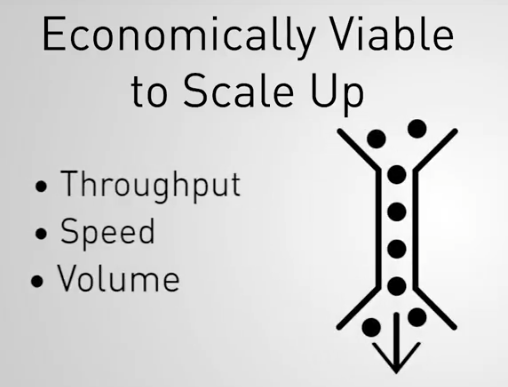
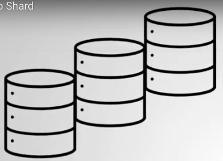

# Capítulo 3: Sharding

### 28 Items

Asignaciones calificadas

## Contenido

1. Tema: ¿Qué es Sharding?
2. Tema: Cuándo fragmentar
3. Examen
4. Tema: Arquitectura de fragmentación
5. Examen
6. Tema: Configuración de un grupo fragmentado
7. Examen
8. Laboratorio: configurar un clúster fragmentado
9. Tema: Config DB
10. Examen
11. Tema: Shard Keys
12. Examen
13. Tema: Escoger una buena clave de fragmento
14. Examen
15. Tema: Hashed Shard Keys
16. Examen
17. Lab - Shard a Collection
18. Tema: trozos
19. Examen
20. Laboratorio - Documentos en trozos
21. Tema: Equilibrio
22. Examen
23. Tema: Consultas en un grupo fragmentado
24. Examen
25. Tema: Consultas enrutadas vs Scatter Gather: Parte 1
26. Tema: Consultas enrutadas vs Scatter Gather: Parte 2
27. Examen
28. Laboratorio: detección de consultas de recopilación de dispersión

## 1. Tema: ¿Qué es Sharding?

### Transcripción

Entonces, hasta este punto, hemos aprendido sobre las implementaciones de MongoDB de tamaños pequeños y medios.

Por lo tanto, es factible almacenar un conjunto de datos completo en un servidor.

En un replica set, tenemos más de un servidor en nuestra base de datos.

Pero cada servidor todavía tiene que contener todo el conjunto de datos.

A medida que nuestro conjunto de datos crece hasta el punto en que nuestras máquinas no pueden atender adecuadamente las aplicaciones de los clientes, una de nuestras opciones es mejorar las máquinas.

Podríamos aumentar la capacidad de las máquinas individuales para que tengan más RAM, o espacio en disco, o tal vez una CPU más potente.

Esto se conoce como **escala vertical**.

Pero esto podría llegar a ser muy costoso.

Y además, los proveedores basados en la nube no nos permitirán escalar verticalmente para siempre.

Eventualmente pondrán un límite a las posibles configuraciones de hardware, lo que limitaría efectivamente nuestra capa de almacenamiento.

**En MongoDB, el escalado se realiza horizontalmente,**

**lo que significa que, en lugar de mejorar las máquinas individuales, **

**simplemente agregamos más máquinas**

**y luego distribuimos el conjunto de datos entre esas máquinas.**

La forma en que distribuimos datos en MongoDB se llama **Sharding**.

Y Sharding nos permite hacer crecer nuestro conjunto de datos sin preocuparnos de poder almacenarlo todo en un servidor.

En su lugar, dividimos el conjunto de datos en partes 

y luego las distribuimos en tantos fragmentos como queramos.

Juntos, los fragmentos forman un Sharded Cluster (clúster fragmentado).

Para garantizar una alta disponibilidad en nuestro Sharded Cluster, implementamos cada fragmento como un replica set.

De esta manera, podemos garantizar un nivel de tolerancia a fallos contra cada pieza de datos, independientemente de qué fragmento contenga realmente esos datos.

Entonces, con nuestros datos distribuidos en varios servidores, las consultas pueden volverse un poco complicadas.

Consultamos nuestra base de datos buscando un documento específico.

Al principio no es obvio dónde buscarlo.

Entonces, entre un Sharded Cluster (clúster fragmentado) y sus clientes, configuramos un tipo de proceso de enrutador que acepta consultas de los clientes y luego determina qué fragmento debe recibir esa consulta.

Ese proceso de enrutador se llama **Mongos**.

Y los clientes se conectan a Mongos en lugar de conectarse a cada fragmento individualmente.

Y tenemos cualquier cantidad de procesos de Mongos para que podamos atender muchas solicitudes o solicitudes diferentes al mismo Sharded Cluster(Clúster fragmentado).

¿Entonces Mongos debe ser bastante pequeño, correcto, para saber dónde está cada dato en un momento dado en un Sharded Cluster masivo?

Pero en realidad, Mongos no sabe nada.

Utiliza los metadatos sobre qué datos están contenidos en cada fragmento.

Y esos metadatos se almacenan en los servidores de configuración.

Pero los datos en los Servidores de Configuración son utilizados muy a menudo por Mongos.

Por lo tanto, debemos asegurarnos de que los datos permanezcan altamente disponibles.

Y probablemente pueda adivinar cómo garantizamos la alta disponibilidad aquí.

Sí, usamos replicación.

Replicamos los datos en los servidores de configuración.

Entonces, en lugar de un único Config Server (servidor de configuración), implementamos un Replica Set del Config Server (servidor de configuración).

Así que esa es una descripción general de alto nivel de Sharding en MongoDB: el Cluster Sharded contiene los fragmentos donde residen los datos; 

los Config Servers (servidores de configuración), que contienen los metadatos de cada fragmento; 

y los Mongos, que encamina las consultas a los fragmentos correctos.

## 2. Tema: Cuándo Fragmentar

### Transcripción

OK, entonces MongoDB puede escalar.

Increíble.

Hagamoslo entonces.

Avancemos y construyamos el clúster escalable desde el principio.

OK.

No tan rápido joven Padawan.

Veamos cuándo definitivamente deberías considerar fragmentar.

Primero, comprendamos qué indicadores debemos verificar para ver si realmente llegamos al momento de fragmentar.

Una de las primeras cosas que debe hacer es verificar si aún es económicamente viable a escala vertical.

Cuando necesitamos abordar un rendimiento de rendimiento o un cuello de botella de volumen, que generalmente son los impulsores técnicos para agregar más recursos a su sistema, 

el primer paso sería verificar si aún podemos agregar más recursos y escalar.

Genial, pero debemos validar que agregar más de esos recursos verticales, como agregar más CPU, red, memoria o disco a sus servidores existentes

, sea económicamente viable y posible.

Entonces, en caso de que tengamos un pequeño conjunto de servidores, 

comprobar que, al aumentar los recursos de la unidad de ese servidor, 

en cualquiera de los cuellos de botella de recursos identificados, 

se obtiene un mayor rendimiento 

con muy poco tiempo de inactividad de una manera económica.

Agregar 10 veces más RAM para resolver un cuello de botella de asignación de memoria no le costará 100 veces más, si ese es el caso, excelente.

Ese debería ser su razonamiento para continuar escalando.

Aún puede hacerlo de manera económica y viable, pero eventualmente llegará a un punto en el que el escalado vertical ya no es económicamente viable o es muy difícil decir que es imposible de lograr.

Digamos que su arquitectura actual depende de servidores que cuestan $100 por hora.

Tiene tres miembros rep cassettes(casetes de representantes), por lo que está sentado encima de $300 por hora.

El siguiente tipo de servidor disponible cuesta $1,000 por hora, 

pero donde su impacto general en el rendimiento es solo de 2x, probablemente no sea una decisión muy acertada.

10 veces el costo por servidor por solo dos veces el rendimiento general.

Probablemente estará mucho mejor con una escala horizontal donde el aumento en el costo será, digamos, tres veces.

Tres servidores más para otro casete de repetición, más tres más para sus servidores de configuración, con un aumento potencial de rendimiento de 2x.

$900 por hora es más aceptable que $3,000 por la misma mejora de rendimiento.

La economía aquí tendrá un peso considerable en su decisión.

Otro aspecto a considerar es el impacto en sus tareas operativas.

Digamos que actualmente está considerando aumentar el tamaño de su discos para permitir pasar de un espacio en disco de 1 terabytes a 20 discos de terabytes.

El propósito de esto es escalar verticalmente sus capacidades de almacenamiento, lo cual está totalmente bien.

Pero si esperamos ejecutarlos al 75% de su capacidad, esto significará cargar hasta 15 terabytes de datos.

Lo que significa 15 veces más datos para respaldar.

Al igual que una cantidad bastante significativa de otros aspectos, esto probablemente significará que tomará 15 veces más tiempo para hacer una copia de seguridad de esos servidores, probablemente una penalización aún mayor al restaurar servidores tan grandes, así como realizar sincronizaciones iniciales entre replica sets.

Y ahora tenemos que tener en cuenta el impacto en la red al hacer una copia de seguridad de esos 15 terabytes de datos.

En tal escenario, tener una escala horizontal y distribuir esa cantidad de datos a través de diferentes shards(fragmentos), 

permitirá obtener ganancias de rendimiento horizontal como la paralelización de los procesos de copia de seguridad, restauración y sincronización inicial.

Recuerde que aunque estas pueden ser operaciones infrecuentes, pueden convertirse en problemas serios de escalabilidad para manejar desde el lado operativo.

Este mismo escenario también afectará su carga de trabajo operativa.

Un conjunto de datos 15 veces mayor 

por MongoDB probablemente se traducirá en índices al menos 15 veces mayores.

Como sabemos, los índices son esenciales para el desempeño de nuestras consultas en una base de datos.

Si ocupan 15 veces más espacio por unidad de procesamiento o servidor, requerirán más RAM para que los índices puedan mantenerse en la memoria.

Una parte muy importante de su conjunto de datos de trabajo.

El aumento del tamaño de sus discos probablemente implicará un aumento eventual del tamaño de su RAM, lo que trae costos adicionales u otros cuellos de botella a su sistema.

En este escenario de fragmentación, la paralelización de su carga de trabajo entre fragmentos podría ser mucho más 

beneficiosa para su aplicación y presupuesto que la cascada de posibles actualizaciones costosas.

Una regla general indica que los servidores individuales deben contener de dos a 5 terabytes de datos.

Más que eso se vuelve demasiado lento para operar.

Finalmente, hay cargas de trabajo que intrínsecamente funcionan mejor en implementaciones distribuidas que comparten ofertas, 

como operaciones de un solo subproceso que pueden ser datos paralelos y distribuidos geográficamente.

Los datos que deben almacenarse en ubicaciones regionales específicas o se beneficiarán de la ubicación conjunta con los clientes que consumen dichos datos.

Como ejemplo de un solo hilo, las operaciones serán los comandos del marco de agregación.

Si su aplicación depende en gran medida de los comandos del marco de agregación y si el tiempo de respuesta de esos comandos se vuelve más lento con el tiempo, debería considerar fragmentar su clúster.

Dicho esto, no todas las etapas de la tubería de agregación son paralelizables.

Por lo tanto, se requiere una comprensión más profunda de su cartera antes de tomar esa decisión.

Puede aprender todo sobre esto en nuestro curso **M121 MongoDB Aggregation Course**.

Así que estad atentos para eso.

Finalmente, los datos geodistribuidos son significativamente simples de administrar usando el fragmentación de zona.

El fragmentación de zonas nos permite distribuir fácilmente los datos que deben ubicarse conjuntamente.

La división de zonas está fuera del alcance de este curso, pero tenga en cuenta que esta es una manera eficiente de administrar conjuntos de datos distribuidos geográficamente.

## 3. Examen

## 4. Tema: Arquitectura de fragmentación

### Transcripción

## 5. Examen

## 6. Tema: Configuración de un grupo fragmentado

### Transcripción

## 7. Examen

## 8. Laboratorio: configurar un clúster fragmentado

## 9. Tema: Config DB

### Transcripción

## 10. Examen

## 11. Tema: Shard Keys

### Transcripción

## 12. Examen

## 13. Tema: Escoger una buena clave de fragmento

### Transcripción

## 14. Examen

## 15. Tema: Hashed Shard Keys

### Transcripción

## 16. Examen

## 17. Lab - Shard a Collection

## 18. Tema: trozos

### Transcripción

## 19. Examen

## 20. Laboratorio - Documentos en trozos

## 21. Tema: Equilibrio

### Transcripción

## 22. Examen

## 23. Tema: Consultas en un grupo fragmentado

### Transcripción

## 24. Examen

## 25. Tema: Consultas enrutadas vs Scatter Gather: Parte 1

### Transcripción

## 26. Tema: Consultas enrutadas vs Scatter Gather: Parte 2

### Transcripción

## 27. Examen

## 28. Laboratorio: detección de consultas de recopilación de dispersión

