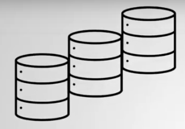
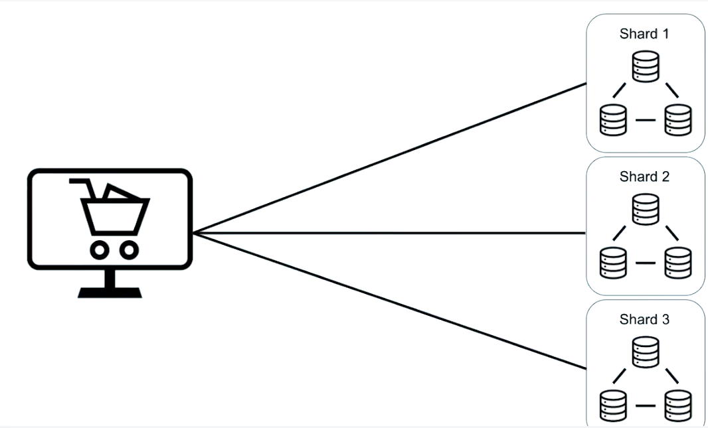
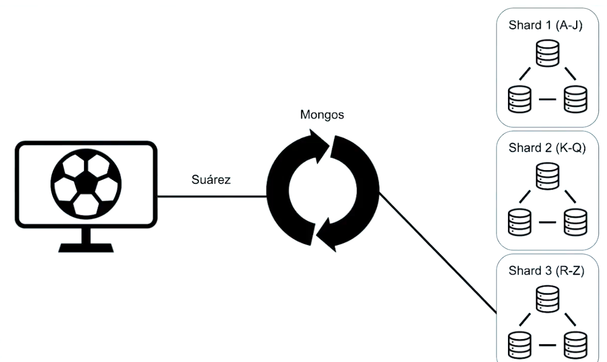
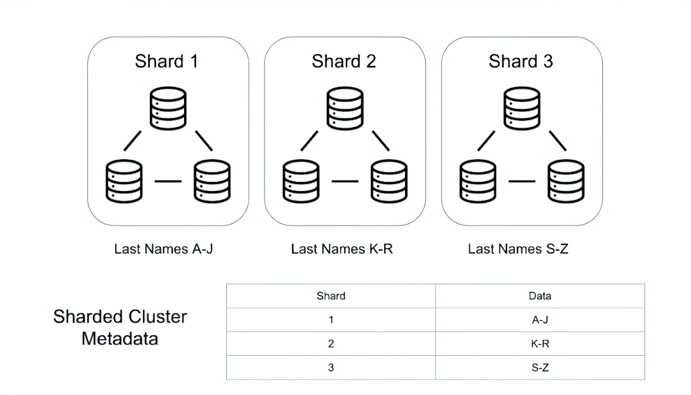

# Capítulo 3: Sharding

### 28 Items

Asignaciones calificadas

## Contenido

1. Tema: ¿Qué es Sharding?
2. Tema: Cuándo fragmentar
3. Examen
4. Tema: Arquitectura de fragmentación
5. Examen
6. Tema: Configuración de un grupo fragmentado
7. Examen
8. Laboratorio: configurar un clúster fragmentado
9. Tema: Config DB
10. Examen
11. Tema: Shard Keys
12. Examen
13. Tema: Escoger una buena clave de fragmento
14. Examen
15. Tema: Hashed Shard Keys
16. Examen
17. Lab - Shard a Collection
18. Tema: trozos
19. Examen
20. Laboratorio - Documentos en trozos
21. Tema: Equilibrio
22. Examen
23. Tema: Consultas en un grupo fragmentado
24. Examen
25. Tema: Consultas enrutadas vs Scatter Gather: Parte 1
26. Tema: Consultas enrutadas vs Scatter Gather: Parte 2
27. Examen
28. Laboratorio: detección de consultas de recopilación de dispersión

## 1. Tema: ¿Qué es Sharding?

### Transcripción

Entonces, hasta este punto, hemos aprendido sobre las implementaciones de MongoDB de tamaños pequeños y medios.

Por lo tanto, es factible almacenar un conjunto de datos completo en un servidor.


En un replica set, tenemos más de un servidor en nuestra base de datos.


Pero cada servidor todavía tiene que contener todo el conjunto de datos.

A medida que nuestro conjunto de datos crece hasta el punto en que nuestras máquinas no pueden atender adecuadamente las aplicaciones de los clientes, una de nuestras opciones es mejorar las máquinas.

Podríamos aumentar la capacidad de las máquinas individuales para que tengan más RAM, o espacio en disco, o tal vez una CPU más potente.


Esto se conoce como **escala vertical**.


Pero esto podría llegar a ser muy costoso.


Y además, los proveedores basados en la nube no nos permitirán escalar verticalmente para siempre.


Eventualmente pondrán un límite a las posibles configuraciones de hardware, lo que limitaría efectivamente nuestra capa de almacenamiento.

**En MongoDB, el escalado se realiza horizontalmente,**


**lo que significa que, en lugar de mejorar las máquinas individuales, **


**simplemente agregamos más máquinas**


**y luego distribuimos el conjunto de datos entre esas máquinas.**


La forma en que distribuimos datos en MongoDB se llama **Sharding**.


Y Sharding nos permite hacer crecer nuestro conjunto de datos sin preocuparnos de poder almacenarlo todo en un servidor.

En su lugar, dividimos el conjunto de datos en partes 


y luego las distribuimos en tantos fragmentos como queramos.


Juntos, los fragmentos forman un Sharded Cluster (clúster fragmentado).


Para garantizar una alta disponibilidad en nuestro Sharded Cluster, implementamos cada fragmento como un replica set.


De esta manera, podemos garantizar un nivel de tolerancia a fallos contra cada pieza de datos, independientemente de qué fragmento contenga realmente esos datos.

Entonces, con nuestros datos distribuidos en varios servidores, las consultas pueden volverse un poco complicadas.

Consultamos nuestra base de datos buscando un documento específico.


Al principio no es obvio dónde buscarlo.

Entonces, entre un Sharded Cluster (clúster fragmentado) y sus clientes, configuramos un tipo de proceso de enrutador que acepta consultas de los clientes y luego determina qué fragmento debe recibir esa consulta.

Ese proceso de enrutador se llama **Mongos**.


Y los clientes se conectan a Mongos en lugar de conectarse a cada fragmento individualmente.

Y tenemos cualquier cantidad de procesos de Mongos para que podamos atender muchas solicitudes o solicitudes diferentes al mismo Sharded Cluster(Clúster fragmentado).


¿Entonces Mongos debe ser bastante pequeño, correcto, para saber dónde está cada dato en un momento dado en un Sharded Cluster masivo?

Pero en realidad, Mongos no sabe nada.

Utiliza los metadatos sobre qué datos están contenidos en cada fragmento.


Y esos metadatos se almacenan en los servidores de configuración.

Pero los datos en los Servidores de Configuración son utilizados muy a menudo por Mongos.


Por lo tanto, debemos asegurarnos de que los datos permanezcan altamente disponibles.

Y probablemente pueda adivinar cómo garantizamos la alta disponibilidad aquí.

Sí, usamos replicación.


Replicamos los datos en los servidores de configuración.

Entonces, en lugar de un único Config Server (servidor de configuración), implementamos un Replica Set del Config Server (servidor de configuración).


Así que esa es una descripción general de alto nivel de Sharding en MongoDB: el Cluster Sharded contiene los fragmentos donde residen los datos; 


los Config Servers (servidores de configuración), que contienen los metadatos de cada fragmento; 


y los Mongos, que encamina las consultas a los fragmentos correctos.


## 2. Tema: Cuándo Fragmentar

### Transcripción

OK, entonces MongoDB puede escalar.


Increíble.

Hagamoslo entonces.

Avancemos y construyamos el clúster escalable desde el principio.

OK.


No tan rápido joven Padawan.


Veamos cuándo definitivamente deberías considerar fragmentar.


Primero, comprendamos qué indicadores debemos verificar para ver si realmente llegamos al momento de fragmentar.


Una de las primeras cosas que debe hacer es verificar si aún es económicamente viable a escala vertical.


Cuando necesitamos abordar un rendimiento de rendimiento o un cuello de botella de volumen, que generalmente son los impulsores técnicos para agregar más recursos a su sistema, 


el primer paso sería verificar si aún podemos agregar más recursos y escalar.


Genial, pero debemos validar que agregar más de esos recursos verticales, como agregar más CPU, red, memoria o disco a sus servidores existentes


, sea económicamente viable y posible.


Entonces, en caso de que tengamos un pequeño conjunto de servidores, 



comprobar que, al aumentar los recursos de la unidad de ese servidor, 


en cualquiera de los cuellos de botella de recursos identificados, 


se obtiene un mayor rendimiento 


con muy poco tiempo de inactividad de una manera económica.


Agregar 10 veces más RAM para resolver un cuello de botella de asignación de memoria no le costará 100 veces más, si ese es el caso, excelente.


Ese debería ser su razonamiento para continuar escalando.

Aún puede hacerlo de manera económica y viable, pero eventualmente llegará a un punto en el que el escalado vertical ya no es económicamente viable o es muy difícil decir que es imposible de lograr.


Digamos que su arquitectura actual depende de servidores que cuestan $100 por hora.

Tiene tres miembros rep cassettes(casetes de representantes), por lo que está sentado encima de $300 por hora.


El siguiente tipo de servidor disponible cuesta $1,000 por hora, 


pero donde su impacto general en el rendimiento es solo de 2x, probablemente no sea una decisión muy acertada.


10 veces el costo por servidor por solo dos veces el rendimiento general.


Probablemente estará mucho mejor con una escala horizontal donde el aumento en el costo será, digamos, tres veces.


Tres servidores más para otro casete de repetición, más tres más para sus servidores de configuración, con un aumento potencial de rendimiento de 2x.

$900 por hora es más aceptable que $3,000 por la misma mejora de rendimiento.


La economía aquí tendrá un peso considerable en su decisión.

Otro aspecto a considerar es el impacto en sus tareas operativas.


Digamos que actualmente está considerando aumentar el tamaño de su discos para permitir pasar de un espacio en disco de 1 terabytes a 20 discos de terabytes.


El propósito de esto es escalar verticalmente sus capacidades de almacenamiento, lo cual está totalmente bien.


Pero si esperamos ejecutarlos al 75% de su capacidad, esto significará cargar hasta 15 terabytes de datos.


Lo que significa 15 veces más datos para respaldar.


Al igual que una cantidad bastante significativa de otros aspectos, esto probablemente significará que tomará 15 veces más tiempo para hacer una copia de seguridad de esos servidores, probablemente una penalización aún mayor al restaurar servidores tan grandes, así como realizar sincronizaciones iniciales entre replica sets.


Y ahora tenemos que tener en cuenta el impacto en la red al hacer una copia de seguridad de esos 15 terabytes de datos.


En tal escenario, tener una escala horizontal y distribuir esa cantidad de datos a través de diferentes shards(fragmentos), 


permitirá obtener ganancias de rendimiento horizontal como la paralelización de los procesos de copia de seguridad, restauración y sincronización inicial.


Recuerde que aunque estas pueden ser operaciones infrecuentes, pueden convertirse en problemas serios de escalabilidad para manejar desde el lado operativo.

Este mismo escenario también afectará su carga de trabajo operativa.


Un conjunto de datos 15 veces mayor 


por MongoDB probablemente se traducirá en índices al menos 15 veces mayores.


Como sabemos, los índices son esenciales para el desempeño de nuestras consultas en una base de datos.

Si ocupan 15 veces más espacio por unidad de procesamiento o servidor, requerirán más RAM para que los índices puedan mantenerse en la memoria.

Una parte muy importante de su conjunto de datos de trabajo.


El aumento del tamaño de sus discos probablemente implicará un aumento eventual del tamaño de su RAM, lo que trae costos adicionales u otros cuellos de botella a su sistema.


En este escenario de fragmentación, la paralelización de su carga de trabajo entre fragmentos podría ser mucho más 


beneficiosa para su aplicación y presupuesto que la cascada de posibles actualizaciones costosas.


Una regla general indica que los servidores individuales deben contener de dos a 5 terabytes de datos.


Más que eso se vuelve demasiado lento para operar.

Finalmente, hay cargas de trabajo que intrínsecamente funcionan mejor en implementaciones distribuidas que comparten ofertas, 


como operaciones de un solo subproceso que pueden ser datos paralelos y distribuidos geográficamente.


Los datos que deben almacenarse en ubicaciones regionales específicas o se beneficiarán de la ubicación conjunta con los clientes que consumen dichos datos.

Como ejemplo de un solo hilo, las operaciones serán los comandos del marco de agregación.


Si su aplicación depende en gran medida de los comandos del marco de agregación 


y si el tiempo de respuesta de esos comandos se vuelve más lento con el tiempo, debería considerar fragmentar(sharding) su clúster.


Dicho esto, no todas las etapas de la tubería de agregación son paralelizables.

Por lo tanto, se requiere una comprensión más profunda de su cartera antes de tomar esa decisión.

Puede aprender todo sobre esto en nuestro curso **M121 MongoDB Aggregation Course**.


Así que estad atentos para eso.

Finalmente, los datos geodistribuidos son significativamente simples de administrar usando el Zone Sharding(fragmentación de zona).


El fragmentación de zonas nos permite distribuir fácilmente los datos que deben ubicarse conjuntamente.

La división de zonas está fuera del alcance de este curso, pero tenga en cuenta que esta es una manera eficiente de administrar conjuntos de datos distribuidos geográficamente.

## 3. Examen When to Shard

**Problem:**

Which of the following scenarios drives us to shard our cluster?

Check all answers that apply:

* When we reach the most powerful servers available, maximizing our vertical scale options. :+1:

* When we start a new project with MongoDB.

* Data sovereignty laws require data to be located in a specific geography. :+1:

* When holding more than 5TB per server and operational costs increase dramatically. :+1:

* When our server disks are full.

See detailed answer

**Correct answers:**

**When we reach the most powerful servers available, maximizing our vertical scale options.**

Sharding can provide an alternative to vertical scaling.

**Data sovereignty laws require data to be located in a specific geography.**

Sharding allows us to store different pieces of data in specific countries or regions.

**When holding more than 5TB per server and operational costs increase dramatically.**

Generally, when our deployment reaches 2-5TB per server, we should consider sharding.

**Incorrect answers:**

**When we start a new project with MongoDB.**

We should carefully consider if we need to have a sharding system out of the start. This might be required for some projects, but certainly not always the ideal moment to address scalability needs.

**When our server disks are full.**

Maxing out the capacity of our disks is not a reason for sharding. Scaling up might make more sense than to add complexity to our system.

## 4. Tema: Sharding Architecture (Arquitectura de Fragmentación)

### Notas de lectura

Alrededor de las 3:25, Matt menciona la etapa `SHARD_MERGE` que tiene lugar en mongos. Esto no es necesariamente cierto: esta etapa puede tener lugar en mongos **o** en un fragmento elegido al azar en el clúster.

### Transcripción

Entonces, en esta lección, vamos a caminar hacia la arquitectura de un sharded cluster.


El aspecto más importante de un sharded cluster es que podemos agregar cualquier cantidad de fragmentos.



Y debido a que podría ser una gran cantidad de fragmentos diferentes, las aplicaciones del cliente no se van a comunicar directamente con los fragmentos.


En cambio, configuramos un tipo de proceso de enrutador llamado mongos.


Luego, el cliente se conecta a mongos, y mongos dirige las consultas a los fragmentos correctos.


Entonces, ¿cómo descubren los mongos exactamente dónde está todo?

Bueno, tiene que entender exactamente cómo se distribuyen los datos.


Entonces, digamos que esta información está en jugadores de fútbol.

Algunos de ustedes pueden conocerlos como jugadores de fútbol.

Dividimos nuestro conjunto de datos en el apellido de cada jugador.

Por lo tanto, los jugadores con apellidos entre A y J se almacenan en el primer fragmento, entre K y Q en el segundo fragmento, y entre R y Z en el tercer fragmento.


Mongos va a necesitar esta información para enrutar consultas al cliente.


Por ejemplo, si el cliente envía una consulta a mongos sobre Luis Suárez, mongos puede usar el apellido Suárez 


para averiguar exactamente qué fragmento contiene el documento de ese jugador y luego enrutar esa consulta al fragmento correcto.



También podemos tener múltiples procesos mongos desde alta disponibilidad con mongos, 


o para dar servicio a múltiples aplicaciones a la vez.


Los procesos mongos utilizarán los metadatos alrededor de las colecciones que se han fragmentado para determinar exactamente dónde enrutar las consultas.


Los metadatos para esta colección se verán así.


Pero los datos no se almacenan en mongos.


En cambio, los metadatos de la colección se almacenan en servidores de configuración, que constantemente realizan un seguimiento de dónde reside cada pieza de datos en el clúster.

Esto es especialmente importante porque la información contenida en cada fragmento puede cambiar con el tiempo.

Entonces mongos consulta los servidores de configuración a menudo, en caso de que se mueva una pieza de datos.


Pero, ¿por qué podría tener que moverse un dato?

Bueno, los servidores de configuración deben asegurarse de que haya una distribución uniforme de los datos en cada parte.

Por ejemplo, si hay muchas personas en nuestra base de datos con el apellido Smith, el tercer fragmento contendrá una cantidad desproporcionadamente grande de datos.


Cuando esto sucede, los servidores de configuración tienen que decidir qué datos se deben mover para que los fragmentos tengan una distribución más uniforme.

En este ejemplo, todos los nombres que comienzan con R no se han movido al segundo fragmento del tercer fragmento, para hacer espacio y tercer fragmento para todas aquellas personas llamadas Smith.


Los servidores de configuración actualizarán los datos que contienen y luego enviarán los datos a los fragmentos correctos.



También existe la posibilidad de que un fragmento crezca demasiado y deba dividirse.


En ese caso, los mongos se partirían la porción.

Hablaremos más sobre esto en la lección sobre **chunks** (trozos).


En el grupo fragmentado, también tenemos esta noción de un fragmento primario.

A cada base de datos se le asignará un Shard primario, y todas las colecciones no fragmentadas en esa base de datos permanecerán en ese Shard.

Recuerde, no todas las colecciones en un clúster fragmentado necesitan ser distribuidas.

Los servidores de configuración asignarán un Shard primario a cada base de datos una vez que se hayan creado.

Pero también podemos cambiar el Shard primario de una base de datos.

Simplemente no vamos a cubrir eso en este curso.

El Shard primario también tiene algunas otras responsabilidades, específicamente en torno a las operaciones de fusión para los comandos de agregación.

Entonces, mientras hablamos de fusionar resultados, solo quiero señalar algo aquí.

En nuestro ejemplo, los datos se organizan en fragmentos por el nombre de cada jugador.

Entonces, si el cliente recibe una consulta sobre la edad de un jugador, no sabe exactamente dónde buscar.


Así que solo va a verificar cada fragmento.

Enviará esta consulta a cada fragmento del clúster.


Y puede encontrar algunos documentos en los diferentes Shards.

Y cada fragmento individual enviará sus resultados a mongos.

Los mongos recopilarán resultados, y luego tal vez los clasifiquen si la consulta así lo exige.

Esta etapa se llama Shard Merge (fusión de fragmentos), y tiene lugar en los mongos.


Una vez que se completa la Shard Merge (fusión de fragmentos), los mongos devolverán los resultados al cliente, pero el cliente no se dará cuenta de nada de esto.

Consultará este proceso como un mongoD normal.

En resumen, en esta lección cubrimos las responsabilidades básicas de los mongos, los metadatos contenidos en los servidores de contacto, y definimos el concepto de un fragmento primario.


## 5. Examen Sharding Architecture

**Problem:**

What is true about the primary shard in a cluster?

Check all answers that apply:

* The role of primary shard is subject to change. :+1:

* Non-sharded collections are placed on the primary shard. :+1:

* Client applications communicate directly with the primary shard.

* The primary shard always has more data than the other shards.

* Shard merges are performed by the mongos. :+1:

**See detailed answer**

**Correct answers:**

**The role of primary shard is subject to change.**

We can manually change the primary shard of a database, if we need to.

**Non-sharded collections are placed on the primary shard.**

Until the collection is sharded, mongos will place it on the primary shard of its database.

**Shard merges are performed by the mongos.**

When documents are fetched from multiple shards, mongos has to gather and organize those documents in a shard_merge.

**Incorrect answers:**

**The primary shard always has more data than the other shards.**

The primary shard may have more data, because non-sharded collections will only exist on the primary shard. But this is not necessarily the case.

**Client applications communicate directly with the primary shard.**

Clients communicate with the mongos, which communicates to the shards in a cluster - this includes the primary shard.

## 6. Tema: Configuración de un Sharded Cluster (Grupo Fragmentado)

### Notas de lectura

Instrucciones de lectura

Archivo de configuración para el primer config server `csrs_1.conf`:

```sh
sharding:
  clusterRole: configsvr
replication:
  replSetName: m103-csrs
security:
  keyFile: /var/mongodb/pki/m103-keyfile
net:
  bindIp: localhost,192.168.103.100
  port: 26001
systemLog:
  destination: file
  path: /var/mongodb/db/csrs1.log
  logAppend: true
processManagement:
  fork: true
storage:
  dbPath: /var/mongodb/db/csrs1
```

`csrs_2.conf`:

```sh
sharding:
  clusterRole: configsvr
replication:
  replSetName: m103-csrs
security:
  keyFile: /var/mongodb/pki/m103-keyfile
net:
  bindIp: localhost,192.168.103.100
  port: 26002
systemLog:
  destination: file
  path: /var/mongodb/db/csrs2.log
  logAppend: true
processManagement:
  fork: true
storage:
  dbPath: /var/mongodb/db/csrs2
```

`csrs_3.conf`:

```sh
sharding:
  clusterRole: configsvr
replication:
  replSetName: m103-csrs
security:
  keyFile: /var/mongodb/pki/m103-keyfile
net:
  bindIp: localhost,192.168.103.100
  port: 26003
systemLog:
  destination: file
  path: /var/mongodb/db/csrs3.log
  logAppend: true
processManagement:
  fork: true
storage:
  dbPath: /var/mongodb/db/csrs3

```

Inicio de los tres servidores de configurados:

```sh
mongod -f csrs_1.conf
mongod -f csrs_2.conf
mongod -f csrs_3.conf
```

Conéctese a uno de los servidores de configuración:

```sh
mongo --port 26001
```

Iniciando el CSRS:

```sh
rs.initiate()
```

Creación de superusuario en CSRS:

```sh
use admin
db.createUser({
  user: "m103-admin",
  pwd: "m103-pass",
  roles: [
    {role: "root", db: "admin"}
  ]
})
```

Autenticando como el super usuario:

```sh
db.auth("m103-admin", "m103-pass")
```

Agregue el segundo y tercer nodo al CSRS:

```sh
rs.add("192.168.103.100:26002")
rs.add("192.168.103.100:26003")
```

Mongos config (mongos.conf):

```sh
sharding:
  configDB: m103-csrs/192.168.103.100:26001,192.168.103.100:26002,192.168.103.100:26003
security:
  keyFile: /var/mongodb/pki/m103-keyfile
net:
  bindIp: localhost,192.168.103.100
  port: 26000
systemLog:
  destination: file
  path: /var/mongodb/db/mongos.log
  logAppend: true
processManagement:
  fork: true
```

Conéctate a mongos:

```sh
vagrant@m103:~$ mongo --port 26000 --username m103-admin --password m103-pass --authenticationDatabase admin
```

Verificar estado del sharding:

```sh
MongoDB Enterprise mongos> sh.status()
```

Actualizar configuración para `node1.conf`:

```sh
sharding:
  clusterRole: shardsvr
storage:
  dbPath: /var/mongodb/db/node1
  wiredTiger:
    engineConfig:
      cacheSizeGB: .1
net:
  bindIp: 192.168.103.100,localhost
  port: 27011
security:
  keyFile: /var/mongodb/pki/m103-keyfile
systemLog:
  destination: file
  path: /var/mongodb/db/node1/mongod.log
  logAppend: true
processManagement:
  fork: true
replication:
  replSetName: m103-repl
```

Actualizar configuración para `node2.conf`:

```sh
sharding:
  clusterRole: shardsvr
storage:
  dbPath: /var/mongodb/db/node2
  wiredTiger:
    engineConfig:
      cacheSizeGB: .1
net:
  bindIp: 192.168.103.100,localhost
  port: 27012
security:
  keyFile: /var/mongodb/pki/m103-keyfile
systemLog:
  destination: file
  path: /var/mongodb/db/node2/mongod.log
  logAppend: true
processManagement:
  fork: true
replication:
  replSetName: m103-repl
```

Actualizar configuración para `node3.conf`:

```sh
sharding:
  clusterRole: shardsvr
storage:
  dbPath: /var/mongodb/db/node3
  wiredTiger:
    engineConfig:
      cacheSizeGB: .1
net:
  bindIp: 192.168.103.100,localhost
  port: 27013
security:
  keyFile: /var/mongodb/pki/m103-keyfile
systemLog:
  destination: file
  path: /var/mongodb/db/node3/mongod.log
  logAppend: true
processManagement:
  fork: true
replication:
  replSetName: m103-repl
```

Conectando directamente al nodo secundario (tenga en cuenta que si se ha realizado una elección en su replica set, el nodo especificado puede haberse convertido en primario):

```sh
mongo --port 27012 -u "m103-admin" -p "m103-pass" --authenticationDatabase "admin"
```

Apagar nodo:

```sh
use admin
db.shutdownServer()
```

Reinicio de nodo con nueva configuración:

```sh
mongod -f node2.conf
```

Deteniendo el primario actual:

```sh
rs.stepDown()
```

Agregar nuevo fragmento al clúster desde mongos:

```sh
sh.addShard("m103-repl/192.168.103.100:27012")
```

### Transcripción

Entonces, ahora que hemos revisado la arquitectura de un sharded cluster (clúster fragmentado) básico MongoDB, en realidad vamos a construir uno en nuestro entorno virtual de curso.

Entonces, en este momento, todo lo que tenemos es un replica set M103 repel.


Este es solo un replica set normal, pero eventualmente se convertirá en el primer shard(fragmento) de nuestro clúster.

Este diagrama es el mínimo requerido para iniciar un sharded cluster(clúster fragmentado), esencialmente, solo los mongos, un config server replica set y al menos un shard.


Las cosas principales que tenemos que construir son el CSRS y los mongos.

El resto del trabajo solo conectará todo junto.

Lo primero que vamos a construir son nuestros config servers(servidores de configuración) **CSRS**.


Entonces este es el archivo de configuración `csrs_1.conf` para uno de nuestros servidores de configuración.

`csrs_1.conf`:

```sh
sharding:
  clusterRole: configsvr
replication:
  replSetName: m103-csrs
security:
  keyFile: /var/mongodb/pki/m103-keyfile
net:
  bindIp: localhost,192.168.103.100
  port: 26001
systemLog:
  destination: file
  path: /var/mongodb/db/csrs1.log
  logAppend: true
processManagement:
  fork: true
storage:
  dbPath: /var/mongodb/db/csrs1
```

Será uno de los nodos en los CSR's, pero es solo un MongoD normal, por lo que seguirá teniendo un puerto(port), una ruta de DB(dbPath) y una log path(ruta de registro).

Ahora los config servers(servidores de configuración) tienen un papel muy importante en el shard cluster(clúster de fragmentos).

Entonces tenemos que especificar, en la configuración `clusterRole: configsvr`, que este es de hecho un servidor de configuración.

Hacemos lo mismo para los otros dos nodos:

`csrs_2.conf`:

```sh
sharding:
  clusterRole: configsvr
replication:
  replSetName: m103-csrs
security:
  keyFile: /var/mongodb/pki/m103-keyfile
net:
  bindIp: localhost,192.168.103.100
  port: 26002
systemLog:
  destination: file
  path: /var/mongodb/db/csrs2.log
  logAppend: true
processManagement:
  fork: true
storage:
  dbPath: /var/mongodb/db/csrs2
```

`csrs_3.conf`:

```sh
sharding:
  clusterRole: configsvr
replication:
  replSetName: m103-csrs
security:
  keyFile: /var/mongodb/pki/m103-keyfile
net:
  bindIp: localhost,192.168.103.100
  port: 26003
systemLog:
  destination: file
  path: /var/mongodb/db/csrs3.log
  logAppend: true
processManagement:
  fork: true
storage:
  dbPath: /var/mongodb/db/csrs3
```

Entonces, aquí, solo voy a usar ese archivo para iniciar un proceso mongoD.

```sh
mongod -f csrs_1.conf
```

Y, aquí, voy a hacer lo mismo para los otros dos nodos en el CSRS.

```sh
mongod -f csrs_2.conf
mongod -f csrs_3.conf
```

Y puede encontrar esos archivos de configuración en las notas de clase.

Se ven muy similares a la primera.

Entonces, habilitamos este replica set para usar la autenticación, y la autenticación del archivo de clave está bien porque ya creamos nuestro archivo de clave.

```sh
mongo --port 26001
```

Vamos a compartir el mismo archivo de clave en esta configuración ya que todas las instancias de mongoD se ejecutan en la misma máquina virtual.

Pero en un entorno de producción real, los certificados X509 serían el camino a seguir.

Tener una contraseña compartida como el archivo de clave, cuando se comparte en varias máquinas, aumenta el riesgo de que ese archivo se vea comprometido.

Así que tenlo en cuenta.

Aquí, solo estoy iniciando el replica set del servidor de configuración.

```sh
rs.initiate()
```

Y aquí, solo uso la excepción localhost para crear nuestro súper usuario.

```sh
use admin
db.createUser({
  user: "m103-admin",
  pwd: "m103-pass",
  roles: [
    {role: "root", db: "admin"}
  ]
})
```

Entonces, ahora me voy a autenticar como el superusuario.

```sh
db.auth("m103-admin", "m103-pass")
```

Uno significa que funcionó.

Y ahora podemos comenzar a agregarlos al conjunto.

```sh
rs.add("192.168.103.100:26002")
rs.add("192.168.103.100:26003")
```

Aquí está nuestro segundo nodo, y nuestro tercero, y ahora tenemos un conjunto completo de réplicas del servidor de configuración.

Solo voy a verificar eso con `rs.ismaster`.

```sh
rs.isMaster()
```

Y parece que el conjunto tiene tres nodos.

Entonces, ahora que tenemos nuestro CSRS en funcionamiento, podemos iniciar mongos y luego apuntar mongos en la dirección de nuestro replica set del servidor de configuración.


Este es el archivo de configuración para mongos `mongos.conf`, y lo primero que notará es que **no hay una ruta de acceso a la base de datos**.

`mongos.conf`:

```sh
sharding:
  configDB: m103-csrs/192.168.103.100:26001,192.168.103.100:26002,192.168.103.100:26003
security:
  keyFile: /var/mongodb/pki/m103-keyfile
net:
  bindIp: localhost,192.168.103.100
  port: 26000
systemLog:
  destination: file
  path: /var/mongodb/db/mongos.log
  logAppend: true
processManagement:
  fork: true
```

Eso es porque mongos no necesita almacenar ningún dato.

Todos los datos utilizados por mongos se almacenan en los servidores de configuración.

Entonces, en la sección de fragmentación, los hemos especificado.

Y tenga en cuenta que especificamos el conjunto completo de réplicas `configDB: m103-csrs/192.168.103.100:26001,192.168.103.100:26002,192.168.103.100:26003` en lugar de los miembros individuales.

También habilitamos la autenticación de archivos clave `keyFile: /var/mongodb/pki/m103-keyfile`, por lo que vamos a necesitar autenticarnos en mongos.

Pero heredará los mismos usuarios que sus servidores de configuración, y lo veremos en un minuto.

Entonces este es el comando que usamos para iniciar mongos.

```sh
mongos -f mongos.conf
```

Pasamos el archivo de configuración, como lo hicimos antes.

Pero, tenga en cuenta que este no es un proceso mongoD.

Mongos es un proceso diferente con diferentes propiedades.

Así que tenlo en cuenta.

Entonces, como vimos antes, mongos ha habilitado la autenticación, y también heredará los usuarios que creamos en los servidores de configuración.

Entonces, este usuario está realmente listo para comenzar.

```sh
vagrant@m103:~$ mongo --port 26000 --username m103-admin --password m103-pass --authenticationDatabase admin
```

Y parece que estamos dentro.

Solo voy a verificar el estado aquí.

```sh
MongoDB Enterprise mongos> sh.status()
```

Entonces, `sh.status` es la forma más básica de obtener datos de fragmentación de mongos.

Y si echamos un vistazo a la salida, podemos ver que tenemos la cantidad de mongos actualmente conectados, y también tenemos la cantidad de fragmentos.

En este momento, esto está vacío porque no tenemos fragmentos.

Pero, probablemente puedas ver a dónde va esto.

En este momento, tenemos un mongos ejecutándose con los servidores de configuración.

Y en realidad también tenemos un replica set que podemos usar.


Solo necesitamos ajustar la configuración para poder usarla como un nodo de fragmento.


Este es el archivo de configuración para el primer nodo en nuestro replica set `node1.conf`, y lo he cambiado ligeramente.

`node1.conf`:

```sh
sharding:
  clusterRole: shardsvr
storage:
  dbPath: /var/mongodb/db/node1
  wiredTiger:
    engineConfig:
      cacheSizeGB: .1
net:
  bindIp: 192.168.103.100,localhost
  port: 27011
security:
  keyFile: /var/mongodb/pki/m103-keyfile
systemLog:
  destination: file
  path: /var/mongodb/db/node1/mongod.log
  logAppend: true
processManagement:
  fork: true
replication:
  replSetName: m103-repl
```

He agregado esta restricción `cacheSizeGB: .1` en el tamaño de caché y gigabytes, porque Vagrant solo tiene permiso para usar dos gigabytes de memoria.

Así que quería reducir el estrés en el entorno general.

Generalmente, esta no es una buena práctica en producción, pero será necesaria una vez que comencemos a agrupar colecciones en este clúster.

Entonces, esta es la línea que tenemos que agregar si queremos habilitar el fragmentación en este nodo.

Esta línea `clusterRole: shardsvr` le dirá a los mongos, oye, sabes que puedes usarme como un nodo de fragmento en tu clúster.

Tenemos que agregar esta línea a cada nodo en la réplica.


`node2.conf`:

```sh
sharding:
  clusterRole: shardsvr
storage:
  dbPath: /var/mongodb/db/node2
  wiredTiger:
    engineConfig:
      cacheSizeGB: .1
net:
  bindIp: 192.168.103.100,localhost
  port: 27012
security:
  keyFile: /var/mongodb/pki/m103-keyfile
systemLog:
  destination: file
  path: /var/mongodb/db/node2/mongod.log
  logAppend: true
processManagement:
  fork: true
replication:
  replSetName: m103-repl
```

`node3.conf`:

```sh
sharding:
  clusterRole: shardsvr
storage:
  dbPath: /var/mongodb/db/node3
  wiredTiger:
    engineConfig:
      cacheSizeGB: .1
net:
  bindIp: 192.168.103.100,localhost
  port: 27013
security:
  keyFile: /var/mongodb/pki/m103-keyfile
systemLog:
  destination: file
  path: /var/mongodb/db/node3/mongod.log
  logAppend: true
processManagement:
  fork: true
replication:
  replSetName: m103-repl
```

Así que acabo de cambiar los archivos de configuración para los tres nodos en nuestro conjunto, pero los nodos aún deben reiniciarse para dar cuenta de esos cambios.

Vamos a hacer una actualización continua para hacerlo.

Lo que significa que vamos a actualizar primero los secundarios, luego volver a subirlos, bajar el primario actual y luego actualizar ese último nodo.

Aquí, solo me estoy conectando a uno de los nodos secundarios.

```sh
mongo --port 27012 -u "m103-admin" -p "m103-pass" --authenticationDatabase "admin"
```

Solo voy a cambiar a la base de datos admin-- y cerrar este nodo.

```sh
use admin
db.shutdownServer()
```

Y aquí, solo estoy comenzando una copia de seguridad con la nueva configuración.

```sh
mongod -f node2.conf
```

Haga lo mismo para nuestro tercer nodo.

```sh
mongo --port 27012 -u "m103-admin" -p "m103-pass" --authenticationDatabase "admin"
use admin
db.shutdownServer()
```


Y aquí, estoy iniciando el tercer nodo con una nueva configuración.

```sh
mongod -f node3.conf

```

Entonces, ahora que ambos secundarios han sido actualizados para la nueva configuración, voy a conectarme al primario y luego lo bajaré para poder actualizar ese también.

```sh
mongo --port 27011 -u "m103-admin" -p "m103-pass" --authenticationDatabase "admin"
```

Voy a forzar una elección para que este nodo se convierta en secundario

```sh
rs.stepDown()
```

, y funcionó.

```sh
```

Ahora voy a cerrar este nodo también.

```sh
use admin

db.shutdownServer()
```

Así que ahora estoy comenzando nuestro último nodo con la nueva configuración, 

```sh
mongod -f node1.conf
```

y funcionó.

```sh

```

Así que ahora hemos habilitado con éxito el fragmentación en este conjunto de réplicas.

Ahora me voy a conectar de nuevo a mongos.

```sh
vagrant@m103:~$ mongo --port 26000 --username m103-admin --password m103-pass --authenticationDatabase admin
```

Entonces, una vez que me conecte de nuevo a mongos, puedo agregar el fragmento en el que solo habilitamos el fragmento.

Y especificamos todo el conjunto de réplicas, por lo que solo necesitamos especificar un nodo para que los mongos descubran el primario actual de este replica set.

```sh
sh.addShard("m103-repl/192.168.103.100:27012")
```

Y, parece que funcionó.

Solo voy a verificar `sh.status`, y nuestra lista de fragmentos ahora tiene un fragmento.

```sh
sh.status()
```

Y como podemos ver, solo especificamos un nodo, pero Mongo pudo descubrir todos los nodos del conjunto.

Entonces, para recapitular aquí, cubrimos cómo iniciar mongos y un replica set del servidor de configuración.

Aprendimos cómo habilitar el fragmentación en un replica set, y lo hicimos a través de una actualización continua.

Y agregamos fragmentos a nuestro grupo.


## 7. Examen Setting Up a Sharded Cluster

**Problem:**

What is true about the mongos?

Check all answers that apply:

* The mongos configuration file doesn't need to have a port.

* The mongos configuration file doesn't need to have a dbpath.

* Users must be created on mongos when auth is enabled.

* The config server configuration files need to specify mongos.

* The mongos configuration file needs to specify the config servers.

## 8. Laboratorio: configurar un clúster fragmentado

## 9. Tema: Config DB

### Transcripción

## 10. Examen

## 11. Tema: Shard Keys

### Transcripción

## 12. Examen

## 13. Tema: Escoger una buena clave de fragmento

### Transcripción

## 14. Examen

## 15. Tema: Hashed Shard Keys

### Transcripción

## 16. Examen

## 17. Lab - Shard a Collection

## 18. Tema: trozos

### Transcripción

## 19. Examen

## 20. Laboratorio - Documentos en trozos

## 21. Tema: Equilibrio

### Transcripción

## 22. Examen

## 23. Tema: Consultas en un grupo fragmentado

### Transcripción

## 24. Examen

## 25. Tema: Consultas enrutadas vs Scatter Gather: Parte 1

### Transcripción

## 26. Tema: Consultas enrutadas vs Scatter Gather: Parte 2

### Transcripción

## 27. Examen

## 28. Laboratorio: detección de consultas de recopilación de dispersión


