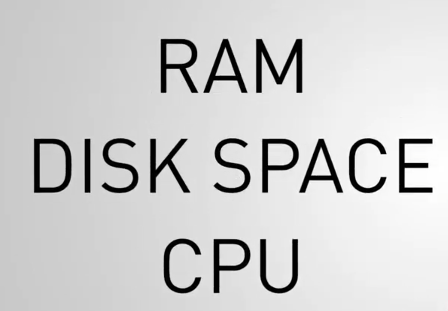
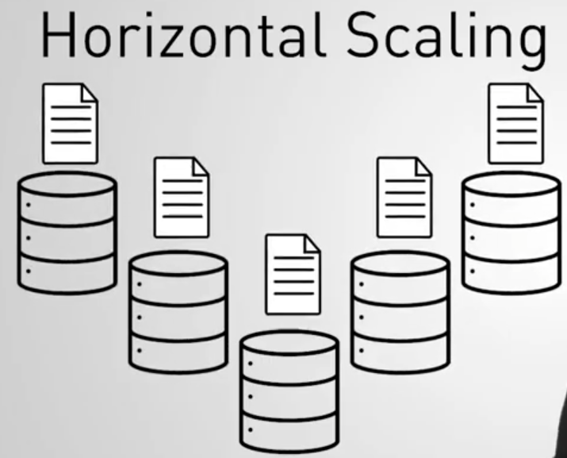

# Capítulo 3: Sharding

### 28 Items

Asignaciones calificadas

## Contenido

1. Tema: ¿Qué es Sharding?
2. Tema: Cuándo fragmentar
3. Examen
4. Tema: Arquitectura de fragmentación
5. Examen
6. Tema: Configuración de un grupo fragmentado
7. Examen
8. Laboratorio: configurar un clúster fragmentado
9. Tema: Config DB
10. Examen
11. Tema: Shard Keys
12. Examen
13. Tema: Escoger una buena clave de fragmento
14. Examen
15. Tema: Hashed Shard Keys
16. Examen
17. Lab - Shard a Collection
18. Tema: trozos
19. Examen
20. Laboratorio - Documentos en trozos
21. Tema: Equilibrio
22. Examen
23. Tema: Consultas en un grupo fragmentado
24. Examen
25. Tema: Consultas enrutadas vs Scatter Gather: Parte 1
26. Tema: Consultas enrutadas vs Scatter Gather: Parte 2
27. Examen
28. Laboratorio: detección de consultas de recopilación de dispersión

## 1. Tema: ¿Qué es Sharding?

### Transcripción

Entonces, hasta este punto, hemos aprendido sobre las implementaciones de MongoDB de tamaños pequeños y medios.

Por lo tanto, es factible almacenar un conjunto de datos completo en un servidor.

En un replica set, tenemos más de un servidor en nuestra base de datos.

Pero cada servidor todavía tiene que contener todo el conjunto de datos.

A medida que nuestro conjunto de datos crece hasta el punto en que nuestras máquinas no pueden atender adecuadamente las aplicaciones de los clientes, una de nuestras opciones es mejorar las máquinas.

Podríamos aumentar la capacidad de las máquinas individuales para que tengan más RAM, o espacio en disco, o tal vez una CPU más potente.

Esto se conoce como **escala vertical**.

Pero esto podría llegar a ser muy costoso.

Y además, los proveedores basados en la nube no nos permitirán escalar verticalmente para siempre.

Eventualmente pondrán un límite a las posibles configuraciones de hardware, lo que limitaría efectivamente nuestra capa de almacenamiento.

**En MongoDB, el escalado se realiza horizontalmente,**

**lo que significa que, en lugar de mejorar las máquinas individuales, **

**simplemente agregamos más máquinas**

**y luego distribuimos el conjunto de datos entre esas máquinas.**

La forma en que distribuimos datos en MongoDB se llama **Sharding**.

Y Sharding nos permite hacer crecer nuestro conjunto de datos sin preocuparnos de poder almacenarlo todo en un servidor.

En su lugar, dividimos el conjunto de datos en partes 

y luego las distribuimos en tantos fragmentos como queramos.

Juntos, los fragmentos forman un Sharded Cluster (clúster fragmentado).

Para garantizar una alta disponibilidad en nuestro Sharded Cluster, implementamos cada fragmento como un replica set.

De esta manera, podemos garantizar un nivel de tolerancia a fallos contra cada pieza de datos, independientemente de qué fragmento contenga realmente esos datos.

Entonces, con nuestros datos distribuidos en varios servidores, las consultas pueden volverse un poco complicadas.

Consultamos nuestra base de datos buscando un documento específico.

Al principio no es obvio dónde buscarlo.

Entonces, entre un Sharded Cluster (clúster fragmentado) y sus clientes, configuramos un tipo de proceso de enrutador que acepta consultas de los clientes y luego determina qué fragmento debe recibir esa consulta.

Ese proceso de enrutador se llama **Mongos**.

Y los clientes se conectan a Mongos en lugar de conectarse a cada fragmento individualmente.

Y tenemos cualquier cantidad de procesos de Mongos para que podamos atender muchas solicitudes o solicitudes diferentes al mismo Sharded Cluster(Clúster fragmentado).

¿Entonces Mongos debe ser bastante pequeño, correcto, para saber dónde está cada dato en un momento dado en un Sharded Cluster masivo?

Pero en realidad, Mongos no sabe nada.

Utiliza los metadatos sobre qué datos están contenidos en cada fragmento.

Y esos metadatos se almacenan en los servidores de configuración.

Pero los datos en los Servidores de Configuración son utilizados muy a menudo por Mongos.

Por lo tanto, debemos asegurarnos de que los datos permanezcan altamente disponibles.

Y probablemente pueda adivinar cómo garantizamos la alta disponibilidad aquí.

Sí, usamos replicación.

Replicamos los datos en los servidores de configuración.

Entonces, en lugar de un único Config Server (servidor de configuración), implementamos un Replica Set del Config Server (servidor de configuración).

Así que esa es una descripción general de alto nivel de Sharding en MongoDB: el Cluster Sharded contiene los fragmentos donde residen los datos; 

los Config Servers (servidores de configuración), que contienen los metadatos de cada fragmento; 

y los Mongos, que encamina las consultas a los fragmentos correctos.

## 2. Tema: Cuándo Fragmentar

### Transcripción

## 3. Examen

## 4. Tema: Arquitectura de fragmentación

### Transcripción

## 5. Examen

## 6. Tema: Configuración de un grupo fragmentado

### Transcripción

## 7. Examen

## 8. Laboratorio: configurar un clúster fragmentado

## 9. Tema: Config DB

### Transcripción

## 10. Examen

## 11. Tema: Shard Keys

### Transcripción

## 12. Examen

## 13. Tema: Escoger una buena clave de fragmento

### Transcripción

## 14. Examen

## 15. Tema: Hashed Shard Keys

### Transcripción

## 16. Examen

## 17. Lab - Shard a Collection

## 18. Tema: trozos

### Transcripción

## 19. Examen

## 20. Laboratorio - Documentos en trozos

## 21. Tema: Equilibrio

### Transcripción

## 22. Examen

## 23. Tema: Consultas en un grupo fragmentado

### Transcripción

## 24. Examen

## 25. Tema: Consultas enrutadas vs Scatter Gather: Parte 1

### Transcripción

## 26. Tema: Consultas enrutadas vs Scatter Gather: Parte 2

### Transcripción

## 27. Examen

## 28. Laboratorio: detección de consultas de recopilación de dispersión

