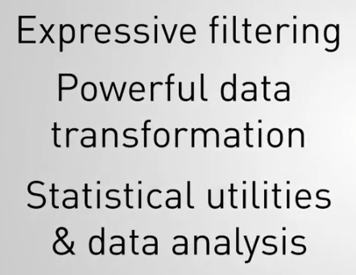
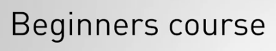

# Chapter 0: Introduction and Aggregation Concepts

## Lecciones

1. Tema: Introducción al MongoDB Aggregation Framework
2. Tema: Atlas Requisitos
3. Tema: El Concepto de Pipelines
4. Examen
5. Tema: Estructura de Aggregation y Sintaxis
6. Examen


## 1. Tema: Introducción al MongoDB Aggregation Framework

### Transcripción

Hola soy Nathan.

Bienvenido a M121, the MongoDB Aggregation Framework.


Seré uno de tus instructores para este curso.

A lo largo de este curso, discutiremos el aggregation framework, una característica clave de MongoDB.


Aprenderá sobre el filtrado expresivo, la poderosa transformación de datos, las utilidades estadísticas 



y el análisis de datos, y cómo hacer mucho más trabajo con una sola operación.


Este curso tiene siete capítulos.

Con cada capítulo, habrá un nuevo conjunto de videos de lecciones.


Después de la mayoría de estas lecciones, habrá un cuestionario para evaluar su aprendizaje del material.


Al final de cada capítulo, habrá un conjunto de ejercicios de laboratorio relacionados.


Repasemos algunos aspectos de la logística del curso.

El público objetivo: este es un curso para principiantes centrado en las prácticas de los desarrolladores.



Si viene de un entorno de operaciones, no tema, joven saltamontes, también tenemos algo para usted.

Se espera que esté familiarizado con el lenguaje de consulta MongoDB.


Si no lo está, le recomendamos que tome nuestro curso definitivo para principiantes, M001, antes de intentar M121.

¿Cómo funciona la calificación?

Hay cuestionarios, laboratorios y un examen final.


Las pruebas no están clasificadas y existen para asegurarse de que comprende el contenido.

Sin embargo, su calificación en la clase se basará en lo bien que le vaya en los laboratorios y en el examen final, 


cada uno de los cuales valdrá el 50% de su calificación total.


Los estudiantes con una calificación de 65% o más recibirán una calificación aprobatoria y obtendrán un certificado de finalización.


Finalmente, le recomiendo que participe en el foro de discusión.


Contamos con asistentes de enseñanza expertos que están allí para responder sus preguntas.

También tenemos sus compañeros de clase que también pueden contribuir a responder sus preguntas y, a menudo, son recursos beneficiosos y bien informados.

Los laboratorios en este curso pueden ser desafiantes.

Según nuestra experiencia, hemos visto que los estudiantes que obtienen mejores resultados en el curso son los que están más activos en el foro de discusión.

Al final de este curso, debe estar familiarizado con la forma de transformar datos, realizar análisis de datos y reasignar el trabajo al servidor desde su aplicación cliente.

Dicho todo esto, nos complace tenerte como estudiante en este curso.

La mejor de las suertes.

## 2. Tema: Atlas Requisitos

### Notas de lectura

Para conectarse al curso M121 [Atlas Cluster](https://www.mongodb.com/cloud/atlas), use el shell mongo, necesitará usar el siguiente comando de conexión:

```sh
mongo "mongodb://cluster0-shard-00-00-jxeqq.mongodb.net:27017,cluster0-shard-00-01-jxeqq.mongodb.net:27017,cluster0-shard-00-02-jxeqq.mongodb.net:27017/aggregations?replicaSet=Cluster0-shard-0" --authenticationDatabase admin --ssl -u m121 -p aggregations --norc
```

Once you've connected, list the existing collections of the aggregations database. Your output should be similar to this one:

Una vez que se haya conectado, enumere las colecciones existentes de la base de datos de `aggregations`. Su salida debe ser similar a esta:

```sh
Cluster0-shard-0:PRIMARY> show collections
air_airlines
air_alliances
air_routes
bronze_banking
customers
employees
exoplanets
gold_banking
icecream_data
movies
nycFacilities
silver_banking
solarSystem
stocks
system.views
```

### Transcripción

Antes de sumergirnos en el curso, analicemos algunos requisitos previos y analicemos la conexión a la infraestructura que respaldará la clase.

Los requisitos previos del curso son mínimos.

Todo lo que se requiere es un sistema operativo moderno de 64 bits y una conexión a Internet y su participación.

Una nota: también deberá poder hacer una conexión TCP en el puerto 27017.

Esto es fácil de probar.

Visita [portquiz.net:27017](http://portquiz.net:27017/).

Debería ver una página que se parece mucho a esto.


Y asegúrese de ver algo como esto `You have reached this page on port 27017.` que dice que ha llegado a esta página en el puerto 27017.

Si no ve esta página, comuníquese con su administrador de red para abrir este puerto.

Además, asegúrese de publicar en los foros para que podamos ayudarlo hasta que se resuelva este problema.

Como ha visto a mí y a otros instructores usar nuevos operadores de agregación a lo largo del curso, le recomendamos que pause el video y lo siga.

Todas las colecciones que realizarán operaciones estarán disponibles para usted en el Class Atlas Cluster.

Entonces, ¿qué es Atlas?

Atlas es el servicio de alojamiento en la nube de MongoDB.

Dejaremos que MongoDB se preocupe por optimizar el almacenamiento, la seguridad y respaldar nuestros datos para este curso.

Registrarse en Atlas es fácil y gratuito.

Visite mongodb.com/cloud/atlas y haga clic en el botón Comenzar gratis.

Después de hacer clic en el botón, complete su información y haga clic en Comenzar gratis nuevamente.

Y por ahora, eso es todo.

Volveremos a visitar Atlas más adelante en el curso.

A continuación, asegurémonos de tener MongoDB instalado.

Visite [mongodb.com](https://www.mongodb.com/) y haga clic en el botón Descargar.

Vaya a Enterprise y seleccione la descarga que sea adecuada para su sistema operativo.

Enterprise es gratis para probar y evaluar, por lo que lo usaremos durante todo el curso.

Mientras se está descargando, hagamos clic en Recursos y [documentación](https://docs.mongodb.com/manual/).

Haga clic en Tutoriales y haga clic en MongoDB Enterprise.

Desplácese hacia abajo y encuentre el [tutorial para instalar MongoDB Enterprise](https://docs.mongodb.com/guides/server/install/) en su sistema operativo específico.

Por último, necesitamos probar nuestra conexión con el class Atlas cluster.

Abra una terminal y pegue la información que encuentre debajo de este video.

```sh
mini-de-adolfo:~ adolfodelarosa$ mongo "mongodb://cluster0-shard-00-00-jxeqq.mongodb.net:27017,cluster0-shard-00-01-jxeqq.mongodb.net:27017,cluster0-shard-00-02-jxemini-de-adolfo:~ adolfodelarosa$ mongo "mongodb://cluster0-shard-00-00-jxeqq.mongodb.net:27017,cluster0-shard-00-01-jxeqq.mongodb.nemini-de-adolfo:~ adolfodelarosa$ mongo "mongodb://cluster0-shard-00-00-jxeqq.mongodb.net:27017,cluster0-shard-00-01-jxeqq.momini-de-adolfo:~ adolfodelarosa$ mongo "mongodb://cluster0-shard-00-00-jxeqq.mongodb.net:27017,cluster0-shard-00-01-jxeqq.mongodb.net:27017,cluster0-shard-00-02-jxeqq.mongodb.net:27017/aggregations?replicaSet=Cluster0-shard-0" --authenticationDatabase admin --ssl -u m121 -p aggregations --norc
2020-03-03T18:20:22.606+0100 W  CONTROL  [main] Option: ssl is deprecated. Please use tls instead.
MongoDB shell version v4.2.2
connecting to: mongodb://cluster0-shard-00-00-jxeqq.mongodb.net:27017,cluster0-shard-00-01-jxeqq.mongodb.net:27017,cluster0-shard-00-02-jxeqq.mongodb.net:27017/aggregations?authSource=admin&compressors=disabled&gssapiServiceName=mongodb&replicaSet=Cluster0-shard-0
2020-03-03T18:20:23.067+0100 I  NETWORK  [js] Starting new replica set monitor for Cluster0-shard-0/cluster0-shard-00-00-jxeqq.mongodb.net:27017,cluster0-shard-00-01-jxeqq.mongodb.net:27017,cluster0-shard-00-02-jxeqq.mongodb.net:27017
2020-03-03T18:20:23.068+0100 I  CONNPOOL [ReplicaSetMonitor-TaskExecutor] Connecting to cluster0-shard-00-01-jxeqq.mongodb.net:27017
2020-03-03T18:20:23.068+0100 I  CONNPOOL [ReplicaSetMonitor-TaskExecutor] Connecting to cluster0-shard-00-00-jxeqq.mongodb.net:27017
2020-03-03T18:20:23.068+0100 I  CONNPOOL [ReplicaSetMonitor-TaskExecutor] Connecting to cluster0-shard-00-02-jxeqq.mongodb.net:27017
2020-03-03T18:20:24.340+0100 I  NETWORK  [ReplicaSetMonitor-TaskExecutor] Confirmed replica set for Cluster0-shard-0 is Cluster0-shard-0/cluster0-shard-00-00-jxeqq.mongodb.net:27017,cluster0-shard-00-01-jxeqq.mongodb.net:27017,cluster0-shard-00-02-jxeqq.mongodb.net:27017
Implicit session: session { "id" : UUID("1a69fa70-7b1a-4b7c-a269-6c49349ce894") }
MongoDB server version: 3.6.17
WARNING: shell and server versions do not match
MongoDB Enterprise Cluster0-shard-0:PRIMARY> 
```

Continúe y escriba `show dbs` para ver todas las bases de datos disponibles en el clúster.

```sh
MongoDB Enterprise Cluster0-shard-0:PRIMARY> show dbs
100YWeatherSmall  0.117GB
admin             0.000GB
aggregations      0.067GB
citibike          0.361GB
city              0.002GB
config            0.018GB
coursera-agg      0.083GB
local             0.881GB
mflix             0.458GB
results           0.000GB
ships             0.001GB
video             0.448GB
MongoDB Enterprise Cluster0-shard-0:PRIMARY> 
```

Escribir `show collections` mostrará las colecciones dentro de la base de datos de `aggregations`.

```sh
MongoDB Enterprise Cluster0-shard-0:PRIMARY> db
aggregations
MongoDB Enterprise Cluster0-shard-0:PRIMARY> show collections
air_airlines
air_alliances
air_routes
bronze_banking
child_reference
customers
employees
exoplanets
gold_banking
icecream_data
movies
nycFacilities
parent_reference
silver_banking
solarSystem
stocks
system.views
MongoDB Enterprise Cluster0-shard-0:PRIMARY> 
```

Y eso es todo con respecto a los requisitos previos del curso para conectarse a Atlas.

## 3. Tema: El Concepto de Pipelines

### Transcripción

Pipelines.

Nos escuchará mencionar los pipelines(tuberías) bastante a lo largo del curso, así que tomemos unos minutos para analizar que son.

Los pipelines pueden considerarse como una cinta transportadora en una fábrica.


A lo largo de la línea, hay diferentes estaciones de montaje.


Estas estaciones de montaje son etapas.


Dependiendo de lo que queramos lograr, podemos tener solo una etapa, o podemos tener muchas etapas.

Los pipelines funcionan así.

Los documentos, representados por estos cuadrados, ingresan a nuestro pipelines y comienzan a fluir hacia nuestra primera etapa.


Esta etapa se llama `$match`, que se presentará muy pronto.


Configuramos esta etapa para que solo pasen los cuadrados rojo y azul.


Luego, fluyen a través de nuestra tubería y entran en la segunda etapa.


En este ejemplo, llamaremos a esta etapa `$project`.


Preparamos esta etapa para transformar nuestros cuadrados en círculos.


Esta es una pequeña representación del poder que ofrece el aggregation framework.


Podemos transformar nuestros datos en casi cualquier forma que deseemos.

Cubriremos la etapa del `$project` con gran detalle en lecciones posteriores.

La etapa 3 representa una de las muchas etapas de análisis potentes disponibles, y se llama `$group`.


Aquí, hemos configurado el escenario para reunir todos los documentos que fluyen hacia él y producir un solo documento que nos da la proporción de círculos rojos a azules.


Cubriremos `$group` y muchas otras poderosas etapas de análisis de datos, más adelante en el curso.

Ahí tienes.

Una descripción general de alto nivel de lo que son los pipelines.

En el nivel más básico, son una composición de etapas, de una a muchas, que podemos organizar y configurar de la forma que más nos guste.

El aggregation framework proporciona muchas etapas que nos permiten filtrar y transformar nuestros datos.

Todo lo que tenemos que hacer es componer el pipeline.

Algunos puntos clave para recordar.

Los pipelines son una composición de etapas.


Las etapas son configurables para producir las transformaciones deseadas.


Los documentos fluyen a través de las etapas como piezas en una línea de ensamblaje o agua a través de una tubería.


Finalmente, con solo unas pocas excepciones, que cubriremos más adelante, las etapas se pueden organizar de la forma que queramos y todas las que necesitemos.


## 4. Examen The Concept of Pipelines

**Problem:**

Which of the following is true about pipelines and the Aggregation Framework?

Check all answers that apply:

* Documents flow through the pipeline, passing from one stage to the next :+1:

* Pipelines must consist of at least two stages.

* Stages cannot be configured to produce our desired output.

* The Aggregation Framework provides us many stages to filter and transform our data :+1:

## 5. Tema: Estructura de Aggregation y Sintaxis

### Notas de lectura

[Aggregation Pipeline Quick Reference](https://docs.mongodb.com/manual/meta/aggregation-quick-reference/)

### Transcripción

## 6. Examen
