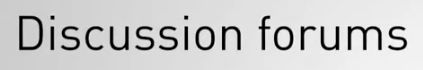

# Chapter 0: Introduction and Aggregation Concepts

## Lecciones

1. Tema: Introducción al MongoDB Aggregation Framework
2. Tema: Atlas Requisitos
3. Tema: El Concepto de Pipelines
4. Examen
5. Tema: Estructura de Aggregation y Sintaxis
6. Examen


## 1. Tema: Introducción al MongoDB Aggregation Framework

### Transcripción

Hola soy Nathan.

Bienvenido a M121, the MongoDB Aggregation Framework.


Seré uno de tus instructores para este curso.

A lo largo de este curso, discutiremos el aggregation framework, una característica clave de MongoDB.


Aprenderá sobre el filtrado expresivo, la poderosa transformación de datos, las utilidades estadísticas 


y el análisis de datos, y cómo hacer mucho más trabajo con una sola operación.


Este curso tiene siete capítulos.

Con cada capítulo, habrá un nuevo conjunto de videos de lecciones.


Después de la mayoría de estas lecciones, habrá un cuestionario para evaluar su aprendizaje del material.


Al final de cada capítulo, habrá un conjunto de ejercicios de laboratorio relacionados.


Repasemos algunos aspectos de la logística del curso.

El público objetivo: este es un curso para principiantes centrado en las prácticas de los desarrolladores.


Si viene de un entorno de operaciones, no tema, joven saltamontes, también tenemos algo para usted.

Se espera que esté familiarizado con el lenguaje de consulta MongoDB.


Si no lo está, le recomendamos que tome nuestro curso definitivo para principiantes, M001, antes de intentar M121.

¿Cómo funciona la calificación?

Hay cuestionarios, laboratorios y un examen final.


Las pruebas no están clasificadas y existen para asegurarse de que comprende el contenido.

Sin embargo, su calificación en la clase se basará en lo bien que le vaya en los laboratorios y en el examen final, 


cada uno de los cuales valdrá el 50% de su calificación total.


Los estudiantes con una calificación de 65% o más recibirán una calificación aprobatoria y obtendrán un certificado de finalización.


Finalmente, le recomiendo que participe en el foro de discusión.



Contamos con asistentes de enseñanza expertos que están allí para responder sus preguntas.

También tenemos sus compañeros de clase que también pueden contribuir a responder sus preguntas y, a menudo, son recursos beneficiosos y bien informados.

Los laboratorios en este curso pueden ser desafiantes.

Según nuestra experiencia, hemos visto que los estudiantes que obtienen mejores resultados en el curso son los que están más activos en el foro de discusión.

Al final de este curso, debe estar familiarizado con la forma de transformar datos, realizar análisis de datos y reasignar el trabajo al servidor desde su aplicación cliente.

Dicho todo esto, nos complace tenerte como estudiante en este curso.

La mejor de las suertes.

## 2. Tema: Atlas Requisitos

### Notas de lectura

Para conectarse al curso M121 [Atlas Cluster](https://www.mongodb.com/cloud/atlas), use el shell mongo, necesitará usar el siguiente comando de conexión:

```sh
mongo "mongodb://cluster0-shard-00-00-jxeqq.mongodb.net:27017,cluster0-shard-00-01-jxeqq.mongodb.net:27017,cluster0-shard-00-02-jxeqq.mongodb.net:27017/aggregations?replicaSet=Cluster0-shard-0" --authenticationDatabase admin --ssl -u m121 -p aggregations --norc
```

Once you've connected, list the existing collections of the aggregations database. Your output should be similar to this one:

Una vez que se haya conectado, enumere las colecciones existentes de la base de datos de `aggregations`. Su salida debe ser similar a esta:

```sh
Cluster0-shard-0:PRIMARY> show collections
air_airlines
air_alliances
air_routes
bronze_banking
customers
employees
exoplanets
gold_banking
icecream_data
movies
nycFacilities
silver_banking
solarSystem
stocks
system.views
```

### Transcripción

## 3. Tema: El Concepto de Pipelines

### Transcripción

## 4. Examen

## 5. Tema: Estructura de Aggregation y Sintaxis

### Notas de lectura

[Aggregation Pipeline Quick Reference](https://docs.mongodb.com/manual/meta/aggregation-quick-reference/)

### Transcripción

## 6. Examen
