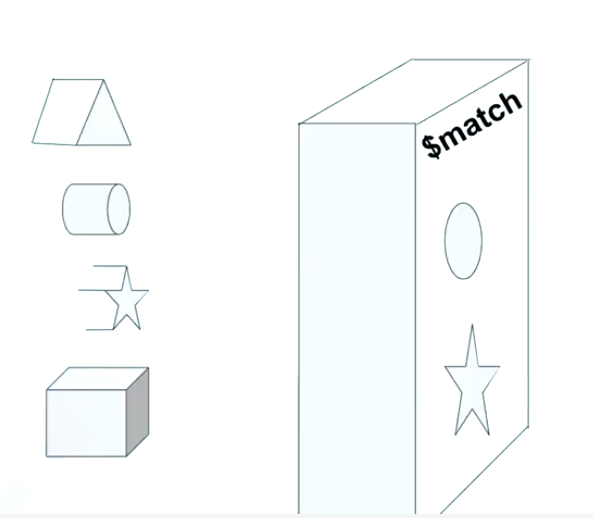
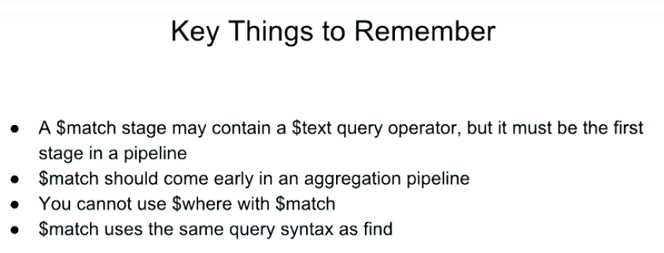

# Capítulo 1: Aggregation Básica: `$match` y `$project`

### Lecciones

1. Tema: `$match`: Filtrado de documentos
2. Examen
3. Tema: Laboratorio - `$match`
4. Tareas
5. Tema: Dar forma a documentos con `$project`
6. Examen
7. Laboratorio: Cambio de la forma del documento con `$project`
8. Laboratorio - Campos Computados
9. Tema: Laboratorio opcional: Expresiones con `$project`
10. Examen

## 1. Tema: `$match`: Filtrado de Documentos

### Notas de lectura

[Página de documentación de `$match`](https://docs.mongodb.com/manual/reference/operator/aggregation/match/).

### Transcripción

Ahora que hemos discutido el concepto de qué son los pipelines, y le hemos dado una descripción general de la aggregation, la estructura y la sintaxis, es hora de que aprendamos sobre una de las etapas más importantes, `$match`.

El estado `$match` es vital para una pipeline exitoso.

Debería venir lo antes posible.

Y es libre de utilizar tantos cambios de `$match` como sea necesario en su pipeline.

Aquí hay una sintaxis básica para `$match`.

```sh
db.solarSystem.aggregate([{
  "$match": {  }
}])
```

Como es un operador de agregación, anteponemos un signo de dólar al nombre.

Nuevamente, `$match` se puede usar varias veces.

Y prácticamente cualquier otra etapa se puede usar después, con algunas excepciones que cubriremos más adelante en el curso.

Para comprender `$match` y el contexto de una aggregation pipeline, lo invito a pensar en `$match` como un filtro, en lugar de un find.



Configuramos los filtros en nuestra etapa `$match`.

Y a medida que fluyen los documentos, solo aquellos que cumplen con nuestros criterios se pasan más lejos en el pipeline.

Aquí, nuestra etapa `$match` solo dejará pasar círculos y estrellas.

`$match` utiliza la sintaxis de consulta de operación de lectura MongoDB estándar.


Podemos realizar coincidencias basadas en la comparación, la lógica, los arrays y mucho más.

**Las únicas limitaciones son que no podemos usar el operador `$where`**.

**Y si queremos usar un operador `$test`, la etapa `$match` debe ser la primera etapa en una tubería**.

Si `$match` es la primera etapa, puede aprovechar los índices, lo que aumenta la velocidad de nuestras consultas.

Nuevamente, `$match` debería llegar temprano en nuestros pipelines.

Como recordatorio y como referencia, puede encontrar un enlace a esta página en las Notas de la Lección.

Lo alentamos a marcar esta página como referencia futura.

Aquí hay un ejemplo de `$match` en uso.

```sh
// $match all celestial bodies, not equal to Star
db.solarSystem.aggregate([{
  "$match": { "type": { "$ne": "Star" } }
}]).pretty()
```

Si le pregunto la siguiente agregación, que filtra la colección `solarSystem`, permitiendo solo documentos con tipos que no son iguales.

Entro a mongo:

```sh
mini-de-adolfo:~ adolfodelarosa$ mongo "mongodb://cluster0-shard-00-00-jxeqq.mongodb.net:27017,cluster0-shard-00-01-jxeqq.mongodb.net:27017,cluster0-shard-00-02-jxeqq.mongodb.net:27017/aggregations?replicaSet=Cluster0-shard-0" --authenticationDatabase admin --ssl -u m121 -p aggregations --norc
....

MongoDB Enterprise Cluster0-shard-0:PRIMARY> 
```

Ejecutamos el comando y puedo ver que obtengo los resultados que esperaba.

```sh
MongoDB Enterprise Cluster0-shard-0:PRIMARY> db.solarSystem.aggregate([{
...   "$match": { "type": { "$ne": "Star" } }
... }]).pretty()
{
	"_id" : ObjectId("59a06674c8df9f3cd2ee7d58"),
	"name" : "Uranus",
	"type" : "Gas giant",
	"orderFromSun" : 7,
	"radius" : {
		"value" : 25559,
		"units" : "km"
	},
	"mass" : {
		"value" : 8.6813e+25,
		"units" : "kg"
	},
	"sma" : {
		"value" : 2872460000,
		"units" : "km"
	},
	"orbitalPeriod" : {
		"value" : 84.01,
		"units" : "years"
	},
	"eccentricity" : 0.0457,
	"meanOrbitalVelocity" : {
		"value" : 6.8,
		"units" : "km/sec"
	},
	"rotationPeriod" : {
		"value" : 0.72,
		"units" : "days"
	},
	"inclinationOfAxis" : {
		"value" : 97.77,
		"units" : "degrees"
	},
	"meanTemperature" : -200,
	"gravity" : {
		"value" : 8.87,
		"units" : "m/s^2"
	},
	"escapeVelocity" : {
		"value" : 21.3,
		"units" : "km/sec"
	},
	"meanDensity" : 1.271,
	"atmosphericComposition" : "H2+He",
	"numberOfMoons" : 27,
	"hasRings" : true,
	"hasMagneticField" : true
}
{
	"_id" : ObjectId("59a06674c8df9f3cd2ee7d52"),
	"name" : "Mercury",
	"type" : "Terrestrial planet",
	"orderFromSun" : 1,
	"radius" : {
		"value" : 4879,
		"units" : "km"
	},
	"mass" : {
		"value" : 3.3e+23,
		"units" : "kg"
	},
	"sma" : {
		"value" : 57910000,
		"units" : "km"
	},
	"orbitalPeriod" : {
		"value" : 0.24,
		"units" : "years"
	},
	"eccentricity" : 0.2056,
	"meanOrbitalVelocity" : {
		"value" : 47.36,
		"units" : "km/sec"
	},
	"rotationPeriod" : {
		"value" : 58.65,
		"units" : "days"
	},
	"inclinationOfAxis" : {
		"value" : 0,
		"units" : "degrees"
	},
	"meanTemperature" : 125,
	"gravity" : {
		"value" : 3.24,
		"units" : "m/s^2"
	},
	"escapeVelocity" : {
		"value" : 4.25,
		"units" : "km/sec"
	},
	"meanDensity" : 5.43,
	"atmosphericComposition" : "",
	"numberOfMoons" : 0,
	"hasRings" : false,
	"hasMagneticField" : true
}
{
	"_id" : ObjectId("59a06674c8df9f3cd2ee7d54"),
	"name" : "Earth",
	"type" : "Terrestrial planet",
	"orderFromSun" : 3,
	"radius" : {
		"value" : 6378.137,
		"units" : "km"
	},
	"mass" : {
		"value" : 5.9723e+24,
		"units" : "kg"
	},
	"sma" : {
		"value" : 149600000,
		"units" : "km"
	},
	"orbitalPeriod" : {
		"value" : 1,
		"units" : "years"
	},
	"eccentricity" : 0.0167,
	"meanOrbitalVelocity" : {
		"value" : 29.78,
		"units" : "km/sec"
	},
	"rotationPeriod" : {
		"value" : 1,
		"units" : "days"
	},
	"inclinationOfAxis" : {
		"value" : 23.45,
		"units" : "degrees"
	},
	"meanTemperature" : 15,
	"gravity" : {
		"value" : 9.8,
		"units" : "m/s^2"
	},
	"escapeVelocity" : {
		"value" : 11.18,
		"units" : "km/sec"
	},
	"meanDensity" : 5.52,
	"atmosphericComposition" : "N2+O2",
	"numberOfMoons" : 1,
	"hasRings" : false,
	"hasMagneticField" : true
}
{
	"_id" : ObjectId("59a06674c8df9f3cd2ee7d56"),
	"name" : "Jupiter",
	"type" : "Gas giant",
	"orderFromSun" : 5,
	"radius" : {
		"value" : 71492,
		"units" : "km"
	},
	"mass" : {
		"value" : 1.89819e+27,
		"units" : "kg"
	},
	"sma" : {
		"value" : 778570000,
		"units" : "km"
	},
	"orbitalPeriod" : {
		"value" : 11.86,
		"units" : "years"
	},
	"eccentricity" : 0.0489,
	"meanOrbitalVelocity" : {
		"value" : 13.06,
		"units" : "km/sec"
	},
	"rotationPeriod" : {
		"value" : 0.41,
		"units" : "days"
	},
	"inclinationOfAxis" : {
		"value" : 3.08,
		"units" : "degrees"
	},
	"meanTemperature" : -150,
	"gravity" : {
		"value" : 24.79,
		"units" : "m/s^2"
	},
	"escapeVelocity" : {
		"value" : 59.5,
		"units" : "km/sec"
	},
	"meanDensity" : 1.33,
	"atmosphericComposition" : "H2+He",
	"numberOfMoons" : 67,
	"hasRings" : true,
	"hasMagneticField" : true
}
{
	"_id" : ObjectId("59a06674c8df9f3cd2ee7d53"),
	"name" : "Venus",
	"type" : "Terrestrial planet",
	"orderFromSun" : 2,
	"radius" : {
		"value" : 6051.8,
		"units" : "km"
	},
	"mass" : {
		"value" : 4.8675e+24,
		"units" : "kg"
	},
	"sma" : {
		"value" : 108210000,
		"units" : "km"
	},
	"orbitalPeriod" : {
		"value" : 0.615,
		"units" : "years"
	},
	"eccentricity" : 0.0067,
	"meanOrbitalVelocity" : {
		"value" : 35.02,
		"units" : "km/sec"
	},
	"rotationPeriod" : {
		"value" : 243.69,
		"units" : "days"
	},
	"inclinationOfAxis" : {
		"value" : 177.36,
		"units" : "degrees"
	},
	"meanTemperature" : 465,
	"gravity" : {
		"value" : 8.87,
		"units" : "m/s^2"
	},
	"escapeVelocity" : {
		"value" : 10.36,
		"units" : "km/sec"
	},
	"meanDensity" : 5.25,
	"atmosphericComposition" : "CO2",
	"numberOfMoons" : 0,
	"hasRings" : false,
	"hasMagneticField" : false
}
{
	"_id" : ObjectId("59a06674c8df9f3cd2ee7d55"),
	"name" : "Mars",
	"type" : "Terrestrial planet",
	"orderFromSun" : 4,
	"radius" : {
		"value" : 3396.2,
		"units" : "km"
	},
	"mass" : {
		"value" : 6.4171e+23,
		"units" : "kg"
	},
	"sma" : {
		"value" : 227920000,
		"units" : "km"
	},
	"orbitalPeriod" : {
		"value" : 1.881,
		"units" : "years"
	},
	"eccentricity" : 0.0935,
	"meanOrbitalVelocity" : {
		"value" : 24.07,
		"units" : "km/sec"
	},
	"rotationPeriod" : {
		"value" : 1.029,
		"units" : "days"
	},
	"inclinationOfAxis" : {
		"value" : 25.19,
		"units" : "degrees"
	},
	"meanTemperature" : -53,
	"gravity" : {
		"value" : 3.71,
		"units" : "m/s^2"
	},
	"escapeVelocity" : {
		"value" : 5.03,
		"units" : "km/sec"
	},
	"meanDensity" : 3.93,
	"atmosphericComposition" : "CO2",
	"numberOfMoons" : 2,
	"hasRings" : false,
	"hasMagneticField" : false
}
{
	"_id" : ObjectId("59a06674c8df9f3cd2ee7d57"),
	"name" : "Saturn",
	"type" : "Gas giant",
	"orderFromSun" : 6,
	"radius" : {
		"value" : 60268,
		"units" : "km"
	},
	"mass" : {
		"value" : 5.6834e+26,
		"units" : "kg"
	},
	"sma" : {
		"value" : 1433530000,
		"units" : "km"
	},
	"orbitalPeriod" : {
		"value" : 29.457,
		"units" : "years"
	},
	"eccentricity" : 0.0566,
	"meanOrbitalVelocity" : {
		"value" : 9.68,
		"units" : "km/sec"
	},
	"rotationPeriod" : {
		"value" : 0.445,
		"units" : "days"
	},
	"inclinationOfAxis" : {
		"value" : 26.73,
		"units" : "degrees"
	},
	"meanTemperature" : -170,
	"gravity" : {
		"value" : 10.44,
		"units" : "m/s^2"
	},
	"escapeVelocity" : {
		"value" : 35.5,
		"units" : "km/sec"
	},
	"meanDensity" : 0.687,
	"atmosphericComposition" : "H2+He",
	"numberOfMoons" : 62,
	"hasRings" : true,
	"hasMagneticField" : true
}
{
	"_id" : ObjectId("59a06674c8df9f3cd2ee7d59"),
	"name" : "Neptune",
	"type" : "Gas giant",
	"orderFromSun" : 8,
	"radius" : {
		"value" : 24765,
		"units" : "km"
	},
	"mass" : {
		"value" : 1.02413e+26,
		"units" : "kg"
	},
	"sma" : {
		"value" : 4495060000,
		"units" : "km"
	},
	"orbitalPeriod" : {
		"value" : 164.79,
		"units" : "years"
	},
	"eccentricity" : 0.0113,
	"meanOrbitalVelocity" : {
		"value" : 5.43,
		"units" : "km/sec"
	},
	"rotationPeriod" : {
		"value" : 0.72,
		"units" : "days"
	},
	"inclinationOfAxis" : {
		"value" : 28.8,
		"units" : "degrees"
	},
	"meanTemperature" : -210,
	"gravity" : {
		"value" : 11.15,
		"units" : "m/s^2"
	},
	"escapeVelocity" : {
		"value" : 23.5,
		"units" : "km/sec"
	},
	"meanDensity" : 1.638,
	"atmosphericComposition" : "H2+He",
	"numberOfMoons" : 14,
	"hasRings" : true,
	"hasMagneticField" : true
}
MongoDB Enterprise Cluster0-shard-0:PRIMARY> 
```


Para mostrar que `$match` usa la sintaxis de consulta MongoDB, usemos find para ver si obtenemos resultados idénticos.

```sh
MongoDB Enterprise Cluster0-shard-0:PRIMARY> db.solarSystem.find({ "type": { "$ne": "Star" } }).pretty();
{
	"_id" : ObjectId("59a06674c8df9f3cd2ee7d58"),
	"name" : "Uranus",
	"type" : "Gas giant",
	"orderFromSun" : 7,
	"radius" : {
		"value" : 25559,
		"units" : "km"
	},
	"mass" : {
		"value" : 8.6813e+25,
		"units" : "kg"
	},
	"sma" : {
		"value" : 2872460000,
		"units" : "km"
	},
	"orbitalPeriod" : {
		"value" : 84.01,
		"units" : "years"
	},
	"eccentricity" : 0.0457,
	"meanOrbitalVelocity" : {
		"value" : 6.8,
		"units" : "km/sec"
	},
	"rotationPeriod" : {
		"value" : 0.72,
		"units" : "days"
	},
	"inclinationOfAxis" : {
		"value" : 97.77,
		"units" : "degrees"
	},
	"meanTemperature" : -200,
	"gravity" : {
		"value" : 8.87,
		"units" : "m/s^2"
	},
	"escapeVelocity" : {
		"value" : 21.3,
		"units" : "km/sec"
	},
	"meanDensity" : 1.271,
	"atmosphericComposition" : "H2+He",
	"numberOfMoons" : 27,
	"hasRings" : true,
	"hasMagneticField" : true
}
{
	"_id" : ObjectId("59a06674c8df9f3cd2ee7d52"),
	"name" : "Mercury",
	"type" : "Terrestrial planet",
	"orderFromSun" : 1,
	"radius" : {
		"value" : 4879,
		"units" : "km"
	},
	"mass" : {
		"value" : 3.3e+23,
		"units" : "kg"
	},
	"sma" : {
		"value" : 57910000,
		"units" : "km"
	},
	"orbitalPeriod" : {
		"value" : 0.24,
		"units" : "years"
	},
	"eccentricity" : 0.2056,
	"meanOrbitalVelocity" : {
		"value" : 47.36,
		"units" : "km/sec"
	},
	"rotationPeriod" : {
		"value" : 58.65,
		"units" : "days"
	},
	"inclinationOfAxis" : {
		"value" : 0,
		"units" : "degrees"
	},
	"meanTemperature" : 125,
	"gravity" : {
		"value" : 3.24,
		"units" : "m/s^2"
	},
	"escapeVelocity" : {
		"value" : 4.25,
		"units" : "km/sec"
	},
	"meanDensity" : 5.43,
	"atmosphericComposition" : "",
	"numberOfMoons" : 0,
	"hasRings" : false,
	"hasMagneticField" : true
}
{
	"_id" : ObjectId("59a06674c8df9f3cd2ee7d54"),
	"name" : "Earth",
	"type" : "Terrestrial planet",
	"orderFromSun" : 3,
	"radius" : {
		"value" : 6378.137,
		"units" : "km"
	},
	"mass" : {
		"value" : 5.9723e+24,
		"units" : "kg"
	},
	"sma" : {
		"value" : 149600000,
		"units" : "km"
	},
	"orbitalPeriod" : {
		"value" : 1,
		"units" : "years"
	},
	"eccentricity" : 0.0167,
	"meanOrbitalVelocity" : {
		"value" : 29.78,
		"units" : "km/sec"
	},
	"rotationPeriod" : {
		"value" : 1,
		"units" : "days"
	},
	"inclinationOfAxis" : {
		"value" : 23.45,
		"units" : "degrees"
	},
	"meanTemperature" : 15,
	"gravity" : {
		"value" : 9.8,
		"units" : "m/s^2"
	},
	"escapeVelocity" : {
		"value" : 11.18,
		"units" : "km/sec"
	},
	"meanDensity" : 5.52,
	"atmosphericComposition" : "N2+O2",
	"numberOfMoons" : 1,
	"hasRings" : false,
	"hasMagneticField" : true
}
{
	"_id" : ObjectId("59a06674c8df9f3cd2ee7d56"),
	"name" : "Jupiter",
	"type" : "Gas giant",
	"orderFromSun" : 5,
	"radius" : {
		"value" : 71492,
		"units" : "km"
	},
	"mass" : {
		"value" : 1.89819e+27,
		"units" : "kg"
	},
	"sma" : {
		"value" : 778570000,
		"units" : "km"
	},
	"orbitalPeriod" : {
		"value" : 11.86,
		"units" : "years"
	},
	"eccentricity" : 0.0489,
	"meanOrbitalVelocity" : {
		"value" : 13.06,
		"units" : "km/sec"
	},
	"rotationPeriod" : {
		"value" : 0.41,
		"units" : "days"
	},
	"inclinationOfAxis" : {
		"value" : 3.08,
		"units" : "degrees"
	},
	"meanTemperature" : -150,
	"gravity" : {
		"value" : 24.79,
		"units" : "m/s^2"
	},
	"escapeVelocity" : {
		"value" : 59.5,
		"units" : "km/sec"
	},
	"meanDensity" : 1.33,
	"atmosphericComposition" : "H2+He",
	"numberOfMoons" : 67,
	"hasRings" : true,
	"hasMagneticField" : true
}
{
	"_id" : ObjectId("59a06674c8df9f3cd2ee7d53"),
	"name" : "Venus",
	"type" : "Terrestrial planet",
	"orderFromSun" : 2,
	"radius" : {
		"value" : 6051.8,
		"units" : "km"
	},
	"mass" : {
		"value" : 4.8675e+24,
		"units" : "kg"
	},
	"sma" : {
		"value" : 108210000,
		"units" : "km"
	},
	"orbitalPeriod" : {
		"value" : 0.615,
		"units" : "years"
	},
	"eccentricity" : 0.0067,
	"meanOrbitalVelocity" : {
		"value" : 35.02,
		"units" : "km/sec"
	},
	"rotationPeriod" : {
		"value" : 243.69,
		"units" : "days"
	},
	"inclinationOfAxis" : {
		"value" : 177.36,
		"units" : "degrees"
	},
	"meanTemperature" : 465,
	"gravity" : {
		"value" : 8.87,
		"units" : "m/s^2"
	},
	"escapeVelocity" : {
		"value" : 10.36,
		"units" : "km/sec"
	},
	"meanDensity" : 5.25,
	"atmosphericComposition" : "CO2",
	"numberOfMoons" : 0,
	"hasRings" : false,
	"hasMagneticField" : false
}
{
	"_id" : ObjectId("59a06674c8df9f3cd2ee7d55"),
	"name" : "Mars",
	"type" : "Terrestrial planet",
	"orderFromSun" : 4,
	"radius" : {
		"value" : 3396.2,
		"units" : "km"
	},
	"mass" : {
		"value" : 6.4171e+23,
		"units" : "kg"
	},
	"sma" : {
		"value" : 227920000,
		"units" : "km"
	},
	"orbitalPeriod" : {
		"value" : 1.881,
		"units" : "years"
	},
	"eccentricity" : 0.0935,
	"meanOrbitalVelocity" : {
		"value" : 24.07,
		"units" : "km/sec"
	},
	"rotationPeriod" : {
		"value" : 1.029,
		"units" : "days"
	},
	"inclinationOfAxis" : {
		"value" : 25.19,
		"units" : "degrees"
	},
	"meanTemperature" : -53,
	"gravity" : {
		"value" : 3.71,
		"units" : "m/s^2"
	},
	"escapeVelocity" : {
		"value" : 5.03,
		"units" : "km/sec"
	},
	"meanDensity" : 3.93,
	"atmosphericComposition" : "CO2",
	"numberOfMoons" : 2,
	"hasRings" : false,
	"hasMagneticField" : false
}
{
	"_id" : ObjectId("59a06674c8df9f3cd2ee7d57"),
	"name" : "Saturn",
	"type" : "Gas giant",
	"orderFromSun" : 6,
	"radius" : {
		"value" : 60268,
		"units" : "km"
	},
	"mass" : {
		"value" : 5.6834e+26,
		"units" : "kg"
	},
	"sma" : {
		"value" : 1433530000,
		"units" : "km"
	},
	"orbitalPeriod" : {
		"value" : 29.457,
		"units" : "years"
	},
	"eccentricity" : 0.0566,
	"meanOrbitalVelocity" : {
		"value" : 9.68,
		"units" : "km/sec"
	},
	"rotationPeriod" : {
		"value" : 0.445,
		"units" : "days"
	},
	"inclinationOfAxis" : {
		"value" : 26.73,
		"units" : "degrees"
	},
	"meanTemperature" : -170,
	"gravity" : {
		"value" : 10.44,
		"units" : "m/s^2"
	},
	"escapeVelocity" : {
		"value" : 35.5,
		"units" : "km/sec"
	},
	"meanDensity" : 0.687,
	"atmosphericComposition" : "H2+He",
	"numberOfMoons" : 62,
	"hasRings" : true,
	"hasMagneticField" : true
}
{
	"_id" : ObjectId("59a06674c8df9f3cd2ee7d59"),
	"name" : "Neptune",
	"type" : "Gas giant",
	"orderFromSun" : 8,
	"radius" : {
		"value" : 24765,
		"units" : "km"
	},
	"mass" : {
		"value" : 1.02413e+26,
		"units" : "kg"
	},
	"sma" : {
		"value" : 4495060000,
		"units" : "km"
	},
	"orbitalPeriod" : {
		"value" : 164.79,
		"units" : "years"
	},
	"eccentricity" : 0.0113,
	"meanOrbitalVelocity" : {
		"value" : 5.43,
		"units" : "km/sec"
	},
	"rotationPeriod" : {
		"value" : 0.72,
		"units" : "days"
	},
	"inclinationOfAxis" : {
		"value" : 28.8,
		"units" : "degrees"
	},
	"meanTemperature" : -210,
	"gravity" : {
		"value" : 11.15,
		"units" : "m/s^2"
	},
	"escapeVelocity" : {
		"value" : 23.5,
		"units" : "km/sec"
	},
	"meanDensity" : 1.638,
	"atmosphericComposition" : "H2+He",
	"numberOfMoons" : 14,
	"hasRings" : true,
	"hasMagneticField" : true
}
MongoDB Enterprise Cluster0-shard-0:PRIMARY> 
```

Los mismos resultados.

Observemos esto de otra manera.

Primero, contemos el número de documentos con tipos que no son iguales a la estrella.

```sh
MongoDB Enterprise Cluster0-shard-0:PRIMARY> db.solarSystem.count({type: {"$ne": "Star"}});
8
MongoDB Enterprise Cluster0-shard-0:PRIMARY> 
```

Debería ser ocho, ahora veamos cuántos documentos pasan por nuestra etapa de `$match`.

```sh
MongoDB Enterprise Cluster0-shard-0:PRIMARY> db.solarSystem.aggregate([{
...   "$match": { "type": { "$ne": "Star"} }
... }, {
...   "$count": "planets"
... }]);
{ "planets" : 8 }
MongoDB Enterprise Cluster0-shard-0:PRIMARY> 
```

Voy a usar `count`, del que aprenderás más adelante.

Aquí `{ "planets" : 8 }`, podemos ver que ocho documentos pasan por nuestra agregación.

Lo siento Plutón.

Por último, `$match` no tiene ningún mecanismo de proyección.


Con `find`, podemos hacer algo como esto si queremos proyectar el campo no descrito.

```sh
MongoDB Enterprise Cluster0-shard-0:PRIMARY> db.solarSystem.find({"name": "Earth"}, {"_id": 0}).pretty()
{
	"name" : "Earth",
	"type" : "Terrestrial planet",
	"orderFromSun" : 3,
	"radius" : {
		"value" : 6378.137,
		"units" : "km"
	},
	"mass" : {
		"value" : 5.9723e+24,
		"units" : "kg"
	},
	"sma" : {
		"value" : 149600000,
		"units" : "km"
	},
	"orbitalPeriod" : {
		"value" : 1,
		"units" : "years"
	},
	"eccentricity" : 0.0167,
	"meanOrbitalVelocity" : {
		"value" : 29.78,
		"units" : "km/sec"
	},
	"rotationPeriod" : {
		"value" : 1,
		"units" : "days"
	},
	"inclinationOfAxis" : {
		"value" : 23.45,
		"units" : "degrees"
	},
	"meanTemperature" : 15,
	"gravity" : {
		"value" : 9.8,
		"units" : "m/s^2"
	},
	"escapeVelocity" : {
		"value" : 11.18,
		"units" : "km/sec"
	},
	"meanDensity" : 5.52,
	"atmosphericComposition" : "N2+O2",
	"numberOfMoons" : 1,
	"hasRings" : false,
	"hasMagneticField" : true
}
MongoDB Enterprise Cluster0-shard-0:PRIMARY> 
```
Aunque esto puede parecer una limitación, pronto aprenderemos sobre una etapa poderosa que nos permite hacer esto y mucho, mucho más.

Y eso es todo por `$match`.

Nuevamente, le recomendamos que piense en `$match` como más un filtro que un find.

Una vez que los documentos están en una aggregation pipeline, y los estamos formando con nuevos campos y nuevos datos, usaremos `$match` en gran medida para seguir filtrando los documentos.

Algunas cosas clave para recordar.



* Una etapa `$match` puede contener un operador de consulta `$text`, pero debe ser la primera etapa en la tubería.
* `$match` debe venir temprano en una aggregation pipeline, 
* No puede usar `$where` con `$match`, 
* `$match` usa la misma sintaxis de consulta que find.

## 2. Examen `$match`: Filtering documents

**Problem:**

Which of the following is/are true of the $match stage?

Check all answers that apply:

* It should come very early in an aggregation pipeline. :+1:

* It uses the familiar MongoDB query language. :+1:

* `$match` can use both query operators and aggregation expressions.

* `$match` can only filter documents on one field.

### See detailed answer

The correct answers are:

* It uses the familiar MongoDB query language.

`$match` uses the MongoDB query language query operators to express queries.

* It should come very early in an aggregation pipeline.

The earlier in the pipeline, the more efficient our pipelines will become. Not only because we will expression filters that reduce the number of documents to process, but also the fact that we might be using indexes withing the pipeline execution.

The remaining options are not correct.

## 3. Tema: Laboratorio - `$match`

Lab - $match

#### Download Course Materials

`m121/chapter1.zip`

Please connect to the class Atlas cluster through the mongo shell. The full command is:

```sh
mongo "mongodb://cluster0-shard-00-00-jxeqq.mongodb.net:27017,cluster0-shard-00-01-jxeqq.mongodb.net:27017,cluster0-shard-00-02-jxeqq.mongodb.net:27017/aggregations?replicaSet=Cluster0-shard-0" --authenticationDatabase admin --ssl -u m121 -p aggregations --norc
```

After connecting to the cluster, ensure you can see the movies collection by typing `show collections` and then run the command `db.movies.findOne()`. Take a moment to familiarize yourself with the schema.

Once you have familiarized yourself with the schema, continue to the next tab.

#### Ejecución de Comandos.

```sh
mini-de-adolfo:~ adolfodelarosa$ mongo "mongodb://cluster0-shard-00-00-jxeqq.mongodb.net:27017,cluster0-shard-00-01-jxeqq.mongodb.net:27017,cluster0-shard-00-02-jxeqq.mongodb.net:27017/aggregations?replicaSet=Cluster0-shard-0" --authenticationDatabase admin --ssl -u m121 -p aggregations --norc
2020-03-05T12:52:26.604+0100 W  CONTROL  [main] Option: ssl is deprecated. Please use tls instead.
MongoDB shell version v4.2.2
connecting to: mongodb://cluster0-shard-00-00-jxeqq.mongodb.net:27017,cluster0-shard-00-01-jxeqq.mongodb.net:27017,cluster0-shard-00-02-jxeqq.mongodb.net:27017/aggregations?authSource=admin&compressors=disabled&gssapiServiceName=mongodb&replicaSet=Cluster0-shard-0
2020-03-05T12:52:26.822+0100 I  NETWORK  [js] Starting new replica set monitor for Cluster0-shard-0/cluster0-shard-00-00-jxeqq.mongodb.net:27017,cluster0-shard-00-01-jxeqq.mongodb.net:27017,cluster0-shard-00-02-jxeqq.mongodb.net:27017
2020-03-05T12:52:26.822+0100 I  CONNPOOL [ReplicaSetMonitor-TaskExecutor] Connecting to cluster0-shard-00-01-jxeqq.mongodb.net:27017
2020-03-05T12:52:26.822+0100 I  CONNPOOL [ReplicaSetMonitor-TaskExecutor] Connecting to cluster0-shard-00-02-jxeqq.mongodb.net:27017
2020-03-05T12:52:26.822+0100 I  CONNPOOL [ReplicaSetMonitor-TaskExecutor] Connecting to cluster0-shard-00-00-jxeqq.mongodb.net:27017
2020-03-05T12:52:27.409+0100 I  NETWORK  [ReplicaSetMonitor-TaskExecutor] Confirmed replica set for Cluster0-shard-0 is Cluster0-shard-0/cluster0-shard-00-00-jxeqq.mongodb.net:27017,cluster0-shard-00-01-jxeqq.mongodb.net:27017,cluster0-shard-00-02-jxeqq.mongodb.net:27017
Implicit session: session { "id" : UUID("14051e4b-0ece-4584-9eb6-1b05c5ae0b56") }
MongoDB server version: 3.6.17
WARNING: shell and server versions do not match
MongoDB Enterprise Cluster0-shard-0:PRIMARY> 

MongoDB Enterprise Cluster0-shard-0:PRIMARY> show collections
air_airlines
air_alliances
air_routes
bronze_banking
child_reference
customers
employees
exoplanets
gold_banking
icecream_data
movies
nycFacilities
parent_reference
silver_banking
solarSystem
stocks
system.views
MongoDB Enterprise Cluster0-shard-0:PRIMARY> 

MongoDB Enterprise Cluster0-shard-0:PRIMARY> db.movies.findOne()
{
	"_id" : ObjectId("573a1390f29313caabcd421c"),
	"title" : "A Turn of the Century Illusionist",
	"year" : 1899,
	"runtime" : 1,
	"cast" : [
		"Georges M�li�s"
	],
	"lastupdated" : "2015-08-29 00:21:21.547000000",
	"type" : "movie",
	"directors" : [
		"Georges M�li�s"
	],
	"imdb" : {
		"rating" : 6.6,
		"votes" : 580,
		"id" : 246
	},
	"countries" : [
		"France"
	],
	"genres" : [
		"Short"
	],
	"tomatoes" : {
		"viewer" : {
			"rating" : 3.8,
			"numReviews" : 32
		},
		"lastUpdated" : ISODate("2015-08-20T18:46:44Z")
	}
}
MongoDB Enterprise Cluster0-shard-0:PRIMARY> 
```

## 4. Tareas

Lab - $match

**Problem:**

Help MongoDB pick a movie our next movie night! Based on employee polling, we've decided that potential movies must meet the following criteria.

* **`imdb.rating`** is at least 7
* **`genres`** does not contain "Crime" or "Horror"
* **`rated`** is either `"PG"` or `"G"`
* **`languages`** contains `"English"` and `"Japanese"`

Assign the aggregation to a variable named `pipeline`, like:

```sh
var pipeline = [ { $match: { ... } } ]
```

* As a hint, your aggregation should return 23 documents. You can verify this by typing 
   `db.movies.aggregate(pipeline).itcount()`   
* Load `validateLab1.js` into `mongo` shell

```sh
load('validateLab1.js')
```

* And run the `validateLab1` validation method

```sh
validateLab1(pipeline)
```

What is the answer?

Choose the best answer:

* 15

* 7

* 12

* 30


## 5. Tema: Dar forma a documentos con `$project`

### Transcripción

## 6. Examen

## 7. Laboratorio: Cambio de la forma del documento con `$project`

## 8. Laboratorio - Campos Computados

## 9. Tema: Laboratorio opcional: Expresiones con `$project`

### Transcripción

## 10. Examen
