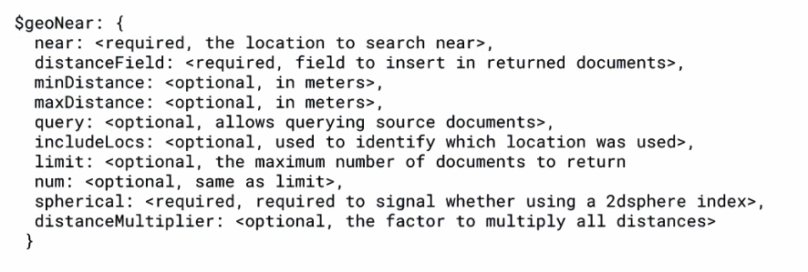
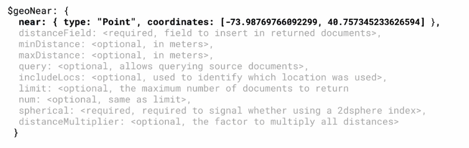
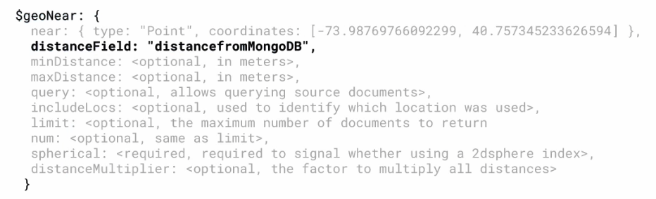
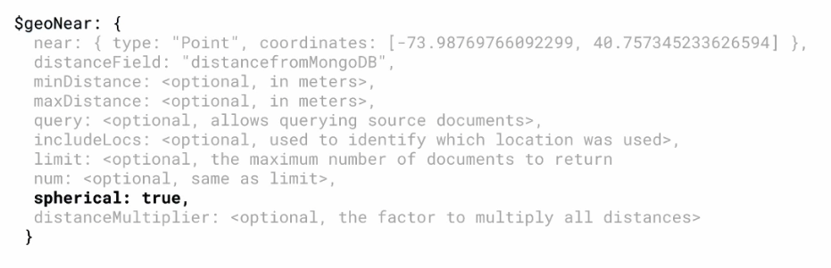
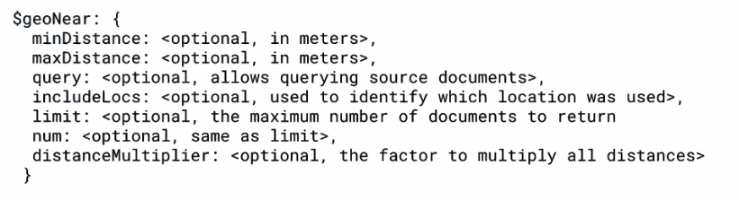
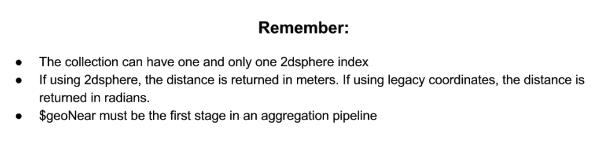
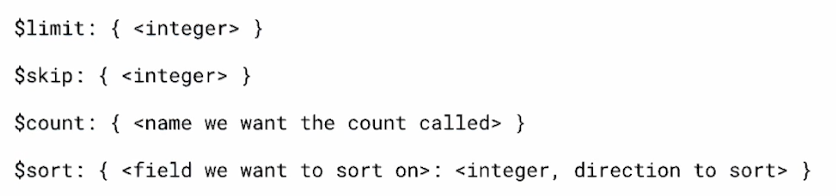
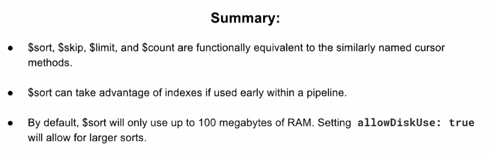
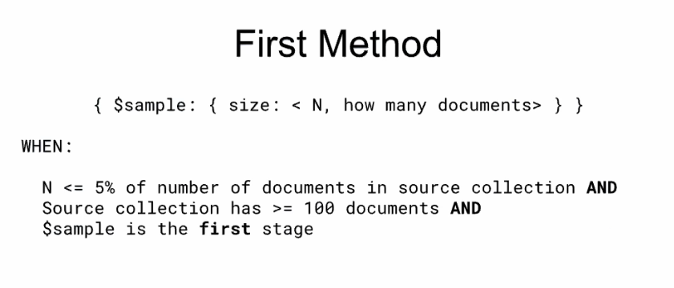
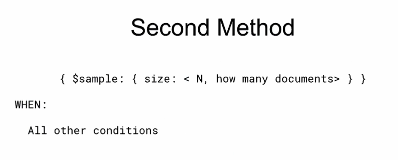

# Capítulo 2: Aggregation Básica: Utility Stages
 
Lecciones

1. Tema: `$addFields` y cómo este es similar a `$project`
2. Tema: `geoNear`Stage
3. Tema: Cursor-like stages: Parte 1
4. Tema: Cursor-like stages: Parte 2
5. Tema: `$sample` Stage
6. Laboratorio: Uso de Cursor-like Stages
7. Laboratorio: Uniendo todo junto

## 1. Tema: `$addFields` y cómo este es similar a `$project`

### Notas de lectura

Página de documentación de [`$addFields`](https://docs.mongodb.com/manual/reference/operator/aggregation/addFields/).

### Transcripción

Analicemos ahora otra etapa transformadora, `$addFields`.

`$addFields` es extremadamente similar a `$project`, con una diferencia clave.

Como su nombre lo dice, `$addFields` agrega campos a un documento.

Mientras que con `$project`, podemos eliminar y retener campos selectivamente, `$addFields` solo le permite modificar los documentos de pipeline entrantes con nuevos campos calculados o modificar campos existentes.

A menudo, queremos derivar un nuevo campo o cambiar los campos existentes, y el requisito en `$project` de que una vez que realicemos una transformación o presentemos un campo, debemos especificar todos los campos que deseamos presentar, esto puede volverse tediosos.

Veamos un ejemplo.

Entramos a Mongo:

```sh
mini-de-adolfo:~ adolfodelarosa$ mongo "mongodb://cluster0-shard-00-00-jxeqq.mongodb.net:27017,cluster0-shard-00-01-jxeqq.mongodb.net:27017,cluster0-shard-00-02-jxeqq.mongodb.net:27017/aggregations?replicaSet=Cluster0-shard-0" --authenticationDatabase admin --ssl -u m121 -p aggregations --norc
....
MongoDB Enterprise Cluster0-shard-0:PRIMARY> 
```

Primero, veremos `$project`.

Simplemente extraigamos los datos del campo `gravity.value` y reasignemoslo al nivel superior, al campo `gravity`.

```sh
MongoDB Enterprise Cluster0-shard-0:PRIMARY> db.solarSystem.aggregate([{"$project": { "gravity": "$gravity.value" } }]);
{ "_id" : ObjectId("59a06674c8df9f3cd2ee7d54"), "gravity" : 9.8 }
{ "_id" : ObjectId("59a06674c8df9f3cd2ee7d59"), "gravity" : 11.15 }
{ "_id" : ObjectId("59a06674c8df9f3cd2ee7d58"), "gravity" : 8.87 }
{ "_id" : ObjectId("59a06674c8df9f3cd2ee7d57"), "gravity" : 10.44 }
{ "_id" : ObjectId("59a06674c8df9f3cd2ee7d56"), "gravity" : 24.79 }
{ "_id" : ObjectId("59a06674c8df9f3cd2ee7d53"), "gravity" : 8.87 }
{ "_id" : ObjectId("59a06674c8df9f3cd2ee7d52"), "gravity" : 3.24 }
{ "_id" : ObjectId("59a06674c8df9f3cd2ee7d51"), "gravity" : 274 }
{ "_id" : ObjectId("59a06674c8df9f3cd2ee7d55"), "gravity" : 3.71 }
MongoDB Enterprise Cluster0-shard-0:PRIMARY> 
```

Como se esperaba, podemos recuperar los resultados con el campo `_id` y el campo `gravity` que acabamos de calcular.

Ahora eliminemos el campo `_id` y agreguemos el campo `name` para una referencia más fácil.

```sh
MongoDB Enterprise Cluster0-shard-0:PRIMARY> db.solarSystem.aggregate([{"$project": { "_id": 0, "name": 1, "gravity": "$gravity.value" } }])
{ "name" : "Earth", "gravity" : 9.8 }
{ "name" : "Neptune", "gravity" : 11.15 }
{ "name" : "Uranus", "gravity" : 8.87 }
{ "name" : "Saturn", "gravity" : 10.44 }
{ "name" : "Jupiter", "gravity" : 24.79 }
{ "name" : "Venus", "gravity" : 8.87 }
{ "name" : "Mercury", "gravity" : 3.24 }
{ "name" : "Sun", "gravity" : 274 }
{ "name" : "Mars", "gravity" : 3.71 }
MongoDB Enterprise Cluster0-shard-0:PRIMARY> 
```

Muy bien, esto es bastante bueno.

Pero, ¿qué sucede si también queremos mantener los campos `temperature`, `density`, `mass`, `radius` y SMA?

```sh
MongoDB Enterprise Cluster0-shard-0:PRIMARY> db.solarSystem.aggregate([
... {"$project":{
...     "_id": 0,
...     "name": 1,
...     "gravity": "$gravity.value",
...     "meanTemperature": 1,
...     "density": 1,
...     "mass": "$mass.value",
...     "radius": "$radius.value",
...     "sma": "$sma.value" }
... }]);
{ "name" : "Earth", "meanTemperature" : 15, "gravity" : 9.8, "mass" : 5.9723e+24, "radius" : 6378.137, "sma" : 149600000 }
{ "name" : "Neptune", "meanTemperature" : -210, "gravity" : 11.15, "mass" : 1.02413e+26, "radius" : 24765, "sma" : 4495060000 }
{ "name" : "Uranus", "meanTemperature" : -200, "gravity" : 8.87, "mass" : 8.6813e+25, "radius" : 25559, "sma" : 2872460000 }
{ "name" : "Saturn", "meanTemperature" : -170, "gravity" : 10.44, "mass" : 5.6834e+26, "radius" : 60268, "sma" : 1433530000 }
{ "name" : "Jupiter", "meanTemperature" : -150, "gravity" : 24.79, "mass" : 1.89819e+27, "radius" : 71492, "sma" : 778570000 }
{ "name" : "Venus", "meanTemperature" : 465, "gravity" : 8.87, "mass" : 4.8675e+24, "radius" : 6051.8, "sma" : 108210000 }
{ "name" : "Mercury", "meanTemperature" : 125, "gravity" : 3.24, "mass" : 3.3e+23, "radius" : 4879, "sma" : 57910000 }
{ "name" : "Sun", "meanTemperature" : 5600, "gravity" : 274, "mass" : 1.9885e+30, "radius" : 695700, "sma" : 0 }
{ "name" : "Mars", "meanTemperature" : -53, "gravity" : 3.71, "mass" : 6.4171e+23, "radius" : 3396.2, "sma" : 227920000 }
MongoDB Enterprise Cluster0-shard-0:PRIMARY> 
```

Como podemos ver, para mantener la información que queremos, tuvimos que ser explícitos, especificando qué campos presentamos junto con la realización de nuestras transformaciones (ej `"gravity": "$gravity.value", "mass": "$mass.value"` etc).

Como se dijo, esto puede volverse tedioso.

Para eso sirve `$addFields`.

Si sustituimos `$addFields` por `$project` y ejecutamos la siguiente pipeline, podemos ver que efectivamente realizamos las transformaciones deseadas.

```sh
MongoDB Enterprise Cluster0-shard-0:PRIMARY> db.solarSystem.aggregate([
... {"$addFields":{
...     "gravity": "$gravity.value",
...     "mass": "$mass.value",
...     "radius": "$radius.value",
...     "sma": "$sma.value"}
... }]).pretty()
{
	"_id" : ObjectId("59a06674c8df9f3cd2ee7d54"),
	"name" : "Earth",
	"type" : "Terrestrial planet",
	"orderFromSun" : 3,
	"radius" : 6378.137,
	"mass" : 5.9723e+24,
	"sma" : 149600000,
	"orbitalPeriod" : {
		"value" : 1,
		"units" : "years"
	},
	"eccentricity" : 0.0167,
	"meanOrbitalVelocity" : {
		"value" : 29.78,
		"units" : "km/sec"
	},
	"rotationPeriod" : {
		"value" : 1,
		"units" : "days"
	},
	"inclinationOfAxis" : {
		"value" : 23.45,
		"units" : "degrees"
	},
	"meanTemperature" : 15,
	"gravity" : 9.8,
	"escapeVelocity" : {
		"value" : 11.18,
		"units" : "km/sec"
	},
	"meanDensity" : 5.52,
	"atmosphericComposition" : "N2+O2",
	"numberOfMoons" : 1,
	"hasRings" : false,
	"hasMagneticField" : true
}
{
	"_id" : ObjectId("59a06674c8df9f3cd2ee7d59"),
	"name" : "Neptune",
	"type" : "Gas giant",
	"orderFromSun" : 8,
	"radius" : 24765,
	"mass" : 1.02413e+26,
	"sma" : 4495060000,
	"orbitalPeriod" : {
		"value" : 164.79,
		"units" : "years"
	},
	"eccentricity" : 0.0113,
	"meanOrbitalVelocity" : {
		"value" : 5.43,
		"units" : "km/sec"
	},
	"rotationPeriod" : {
		"value" : 0.72,
		"units" : "days"
	},
	"inclinationOfAxis" : {
		"value" : 28.8,
		"units" : "degrees"
	},
	"meanTemperature" : -210,
	"gravity" : 11.15,
	"escapeVelocity" : {
		"value" : 23.5,
		"units" : "km/sec"
	},
	"meanDensity" : 1.638,
	"atmosphericComposition" : "H2+He",
	"numberOfMoons" : 14,
	"hasRings" : true,
	"hasMagneticField" : true
}
{
	"_id" : ObjectId("59a06674c8df9f3cd2ee7d58"),
	"name" : "Uranus",
	"type" : "Gas giant",
	"orderFromSun" : 7,
	"radius" : 25559,
	"mass" : 8.6813e+25,
	"sma" : 2872460000,
	"orbitalPeriod" : {
		"value" : 84.01,
		"units" : "years"
	},
	"eccentricity" : 0.0457,
	"meanOrbitalVelocity" : {
		"value" : 6.8,
		"units" : "km/sec"
	},
	"rotationPeriod" : {
		"value" : 0.72,
		"units" : "days"
	},
	"inclinationOfAxis" : {
		"value" : 97.77,
		"units" : "degrees"
	},
	"meanTemperature" : -200,
	"gravity" : 8.87,
	"escapeVelocity" : {
		"value" : 21.3,
		"units" : "km/sec"
	},
	"meanDensity" : 1.271,
	"atmosphericComposition" : "H2+He",
	"numberOfMoons" : 27,
	"hasRings" : true,
	"hasMagneticField" : true
}
{
	"_id" : ObjectId("59a06674c8df9f3cd2ee7d57"),
	"name" : "Saturn",
	"type" : "Gas giant",
	"orderFromSun" : 6,
	"radius" : 60268,
	"mass" : 5.6834e+26,
	"sma" : 1433530000,
	"orbitalPeriod" : {
		"value" : 29.457,
		"units" : "years"
	},
	"eccentricity" : 0.0566,
	"meanOrbitalVelocity" : {
		"value" : 9.68,
		"units" : "km/sec"
	},
	"rotationPeriod" : {
		"value" : 0.445,
		"units" : "days"
	},
	"inclinationOfAxis" : {
		"value" : 26.73,
		"units" : "degrees"
	},
	"meanTemperature" : -170,
	"gravity" : 10.44,
	"escapeVelocity" : {
		"value" : 35.5,
		"units" : "km/sec"
	},
	"meanDensity" : 0.687,
	"atmosphericComposition" : "H2+He",
	"numberOfMoons" : 62,
	"hasRings" : true,
	"hasMagneticField" : true
}
{
	"_id" : ObjectId("59a06674c8df9f3cd2ee7d56"),
	"name" : "Jupiter",
	"type" : "Gas giant",
	"orderFromSun" : 5,
	"radius" : 71492,
	"mass" : 1.89819e+27,
	"sma" : 778570000,
	"orbitalPeriod" : {
		"value" : 11.86,
		"units" : "years"
	},
	"eccentricity" : 0.0489,
	"meanOrbitalVelocity" : {
		"value" : 13.06,
		"units" : "km/sec"
	},
	"rotationPeriod" : {
		"value" : 0.41,
		"units" : "days"
	},
	"inclinationOfAxis" : {
		"value" : 3.08,
		"units" : "degrees"
	},
	"meanTemperature" : -150,
	"gravity" : 24.79,
	"escapeVelocity" : {
		"value" : 59.5,
		"units" : "km/sec"
	},
	"meanDensity" : 1.33,
	"atmosphericComposition" : "H2+He",
	"numberOfMoons" : 67,
	"hasRings" : true,
	"hasMagneticField" : true
}
{
	"_id" : ObjectId("59a06674c8df9f3cd2ee7d53"),
	"name" : "Venus",
	"type" : "Terrestrial planet",
	"orderFromSun" : 2,
	"radius" : 6051.8,
	"mass" : 4.8675e+24,
	"sma" : 108210000,
	"orbitalPeriod" : {
		"value" : 0.615,
		"units" : "years"
	},
	"eccentricity" : 0.0067,
	"meanOrbitalVelocity" : {
		"value" : 35.02,
		"units" : "km/sec"
	},
	"rotationPeriod" : {
		"value" : 243.69,
		"units" : "days"
	},
	"inclinationOfAxis" : {
		"value" : 177.36,
		"units" : "degrees"
	},
	"meanTemperature" : 465,
	"gravity" : 8.87,
	"escapeVelocity" : {
		"value" : 10.36,
		"units" : "km/sec"
	},
	"meanDensity" : 5.25,
	"atmosphericComposition" : "CO2",
	"numberOfMoons" : 0,
	"hasRings" : false,
	"hasMagneticField" : false
}
{
	"_id" : ObjectId("59a06674c8df9f3cd2ee7d52"),
	"name" : "Mercury",
	"type" : "Terrestrial planet",
	"orderFromSun" : 1,
	"radius" : 4879,
	"mass" : 3.3e+23,
	"sma" : 57910000,
	"orbitalPeriod" : {
		"value" : 0.24,
		"units" : "years"
	},
	"eccentricity" : 0.2056,
	"meanOrbitalVelocity" : {
		"value" : 47.36,
		"units" : "km/sec"
	},
	"rotationPeriod" : {
		"value" : 58.65,
		"units" : "days"
	},
	"inclinationOfAxis" : {
		"value" : 0,
		"units" : "degrees"
	},
	"meanTemperature" : 125,
	"gravity" : 3.24,
	"escapeVelocity" : {
		"value" : 4.25,
		"units" : "km/sec"
	},
	"meanDensity" : 5.43,
	"atmosphericComposition" : "",
	"numberOfMoons" : 0,
	"hasRings" : false,
	"hasMagneticField" : true
}
{
	"_id" : ObjectId("59a06674c8df9f3cd2ee7d51"),
	"name" : "Sun",
	"type" : "Star",
	"orderFromSun" : 0,
	"radius" : 695700,
	"mass" : 1.9885e+30,
	"sma" : 0,
	"orbitalPeriod" : {
		"value" : 0,
		"units" : "years"
	},
	"eccentricity" : 0,
	"meanOrbitalVelocity" : {
		"value" : 0,
		"units" : "km/sec"
	},
	"rotationPeriod" : {
		"value" : 25.449,
		"units" : "days"
	},
	"inclinationOfAxis" : {
		"value" : 7.25,
		"units" : "degrees"
	},
	"meanTemperature" : 5600,
	"gravity" : 274,
	"escapeVelocity" : {
		"value" : 617.7,
		"units" : "km/sec"
	},
	"meanDensity" : 1.4,
	"atmosphericComposition" : "H2+He",
	"numberOfMoons" : 0,
	"hasRings" : false,
	"hasMagneticField" : true
}
{
	"_id" : ObjectId("59a06674c8df9f3cd2ee7d55"),
	"name" : "Mars",
	"type" : "Terrestrial planet",
	"orderFromSun" : 4,
	"radius" : 3396.2,
	"mass" : 6.4171e+23,
	"sma" : 227920000,
	"orbitalPeriod" : {
		"value" : 1.881,
		"units" : "years"
	},
	"eccentricity" : 0.0935,
	"meanOrbitalVelocity" : {
		"value" : 24.07,
		"units" : "km/sec"
	},
	"rotationPeriod" : {
		"value" : 1.029,
		"units" : "days"
	},
	"inclinationOfAxis" : {
		"value" : 25.19,
		"units" : "degrees"
	},
	"meanTemperature" : -53,
	"gravity" : 3.71,
	"escapeVelocity" : {
		"value" : 5.03,
		"units" : "km/sec"
	},
	"meanDensity" : 3.93,
	"atmosphericComposition" : "CO2",
	"numberOfMoons" : 2,
	"hasRings" : false,
	"hasMagneticField" : false
}
MongoDB Enterprise Cluster0-shard-0:PRIMARY> 
```

Sin embargo, no eliminamos ningún campo del documento original.

En cambio, agregamos nuevos campos de transformación al documento.

OK.

Un último ejemplo.

Al combinar `$project` con `$addFields`, eliminamos la molestia de la necesidad explícita de eliminar o retener campos.

```sh
db.solarSystem.aggregate([
{"$project": {
    "_id": 0,
    "name": 1,
    "gravity": 1,
    "mass": 1,
    "radius": 1,
    "sma": 1}
},
{"$addFields": {
    "gravity": "$gravity.value",
    "mass": "$mass.value",
    "radius": "$radius.value",
    "sma": "$sma.value"
}}]);
```

En este ejemplo, con `$project`, estamos seleccionando los campos que deseamos retener, y en `$addFields`, estamos realizando nuestra transformación en esos campos preseleccionados.

No es necesario ir uno por uno y eliminar o presentar campos mientras realizamos nuestras transformaciones.

Esta es una opción de estilo y puede evitar tener que especificar repetidamente qué campos retener en pipelines más grandes al realizar muchos cálculos diferentes.

Vamos a verlo en acción.

```sh
MongoDB Enterprise Cluster0-shard-0:PRIMARY> db.solarSystem.aggregate([
... {"$project": {
...     "_id": 0,
...     "name": 1,
...     "gravity": 1,
...     "mass": 1,
...     "radius": 1,
...     "sma": 1}
... },
... {"$addFields": {
...     "gravity": "$gravity.value",
...     "mass": "$mass.value",
...     "radius": "$radius.value",
...     "sma": "$sma.value"
... }}]);
{ "name" : "Earth", "radius" : 6378.137, "mass" : 5.9723e+24, "sma" : 149600000, "gravity" : 9.8 }
{ "name" : "Neptune", "radius" : 24765, "mass" : 1.02413e+26, "sma" : 4495060000, "gravity" : 11.15 }
{ "name" : "Uranus", "radius" : 25559, "mass" : 8.6813e+25, "sma" : 2872460000, "gravity" : 8.87 }
{ "name" : "Saturn", "radius" : 60268, "mass" : 5.6834e+26, "sma" : 1433530000, "gravity" : 10.44 }
{ "name" : "Jupiter", "radius" : 71492, "mass" : 1.89819e+27, "sma" : 778570000, "gravity" : 24.79 }
{ "name" : "Venus", "radius" : 6051.8, "mass" : 4.8675e+24, "sma" : 108210000, "gravity" : 8.87 }
{ "name" : "Mercury", "radius" : 4879, "mass" : 3.3e+23, "sma" : 57910000, "gravity" : 3.24 }
{ "name" : "Sun", "radius" : 695700, "mass" : 1.9885e+30, "sma" : 0, "gravity" : 274 }
{ "name" : "Mars", "radius" : 3396.2, "mass" : 6.4171e+23, "sma" : 227920000, "gravity" : 3.71 }
MongoDB Enterprise Cluster0-shard-0:PRIMARY> 
```

Como podemos ver, conservaremos los campos especificados y realizaremos la transformación especificada.

## 2. Tema: `geoNear`Stage

### Notas de lectura

Página de documentación de [`$geoNear`](https://docs.mongodb.com/manual/reference/operator/aggregation/geoNear/).

### Transcripción

Tomemos un descanso de la transformación por un momento y analicemos algo útil de utility stage si trabajamos con datos GeoJSON-- `$geoNear`.

`$geoNear` es la solución aggregation framework para realizar geoqueries dentro de la aggregation pipeline.

Dentro de un pipeline, `$geoNear` debe ser la primera etapa de un pipeline.

También es de notar que no podemos usar el predicado `$near` en el campo query, aunque realmente no tendría mucho sentido hacerlo.

Entonces, si ya tenemos disponible el operador `$near` para operaciones de búsqueda, ¿por qué necesitamos una etapa de agregación como `$geoNear`?

`$geoNear` se puede usar en colecciones trazadas, mientras que `$near` no.

Además, cualquier consulta que use `$near` no puede usar otros índices especiales, como `$text`, por ejemplo.

Una última cosa, `$geoNear` requiere que la colección en la que estamos realizando nuestras agregaciones tenga un único geoindex.

Aquí están los argumentos de estructuración de `$geoNear`.



Como podemos ver, puede requerir muchos argumentos, aunque solo si es necesario.

Los argumentos requeridos son `near`, `distanceField` y `spherical`.

`near` es el punto que nos gustaría buscar cerca.



Los resultados se ordenarán del más cercano al más alejado de esta ubicación.

`distanceField` es el argumento que suministramos que se insertará en los documentos devueltos, dándonos la distancia desde la ubicación hasta la ubicación que especificamos en `near`.



`Spherical` es el último argumento requerido.



Especifique `true` si el índice es una `2dsphere`, de lo contrario `false`.

Durante esta lección, usaremos un índice `2dsphere`.

Sigamos adelante y ejecutemos una agregación `$geoNear`.

Voy a buscar ubicaciones cerca de la sede de MongoDB en la ciudad de Nueva York.

```sh
db.nycFacilities.aggregate([
  {
    "$geoNear": {
      "near": {
        "type": "Point",
        "coordinates": [-73.98769766092299, 40.757345233626594]
      },
      "distanceField": "distanceFromMongoDB",
      "spherical": true
    }
  }
]).pretty();


MongoDB Enterprise Cluster0-shard-0:PRIMARY> db.nycFacilities.aggregate([
...   {
...     "$geoNear": {
...       "near": {
...         "type": "Point",
...         "coordinates": [-73.98769766092299, 40.757345233626594]
...       },
...       "distanceField": "distanceFromMongoDB",
...       "spherical": true
...     }
...   }
... ]).pretty();
{
	"_id" : ObjectId("59a57f72ea2da4c51ef39f9a"),
	"name" : "Advance Parking LLC",
	"address" : {
		"number" : "249",
		"street" : "West   43 Street",
		"city" : "New York",
		"zipcode" : "10036"
	},
	"borough" : "Manhattan",
	"location" : {
		"type" : "Point",
		"coordinates" : [
			-73.988248,
			40.757715
		]
	},
	"domain" : "Core Infrastructure and Transportation",
	"group" : "Transportation",
	"specialty" : "Parking Lots and Garages",
	"type" : "Commercial Garage",
	"distanceFromMongoDB" : 62.03048232300762
}
{
	"_id" : ObjectId("59a57f72ea2da4c51ef38b72"),
	"name" : "Lubovitch Dance Foundation, Inc.",
	"address" : {
		"number" : "229",
		"street" : "West   42 Street",
		"city" : "New York",
		"zipcode" : "10036"
	},
	"borough" : "Manhattan",
	"location" : {
		"type" : "Point",
		"coordinates" : [
			-73.988077,
			40.756827
		]
	},
	"domain" : "Libraries and Cultural Programs",
	"group" : "Cultural Institutions",
	"specialty" : "Other Cultural Institutions",
	"type" : "Dance",
	"distanceFromMongoDB" : 65.96356009175788
}
{
	"_id" : ObjectId("59a57f72ea2da4c51ef3a32b"),
	"name" : "Threshold Dance Projects, Inc.",
	"address" : {
		"number" : "229",
		"street" : "West   42 Street",
		"city" : "New York",
		"zipcode" : "10036"
	},
	"borough" : "Manhattan",
	"location" : {
		"type" : "Point",
		"coordinates" : [
			-73.988077,
			40.756827
		]
	},
	"domain" : "Libraries and Cultural Programs",
	"group" : "Cultural Institutions",
	"specialty" : "Other Cultural Institutions",
	"type" : "Dance",
	"distanceFromMongoDB" : 65.96356009175788
}
{
	"_id" : ObjectId("59a57f72ea2da4c51ef3c3da"),
	"name" : "Parsons Dance Foundation",
	"address" : {
		"number" : "229",
		"street" : "West   42 Street",
		"city" : "New York",
		"zipcode" : "10036"
	},
	"borough" : "Manhattan",
	"location" : {
		"type" : "Point",
		"coordinates" : [
			-73.988077,
			40.756827
		]
	},
	"domain" : "Libraries and Cultural Programs",
	"group" : "Cultural Institutions",
	"specialty" : "Other Cultural Institutions",
	"type" : "Dance",
	"distanceFromMongoDB" : 65.96356009175788
}
{
	"_id" : ObjectId("59a57f72ea2da4c51ef3e222"),
	"name" : "New 42nd Street, Inc.",
	"address" : {
		"number" : "229",
		"street" : "West   42 Street",
		"city" : "New York",
		"zipcode" : "10036"
	},
	"borough" : "Manhattan",
	"location" : {
		"type" : "Point",
		"coordinates" : [
			-73.988077,
			40.756827
		]
	},
	"domain" : "Libraries and Cultural Programs",
	"group" : "Cultural Institutions",
	"specialty" : "Other Cultural Institutions",
	"type" : "Theater",
	"distanceFromMongoDB" : 65.96356009175788
}
{
	"_id" : ObjectId("59a57f72ea2da4c51ef3864f"),
	"name" : "New Professional Theatre, Inc.",
	"address" : {
		"number" : "229",
		"street" : "West   42 Street",
		"city" : "New York",
		"zipcode" : "10036"
	},
	"borough" : "Manhattan",
	"location" : {
		"type" : "Point",
		"coordinates" : [
			-73.988077,
			40.756827
		]
	},
	"domain" : "Libraries and Cultural Programs",
	"group" : "Cultural Institutions",
	"specialty" : "Other Cultural Institutions",
	"type" : "Theater",
	"distanceFromMongoDB" : 65.96356009175788
}
{
	"_id" : ObjectId("59a57f72ea2da4c51ef39072"),
	"name" : "Spanish-American Inst",
	"address" : {
		"number" : "215",
		"street" : "West   43 Street",
		"city" : "New York",
		"zipcode" : "10036"
	},
	"borough" : "Manhattan",
	"location" : {
		"type" : "Point",
		"coordinates" : [
			-73.986702,
			40.757222
		]
	},
	"domain" : "Education, Child Welfare, and Youth",
	"group" : "Vocational and Proprietary Schools",
	"specialty" : "Proprietary Schools",
	"type" : "Registered Business Schools",
	"distanceFromMongoDB" : 85.06952077294312
}
{
	"_id" : ObjectId("59a57f72ea2da4c51ef3671d"),
	"name" : "Fedcap",
	"address" : {
		"number" : "210",
		"street" : "West   43 Street",
		"city" : "New York",
		"zipcode" : "10036"
	},
	"borough" : "Manhattan",
	"location" : {
		"type" : "Point",
		"coordinates" : [
			-73.987069,
			40.756587
		]
	},
	"domain" : "Education, Child Welfare, and Youth",
	"group" : "Youth Services",
	"specialty" : "Youth Centers, Literacy Programs, Job Training, and Immigrant Services",
	"type" : "Youth Program",
	"distanceFromMongoDB" : 99.67147750159312
}
{
	"_id" : ObjectId("59a57f72ea2da4c51ef374f6"),
	"name" : "Times Square Hotel",
	"address" : {
		"number" : "680",
		"street" : "8 Avenue",
		"city" : "New York",
		"zipcode" : "10036"
	},
	"borough" : "Manhattan",
	"location" : {
		"type" : "Point",
		"coordinates" : [
			-73.988675,
			40.757874
		]
	},
	"domain" : "Parks, Gardens, and Historical Sites",
	"group" : "Historical Sites",
	"specialty" : "Historical Sites",
	"type" : "State Historic Place",
	"distanceFromMongoDB" : 101.2730741875645
}
{
	"_id" : ObjectId("59a57f72ea2da4c51ef3d77f"),
	"name" : "Times Square Hotel",
	"address" : {
		"number" : "255",
		"street" : "West   43 Street",
		"city" : "New York",
		"zipcode" : "10036"
	},
	"borough" : "Manhattan",
	"location" : {
		"type" : "Point",
		"coordinates" : [
			-73.988675,
			40.757874
		]
	},
	"domain" : "Health and Human Services",
	"group" : "Human Services",
	"specialty" : "Permanent Supportive SRO Housing",
	"type" : "Supportive Housing",
	"distanceFromMongoDB" : 101.2730741875645
}
{
	"_id" : ObjectId("59a57f72ea2da4c51ef3cc71"),
	"name" : "One Astor Place",
	"address" : {
		"number" : "1515",
		"street" : "Broadway",
		"city" : "New York",
		"zipcode" : "10036"
	},
	"borough" : "Manhattan",
	"location" : {
		"type" : "Point",
		"coordinates" : [
			-73.986384,
			40.757903
		]
	},
	"domain" : "Parks, Gardens, and Historical Sites",
	"group" : "Parks and Plazas",
	"specialty" : "Privately Owned Public Space",
	"type" : "Privately Owned Public Space",
	"distanceFromMongoDB" : 126.9848198234587
}
{
	"_id" : ObjectId("59a57f72ea2da4c51ef3cdfa"),
	"name" : "Astor Parking LLC",
	"address" : {
		"number" : "1511",
		"street" : "Broadway",
		"city" : "New York",
		"zipcode" : "10036"
	},
	"borough" : "Manhattan",
	"location" : {
		"type" : "Point",
		"coordinates" : [
			-73.986384,
			40.757903
		]
	},
	"domain" : "Core Infrastructure and Transportation",
	"group" : "Transportation",
	"specialty" : "Parking Lots and Garages",
	"type" : "Commercial Garage",
	"distanceFromMongoDB" : 126.9848198234587
}
{
	"_id" : ObjectId("59a57f72ea2da4c51ef36ebe"),
	"name" : "Candler Building",
	"address" : {
		"number" : "221",
		"street" : "West 41 Street",
		"city" : "New York",
		"zipcode" : "10036"
	},
	"borough" : "Manhattan",
	"location" : {
		"type" : "Point",
		"coordinates" : [
			-73.988161,
			40.756168
		]
	},
	"domain" : "Parks, Gardens, and Historical Sites",
	"group" : "Historical Sites",
	"specialty" : "Historical Sites",
	"type" : "State Historic Place",
	"distanceFromMongoDB" : 136.74837610606284
}
{
	"_id" : ObjectId("59a57f72ea2da4c51ef384e3"),
	"name" : "42nd St Dev/Times Square",
	"address" : {
		"number" : "234",
		"street" : "West 42 Street",
		"city" : "New York",
		"zipcode" : "10036"
	},
	"borough" : "Manhattan",
	"location" : {
		"type" : "Point",
		"coordinates" : [
			-73.988731,
			40.756332
		]
	},
	"domain" : "Administration of Government",
	"group" : "Other Property",
	"specialty" : "Properties Leased or Licensed to Non-public Entities",
	"type" : "Long-Term Agreement",
	"distanceFromMongoDB" : 142.52837491183874
}
{
	"_id" : ObjectId("59a57f72ea2da4c51ef37eef"),
	"name" : "New Amsterdam Theater",
	"address" : {
		"number" : "214",
		"street" : "West 42 Street",
		"city" : "New York",
		"zipcode" : "10036"
	},
	"borough" : "Manhattan",
	"location" : {
		"type" : "Point",
		"coordinates" : [
			-73.988044,
			40.755917
		]
	},
	"domain" : "Parks, Gardens, and Historical Sites",
	"group" : "Historical Sites",
	"specialty" : "Historical Sites",
	"type" : "State Historic Place",
	"distanceFromMongoDB" : 161.64929369205123
}
{
	"_id" : ObjectId("59a57f72ea2da4c51ef385f2"),
	"name" : "Times Square Plaza",
	"address" : {
		"number" : "",
		"street" : "",
		"city" : "New York",
		"zipcode" : "10036"
	},
	"borough" : "Manhattan",
	"location" : {
		"type" : "Point",
		"coordinates" : [
			-73.985786,
			40.757572
		]
	},
	"domain" : "Parks, Gardens, and Historical Sites",
	"group" : "Parks and Plazas",
	"specialty" : "Streetscapes, Plazas, and Malls",
	"type" : "Pedestrian Plaza",
	"distanceFromMongoDB" : 163.1592942615766
}
{
	"_id" : ObjectId("59a57f72ea2da4c51ef38576"),
	"name" : "42nd St Dev/Timessquare",
	"address" : {
		"number" : "582",
		"street" : "7 Avenue",
		"city" : "New York",
		"zipcode" : "10036"
	},
	"borough" : "Manhattan",
	"location" : {
		"type" : "Point",
		"coordinates" : [
			-73.987592,
			40.755844
		]
	},
	"domain" : "Administration of Government",
	"group" : "Other Property",
	"specialty" : "Properties Leased or Licensed to Non-public Entities",
	"type" : "Long-Term Agreement",
	"distanceFromMongoDB" : 167.35292993567325
}
{
	"_id" : ObjectId("59a57f72ea2da4c51ef3c50d"),
	"name" : "Second Stage Theatre",
	"address" : {
		"number" : "305",
		"street" : "West   43 Street",
		"city" : "New York",
		"zipcode" : "10036"
	},
	"borough" : "Manhattan",
	"location" : {
		"type" : "Point",
		"coordinates" : [
			-73.989509,
			40.758182
		]
	},
	"domain" : "Libraries and Cultural Programs",
	"group" : "Cultural Institutions",
	"specialty" : "Other Cultural Institutions",
	"type" : "Theater",
	"distanceFromMongoDB" : 178.89774760698953
}
{
	"_id" : ObjectId("59a57f72ea2da4c51ef399f1"),
	"name" : "Kree Inst Of Electrolysis Inc",
	"address" : {
		"number" : "1500",
		"street" : "Broadway",
		"city" : "New York",
		"zipcode" : "10036"
	},
	"borough" : "Manhattan",
	"location" : {
		"type" : "Point",
		"coordinates" : [
			-73.985635,
			40.756776
		]
	},
	"domain" : "Education, Child Welfare, and Youth",
	"group" : "Vocational and Proprietary Schools",
	"specialty" : "Proprietary Schools",
	"type" : "Licensed Private Schools",
	"distanceFromMongoDB" : 185.1117645324543
}
{
	"_id" : ObjectId("59a57f72ea2da4c51ef3942c"),
	"name" : "1500 Broadway",
	"address" : {
		"number" : "1500",
		"street" : "Broadway",
		"city" : "New York",
		"zipcode" : "10036"
	},
	"borough" : "Manhattan",
	"location" : {
		"type" : "Point",
		"coordinates" : [
			-73.985635,
			40.756776
		]
	},
	"domain" : "Parks, Gardens, and Historical Sites",
	"group" : "Parks and Plazas",
	"specialty" : "Privately Owned Public Space",
	"type" : "Privately Owned Public Space",
	"distanceFromMongoDB" : 185.1117645324543
}
Type "it" for more
MongoDB Enterprise Cluster0-shard-0:PRIMARY> 
```

Aquí he especificado mis tres argumentos obligatorios: `near`, `distanceField` y `spherical`.

Bueno, obtuvimos muchos resultados, por lo que podemos ver que funciona.

Sin embargo, no es muy útil en su estado actual.

Miremos esos argumentos opcionales en mayor detalle para aprender cómo hacer que esta agregación sea mucho más específica.

`minDistance` y `maxDistance` especifican los resultados más cercanos y más lejanos que queremos.



`query` permite especificar las condiciones que cada documento debe cumplir, y utiliza la misma sintaxis del query operator como match.

`includeLocs` nos permitiría mostrar qué ubicación se utilizó en el documento si tiene más de una ubicación.

Para nuestro dataset, esto no es necesario, ya que cada documento solo tiene una ubicación.

Y recuerde, `$geoNear` requiere que tengamos exactamente un índice `2dsphere` en la colección.

`limit` y `num` son funcionalmente idénticos y se usan para limitar el número de documentos devueltos.

Por último, `distanceMultiplier` se utiliza para convertir los resultados de distancia de radianes a cualquier unidad que necesitemos, en caso de que utilicemos datos geoespaciales heredados.

Así que limpiemos nuestra agregación y busquemos resultados útiles.

Me gustaría encontrar los cinco hospitales más cercanos a la sede de MongoDB.

```sh
// include ``limit`` to results
db.nycFacilities.aggregate([
  {
    $geoNear: {
      near: {
        type: "Point",
        coordinates: [-73.98769766092299, 40.757345233626594]
      },
      distanceField: "distanceFromMongoDB",
      spherical: true,
      query: { type: "Hospital" },
      limit: 5
    }
  }
]).pretty()

MongoDB Enterprise Cluster0-shard-0:PRIMARY> // include ``limit`` to results
MongoDB Enterprise Cluster0-shard-0:PRIMARY> db.nycFacilities.aggregate([
...   {
...     $geoNear: {
...       near: {
...         type: "Point",
...         coordinates: [-73.98769766092299, 40.757345233626594]
...       },
...       distanceField: "distanceFromMongoDB",
...       spherical: true,
...       query: { type: "Hospital" },
...       limit: 5
...     }
...   }
... ]).pretty()
{
	"_id" : ObjectId("59a57f72ea2da4c51ef39c74"),
	"name" : "Mount Sinai West",
	"address" : {
		"number" : "1000",
		"street" : "10 Avenue",
		"city" : "New York",
		"zipcode" : "10019"
	},
	"borough" : "Manhattan",
	"location" : {
		"type" : "Point",
		"coordinates" : [
			-73.986799,
			40.769664
		]
	},
	"domain" : "Health and Human Services",
	"group" : "Health Care",
	"specialty" : "Hospitals and Clinics",
	"type" : "Hospital",
	"distanceFromMongoDB" : 1373.402525696724
}
{
	"_id" : ObjectId("59a57f72ea2da4c51ef37254"),
	"name" : "NYU Hospitals Center",
	"address" : {
		"number" : "550",
		"street" : "1 Avenue",
		"city" : "New York",
		"zipcode" : "10016"
	},
	"borough" : "Manhattan",
	"location" : {
		"type" : "Point",
		"coordinates" : [
			-73.973621,
			40.741474
		]
	},
	"domain" : "Health and Human Services",
	"group" : "Health Care",
	"specialty" : "Hospitals and Clinics",
	"type" : "Hospital",
	"distanceFromMongoDB" : 2128.5451518719083
}
{
	"_id" : ObjectId("59a57f72ea2da4c51ef3cbd8"),
	"name" : "Bellevue Hospital Center",
	"address" : {
		"number" : "462",
		"street" : "1 Avenue",
		"city" : "New York",
		"zipcode" : "10016"
	},
	"borough" : "Manhattan",
	"location" : {
		"type" : "Point",
		"coordinates" : [
			-73.975119,
			40.739106
		]
	},
	"domain" : "Health and Human Services",
	"group" : "Health Care",
	"specialty" : "Hospitals and Clinics",
	"type" : "Hospital",
	"distanceFromMongoDB" : 2290.787247189754
}
{
	"_id" : ObjectId("59a57f72ea2da4c51ef362b6"),
	"name" : "Belvue Hosp Ctr/CUNY/Ocme/Ems",
	"address" : {
		"number" : "430",
		"street" : "1 Avenue",
		"city" : "New York",
		"zipcode" : "10016"
	},
	"borough" : "Manhattan",
	"location" : {
		"type" : "Point",
		"coordinates" : [
			-73.975927,
			40.737953
		]
	},
	"domain" : "Health and Human Services",
	"group" : "Health Care",
	"specialty" : "Hospitals and Clinics",
	"type" : "Hospital",
	"distanceFromMongoDB" : 2376.0197324860424
}
{
	"_id" : ObjectId("59a57f72ea2da4c51ef3ca8d"),
	"name" : "Belvue Hosp Ctr/CUNY/Ocme/Ems",
	"address" : {
		"number" : "430",
		"street" : "1 Avenue",
		"city" : "New York",
		"zipcode" : "10016"
	},
	"borough" : "Manhattan",
	"location" : {
		"type" : "Point",
		"coordinates" : [
			-73.975927,
			40.737953
		]
	},
	"domain" : "Health and Human Services",
	"group" : "Health Care",
	"specialty" : "Hospitals and Clinics",
	"type" : "Hospital",
	"distanceFromMongoDB" : 2376.0197324860424
}
MongoDB Enterprise Cluster0-shard-0:PRIMARY> 
```

Aquí `query: { type: "Hospital" },` agregué el campo de consulta opcional y especifiqué que debería ser tipo "Hospital". Y aquí `limit: 5` agregué el campo de límite opcional y lo especifiqué como 5.

Mucho mejor.

Tenemos los cinco lugares más cercanos que coinciden con el hospital.

Y pudimos ver que nuestra distancia es en metros.

Y eso es todo con `$geoNear`.

Solo hay algunas cosas para recordar.



* La colección puede tener uno y solo un índice `2dsphere`.

* Si usa `2dsphere`, la distancia se devuelve en metros. Si usa coordenadas heredadas, la distancia se devuelve en radianes.

* Y `$geoNear` debe ser la primera etapa en una aggregation pipeline.

## 3. Tema: Cursor-like stages: Parte 1

### Transcripción

Es hora de que discutamos algo  útil de utility stages, lo que llamamos cursor-like stages.

Estas etapas son `sort`, `skip`, `limit` y `counts`.

Y tienen un equivalente en nuestro query language como método de cursor.

Echemos un vistazo.

Después de conectarme a mi base de datos de aggregations, puedo expresar esta simple consulta en el sistema solar donde voy a encontrar todos mis documentos.

Esta es una exploración de colección completa y solo proyectando el `name`, el `numberOfMoons` y evitando el `_id`.

```sh
MongoDB Enterprise Cluster0-shard-0:PRIMARY> use aggregations
switched to db aggregations
MongoDB Enterprise Cluster0-shard-0:PRIMARY> db.solarSystem.find({}, {"_id": 0, "name": 1, "numberOfMoons": 1}).pretty();
{ "name" : "Earth", "numberOfMoons" : 1 }
{ "name" : "Neptune", "numberOfMoons" : 14 }
{ "name" : "Uranus", "numberOfMoons" : 27 }
{ "name" : "Saturn", "numberOfMoons" : 62 }
{ "name" : "Jupiter", "numberOfMoons" : 67 }
{ "name" : "Venus", "numberOfMoons" : 0 }
{ "name" : "Mercury", "numberOfMoons" : 0 }
{ "name" : "Sun", "numberOfMoons" : 0 }
{ "name" : "Mars", "numberOfMoons" : 2 }
MongoDB Enterprise Cluster0-shard-0:PRIMARY> 
```

Si hago esto, puedo ver todos los resultados de mi colección, solo exponiendo el `name`, el `numberOfMoons` por cada uno de los documentos.

Dulce, esto funciona bien.

La otra cosa que puedo hacer es básicamente contar llamadas.

Ahora esto contará la cantidad total de documentos devueltos por la consulta.

```sh
MongoDB Enterprise Cluster0-shard-0:PRIMARY> db.solarSystem.find({}, {"_id": 0, "name": 1, "numberOfMoons": 1}).count();
9
MongoDB Enterprise Cluster0-shard-0:PRIMARY> 
```

Aquí, puedo ver que tengo en mi sistema solar nueve documentos.

Otra cosa que puedo hacer es básicamente saltarme cinco documentos.

Y si ejecuto esta consulta, puedo ver que se omitieron los primeros cinco documentos.

```sh
MongoDB Enterprise Cluster0-shard-0:PRIMARY> db.solarSystem.find({}, {"_id": 0, "name": 1, "numberOfMoons": 1}).skip(5).pretty();
{ "name" : "Venus", "numberOfMoons" : 0 }
{ "name" : "Mercury", "numberOfMoons" : 0 }
{ "name" : "Sun", "numberOfMoons" : 0 }
{ "name" : "Mars", "numberOfMoons" : 2 }
MongoDB Enterprise Cluster0-shard-0:PRIMARY> 

```

Ahora, si se pregunta por qué obtuve esto, por qué omití esos cinco documentos anteriores y no otros, si no especifico una operación de clasificación o una clasificación de mi cursor, obtendré de MongoDB el orden por el cual los documentos se insertan en la colección, lo que llamamos el orden natural de la colección.

Entonces, en este caso, voy a omitir los cinco primeros elementos que se han insertado en esta colección.

El siguiente método será limit, donde puedo especificar la cantidad de documentos que voy a devolver.

```sh
MongoDB Enterprise Cluster0-shard-0:PRIMARY> db.solarSystem.find({}, {"_id": 0, "name": 1, "numberOfMoons": 1}).limit(5).pretty();
{ "name" : "Earth", "numberOfMoons" : 1 }
{ "name" : "Neptune", "numberOfMoons" : 14 }
{ "name" : "Uranus", "numberOfMoons" : 27 }
{ "name" : "Saturn", "numberOfMoons" : 62 }
{ "name" : "Jupiter", "numberOfMoons" : 67 }
```

Y de nuevo, siguiendo exactamente el mismo orden de clasificación, que en este caso será mi orden de clasificación de inserción natural en nuestra colección del sistema solar, obtendré el `Earth`, `Neptune`, `Uranus`, `Saturn` y `Jupiter`, que son los cinco primeros documentos de mi colección.

Y, por último, también puedo especificar un orden para el conjunto de resultados de mi colección.

Aquí, voy a encontrar todo.

```sh
MongoDB Enterprise Cluster0-shard-0:PRIMARY> db.solarSystem.find({}, { "_id": 0, "name": 1, "numberOfMoons": 1 }).sort( {"numberOfMoons": -1 } ).pretty();
{ "name" : "Jupiter", "numberOfMoons" : 67 }
{ "name" : "Saturn", "numberOfMoons" : 62 }
{ "name" : "Uranus", "numberOfMoons" : 27 }
{ "name" : "Neptune", "numberOfMoons" : 14 }
{ "name" : "Mars", "numberOfMoons" : 2 }
{ "name" : "Earth", "numberOfMoons" : 1 }
{ "name" : "Venus", "numberOfMoons" : 0 }
{ "name" : "Mercury", "numberOfMoons" : 0 }
{ "name" : "Sun", "numberOfMoons" : 0 }
MongoDB Enterprise Cluster0-shard-0:PRIMARY> 
```

Pero en lugar de devolver el orden por el cual se insertan los documentos en la colección, ordenaré el conjunto de resultados en función del número de lunas que contiene cada uno de estos documentos.

`-1` especifica el orden. Y en este caso, será descendente.

Entonces, como podemos ver, vamos a obtener primero, los que tienen más lunas y luego los que tienen menos lunas.

Ahora hemos visto los métodos del cursor, pero también tenemos etapas que ejecutan exactamente el mismo tipo de funcionalidad.

Tenemos `$limit`, `$skip`, `$count` y `$sort`.



Variarán un poco en la sintaxis, donde `$limit` tomará un número entero, `$skip` también tomará un número entero, especificando el número de documentos límite y el número de documentos a saltar.

`$count`, por otro lado, tendremos que especificar un campo donde queremos recopilar el valor calculado.

Y `$sort`, necesitamos especificar las claves y el orden por el cual queremos que se ordenen nuestros conjuntos de resultados del pipeline.

Veamos algo de esto en acción.

Ahora, para imitar exactamente la misma operación que antes teniamos con el comando `find`, voy a ejecutar el `project` de `name` y `numberOfMoons`, excluyendo `_id`, exactamente la misma operación que antes.

Y en este caso, dado el pipeline que estoy ejecutando y los documentos que proporcionará este pipeline de agregación, agregaré una etapa `$limit` a mi pipeline, diciendo, solo quiero que los primeros cinco documentos provengan de esta etapa del proyecto.

```sh
db.solarSystem.aggregate([{
  "$project": {
    "_id": 0,
    "name": 1,
    "numberOfMoons": 1
  }
},
{ "$limit": 5  }]).pretty();

MongoDB Enterprise Cluster0-shard-0:PRIMARY> db.solarSystem.aggregate([{
...   "$project": {
...     "_id": 0,
...     "name": 1,
...     "numberOfMoons": 1
...   }
... },
... { "$limit": 5  }]).pretty();
{ "name" : "Earth", "numberOfMoons" : 1 }
{ "name" : "Neptune", "numberOfMoons" : 14 }
{ "name" : "Uranus", "numberOfMoons" : 27 }
{ "name" : "Saturn", "numberOfMoons" : 62 }
{ "name" : "Jupiter", "numberOfMoons" : 67 }
MongoDB Enterprise Cluster0-shard-0:PRIMARY> 
```

Y como se esperaba, obtengo los mismos resultados que si limitara una operación de búsqueda.

La siguiente etapa a probar es `$skip`. 

Y nuevamente, dados los resultados entrantes de la etapa del proyecto, omitiré solo uno.

```sh
db.solarSystem.aggregate([{
  "$project": {
    "_id": 0,
    "name": 1,
    "numberOfMoons": 1
  }
}, {
  "$skip": 1
}]).pretty()

MongoDB Enterprise Cluster0-shard-0:PRIMARY> db.solarSystem.aggregate([{
...   "$project": {
...     "_id": 0,
...     "name": 1,
...     "numberOfMoons": 1
...   }
... }, {
...   "$skip": 1
... }]).pretty()
{ "name" : "Neptune", "numberOfMoons" : 14 }
{ "name" : "Uranus", "numberOfMoons" : 27 }
{ "name" : "Saturn", "numberOfMoons" : 62 }
{ "name" : "Jupiter", "numberOfMoons" : 67 }
{ "name" : "Venus", "numberOfMoons" : 0 }
{ "name" : "Mercury", "numberOfMoons" : 0 }
{ "name" : "Sun", "numberOfMoons" : 0 }
{ "name" : "Mars", "numberOfMoons" : 2 }
MongoDB Enterprise Cluster0-shard-0:PRIMARY> 
```

En este caso, me voy a saltar `Earth`.

Entonces, ¿cómo sé que voy a saltarme `Earth`?

Básicamente, el orden por el cual voy a obtener los resultados en el project es el orden natural, exactamente de la misma manera que hemos visto antes.

El project filtrará solo los campos que me interesan y los pasará a la etapa `$skip`.

`$skip`, salta uno, voy a omitir `Earth`.

Como puede ver aquí, todos los diferentes cuerpos celestes serán presentados en mis resultados, excepto `Earth`, que es el primer elemento, el que estoy omitiendo en el pipeline.

## 4. Tema: Cursor-like stages: Parte 2

### Transcripción

También tenemos nuestra etapa `$count`.

La etapa `$count` cuenta todos los documentos entrantes.

El argumento para contar es el nombre del campo en el que vamos a recopilar ese valor de conteo.

En un documento de los resultados.

En este caso, voy a filtrar nuestra colección para que solo veamos documentos que están en planetas terrestres.

```sh
db.solarSystem.aggregate([{
  "$match": {
    "type": "Terrestrial planet"
  }
}, {
  "$project": {
    "_id": 0,
    "name": 1,
    "numberOfMoons": 1
  }
}, {
  "$count": "terrestrial planets"
}]).pretty();
```

Aquí estamos especificando esa coincidencia donde el tipo de documento tendrá el valor `"Terrestrial planet"`.

Luego, a partir de los resultados del `$match` que luego se envían a la etapa `$project`, voy a filtrar solo el `name` y el `numberOfMoons`, eliminando el `_id`, como lo hemos hecho antes.

Y de todos los documentos que vienen del pipeline, los voy a contar.

```sh
MongoDB Enterprise Cluster0-shard-0:PRIMARY> db.solarSystem.aggregate([{
...   "$match": {
...     "type": "Terrestrial planet"
...   }
... }, {
...   "$project": {
...     "_id": 0,
...     "name": 1,
...     "numberOfMoons": 1
...   }
... }, {
...   "$count": "terrestrial planets"
... }]).pretty();
{ "terrestrial planets" : 4 }
MongoDB Enterprise Cluster0-shard-0:PRIMARY> 
```

El `$count` me devolverá un resultados de documento, que tiene un campo que especifiqué aquí `"$count": "terrestrial planets"`, que contiene el valor de la cantidad de documentos que son de tipo `"terrestrial planets"`.

Ahora, para este pipeline en particular aquí, donde el resultado final será el recuento de la cantidad de documentos, que tienen un "type": "Terrestrial planet", la etapa `"$project"` aquí es un poco molesta.

Realmente no interfiere con el resultado final del pipeline.

Entonces, si simplemente lo eliminamos, y solo tenemos el `$match` y luego el `$count`, podemos ver que obtengo exactamente la misma ejecución, exactamente los mismos resultados, teniendo o no `"$project"` entre `$match` y `$count`.

```sh
MongoDB Enterprise Cluster0-shard-0:PRIMARY> db.solarSystem.aggregate([{
...   "$match": {
...     "type": "Terrestrial planet"
...   }
... }, {
...   "$count": "terrestrial planets"
... }]).pretty();
{ "terrestrial planets" : 4 }
MongoDB Enterprise Cluster0-shard-0:PRIMARY> 
```

Por último, veamos `$sort`.

`$sort` debe indicar el campo con el que queremos ordenar.

En este caso, la proyección `$project`, con lo campos `name` y `numberOfMoons`, puedo ordenar los campos que estoy recuperando del pipeline entrante.

```sh
db.solarSystem.aggregate([{
  "$project": {
    "_id": 0,
    "name": 1,
    "numberOfMoons": 1
  }
}, {
  "$sort": { "numberOfMoons": -1 }
}]).pretty();

MongoDB Enterprise Cluster0-shard-0:PRIMARY> db.solarSystem.aggregate([{
...   "$project": {
...     "_id": 0,
...     "name": 1,
...     "numberOfMoons": 1
...   }
... }, {
...   "$sort": { "numberOfMoons": -1 }
... }]).pretty();
{ "name" : "Jupiter", "numberOfMoons" : 67 }
{ "name" : "Saturn", "numberOfMoons" : 62 }
{ "name" : "Uranus", "numberOfMoons" : 27 }
{ "name" : "Neptune", "numberOfMoons" : 14 }
{ "name" : "Mars", "numberOfMoons" : 2 }
{ "name" : "Earth", "numberOfMoons" : 1 }
{ "name" : "Venus", "numberOfMoons" : 0 }
{ "name" : "Mercury", "numberOfMoons" : 0 }
{ "name" : "Sun", "numberOfMoons" : 0 }
MongoDB Enterprise Cluster0-shard-0:PRIMARY> 
```

En este caso, quiero ordenar por `numberOfMoons` descendente (-1), obtendré los resultados como se esperaba, donde obtengo el planeta que tiene más lunas primero, y en ese orden hasta las que no tienen lunas. - Como sun, Mercury y Venus-- pobres tipos.

Un aspecto importante al que se debe hacer referencia aquí es que la etapa de clasificación no se limita a un solo campo.

Operará en múltiples campos diferentes en combinación, como lo haríamos en consultas normales y operaciones de búsqueda, si desea ordenar primero en un campo y luego en otro, eso también es totalmente posible en  aggregation pipeline stage.

Entonces, digamos aquí, por ejemplo, que tengo este `project` diferente donde también voy a proyectar, aparte del `name` y `numberOfMoons`, el campo `hasMagneticField`, que es un campo de tracción.

```sh
db.solarSystem.aggregate([{
  "$project": {
    "_id": 0,
    "name": 1,
    "hasMagneticField": 1,
    "numberOfMoons": 1
  }
}, {
  "$sort": { "hasMagneticField": -1, "numberOfMoons": -1 }
}]).pretty();
```

En la tercera etapa, puedo especificar que quiero ordenar con `hasMagneticField` descendente y `numberOfMoons` descendentes.

Al ejecutar esta consulta específica, obtenemos un resultado muy similar al anterior, dónde vamos a tener a Júpiter, Saturno, Urano, etc.

```sh
MongoDB Enterprise Cluster0-shard-0:PRIMARY> db.solarSystem.aggregate([{
...   "$project": {
...     "_id": 0,
...     "name": 1,
...     "hasMagneticField": 1,
...     "numberOfMoons": 1
...   }
... }, {
...   "$sort": { "hasMagneticField": -1, "numberOfMoons": -1 }
... }]).pretty();
{ "name" : "Jupiter", "numberOfMoons" : 67, "hasMagneticField" : true }
{ "name" : "Saturn", "numberOfMoons" : 62, "hasMagneticField" : true }
{ "name" : "Uranus", "numberOfMoons" : 27, "hasMagneticField" : true }
{ "name" : "Neptune", "numberOfMoons" : 14, "hasMagneticField" : true }
{ "name" : "Earth", "numberOfMoons" : 1, "hasMagneticField" : true }
{ "name" : "Mercury", "numberOfMoons" : 0, "hasMagneticField" : true }
{ "name" : "Sun", "numberOfMoons" : 0, "hasMagneticField" : true }
{ "name" : "Mars", "numberOfMoons" : 2, "hasMagneticField" : false }
{ "name" : "Venus", "numberOfMoons" : 0, "hasMagneticField" : false }
MongoDB Enterprise Cluster0-shard-0:PRIMARY> 
```

La única diferencia es que, por ejemplo, el sol y Mercurio vendrán antes que Marte.

Entonces, ¿cómo es eso posible?

Bueno, el resultado se ordena primero en el campo `hasMagneticField` igual a true, y luego en `numberOfMoons`.

Así que primero voy a tener todos los que tienen `hasMagneticField` igual a true.

Y luego, después de eso, voy a buscar el `numberOfMoons` para los resultados.

Ahora, si la ordenación está cerca del comienzo de nuestro pipeline, en el lugar antes de un `project`, y se desenrolla en la etapa de `group`, puede aprovechar los índices.

De lo contrario, esta etapa `$sort` realizará una ordenación en memoria, lo que aumentará en gran medida el consumo de memoria de nuestro servidor.

Las operaciones de ordenacion dentro de esa línea de visión están limitadas a 100 megabytes de RAM por defecto.

Para permitir el manejo de conjuntos de datos más grandes, debemos permitir el uso del disco, que es una opción del   aggregation pipeline que podemos proporcionar a la función de agregación.

```sh
db.solarSystem.aggregate([{
  "$project": {
    "_id": 0,
    "name": 1,
    "hasMagneticField": 1,
    "numberOfMoons": 1
  }
}, {
  "$sort": { "hasMagneticField": -1, "numberOfMoons": -1 }
}], { "allowDiskUse": true }).pretty();
```

Al hacerlo, realizaremos el exceso de 100 megabytes de memoria necesarios para hacer una clasificación usando el disco para ayudarnos a ordenar los resultados.

En resumen, 



* `$sort`, `$skip`, `$limit` y `$count` son funcionalmente equivalentes a los métodos de cursor con nombre similares.

* Por lo tanto, podemos aprovechar los índices si está cerca del comienzo del pipeline y antes del project group o etapas de desconexión.

* Por defecto, `$sort` solo tomará hasta 100 megabytes de RAM. Para más que eso, tendremos que proporcionar la opción `allowDiskUse: true` para nuetro pipeline.

Si no lo hacemos, la operación finalizará en el servidor.

Y eso es todo lo que tenemos para usted en las etapas de cursor-like stages de aggregation pipeline.

## 5. Tema: `$sample` Stage

### Notas de lectura

Página de documentación de [`$sample`](https://docs.mongodb.com/manual/reference/operator/aggregation/sample/).

### Transcripción

Otra etapa de utilidad muy útil es `$sample`.

`$sample` seleccionará un conjunto de documentos aleatorios de una colección de una de dos maneras.



El primer método es si el tamaño(size) que estamos especificando, el número N de documentos a los que queremos que se vea nuestra muestra, si es menos del 5% del número de documentos en nuestra colección de origen, y la colección de origen tiene más de 100 documentos, y `$sample` es la primera etapa, luego un cursor pseudoaleatorio seleccionará el número específico de documentos a transmitir.



Si todas las demás condiciones, y recapitulamos muy rápidamente, si N es más del 5% o la colección de origen tiene menos de 100 documentos, o si `$sample` es la primera etapa, si alguna de estas condiciones no se aplica, entonces, ¿cuál es hecho es una ordenación aleatoria en memoria y selecciona el número específico de documentos que especificamos como el tamaño(size).

Ahora este sort estará sujeto a las mismas restricciones de memoria que la etapa sort de nuestra aggregation pipeline.

Entonces, veamos algo de esto en acción.

```sh
db.nycFacilities.aggregate([{"$sample": { "size": 200 }}]).pretty();
```

En mi base de datos, tendré una colección `nycFacilities`.

Esta colección contiene más de 100 documentos.

El tamaño de sample es superior al 5% de la cantidad total de documentos.

Y la etapa `$sample` es la primera de mi pipeline.

Por lo tanto, se aplicará la operación pseudoaleatoria.

Cuando ejecuto este pipeline, podemos ver que obtuvimos documentos seleccionados al azar de nuestra colección.

```sh
MongoDB Enterprise Cluster0-shard-0:PRIMARY> db.nycFacilities.aggregate([{"$sample": { "size": 200 }}]).pretty();
{
	"_id" : ObjectId("59a57f72ea2da4c51ef3d56c"),
	"name" : "Program Development Services",
	"address" : {
		"number" : "6916",
		"street" : "New Utrecht Avenue",
		"city" : "Brooklyn",
		"zipcode" : "11228"
	},
	"borough" : "Brooklyn",
	"location" : {
		"type" : "Point",
		"coordinates" : [
			-73.998986,
			40.620176
		]
	},
	"domain" : "Health and Human Services",
	"group" : "Human Services",
	"specialty" : "Programs for People with Disabilities",
	"type" : "Programs for People with Disabilities"
}
{
	"_id" : ObjectId("59a57f72ea2da4c51ef3c17d"),
	"name" : "New Federal Theatre, Inc.",
	"address" : {
		"number" : "292",
		"street" : "Henry Street",
		"city" : "New York",
		"zipcode" : "10002"
	},
	"borough" : "Manhattan",
	"location" : {
		"type" : "Point",
		"coordinates" : [
			-73.983003,
			40.713668
		]
	},
	"domain" : "Libraries and Cultural Programs",
	"group" : "Cultural Institutions",
	"specialty" : "Other Cultural Institutions",
	"type" : "Theater"
}
{
	"_id" : ObjectId("59a57f72ea2da4c51ef3c7be"),
	"name" : "Give Them To Eat",
	"address" : {
		"number" : "800",
		"street" : "East  156 Street",
		"city" : "Bronx",
		"zipcode" : "10455"
	},
	"borough" : "Bronx",
	"location" : {
		"type" : "Point",
		"coordinates" : [
			-73.904431,
			40.817439
		]
	},
	"domain" : "Health and Human Services",
	"group" : "Human Services",
	"specialty" : "Soup Kitchens and Food Pantries",
	"type" : "Soup Kitchen"
}
{
	"_id" : ObjectId("59a57f72ea2da4c51ef35fdc"),
	"name" : "I S 90",
	"address" : {
		"number" : "21",
		"street" : "Jumel Place",
		"city" : "New York",
		"zipcode" : "10032"
	},
	"borough" : "Manhattan",
	"location" : {
		"type" : "Point",
		"coordinates" : [
			-73.935707,
			40.839358
		]
	},
	"domain" : "Health and Human Services",
	"group" : "Health Care",
	"specialty" : "Hospitals and Clinics",
	"type" : "School Based Diagnostic and Treatment Center Extension Clinic"
}
{
	"_id" : ObjectId("59a57f72ea2da4c51ef36176"),
	"name" : "Lmc Trucking Corp.",
	"address" : {
		"number" : "125",
		"street" : "Townsend Avenue",
		"city" : "Staten Island",
		"zipcode" : "10304"
	},
	"borough" : "Staten Island",
	"location" : {
		"type" : "Point",
		"coordinates" : [
			-74.07516,
			40.619099
		]
	},
	"domain" : "Core Infrastructure and Transportation",
	"group" : "Solid Waste",
	"specialty" : "Solid Waste Transfer and Carting",
	"type" : "Trade Waste Carter Site"
}
{
	"_id" : ObjectId("59a57f72ea2da4c51ef37f98"),
	"name" : "City Owned Property",
	"address" : {
		"number" : "1372",
		"street" : "Forest Hill Road",
		"city" : "Staten Island",
		"zipcode" : "10314"
	},
	"borough" : "Staten Island",
	"location" : {
		"type" : "Point",
		"coordinates" : [
			-74.14695,
			40.585903
		]
	},
	"domain" : "Administration of Government",
	"group" : "Other Property",
	"specialty" : "Miscellaneous Use",
	"type" : "No Use-Vacant Land"
}
{
	"_id" : ObjectId("59a57f72ea2da4c51ef3b38b"),
	"name" : "Lott Community Home Health Care, Inc.",
	"address" : {
		"number" : "1261",
		"street" : "5 Avenue",
		"city" : "New York",
		"zipcode" : "10029"
	},
	"borough" : "Manhattan",
	"location" : {
		"type" : "Point",
		"coordinates" : [
			-73.949988,
			40.795292
		]
	},
	"domain" : "Health and Human Services",
	"group" : "Health Care",
	"specialty" : "Other Health Care",
	"type" : "Certified Home Health Agency"
}
{
	"_id" : ObjectId("59a57f72ea2da4c51ef370dd"),
	"name" : "Bklyn Civic Center Parking",
	"address" : {
		"number" : "350",
		"street" : "Jay Street",
		"city" : "Brooklyn",
		"zipcode" : "11201"
	},
	"borough" : "Brooklyn",
	"location" : {
		"type" : "Point",
		"coordinates" : [
			-73.988042,
			40.693856
		]
	},
	"domain" : "Administration of Government",
	"group" : "Offices, Training, and Testing",
	"specialty" : "Offices",
	"type" : "Office"
}
{
	"_id" : ObjectId("59a57f72ea2da4c51ef3cb6e"),
	"name" : "Jessie&Charles Dome Playground",
	"address" : {
		"number" : "384",
		"street" : "Dahill Road",
		"city" : "Brooklyn",
		"zipcode" : "11218"
	},
	"borough" : "Brooklyn",
	"location" : {
		"type" : "Point",
		"coordinates" : [
			-73.980197,
			40.638204
		]
	},
	"domain" : "Parks, Gardens, and Historical Sites",
	"group" : "Parks and Plazas",
	"specialty" : "Recreation and Waterfront Sites",
	"type" : "Playground/Sports Area"
}
{
	"_id" : ObjectId("59a57f72ea2da4c51ef3b6e2"),
	"name" : "Heart Share Human Services Of New York Preschool 1",
	"address" : {
		"number" : "115-15",
		"street" : "101 Avenue",
		"city" : "South Richmond Hill",
		"zipcode" : "11419"
	},
	"borough" : "Queens",
	"location" : {
		"type" : "Point",
		"coordinates" : [
			-73.828901,
			40.689364
		]
	},
	"domain" : "Education, Child Welfare, and Youth",
	"group" : "Child Care and Pre-Kindergarten",
	"specialty" : "Child Care",
	"type" : "Group Day Care - Preschool"
}
{
	"_id" : ObjectId("59a57f72ea2da4c51ef378d0"),
	"name" : "Prospect Hall",
	"address" : {
		"number" : "263",
		"street" : "Prospect Avenue",
		"city" : "Brooklyn",
		"zipcode" : "11215"
	},
	"borough" : "Brooklyn",
	"location" : {
		"type" : "Point",
		"coordinates" : [
			-73.989344,
			40.663925
		]
	},
	"domain" : "Parks, Gardens, and Historical Sites",
	"group" : "Historical Sites",
	"specialty" : "Historical Sites",
	"type" : "State Historic Place"
}
{
	"_id" : ObjectId("59a57f72ea2da4c51ef391cb"),
	"name" : "Immaculate Conception Church",
	"address" : {
		"number" : "754",
		"street" : "East Gun Hill Road",
		"city" : "Bronx",
		"zipcode" : "10467"
	},
	"borough" : "Bronx",
	"location" : {
		"type" : "Point",
		"coordinates" : [
			-73.864434,
			40.876323
		]
	},
	"domain" : "Health and Human Services",
	"group" : "Human Services",
	"specialty" : "Soup Kitchens and Food Pantries",
	"type" : "Food Pantry"
}
{
	"_id" : ObjectId("59a57f72ea2da4c51ef3980b"),
	"name" : "Mission Assembly Pentecostal",
	"address" : {
		"number" : "118",
		"street" : "Bushwick Avenue",
		"city" : "Brooklyn",
		"zipcode" : "11206"
	},
	"borough" : "Brooklyn",
	"location" : {
		"type" : "Point",
		"coordinates" : [
			-73.940719,
			40.711307
		]
	},
	"domain" : "Health and Human Services",
	"group" : "Human Services",
	"specialty" : "Soup Kitchens and Food Pantries",
	"type" : "Food Pantry"
}
{
	"_id" : ObjectId("59a57f72ea2da4c51ef38b8d"),
	"name" : "Eng 44",
	"address" : {
		"number" : "221",
		"street" : "East   75 Street",
		"city" : "New York",
		"zipcode" : "10021"
	},
	"borough" : "Manhattan",
	"location" : {
		"type" : "Point",
		"coordinates" : [
			-73.958116,
			40.771503
		]
	},
	"domain" : "Public Safety, Emergency Services, and Administration of Justice",
	"group" : "Emergency Services",
	"specialty" : "Fire Services",
	"type" : "Firehouse"
}
{
	"_id" : ObjectId("59a57f72ea2da4c51ef38e4e"),
	"name" : "Thomas Jefferson Park",
	"address" : {
		"number" : "2158",
		"street" : "1 Avenue",
		"city" : "New York",
		"zipcode" : "10029"
	},
	"borough" : "Manhattan",
	"location" : {
		"type" : "Point",
		"coordinates" : [
			-73.936579,
			40.793562
		]
	},
	"domain" : "Parks, Gardens, and Historical Sites",
	"group" : "Parks and Plazas",
	"specialty" : "Parks",
	"type" : "Community Park"
}
{
	"_id" : ObjectId("59a57f72ea2da4c51ef3c24e"),
	"name" : "Land Under Queensboro Br/Park",
	"address" : {
		"number" : "405",
		"street" : "East   59 Street",
		"city" : "New York",
		"zipcode" : "10022"
	},
	"borough" : "Manhattan",
	"location" : {
		"type" : "Point",
		"coordinates" : [
			-73.961323,
			40.759525
		]
	},
	"domain" : "Parks, Gardens, and Historical Sites",
	"group" : "Parks and Plazas",
	"specialty" : "Parks",
	"type" : "Park"
}
{
	"_id" : ObjectId("59a57f72ea2da4c51ef395b1"),
	"name" : "Castleton Depot",
	"address" : {
		"number" : "1",
		"street" : "Rector Street",
		"city" : "Staten Island",
		"zipcode" : "10310"
	},
	"borough" : "Staten Island",
	"location" : {
		"type" : "Point",
		"coordinates" : [
			-74.12766,
			40.63326
		]
	},
	"domain" : "Core Infrastructure and Transportation",
	"group" : "Transportation",
	"specialty" : "Other Transportation",
	"type" : "Transportation Facility"
}
{
	"_id" : ObjectId("59a57f72ea2da4c51ef399ee"),
	"name" : "Playground",
	"address" : {
		"number" : "297",
		"street" : "Delancey Street",
		"city" : "New York",
		"zipcode" : "10002"
	},
	"borough" : "Manhattan",
	"location" : {
		"type" : "Point",
		"coordinates" : [
			-73.979619,
			40.715231
		]
	},
	"domain" : "Parks, Gardens, and Historical Sites",
	"group" : "Parks and Plazas",
	"specialty" : "Recreation and Waterfront Sites",
	"type" : "Playground/Sports Area"
}
{
	"_id" : ObjectId("59a57f72ea2da4c51ef3e664"),
	"name" : "Shirley Chisholm 5 - Advent",
	"address" : {
		"number" : "265",
		"street" : "Sumpter Street",
		"city" : "Brooklyn",
		"zipcode" : "11233"
	},
	"borough" : "Brooklyn",
	"location" : {
		"type" : "Point",
		"coordinates" : [
			-73.914714,
			40.680908
		]
	},
	"domain" : "Education, Child Welfare, and Youth",
	"group" : "Child Care and Pre-Kindergarten",
	"specialty" : "Child Care",
	"type" : "Child Care"
}
{
	"_id" : ObjectId("59a57f72ea2da4c51ef38498"),
	"name" : "Police Service Area #1 Satellite",
	"address" : {
		"number" : "80",
		"street" : "Dwight Street",
		"city" : "Brooklyn",
		"zipcode" : "11231"
	},
	"borough" : "Brooklyn",
	"location" : {
		"type" : "Point",
		"coordinates" : [
			-74.009694,
			40.67661
		]
	},
	"domain" : "Public Safety, Emergency Services, and Administration of Justice",
	"group" : "Public Safety",
	"specialty" : "Police Services",
	"type" : "NYCHA Police Service"
}
Type "it" for more
MongoDB Enterprise Cluster0-shard-0:PRIMARY> 

```

Ahora `$sample` es muy útil cuando se trabaja con grandes colecciones.

Y solo queremos una cantidad limitada de documentos para operar.

Pueden ser útiles para hacer un análisis inicial o para hacer un muestreo del conjunto de resultados con el que podríamos estar interesados en trabajar.

Se puede usar para obtener documentos de manera aleatoria para características como la búsqueda aleatoria de usuarios en una colección, o cuando deseamos sembrar algún objeto aleatorio para algún cálculo, o cuando queremos datos aleatorios para nuestro conjunto de datos.

Y esto es todo lo que tenemos para usted en `$sample`.

## 6. Laboratorio: Uso de Cursor-like Stages

Lab: Using Cursor-like Stages

**Problem:**

MongoDB has another movie night scheduled. This time, we polled employees for their favorite actress or actor, and got these results

```sh
favorites = [
  "Sandra Bullock",
  "Tom Hanks",
  "Julia Roberts",
  "Kevin Spacey",
  "George Clooney"]
```

For movies released in the **USA** with a `tomatoes.viewer.rating` greater than or equal to 3, calculate a new field called num_favs that represets how many **favorites** appear in the cast field of the movie.

Sort your results by `num_favs`, `tomatoes.viewer.rating`, and `title`, all in descending order.

What is the `title` of the **25th** film in the aggregation result?

Choose the best answer:

* Recount

* The Heat :+1:

* Wrestling Ernest Hemingway

* Erin Brockovich

### See detailed answer

```sh
var favorites = [
  "Sandra Bullock",
  "Tom Hanks",
  "Julia Roberts",
  "Kevin Spacey",
  "George Clooney"]

db.movies.aggregate([
  {
    $match: {
      "tomatoes.viewer.rating": { $gte: 3 },
      countries: "USA",
      cast: {
        $in: favorites
      }
    }
  },
  {
    $project: {
      _id: 0,
      title: 1,
      "tomatoes.viewer.rating": 1,
      num_favs: {
        $size: {
          $setIntersection: [
            "$cast",
            favorites
          ]
        }
      }
    }
  },
  {
    $sort: { num_favs: -1, "tomatoes.viewer.rating": -1, title: -1 }
  },
  {
    $skip: 24
  },
  {
    $limit: 1
  }
])
```

We store our favorites in a variable for easy reference within the pipeline

```sh
var favorites = [
 "Sandra Bullock",
 "Tom Hanks",
 "Julia Roberts",
 "Kevin Spacey",
 "George Clooney"]
```

We start by matching films that include at least one of our favorites in their `cast`

```sh
{
  $match: {
    "tomatoes.viewer.rating": { $gte: 3 },
    countries: "USA",
    cast: {
      $in: favorites
    }
  }
}
```

Then, we will be projecting the `num_favs` value by calculating the `$size` of the array intersection, between the given set of favorites and the film `cast`:

```sh
{
  $project: {
    _id: 0,
    title: 1,
    "tomatoes.viewer.rating": 1,
    starPower: {
      $size: {
        $setIntersection: favorites
      }
    }
  }
}
```

After that, we call the `$sort` stage and `$skip + $limit` in the result to the element requested:

```sh
  {
    $sort: { num_favs: -1, "tomatoes.viewer.rating": -1, title: -1 }
  },
  {
    $skip: 24
  },
  {
    $limit: 1
  }
])
```

Ejecutando los comandos:

```sh
MongoDB Enterprise Cluster0-shard-0:PRIMARY> var favorites = [
...   "Sandra Bullock",
...   "Tom Hanks",
...   "Julia Roberts",
...   "Kevin Spacey",
...   "George Clooney"]
MongoDB Enterprise Cluster0-shard-0:PRIMARY> db.movies.aggregate([
...   {
...     $match: {
...       "tomatoes.viewer.rating": { $gte: 3 },
...       countries: "USA",
...       cast: {
...         $in: favorites
...       }
...     }
...   },
...   {
...     $project: {
...       _id: 0,
...       title: 1,
...       "tomatoes.viewer.rating": 1,
...       num_favs: {
...         $size: {
...           $setIntersection: [
...             "$cast",
...             favorites
...           ]
...         }
...       }
...     }
...   },
...   {
...     $sort: { num_favs: -1, "tomatoes.viewer.rating": -1, title: -1 }
...   },
...   {
...     $skip: 24
...   },
...   {
...     $limit: 1
...   }
... ])
{ "title" : "The Heat", "tomatoes" : { "viewer" : { "rating" : 3.8 } }, "num_favs" : 1 }
MongoDB Enterprise Cluster0-shard-0:PRIMARY> 
```

## 7. Laboratorio: Uniendo todo junto

Lab - Bringing it all together

**Problem:**

Calculate an average rating for each movie in our collection where English is an available language, the minimum `imdb.rating` is at least 1, the minimum `imdb.votes` is at least 1, and it was released in **1990** or after. You'll be required to [rescale (or normalize)](https://en.wikipedia.org/wiki/Feature_scaling) `imdb.votes`. The formula to rescale `imdb.votes` and calculate `normalized_rating` is included as a handout.

What film has the lowest `normalized_rating`?

Choose the best answer:

* Avatar: The Last Airbender

* DMZ

* The Christmas Tree :+1:

* Twilight

### See detailed answer

One possible solution is below.

```sh
db.movies.aggregate([
  {
    $match: {
      year: { $gte: 1990 },
      languages: { $in: ["English"] },
      "imdb.votes": { $gte: 1 },
      "imdb.rating": { $gte: 1 }
    }
  },
  {
    $project: {
      _id: 0,
      title: 1,
      "imdb.rating": 1,
      "imdb.votes": 1,
      normalized_rating: {
        $avg: [
          "$imdb.rating",
          {
            $add: [
              1,
              {
                $multiply: [
                  9,
                  {
                    $divide: [
                      { $subtract: ["$imdb.votes", 5] },
                      { $subtract: [1521105, 5] }
                    ]
                  }
                ]
              }
            ]
          }
        ]
      }
    }
  },
  { $sort: { normalized_rating: 1 } },
  { $limit: 1 }
])
```

We start by applying the `$match` filtering:

```sh
{
  $match: {
    year: { $gte: 1990 },
    languages: { $in: ["English"] },
    "imdb.votes": { $gte: 1 },
    "imdb.rating": { $gte: 1 }
  }
}
```

And within the `$project` stage we apply the scaling and normalizating calculations:

```sh
{
  $project: {
    _id: 0,
    title: 1,
    "imdb.rating": 1,
    "imdb.votes": 1,
    normalized_rating: {
      $avg: [
        "$imdb.rating",
        {
          $add: [
            1,
            {
              $multiply: [
                9,
                {
                  $divide: [
                    { $subtract: ["$imdb.votes", 5] },
                    { $subtract: [1521105, 5] }
                  ]
                }
              ]
            }
          ]
        }
      ]
    }
  }
},
```

in a new computed field `normalized_rating`.

The first element of the result, after sorting by `normalized_rating` is **The Christmas Tree**, the expected correct answer.

Ejecutando la solución:

```sh
MongoDB Enterprise Cluster0-shard-0:PRIMARY> db.movies.aggregate([
...   {
...     $match: {
...       year: { $gte: 1990 },
...       languages: { $in: ["English"] },
...       "imdb.votes": { $gte: 1 },
...       "imdb.rating": { $gte: 1 }
...     }
...   },
...   {
...     $project: {
...       _id: 0,
...       title: 1,
...       "imdb.rating": 1,
...       "imdb.votes": 1,
...       normalized_rating: {
...         $avg: [
...           "$imdb.rating",
...           {
...             $add: [
...               1,
...               {
...                 $multiply: [
...                   9,
...                   {
...                     $divide: [
...                       { $subtract: ["$imdb.votes", 5] },
...                       { $subtract: [1521105, 5] }
...                     ]
...                   }
...                 ]
...               }
...             ]
...           }
...         ]
...       }
...     }
...   },
...   { $sort: { normalized_rating: 1 } },
...   { $limit: 1 }
... ])
{ "title" : "The Christmas Tree", "imdb" : { "rating" : 1.1, "votes" : 264 }, "normalized_rating" : 1.0507662218131615 }
MongoDB Enterprise Cluster0-shard-0:PRIMARY> 
```
