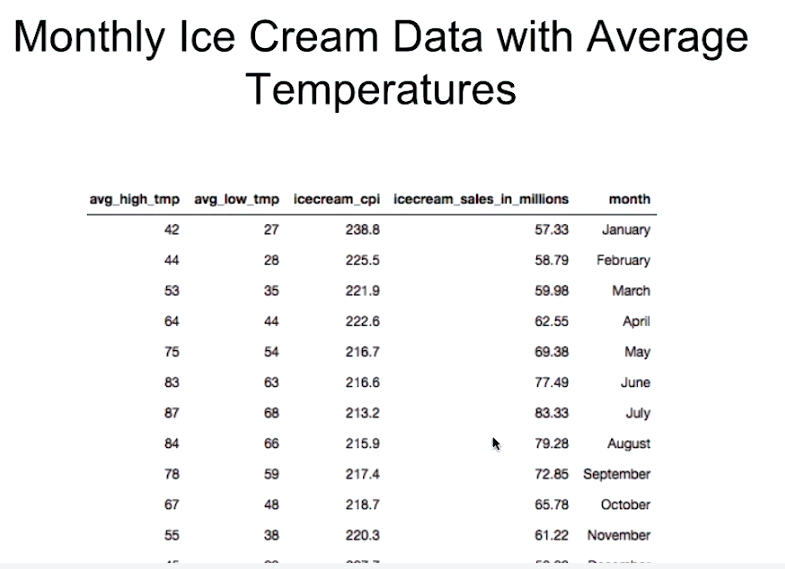

# Chapter 3: Core Aggregation - Combining Information
`$group`, `$unwind`, `$lookup`, `$graphLookup`, `$facet`

### Lecciones

* Tema: La etapa `$group`
* Tema: Etapas del Acumulador con `$project`
* Laboratorio - `$group` y Acumuladores
* Tema: La etapa `$unwind`
* Laboratorio - `$unwind`
* Tema: La etapa $lookup
* Examen
* Laboratorio: Uso de `$lookup`
* Tema: `$graphLookup` Introducción
* Examen
* Tema: `$graphLookup`: Búsqueda simple
* Examen
* Tema: `$graphLookup`: Esquema inverso de búsqueda simple
* Tema: `$graphLookup`: `maxDepth` y `depthField`
* Examen
* Tema: `$graphLookup`: Cross Collection Lookup
* Tema: `$graphLookup`: Consideraciones generales
* Examen
* Laboratorio: `$graphLookup`


## 1. Tema: La etapa `$group`

### Notas de lectura

Página de documentación de [`$group`](https://docs.mongodb.com/manual/reference/operator/aggregation/group/).

### Transcripción

La siguiente etapa que aprenderemos es la etapa `$group`.


La clave para la comprensión del group es comprender el argumento requerido: el campo `_id` de esta etapa.

La expresión o expresiones que especificamos a `_id` se convierten en los criterios que utiliza la etapa de grupo para clasificar y agrupar documentos.

En esta imagen, estamos agrupando monedas según su denominación, por lo que la expresión especificada para `_id` sería la denomination field path (`$denomination`).


Veamos esto en acción usando datos reales.

```sh
db.movies.aggregate([
  {
    "$group": { "_id": "$year" }
  }])
```

Muy bien, agrupamos documentos en nuestra colección `movies` según el valor que tengan en su campo `year`.

Al agrupar, podemos ver que hemos cambiado fundamentalmente la estructura de los documentos resultantes.

```sh
MongoDB Enterprise Cluster0-shard-0:PRIMARY> db.movies.aggregate([
...   {
...     "$group": { "_id": "$year" }
...   }])
{ "_id" : 2019 }
{ "_id" : 2018 }
{ "_id" : 1874 }
{ "_id" : 1880 }
{ "_id" : 1887 }
{ "_id" : "2010�" }
{ "_id" : "2016�" }
{ "_id" : "2007�" }
{ "_id" : 2017 }
{ "_id" : "2003�" }
{ "_id" : 2016 }
{ "_id" : 2014 }
{ "_id" : 2013 }
{ "_id" : 1890 }
{ "_id" : 1888 }
{ "_id" : "2002�" }
{ "_id" : 2011 }
{ "_id" : 2009 }
{ "_id" : "2001�" }
{ "_id" : 2012 }
Type "it" for more
MongoDB Enterprise Cluster0-shard-0:PRIMARY> 
```

Group los comparó en función del valor del campo `year`.

Los documentos con valores idénticos se agruparon, y cada valor único produjo un documento de salida que nos muestra los valores o valores agrupados.

Por sí solo, esto puede o no ser útil dependiendo del caso de uso, y solo agrupar en una expresión es funcionalmente equivalente a usar el comando `distinct`.

Exploremos la otra característica poderosa de la etapa `group`: la capacidad de usar expresiones de acumulación de agregación.


Podemos especificar campos adicionales que queremos calcular en la etapa `group`, tantos como sea necesario para lograr nuestro objetivo.

Aquí vamos a agrupar el valor de `year`, como antes.

```sh
db.movies.aggregate([
  {
    "$group": {
      "_id": "$year",
      "numFilmsThisYear": { "$sum": 1 }
    }
  }
])
```

También calculamos un nuevo campo llamado `numFilmsThisYear` usando la expresión de acumulador `$sum`.

Cada vez que `group` categoriza un documento por nosotros, se llama a la expresión `sum`.

Como especificamos un valor de 1, cada documento coincidente sumará 1 al valor de `num_films_in_year`.

Vamos a verlo en acción.

```sh
MongoDB Enterprise Cluster0-shard-0:PRIMARY> db.movies.aggregate([
...   {
...     "$group": {
...       "_id": "$year",
...       "numFilmsThisYear": { "$sum": 1 }
...     }
...   }
... ])
{ "_id" : 2019, "numFilmsThisYear" : 1 }
{ "_id" : 2018, "numFilmsThisYear" : 1 }
{ "_id" : 1874, "numFilmsThisYear" : 1 }
{ "_id" : 1880, "numFilmsThisYear" : 1 }
{ "_id" : 1887, "numFilmsThisYear" : 1 }
{ "_id" : "2010�", "numFilmsThisYear" : 4 }
{ "_id" : "2016�", "numFilmsThisYear" : 4 }
{ "_id" : "2007�", "numFilmsThisYear" : 3 }
{ "_id" : 2017, "numFilmsThisYear" : 42 }
{ "_id" : "2003�", "numFilmsThisYear" : 1 }
{ "_id" : 2016, "numFilmsThisYear" : 516 }
{ "_id" : 2014, "numFilmsThisYear" : 2058 }
{ "_id" : 2013, "numFilmsThisYear" : 1898 }
{ "_id" : 1890, "numFilmsThisYear" : 4 }
{ "_id" : 1888, "numFilmsThisYear" : 2 }
{ "_id" : "2002�", "numFilmsThisYear" : 2 }
{ "_id" : 2011, "numFilmsThisYear" : 1665 }
{ "_id" : 2009, "numFilmsThisYear" : 1606 }
{ "_id" : "2001�", "numFilmsThisYear" : 1 }
{ "_id" : 2012, "numFilmsThisYear" : 1769 }
Type "it" for more
MongoDB Enterprise Cluster0-shard-0:PRIMARY> 
```

Los mismos resultados que antes, con la adición del campo `numFilmsThisYear`.

Podemos ver que solo había un documento con un valor de 1874 en el campo anual, mientras que había 2,058 documentos con el valor de 2014.

Un año muy ocupado.

Realicemos la misma agregación con la etapa `sort` agregada al final para ordenar nuestros resultados.

```sh
MongoDB Enterprise Cluster0-shard-0:PRIMARY> db.movies.aggregate([
...   {
...     "$group": {
...       "_id": "$year",
...       "numFilmsThisYear": { "$sum": 1 }
...     }
...   }, {
...       $sort: { numFilmsThisYear: -1 }
...   }
... ])
{ "_id" : 2015, "numFilmsThisYear" : 2079 }
{ "_id" : 2014, "numFilmsThisYear" : 2058 }
{ "_id" : 2013, "numFilmsThisYear" : 1898 }
{ "_id" : 2012, "numFilmsThisYear" : 1769 }
{ "_id" : 2011, "numFilmsThisYear" : 1665 }
{ "_id" : 2009, "numFilmsThisYear" : 1606 }
{ "_id" : 2010, "numFilmsThisYear" : 1538 }
{ "_id" : 2008, "numFilmsThisYear" : 1493 }
{ "_id" : 2007, "numFilmsThisYear" : 1328 }
{ "_id" : 2006, "numFilmsThisYear" : 1292 }
{ "_id" : 2005, "numFilmsThisYear" : 1135 }
{ "_id" : 2004, "numFilmsThisYear" : 1007 }
{ "_id" : 2002, "numFilmsThisYear" : 909 }
{ "_id" : 2003, "numFilmsThisYear" : 898 }
{ "_id" : 2001, "numFilmsThisYear" : 862 }
{ "_id" : 2000, "numFilmsThisYear" : 806 }
{ "_id" : 1999, "numFilmsThisYear" : 730 }
{ "_id" : 1998, "numFilmsThisYear" : 722 }
{ "_id" : 1997, "numFilmsThisYear" : 676 }
{ "_id" : 1996, "numFilmsThisYear" : 644 }
Type "it" for more
MongoDB Enterprise Cluster0-shard-0:PRIMARY> 
```

Excelente.

Vemos que a medida que aumenta el valor del año, tenemos más documentos en nuestra colección.

Esto realza la importancia sobre la expresión que especificamos en `_id`.

Los valores de documento utilizados en la expresión deben resolver al mismo valor o combinación de valores para que los documentos coincidan.

Veamos un ejemplo.

```sh
db.movies.aggregate([
  {
    "$group": {
      "_id": {
        "numDirectors": {
          "$cond": [{ "$isArray": "$directors" }, { "$size": "$directors" }, 0]
        }
      },
      "numFilms": { "$sum": 1 },
      "averageMetacritic": { "$avg": "$metacritic" }
    }
  },
  {
    "$sort": { "_id.numDirectors": -1 }
  }
])
```

Aquí estamos usando la expresión `size` para obtener el valor del array `directors`.

Lo estoy envolviendo en la expresión condicional `$cond` porque si el valor que especificamos como tamaño no se evalúa en un array o falta el tamaño fallará.

`"$cond": [{ "$isArray": "$directors" }, { "$size": "$directors" }, 0]`

Entonces, si `directors` es un array (`isArray`), devuelva el tamaño de los directores.

De lo contrario, 0.

A medida que fluyan los documentos, se evaluará y los documentos con el mismo número de directores se agruparán.

Todos los documentos sin información del director o con un array vacío para directores también se agruparán.

Llamamos al campo `numDirectors`, pero podríamos haberle dado el nombre que quisiéramos.

Cuando los documentos se agrupan, calcularemos un campo llamado `numFilms` y solo contaremos cuántos documentos coinciden.

También promediaremos la información metacrítica (`metacritic`) y la asignaremos a un campo llamado `averageMetacritic` para todos los documentos coincidentes en un grupo.

Nuevamente, podríamos haber especificado cualquier nombre para `numFilms` o `averageMetacritic`.

Por último, clasificaremos los documentos en orden descendente.

Vamos a verlo en acción.

```sh
MongoDB Enterprise Cluster0-shard-0:PRIMARY> db.movies.aggregate([
...   {
...     "$group": {
...       "_id": {
...         "numDirectors": {
...           "$cond": [{ "$isArray": "$directors" }, { "$size": "$directors" }, 0]
...         }
...       },
...       "numFilms": { "$sum": 1 },
...       "averageMetacritic": { "$avg": "$metacritic" }
...     }
...   },
...   {
...     "$sort": { "_id.numDirectors": -1 }
...   }
... ])
{ "_id" : { "numDirectors" : 44 }, "numFilms" : 1, "averageMetacritic" : null }
{ "_id" : { "numDirectors" : 42 }, "numFilms" : 1, "averageMetacritic" : null }
{ "_id" : { "numDirectors" : 41 }, "numFilms" : 1, "averageMetacritic" : null }
{ "_id" : { "numDirectors" : 36 }, "numFilms" : 1, "averageMetacritic" : null }
{ "_id" : { "numDirectors" : 30 }, "numFilms" : 1, "averageMetacritic" : 53 }
{ "_id" : { "numDirectors" : 29 }, "numFilms" : 1, "averageMetacritic" : 58 }
{ "_id" : { "numDirectors" : 27 }, "numFilms" : 1, "averageMetacritic" : 43 }
{ "_id" : { "numDirectors" : 26 }, "numFilms" : 2, "averageMetacritic" : null }
{ "_id" : { "numDirectors" : 22 }, "numFilms" : 1, "averageMetacritic" : 66 }
{ "_id" : { "numDirectors" : 21 }, "numFilms" : 1, "averageMetacritic" : null }
{ "_id" : { "numDirectors" : 20 }, "numFilms" : 1, "averageMetacritic" : null }
{ "_id" : { "numDirectors" : 15 }, "numFilms" : 1, "averageMetacritic" : null }
{ "_id" : { "numDirectors" : 14 }, "numFilms" : 3, "averageMetacritic" : null }
{ "_id" : { "numDirectors" : 13 }, "numFilms" : 3, "averageMetacritic" : 18 }
{ "_id" : { "numDirectors" : 12 }, "numFilms" : 1, "averageMetacritic" : null }
{ "_id" : { "numDirectors" : 11 }, "numFilms" : 9, "averageMetacritic" : 48 }
{ "_id" : { "numDirectors" : 10 }, "numFilms" : 9, "averageMetacritic" : 58 }
{ "_id" : { "numDirectors" : 9 }, "numFilms" : 5, "averageMetacritic" : null }
{ "_id" : { "numDirectors" : 8 }, "numFilms" : 13, "averageMetacritic" : 51 }
{ "_id" : { "numDirectors" : 7 }, "numFilms" : 26, "averageMetacritic" : 49 }
Type "it" for more
MongoDB Enterprise Cluster0-shard-0:PRIMARY> 
```

Wow, una película con 44 directores, pero el promedio metacrítico es nulo.

Exploremos esto mirando el documento.

```sh
MongoDB Enterprise Cluster0-shard-0:PRIMARY> db.movies.findOne({ directors: { $size: 44 } })
{
	"_id" : ObjectId("573a13edf29313caabdd41f4"),
	"title" : "Our RoboCop Remake",
	"year" : 2014,
	"runtime" : 108,
	"released" : ISODate("2014-02-06T00:00:00Z"),
	"cast" : [
		"Chase Fein",
		"Nichole Bagby",
		"Willy Roberts",
		"Hank Friedmann"
	],
	"lastupdated" : "2015-09-11 00:13:14.227000000",
	"type" : "movie",
	"languages" : [
		"English"
	],
	"directors" : [
		"Kelsy Abbott",
		"Eric Appel",
		"James Atkinson",
		"Paul Bartunek",
		"Todd Bishop",
		"Stephen Cedars",
		"David Codeglia",
		"Casey Donahue",
		"Fatal Farm",
		"Kate Freund",
		"Matthew Freund",
		"Hank Friedmann",
		"Clint Gage",
		"Ariel Gardner",
		"Paul Isakson",
		"Tom Kauffman",
		"Alex Kavutskiy",
		"Benji Kleiman",
		"Jim Klimek",
		"Jason Makiaris",
		"Timothy Marklevitz",
		"Michael McCafferty",
		"Wendy McColm",
		"Aaron Moles",
		"Nick Mundy",
		"Dan Murrell",
		"John Olsen",
		"Ben Pluimer",
		"Wade Randolph",
		"Kyle Reiter",
		"Ryan Ridley",
		"Dan Riesser",
		"J.D. Ryznar",
		"Joshua Sasson",
		"David Seger",
		"Duncan Skiles",
		"Tyler Spiers",
		"Spencer Strauss",
		"Erni Walker",
		"Jon Watts",
		"Brian Wysol",
		"Scott Yacyshyn",
		"Zach Zdziebko",
		"Mike Manasewitsch"
	],
	"writers" : [
		"Eric Appel",
		"James Atkinson (creator)",
		"Todd Bishop (scene)",
		"Stephen Cedars",
		"David Codeglia",
		"Paul Isakson",
		"Tom Kauffman",
		"Benji Kleiman",
		"Michael McCafferty",
		"John Olsen (creator)",
		"Ryan Ridley",
		"David Seger",
		"Tyler Spiers",
		"Spencer Strauss",
		"Michael Ryan Truly",
		"Scott Yacyshyn"
	],
	"imdb" : {
		"rating" : 6.5,
		"votes" : 156,
		"id" : 3528906
	},
	"countries" : [
		"USA"
	],
	"genres" : [
		"Animation",
		"Action",
		"Comedy"
	],
	"num_mflix_comments" : 1,
	"comments" : [
		{
			"name" : "Mackenzie Bell",
			"email" : "mackenzie_bell@fakegmail.com",
			"movie_id" : ObjectId("573a13edf29313caabdd41f4"),
			"text" : "Alias veritatis quasi a et magni. Tempore ullam omnis temporibus. Eaque officia assumenda quasi vero corrupti laborum recusandae. Blanditiis sequi iusto ducimus officia nam ad.",
			"date" : ISODate("1975-04-10T19:33:13Z")
		}
	]
}
MongoDB Enterprise Cluster0-shard-0:PRIMARY> 

```

Muy bien, escaneando el documento, podemos ver que falta el campo `metacritic`.

Esto ilustra un concepto importante.

Es crucial comprender el tipo de datos que ingresan para interpretar adecuadamente los resultados que calculamos, y es posible que se nos requiera desinfectar nuestra entrada de alguna manera para calcular un resultado.

Las expresiones de acumulador ignorarán los documentos con un valor en el campo especificado que no sea del tipo que la expresión espera, o si falta el valor.

Si todos los documentos encontrados tienen un tipo de datos incorrecto o un valor perdido para el campo deseado, la expresión dará como resultado `null`.

Bien, estamos adquiriendo una buena comprensión de cómo se aplican las expresiones a los documentos de los grupos `_id` y cómo funcionan las expresiones especificadas en nuestros acumuladores.

Pero, ¿qué pasaría si quisiéramos agrupar todos los documentos, en lugar de solo un subconjunto?

Por convención, especificamos `null`, o una cadena vacía, como argumento para `_id`.

```sh
db.movies.aggregate([
  {
    "$group": {
      "_id": null,
      "count": { "$sum": 1 }
    }
  }
])
```

Antes de ejecutar este pipeline, establezcamos una expectativa.

Espero que el valor del recuento sea igual al número de documentos en la colección `movies`.

Probemos

```sh
MongoDB Enterprise Cluster0-shard-0:PRIMARY> db.movies.aggregate([
...   {
...     "$group": {
...       "_id": null,
...       "count": { "$sum": 1 }
...     }
...   }
... ])
{ "_id" : null, "count" : 44497 }
MongoDB Enterprise Cluster0-shard-0:PRIMARY> 
```

Muy bien, 44,497.

¿Y el número total de documentos?

```sh
MongoDB Enterprise Cluster0-shard-0:PRIMARY> db.movies.count()
44497
MongoDB Enterprise Cluster0-shard-0:PRIMARY> 
```

De nuevo 44.497.

Una coincidencia exacta

En lugar de duplicar la funcionalidad de una manera muy poco optimizada, hagamos algo que sea útil para todos los documentos.

Calculemos la calificación metacrítica promedio.

Aquí, usamos una etapa `match` para filtrar documentos con un `metacritic` que no sea mayor o igual a 0.

```sh
db.movies.aggregate([
  {
    "$match": { "metacritic": { "$gte": 0 } }
  },
  {
    "$group": {
      "_id": null,
      "averageMetacritic": { "$avg": "$metacritic" }
    }
  }
])
```

Documentos que les falte información metacrítica, o con un valor no numérico en ese campo no se logrará.

```sh
MongoDB Enterprise Cluster0-shard-0:PRIMARY> db.movies.aggregate([
...   {
...     "$match": { "metacritic": { "$gte": 0 } }
...   },
...   {
...     "$group": {
...       "_id": null,
...       "averageMetacritic": { "$avg": "$metacritic" }
...     }
...   }
... ])
{ "_id" : null, "averageMetacritic" : 56.93454223794781 }
MongoDB Enterprise Cluster0-shard-0:PRIMARY> 
```

Y podemos suponer que la calificación metacrítica promedio entre todos los documentos que tenían información metacrítica es de alrededor de 56.93.

Y eso cubre la etapa `group`.

Resumamos


* `_id` es donde especificamos en qué documentos entrantes se deben agrupar.

* Podemos usar todas las expresiones de acumulador dentro de `$grupo`.

* `$grupo` se puede usar varias veces dentro de una pipeline 

* Puede ser necesario desinfectar los datos entrantes.

## 2. Tema: Etapas del Acumulador con `$project`

### Notas de lectura

Página de documentación de [`accumulator expressions`](https://docs.mongodb.com/manual/reference/operator/aggregation/#group-accumulator-operators).

### Transcripción


Tomemos un momento para aprender sobre el uso de expresiones de acumulador con la etapa `$project`.

El conocimiento de cómo usar estas expresiones puede simplificar enormemente nuestro trabajo.

Una cosa importante a tener en cuenta es que las expresiones de acumulador dentro de `$project` funcionan sobre un array dentro del documento dado.


No llevan valores a cada documento encontrado.

Supongamos que tenemos una colección llamada `example` con el esquema que se muestra en la imagen.

Si realizamos la agregación, se ve el resultado.

Un documento de salida para cada documento de entrada, con el promedio del campo de datos de ese documento.

Para esta lección, vamos a explorar este conjunto de datos.



Es la temperatura baja y alta mensual promedio para los Estados Unidos, así como el índice mensual de precios al consumidor de helado y la información de ventas.

Y así es como se ven los datos en nuestra colección.

```sh
MongoDB Enterprise Cluster0-shard-0:PRIMARY> db.icecream_data.findOne()
{
	"_id" : ObjectId("59bff494f70ff89cacc36f90"),
	"trends" : [
		{
			"month" : "January",
			"avg_high_tmp" : 42,
			"avg_low_tmp" : 27,
			"icecream_cpi" : 238.8,
			"icecream_sales_in_millions" : 115
		},
		{
			"month" : "February",
			"avg_high_tmp" : 44,
			"avg_low_tmp" : 28,
			"icecream_cpi" : 225.5,
			"icecream_sales_in_millions" : 118
		},
		{
			"month" : "March",
			"avg_high_tmp" : 53,
			"avg_low_tmp" : 35,
			"icecream_cpi" : 221.9,
			"icecream_sales_in_millions" : 121
		},
		{
			"month" : "April",
			"avg_high_tmp" : 64,
			"avg_low_tmp" : 44,
			"icecream_cpi" : 222.6,
			"icecream_sales_in_millions" : 125
		},
		{
			"month" : "May",
			"avg_high_tmp" : 75,
			"avg_low_tmp" : 54,
			"icecream_cpi" : 216.7,
			"icecream_sales_in_millions" : 140
		},
		{
			"month" : "June",
			"avg_high_tmp" : 83,
			"avg_low_tmp" : 63,
			"icecream_cpi" : 216.6,
			"icecream_sales_in_millions" : 155
		},
		{
			"month" : "July",
			"avg_high_tmp" : 87,
			"avg_low_tmp" : 68,
			"icecream_cpi" : 213.2,
			"icecream_sales_in_millions" : 163
		},
		{
			"month" : "August",
			"avg_high_tmp" : 84,
			"avg_low_tmp" : 66,
			"icecream_cpi" : 215.9,
			"icecream_sales_in_millions" : 157
		},
		{
			"month" : "September",
			"avg_high_tmp" : 78,
			"avg_low_tmp" : 59,
			"icecream_cpi" : 217.4,
			"icecream_sales_in_millions" : 140
		},
		{
			"month" : "October",
			"avg_high_tmp" : 67,
			"avg_low_tmp" : 48,
			"icecream_cpi" : 218.7,
			"icecream_sales_in_millions" : 128
		},
		{
			"month" : "November",
			"avg_high_tmp" : 55,
			"avg_low_tmp" : 38,
			"icecream_cpi" : 220.3,
			"icecream_sales_in_millions" : 122
		},
		{
			"month" : "December",
			"avg_high_tmp" : 45,
			"avg_low_tmp" : 29,
			"icecream_cpi" : 227.7,
			"icecream_sales_in_millions" : 117
		}
	]
}
MongoDB Enterprise Cluster0-shard-0:PRIMARY> 
```

Podemos ver que tenemos una serie de tendencias con documentos que contienen toda la información que necesitaremos.

Fácil de trabajar.

Avancemos y encontremos los valores máximos y mínimos para la temperatura alta promedio.

Exploraremos dos métodos diferentes para encontrar el máximo.

Primero, usaremos la expresión `$reduce` para encontrar manualmente el máximo.

Antes de ejecutar esto, analicemoslo.

```sh
db.icecream_data.aggregate([
  {
    "$project": {
      "_id": 0,
      "max_high": {
        "$reduce": {
          "input": "$trends",
          "initialValue": -Infinity,
          "in": {
            "$cond": [
              { "$gt": ["$$this.avg_high_tmp", "$$value"] },
              "$$this.avg_high_tmp",
              "$$value"
            ]
          }
        }
      }
    }
  }
])
```

Aquí, estoy especificando la expresión `$reduce`.

`$reduce` toma un array como argumento de entrada aquí `"input": "$trends",`.

Para el argumento `initialValue`, el valor o acumulador con el que comenzaremos, especificamos `-Infinity`.

Espero que nunca tengamos una temperatura media mensual alta de `-Infinity`, pero con toda seriedad, estamos usando `-Infinity` porque cualquier valor razonable que encontremos debería ser mayor.

Por último, especificaremos la lógica del campo final aquí.

```sh
"in": {
   "$cond": [
      { "$gt": ["$$this.avg_high_tmp", "$$value"] },
      "$$this.avg_high_tmp",
      "$$value"
   ]
}
```

Esto está usando el operador condicional `$cond` y dice si `$$this.avg_high_tmp` es mayor que `value` que se encuentra en nuestro acumulador, luego devuelve `$$this.avg_high_tmp`.

De lo contrario, simplemente devuelve `$$value`.

Entonces, compare el valor actual con el valor del acumulador, y si es mayor, lo reemplazaremos con el valor que acabamos de encontrar.

De lo contrario, seguiremos usando nuestro valor máximo actual.

Observe los signos dobles de dólar `$$`.

Estas son variables temporales definidas para usar solo dentro de la expresión `$reduce`, como mencionamos en la estructura de agregación y la lección de sintaxis.

`$this` se refiere al elemento actual en el array.

`$value` se refiere al valor del acumulador.

Hará esto para cada elemento del array.

OK, ejecutemos esto.

```sh
MongoDB Enterprise Cluster0-shard-0:PRIMARY> db.icecream_data.aggregate([
...   {
...     "$project": {
...       "_id": 0,
...       "max_high": {
...         "$reduce": {
...           "input": "$trends",
...           "initialValue": -Infinity,
...           "in": {
...             "$cond": [
...               { "$gt": ["$$this.avg_high_tmp", "$$value"] },
...               "$$this.avg_high_tmp",
...               "$$value"
...             ]
...           }
...         }
...       }
...     }
...   }
... ])
{ "max_high" : 87 }
MongoDB Enterprise Cluster0-shard-0:PRIMARY> 
```

Y vemos que `max_high` fue 87.

Wow, eso fue bastante complicado.

Veamos una forma más fácil de lograr esto.

```sh
db.icecream_data.aggregate([
  { "$project": { "_id": 0, "max_high": { "$max": "$trends.avg_high_tmp" } } }
])
```

Creo que todos podemos estar de acuerdo en que esto es mucho más simple.

Usamos la expresión del acumulador de grupo `$max` para obtener la información que queremos.

```sh
MongoDB Enterprise Cluster0-shard-0:PRIMARY> db.icecream_data.aggregate([
...   { "$project": { "_id": 0, "max_high": { "$max": "$trends.avg_high_tmp" } } }
... ])
{ "max_high" : 87 }
MongoDB Enterprise Cluster0-shard-0:PRIMARY> 
```

Y de nuevo, tenemos un máximo de 87.

OK, obtengamos la temperatura promedio mínima.

```sh
db.icecream_data.aggregate([
  { "$project": { "_id": 0, "min_low": { "$min": "$trends.avg_low_tmp" } } }
])
```

Aquí, usamos la expresión acumuladora `$min` y podemos ver que nuestro mínimo máximo fue 27.

```sh
MongoDB Enterprise Cluster0-shard-0:PRIMARY> db.icecream_data.aggregate([
...   { "$project": { "_id": 0, "min_low": { "$min": "$trends.avg_low_tmp" } } }
... ])
{ "min_low" : 27 }
MongoDB Enterprise Cluster0-shard-0:PRIMARY> 
```

Todo bien.

Ahora sabemos cómo usar max y min.

También podemos calcular promedios y desviaciones estándar.

Calculemos el índice de precios al consumidor promedio para el helado, así como la desviación estándar.

Aquí, estamos calculando ambos en una sola pasada.

```sh
db.icecream_data.aggregate([
  {
    "$project": {
      "_id": 0,
      "average_cpi": { "$avg": "$trends.icecream_cpi" },
      "cpi_deviation": { "$stdDevPop": "$trends.icecream_cpi" }
    }
  }
])
```

Para el campo `average_cpi`, especificamos la expresión promedio `$avg`, diciéndole que promedie los valores en el campo `icecream_cpi` en en el array `trends`.

Y aquí, `cpi_deviation` se calcula de forma casi idéntica, excepto que estamos usando la desviación estándar de la población `$stdDevPop`.

Estamos utilizando `$stdDevPop` porque estamos viendo todo el conjunto de datos.

Sin embargo, si esto fuera solo una muestra de nuestros datos, usaríamos la expresión de desviación estándar de la muestra `$stdDevSamp`.

Excelente.

```sh
MongoDB Enterprise Cluster0-shard-0:PRIMARY> db.icecream_data.aggregate([
...   {
...     "$project": {
...       "_id": 0,
...       "average_cpi": { "$avg": "$trends.icecream_cpi" },
...       "cpi_deviation": { "$stdDevPop": "$trends.icecream_cpi" }
...     }
...   }
... ])
{ "average_cpi" : 221.275, "cpi_deviation" : 6.632511464998266 }
MongoDB Enterprise Cluster0-shard-0:PRIMARY> 
```

Podemos ver que el índice de precios al consumidor promedio `average_cpi` fue de 221.275 y la desviación estándar `cpi_deviation` fue de alrededor de 6.63.

Podríamos usar esta información para encontrar datos que están fuera de las normas para apuntar a áreas que podrían necesitar un análisis especial.

La última expresión de acumulador que me gustaría mostrar es `$sum`.

```sh
db.icecream_data.aggregate([
  {
    "$project": {
      "_id": 0,
      "yearly_sales (millions)": { "$sum": "$trends.icecream_sales_in_millions" }
    }
  }
])
```

Como su nombre lo indica, `$sum` resume los valores de un array.

```sh
MongoDB Enterprise Cluster0-shard-0:PRIMARY> db.icecream_data.aggregate([
...   {
...     "$project": {
...       "_id": 0,
...       "yearly_sales (millions)": { "$sum": "$trends.icecream_sales_in_millions" }
...     }
...   }
... ])
{ "yearly_sales (millions)" : 1601 }
MongoDB Enterprise Cluster0-shard-0:PRIMARY> 
```

Podemos ver que las ventas anuales `yearly_sales` fueron de 1.601 millones.

Y eso cubre las expresiones de acumulador disponibles dentro de `$project`.

Aquí hay algunas cosas a tener en cuenta.


* Las **Accumulator Expressions** (expresiones de acumulador) disponibles en `$project` son:
   * `$sum`, `$avg`, `$max`, `$min`, `$stdDevPop` población de desviación estándar y `$stdDevSam` muestra de desviación estándar.

* Dentro de `$project`, estas expresiones no llevarán su valor adelante y operarán en múltiples documentos.

* Para esto, necesitaríamos usar la etapa de desenrollar y las expresiones de acumulador de grupo.

* Para cálculos más complejos, es útil saber cómo usar `$reduce` y `$map`.

## 3. Laboratorio - `$group` y Acumuladores

Lab - $group and Accumulators

**Problem:**

In the last lab, we calculated a normalized rating that required us to know what the minimum and maximum values for `imdb.votes` were. These values were found using the `$group` stage!

For all films that won at least 1 Oscar, calculate the standard deviation, highest, lowest, and average `imdb.rating`. Use the **sample** standard deviation expression.

**HINT** - All movies in the collection that won an Oscar begin with a string resembling one of the following in their `awards` field

```sh
Won 13 Oscars
Won 1 Oscar
```

Select the correct answer from the choices below. Numbers are truncated to 4 decimal places.

Choose the best answer:


* `{ "highest_rating" : 9.8, "lowest_rating" : 6.5, "average_rating" : 7.5270, "deviation" : 0.5988 }`

* `{ "highest_rating" : 9.2, "lowest_rating" : 4.5, "average_rating" : 7.5270, "deviation" : 0.5984 }`

* `{ "highest_rating" : 9.2, "lowest_rating" : 4.5, "average_rating" : 7.5270, "deviation" : 0.5988 }`

* `{ "highest_rating" : 9.5, "lowest_rating" : 5.9, "average_rating" : 7.5290, "deviation" : 0.5988 }`


## 4. Tema: La etapa `$unwind`

### Notas de lectura

Página de documentación de [`$unwind`](https://docs.mongodb.com/manual/reference/operator/aggregation/unwind/).

### Transcripción

Aprendamos sobre otra etapa útil de agregación, la etapa $ desenrollar.

$ desenrollar listas desenrolla en un campo RA, creando un nuevo documento para cada entrada donde el valor del campo es ahora cada entrada.

Visualicemos esto con un ejemplo.

Si tuviera el siguiente esquema a la izquierda, título y géneros, y $ se desenrolle en el campo de géneros, recuperaré los documentos a la derecha.

¿Qué?

¿Estoy diciendo que estoy generando un documento para cada entrada de matriz, cuando todo estaba ajustado y bien incrustado?

¿Por qué podría ser útil?

Un ejemplo es cuando nos gustaría agrupar entradas individuales.

En la clase grupal, agrupamos las películas según su año.

Y tratamos de agrupar por año y géneros, habríamos obtenido muchas entradas distintas porque, dentro del grupo, las matrices se mezclan en igualdad pura, no en equivalentes.

Por lo tanto, esta matriz de Adventure Action no coincidiría con esta matriz de Action Adventure.

Usemos $ unwind para algo real.

Busquemos los géneros más populares por año desde 2010 hasta 2015 dentro de la colección de la película.

Voy a seguir adelante y limitar esto, y decir que solo estoy considerando entradas con un tiempo de ejecución de 90 minutos o más.

Y para popularidad, usaré un valor en imdb.rating.

Analicemos esto.

Aquí, comenzamos con la etapa $ match, asegurándonos de que tenemos un valor imdb.rating especificando que debe ser mayor que 0 y filtrando documentos según el año y el tiempo de ejecución.

Luego, desenrollamos la matriz de géneros, creando un nuevo documento para cada entrada en la matriz original.

Luego agruparemos en el año, y el campo de valores de género ahora único, y usaremos la expresión promedio para calcular el valor promedio de imdb.rating.

Finalmente, clasificamos, primero en el año descendente, y luego el promedio de la tasa descendente.

Probémoslo.

Está cerca, pero aún no está allí.

Podemos ver que estamos obteniendo el género más popular por año, pero estamos recuperando todos los resultados.

Solo queremos un único documento por año, con el género mejor calificado.

Hay muchas formas de lograr esto.

Solo veremos uno de los más simples.

Examinemos esta nueva tubería.

Es idéntico al anterior, con la adición de estas dos etapas.

La canalización anterior regresaba en el formato que queríamos.

Se devolvieron demasiados documentos.

Aquí, en esta etapa de grupo adicional, agrupamos los documentos en función de su año.

Y dado que ya están ordenados en el orden que necesitamos, solo tomamos el primer valor que encontramos para el género y la calificación promedio.

Luego terminamos con un $ sort para asegurarnos de que sean devueltos y el orden que queremos.

A ver si funciona.

Excelente.

Un documento por año, con el género mejor calificado en ese año.

Hemos visto cómo funciona $ unwind.

Ahora hay algunas cosas menos que cubrir.

Hemos estado usando el formulario corto para $ unwind.

Aquí está la forma larga de contraste.

En la forma larga, especificamos la matriz que queremos desenrollar proporcionando una expresión de ruta de campo al argumento de ruta.

Podemos proporcionar una cadena para incluir ArrayIndex.

Esto creará otro campo en el documento con cualquier nombre que especifiquemos, con el valor del índice del elemento en la matriz original.

Por último, podemos proporcionar un valor verdadero o falso para preservarNullAndEmptyArrays.

True creará una entrada con una matriz vacía, con el valor especificado en la ruta como nulo, faltante o una matriz vacía.

Una cosa más de nota.

Si los documentos en nuestra colección son muy grandes y necesitamos usar $ unwind, podemos exceder el límite de memoria predeterminado del marco de agregación.

Como siempre, haga coincidir temprano, conserve solo la información necesaria con el proyecto y recuerde que podemos especificar permitir el uso del disco.

Y eso cubre $ desenrollar Hemos aprendido mucho.

Recapitulemos algunas cosas.

$ unwind solo funciona en una matriz de valores.

Hay dos formas para relajarse, la forma corta y la forma larga.

Usar desenrollar en grandes colecciones con grandes documentos puede generar problemas de rendimiento.

## 5. Laboratorio - `$unwind`

Lab - $unwind

**Problem:**

Let's use our increasing knowledge of the Aggregation Framework to explore our movies collection in more detail. We'd like to calculate how many movies every **cast** member has been in and get an average `imdb.rating` for each `cast` member.

What is the name, number of movies, and average rating (truncated to one decimal) for the cast member that has been in the most number of movies with **English** as an available language?

Provide the input in the following order and format

```sh
{ "_id": "First Last", "numFilms": 1, "average": 1.1 }
```

Enter answer here:


## 6. Tema: La etapa $lookup

### Notas de lectura

Página de documentación de [`$lookup`](https://docs.mongodb.com/manual/reference/operator/aggregation/lookup/).

### Transcripción

Ahora es el momento de aprender sobre la búsqueda, una etapa poderosa que le permite combinar información de dos colecciones.

Para aquellos con algún conocimiento de SQL, la búsqueda es efectivamente una combinación externa izquierda.

Si eso no tiene ningún sentido, no te preocupes.

Vamos a desglosarlo.

En términos de base de datos, una combinación externa izquierda combina todos los documentos o entradas de la izquierda con documentos o entradas coincidentes de la derecha.

Entonces, un exterior izquierdo unido con B se vería así.

La etapa de búsqueda tiene esta forma.

El campo de aquí es la colección de la que queremos buscar documentos.

Tenga en cuenta que la colección que especifique en el campo desde no se puede fragmentar y debe existir en la misma base de datos.

LocalField aquí es un campo en la colección de trabajo donde expresamos el comando de agregación con el que queremos comparar.

ForeignField aquí, es el campo desde el que queremos comparar en la colección que especificamos.

La búsqueda formará una comparación estricta de igualdad.

Y el campo as aquí, es el nuevo nombre de campo que especificamos que aparecerá en nuestros documentos que contiene coincidencias entre localField y foreignField.

Todas las coincidencias se colocarán en una matriz en este campo.

Si no hubo coincidencias, el campo contendrá una matriz vacía.

Visualicemos esto en un ejemplo.

Supongamos que estamos agregando sobre la colección de una aerolínea y queremos obtener a qué alianza pertenece la aerolínea.

Como el argumento de especificaría alianzas aéreas.

A continuación, especificaríamos el nombre como argumento para localField, el valor con el que queremos comparar.

El argumento de un localField puede resolverse en una matriz o en un solo valor.

Luego, especificamos a las aerolíneas como argumento para un ForeignField con el valor que queremos comparar.

El argumento de ForeignField también puede resolverse en una matriz o en un solo valor.

Podemos ver que según el argumento hasta ahora, Penguin Air no coincidirá con nada.

Delta Airlines igualará a SkyTeam.

Y Lufthansa coincidirá con Star Alliance.

Esos partidos se incorporaron al documento actual como alianza.

Podríamos haber dado cualquier valor de cadena que quisiéramos, pero tenga en cuenta que si especificamos un nombre que ya existe en el documento de trabajo, ese campo se sobrescribirá.

Observe aquí que debido a que el documento se llamó Penguin Air y no tuvo ningún resultado, hay una matriz vacía.

A menudo, después de una búsqueda, queremos seguirlo con una etapa de coincidencia para filtrar los documentos.

Otra cosa que debe saber es que la búsqueda recupera todo el documento que coincide, no solo el campo que especificamos, el ForeignField.

Muy bien, veamos la búsqueda en el uso real.

Combinemos la información de la colección de aerolíneas con la colección de alianzas aéreas, colocando toda la información de la aerolínea en el documento de la alianza.

Primero, veamos el esquema en nuestra colección de alianzas de aerolíneas.

OK, los datos que necesitamos para localField están en el campo de la aerolínea.

Veamos el esquema de la aerolínea, para saber qué valor usar como el ForeignField.

Muy bien, bastante fácil.

Parece que la información que necesitamos para ForeignField está en el campo de nombre.

Esa debería ser toda la información que necesitamos.

Construyamos la tubería.

Muy bien, especificamos aerolíneas aéreas al campo desde, aerolíneas como el nombre localField como el ForeignField.

Y aquí elegimos sobrescribir el campo de las aerolíneas con la información que recibimos.

Que tiene sentido.

Reemplazaremos los nombres con documentos completos.

Veamos el resultado.

Muy genial.

Podemos ver que la búsqueda hizo exactamente lo que esperábamos que hiciera.

Podríamos seguir esto con algunas proyecciones o incluso con otra etapa de búsqueda para realizar una remodelación y análisis potentes.

Pero por ahora, eso es suficiente.

Hemos cubierto mucha información en esta lección.

La búsqueda es una etapa poderosa que puede ayudar a reducir las solicitudes de red y combinar información de diferentes colecciones para un análisis poderoso y profundo.

Aquí hay algunas cosas a tener en cuenta.

El campo de no se puede fragmentar.

La colección from debe estar en la misma base de datos.

Los valores en localField y foreignField coinciden en igualdad.

Y como puede ser cualquier nombre, pero si existe en el documento de trabajo, ese campo se sobrescribirá.

## 7. Examen The $lookup Stage

**Problem:**

Which of the following statements is true about the `$lookup` stage?

Check all answers that apply:

* Specifying an existing field name to **as** will overwrite the the existing field

* The collection specified in **from** cannot be sharded

* `$lookup` matches between **localField** and **foreignField** with an equality match

* You can specify a collection in another database to **from**

## 8. Laboratorio: Uso de `$lookup`

Lab - Using $lookup

**Problem:**

Which alliance from `air_alliances` flies the most **routes** with either a `Boeing 747 or an Airbus A380` (abbreviated 747 and 380 in `air_routes`)?

Choose the best answer:

* "OneWorld"

* "Star Alliance"

* "SkyTeam"

## 9. Tema: `$graphLookup` Introducción

### Transcripción

A estas alturas, probablemente ya se haya dado cuenta de que MongoDB ofrece un modelo de datos flexible.

Los documentos pueden tener diferentes formas y estar organizados de tal manera que reflejen tanto las estructuras de datos dinámicos de las aplicaciones como los requisitos de escalabilidad.

Podemos tener campos muy planos, solo de nivel raíz en nuestros documentos, son esquemas bastante complejos y profundamente anidados que reflejan las necesidades de obligación de operaciones rápidas y lógica comercial.

Un conjunto común de estructuras de datos que requieren niveles de anidamiento complejos y una capa de almacenamiento flexible tiende a ser un gráfico o un caso de uso de jerarquía de árbol.

Los conjuntos de datos pueden ser tan simples como un almacén de datos de recursos humanos de la cadena de informes o estructuras de datos complejas que mapean rutas de viaje del aeropuerto o incluso redes sociales.

El cambio de Telco, la taxonomía de enfermedades y la detección de fraude se encuentran entre varios casos de uso diferentes donde la capacidad de consulta de gráficos y la representación flexible de datos van de la mano.

A diferencia de las bases de datos de gráficos específicos, MongoDB está diseñado para ser una base de datos de propósito general, lo que significa que queremos proporcionar una infraestructura muy buena para soportar casos de uso operativos y analíticos.

Con MongoDB 3.4, estamos ampliando además las capacidades de consulta de MongoDB al ofrecer una búsqueda de gráficos en dólares.

La búsqueda de gráficos permite a los desarrolladores combinar sus conjuntos de datos flexibles con operaciones gráficas o de tipo gráfico.

Esto permite que todos esos conjuntos de datos complejos se procesen, analicen y transformen utilizando una única fuente de datos.

Al diseñar e implementar relaciones gráficas y diseñar sus consultas, generalmente necesitamos pensar en relaciones transitivas.

Si a informa a b, y b informa a c, entonces a indirectamente informa a c.

En SQL estándar, estas consultas jerárquicas se implementan mediante expresiones de tabla comunes recursivas.

En álgebra relacional, esto se llama cierre transitivo.

La búsqueda de gráficos permite buscar de forma recursiva un conjunto de documentos con una relación definida con un documento inicial.

La búsqueda de gráficos es muy similar a nuestro operador de búsqueda de dólares.

Es otra búsqueda con algunas variaciones importantes.

Tendremos desde el campo que especifica una colección de la que esta etapa recupera resultados, un campo startWith que especifica el valor o los valores de connectToField con los que deberíamos comenzar nuestra búsqueda recursiva.

Tenemos un connectFromField que determina un campo en cada documento de la colección from que se utiliza para realizar la siguiente consulta recursiva.

Y tenemos el campo Conectar a que establece el campo en cada documento de la colección from que se consulta en cada consulta recursiva.

Como especifica un campo en el documento de salida al que se le asignará la matriz de resultados de esa búsqueda gráfica.

maxDepth-- este es un campo opcional que especifica el número máximo de profundidad recursiva para la búsqueda de gráficos.

depthField, también opcional, especifica el nombre del campo en el que el documento resultante se establecerá en la profundidad recursiva a la que se recuperó el documento.

Esto será 0 para la primera búsqueda.

Y también tenemos restrictSearchWithMatch, otro campo opcional que especifica un filtro para aplicar cuando se realiza la búsqueda en la colección from.

Se ve bien, ¿no?

En la siguiente lección, nos vamos a ocupar y comenzar a experimentar con esta nueva característica, buscando un nuevo conjunto de ejemplos diferentes.

## 10. Examen $graphLookup Introduction

**Problem:**

Which of the following statements apply to `$graphLookup` operator? *check all that apply*

Check all answers that apply:

* `$graphLookup` is a new stage of the aggregation pipeline introduced in MongoDB 3.2

* `$lookup` and `$graphLookup` stages require the exact same fields in their specification.

* Provides MongoDB with graph or graph-like capabilities

* `$graphLookup` provides MongoDB a transitive closure implementation

* `$graphLookup` depends on `$lookup` operator. Cannot be used without `$lookup`

## 11. Tema: `$graphLookup`: Búsqueda Simple 

### Transcripción

Mientras modelamos estructuras de árbol, hay diferentes patrones que podemos seguir dependiendo de cómo deseamos hacer malabarismos con nuestros datos.

Así que echemos un vistazo, por ejemplo, a un organigrama.

Vamos a tener diferentes personas en la empresa, como por ejemplo, vamos a tener nuestro CEO.

Y para nuestro CEO, él tendrá un montón de informes diferentes, como el CMO, CRO, CTO, servicios y CFO.

Todos ellos informan, obviamente, a este individuo en particular.

Entonces vamos a tener una subcapa entre esto donde vamos a tener las diferentes personas que informan directamente al CTO.

En este caso, vamos a tener el SVP de Ingeniería reportando directamente a ese CTO y también el VP de Producto también al CTO.

Y más adelante, tendremos los diferentes informes de las diferentes áreas centrales, como por ejemplo, en educación, nube o incluso vicepresidente de Core.

Por lo tanto, al modelar dicho árbol en un documento o una estructura de documentos, podríamos tener un par de alternativas diferentes.

Entonces, por ejemplo, en esta estructura particular, vamos a tener una referencia principal.

Ahora, una referencia principal significa que para cada documento vamos a tener un atributo particular de campo que nos indicará a quién informamos, quién es nuestro principal en la estructura de árbol, o en este caso, el organigrama que están definiendo

Entonces, por ejemplo, aquí podemos ver que Carlos, nuestro CRO, informa a 1.

Y 1 refiriéndome al _id, la clave principal, de Dave, que es nuestro CEO.

Así que vamos a tener una relación de 1 a n, donde cada documento apuntará a sus informes_a, que a su vez será el valor del campo _id del padre designado.

Con este esquema, es bastante fácil navegar entre diferentes documentos.

Entonces, si quiero ir de Carlos a sus informes_a, o a quién le informa, simplemente sigo esto y voy directamente a Dave, que es valor _id es igual a 1.

Por lo tanto, siempre hay un enlace entre reports_to y _id.

Ahora, ¿qué sucede si queremos saber la estructura de informes completa de, por ejemplo, Dave?

Quiero conocer todos sus informes directos, pero también los informes de sus informes directos.

Podemos ir a buscar, por ejemplo, el de Dave.

Y sabemos que no informa a nadie, pero tenemos su _id.

Entonces, si queremos saber exactamente quién informa directamente a Dave, podemos usar la referencia y el valor de su _id y encontrar todos sus informes directos.

Si queremos conocer la estructura completa de los informes, bueno, solo tendríamos que ir y venir para hacer la base de datos para comprender exactamente, para cada elemento o para cada documento que encontremos, verificar quién informa y hacer la consulta de nuevo, basado en su _id.

Ahora este ping continuo de la base de datos es bastante ineficiente.

Para cada solicitud que recibamos, necesitamos hacer ping a la base de datos nuevamente.

La alternativa a esta operación será utilizar nuestro nuevo operador graphLookup.

Entonces, en este ejemplo particular aquí, quiero conocer la estructura de informes completa que informa a nuestro CTO, Eliot.

Entonces, para hacer esto con graphLookup, necesitamos ejecutar una consulta similar a esta.

Comenzamos haciendo coincidir el documento que queremos comenzar a analizar con el operador de coincidencia.

Entonces, en este caso, quiero encontrar la estructura de informes para Eliot, por lo tanto, voy a hacer coincidir todos los documentos que contienen este nombre en particular.

Y luego tenemos el operador graphLookup que recuperará todos los documentos descendientes posteriores de la referencia principal.

Así que esto será una auto búsqueda.

Comenzando con el valor _id del documento anterior encontrado por primera vez, conectando desde el campo _id, este es el campo en el que buscaré los siguientes GraphLookups, pero vamos a utilizar el valor reports_to para que coincida, y usaremos ese para usar en las consultas posteriores.

Y luego almacenaré todos los documentos que encuentre desde el bloqueo como all_reports.

Después de ejecutar esta consulta, encontraré el documento que quería, el que coincide con el nombre es igual a Eliot.

Puedo ver su título.

Y luego puedo encontrar, gracias a graphLookup, todos sus informes descendientes.

En este caso, serán Cailin, luego Andrew, Ron, Shannon y Elyse.

Ahora esto solo me dice a todos los descendientes debajo de Eliot.

Entonces, en este caso, graphLookup me permitirá encontrar todos los nodos diferentes que están debajo de un nodo particular que estoy encontrando.

También podemos hacer la pregunta inversa, que es, dado un elemento en el organigrama, ¿cuál es la jerarquía de los niveles superiores de informes?

Entonces, por ejemplo, si le doy al vicepresidente de educación, quiero conocer la estructura completa hasta llegar al padre principal de nuestro árbol, el nivel raíz.

Para hacer eso, lo que tenemos que hacer es, nuevamente, hacer coincidir el elemento que nos interesa, en este caso Shannon, y luego invertir los campos connectFrom y connectTo, pero también comenzando con el valor startWith diferente.

En este caso, comenzaremos con reports_to.

connectFrom también será informes_a pero el campo de conexión, el valor que vamos a elegir para que coincida con informes_a será _id.

Y vamos a almacenar eso*********información, esa cadena, en un campo llamado jefes.

Una vez que ejecuto esto, puedo ver que Shannon tiene el conjunto de jefes.

El tiene a Dave.

Eliot y, obviamente, su jefe directo, Andrew.

## 12. Examen `$graphLookup`: Simple Lookup

**Problem:**

Which of the following statements is/are correct? *Check all that apply*.

Check all answers that apply:

* `connectToField` will be used on recursive find operations

* `as` determines a collection where `$graphLookup` will store the stage results

* `connectFromField` value will be use to match `connectToField` in a recursive match

* `startWith` indicates the index that should be use to execute the recursive match

## 13. Tema: `$graphLookup`: Esquema inverso de búsqueda simple

### Transcripción

Otro patrón que podemos aplicar será tener la referencia inversa.

Digamos que en este caso, vamos a tener la definición de nuestro CEO, pero dentro de ese documento vamos a tener la referencia a todos sus informes directos, sus nodos hijos.

Lo mismo para el CTO, podemos hacer referencia a todos sus informes inmediatos, y lo mismo en el futuro.

Para hacer esto, solo necesitamos transformar nuestros documentos.

En lugar de tener una referencia a sus padres, lo que vamos a tener es que cada referencia de documento es informes directos.

En este ejemplo aquí, podemos ver que Dave, con su título de CEO, tiene esta lista de informes directos, Eliot, Meagan, Carlos, Richard y Kristen.

Con esta estructura, conseguir hijos inmediatos se puede lograr con una sola operación.

Si encuentro documentos donde el nombre es igual a Dave, obtengo de inmediato su lista completa de informes directos.

Así que un nivel por debajo de Dave.

Pero llevar el árbol completo a su último elemento requiere algo más elaborado.

Y nuevamente, $ graphLookup está aquí para el rescate con una sola operación.

En este escenario, cambiamos el esquema del documento con las referencias secundarias inmediatas, nuevamente, en direct_reports.

Y por lo tanto, si queremos obtener la lista completa de descendientes, tendremos que hacer lo siguiente.

Volveremos a la misma coincidencia, encontraremos el nodo donde queremos comenzar y expresaremos de dónde vamos a buscar la información.

En este caso, una vez más, un self graphLookup, self lookup.

Vamos a comenzar con los informes directos, por lo que este es el primer conjunto de valores que vamos a utilizar para iterar.

Vamos a conectar directFromField direct_reports, vamos a usar eso para las consultas gráficas posteriores, pero vamos a conectar el nombre de ConnectToField.

Entonces, cada vez que combinemos un elemento de informes directos con un nombre, haremos esto de forma recursiva.

Y comenzaremos esto en all_reports.

Una vez que ejecutamos esto, tendremos la siguiente estructura.

Descubriremos que Dave tiene un conjunto de informes directos, pero todos los informes se encontrarán en este campo.

Vamos a tener a Dan, Shannon, Elyse, Ron, Andrew, etc.

Entonces, al final, lo que tenemos es básicamente, para todos los informes directos diferentes, hacemos coincidir, o estamos tratando de encontrar, un documento en el campo de nombre.

Y para sus informes directos, hacemos esto de forma recursiva,

## 14. Tema: `$graphLookup`: `maxDepth` y `depthField`

### Transcripción

En algunas situaciones, es posible que no nos interese la lista completa.

Digamos, por ejemplo, que solo queremos los informes directos de Dave y sus informes directos.

Entonces, digamos dos niveles más abajo.

Ahora, una sola búsqueda es de profundidad cero, lo que significa que si coincidimos con Dave y solo estamos interesados ​​en conocer los documentos de sus informes directos, solo necesitamos establecer la profundidad de nuestra búsqueda en cero.

Pero si queremos bajar dos niveles, necesitaríamos tener una profundidad de uno.

Y por lo tanto, encontraremos una estructura de datos completa de Andrew, Elyse y Ron.

La búsqueda de gráficos nos permite hacer eso.

Usando el conjunto de datos anterior, referencia secundaria, donde tenemos una referencia de informes directos dentro de cada documento.

Si desea bajar dos niveles, hasta informes de nivel descendente_2, simplemente especifique un campo maxDepth, el valor es igual a 1, en nuestro GraphLookup.

Después de ejecutar esto, tenemos nuestros documentos coincidentes.

Y luego la lista de resultados de informes directos a Dave hasta dos niveles inferiores.

Entonces podemos ver aquí que, por ejemplo, Andrew aparecerá en la lista, así como Ron y Elyse, y obviamente, todos los informes directos de Dave.

Básicamente, maxDepth restringirá cuántas veces queremos buscar documentos que coincidan recursivamente o que estén conectados usando FromField y connecToField.

Pero digamos que, además de definir un campo maxDepth de solo quiero bajar dos niveles, también quiero saber qué tan lejos están esos elementos del primer elemento que encuentro en mi búsqueda.

Básicamente, quiero saber cuántas búsquedas recursivas necesité hacer para encontrar los documentos en particular.

Para eso, tengo depthField, que puedo especificar un nombre de campo que me dirá exactamente eso, cuántas búsquedas recursivas fueron necesarias para obtener este punto en particular.

Cuando ejecuto esto, puedo ver que Eliot está en el número cero, lo que significa que solo necesitaba una sola búsqueda para encontrarlo.

Por otra parte, es la búsqueda de primera base.

Lo mismo para Meagan, lo mismo para Richard, lo mismo para Carlos.

Pero para Andrew, necesito hacer una búsqueda recursiva o, en este caso, dos búsquedas recursivas hacia abajo.

Lo mismo para Ron y lo mismo para Elyse.

Al especificar el nivel de campo de profundidad, puedo obtener la información de cuántas búsquedas recursivas fueron necesarias para encontrar ese elemento en particular en el campo de descendientes aquí.

## 15. Examen `$graphLookup`: `maxDepth` and `depthField``

**Problem:**

Which of the following statements are incorrect? *Check all that apply*

Check all answers that apply:

* `maxDepth` allows to specify the number of recursive lookups

* `depthField` determines a field, in the result document, which specifies the number of recursive lookup needed to reach that document

* `maxDepth` only takes `$long` values

* `depthField` determines a field, which contains the value number of documents matched by the recursive lookup

## 16. Tema: `$graphLookup`: Cross Collection Lookup

### Transcripción

Hasta ahora hemos estado analizando la búsqueda de gráficos en las auto-búsquedas, lo que significa que encontramos un documento, luego implementamos la búsqueda de gráficos y luego encontramos documentos posteriores que coinciden con lo que pretendía.

Y luego hago otra en la autounión, y así sucesivamente, lo cual es agradable y divertido, pero podemos hacer mucho más que eso.

Como en cualquier otra búsqueda ordinaria, podemos comenzar desde una colección inicial y buscar otras colecciones, y hacer las búsquedas recursivas como mejor nos parezca.

Obviamente, no necesitamos restringirnos a un solo documento original.

Tenemos múltiples que seguirán siempre el mismo comportamiento.

Para esta demostración en particular, voy a usar esta base de datos aérea que tengo aquí.

Entonces, en esta base de datos aérea, lo que tengo son dos colecciones, una de ellas son aerolíneas y otra son rutas.

En un documento de una aerolínea en particular, es un documento bastante plano, donde tengo toda la información que necesito para una aerolínea en particular.

Su alias, su código iata, el país y la ubicación de la aerolínea en sí misma, básicamente dicen qué aeropuerto es la base de esta aerolínea de origen.

En las rutas de recolección, lo que puedo encontrar es información sobre la aerolínea, de dónde sale el vuelo, el aeropuerto de origen, a dónde llega, el aeropuerto de destino y alguna otra información, como si es código compartido, sus paradas y el tipo del avión o el avión que realmente está operando esta ruta en particular.

Entonces, en este escenario, voy a tener información sobre aerolíneas e información sobre rutas.

Entonces, si imagina este mapa del mundo muy esquemático, donde tenemos los puntos azules e identificamos los aeropuertos, y las rutas que conectan estos puntos, dando a una aerolínea que opera ciertas rutas, podemos intentar identificar eso desde un aeropuerto determinado, donde la aerolínea se basa, ¿a dónde puedo ir con un máximo, por ejemplo, de una escala?

Digamos que quiero ir desde este lugar en particular aquí, ¿por dónde puedo pasar?

Tengo al menos tres rutas diferentes que salen aquí.

Pero a partir de esas rutas puedo tomar muchas otras formas, dependiendo de la cantidad de escalas que quiero hacer.

Si quiero una lista de todas las conexiones, y restringiendo, por ejemplo, las escalas numéricas, o algo así, podemos hacerlo usando la búsqueda de gráficos.

De nuevo, si quiero comenzar con TAP Portugal, encontrar su propio aeropuerto base y conocer cada destino, independientemente de la aerolínea, que puedo ir desde su aeropuerto base, en este caso, Portugal, mi ciudad natal, muy encantadora ciudad: ¿a dónde puedo ir con un máximo de una conexión?

La lista completa de los aeropuertos conectados estará dada por esta consulta.

Puedo ver aquí que voy hasta Atenas pasando por el aeropuerto de Gatwick en Londres.

Ahora, comparando maxDepth aquí, estamos usando uno en lugar de cero, es porque estamos comenzando desde las aerolíneas y buscando rutas.

Y maxDepth solo restringirá el número de búsquedas recursivas en la colección frontal.

Así que comencé a recopilar el documento correspondiente que quiero y luego solo voy a buscar, o en este caso, la búsqueda gráfica dos veces, la primera y otra, en la colección de la ruta.

Anteriormente, utilizamos el mismo valor para los dos niveles inferiores ya que estábamos haciendo una búsqueda auto recursiva.

Pero digamos que, comenzar desde un aeropuerto en particular y conectarse a todos los demás aeropuertos, independientemente de las aerolíneas, no es realmente lo que pretendía.

No solo quiero comenzar desde el aeropuerto base de una aerolínea determinada, también quiero asegurarme de que todos los vuelos con los que me conecto utilicen exactamente la misma aerolínea.

Así que no quiero conectarme, por ejemplo, desde Oporto a Nueva York y luego el próximo salto para estar en una aerolínea diferente.

No, en absoluto.

Quiero asegurarme de que siempre estoy usando el mismo operador en toda su red.

Para hacerlo, también podemos restringir la búsqueda con una coincidencia.

Y en este caso, quiero asegurarme de que las únicas búsquedas que recuperaría coincidan con el nombre de la aerolínea con el mismo que tenía la intención original, en este caso, TAP Portugal.

¿Entonces que estamos haciendo?

Estamos haciendo coincidir las aerolíneas, encontrando que el documento de la aerolínea que coincide con el nombre es igual a TAP Portugal, vamos a graficar Búsqueda de rutas, configurando los valores en cadena, utilizando como valor inicial del aeropuerto base de estos documentos originales.

Conectando el aeropuerto de destino con el aeropuerto de origen, por lo que el valor del aeropuerto de destino utilizará esta consulta recursiva sobre el aeropuerto de origen de campo con un máximo de un salto.

Así que solo quiero una escala.

Pero siempre usando la misma aerolínea.

Una vez que haga esto, puedo tener la lista completa de todas las conexiones que pretendía, siempre viajando dentro de la misma aerolínea.

## 17. Tema: `$graphLookup`: Consideraciones Generales

### Transcripción

Así que ahora no te olvides de las restricciones subyacentes de ejecutar tuberías de agregación.

Lo primero que quiero llamar su atención es la asignación de memoria.

La búsqueda del gráfico en dólares, debido a su naturaleza recursiva, y al hecho de que puede recuperar varios miles de megabytes de memoria solo en una sola consulta puede requerir una cantidad significativa de memoria para funcionar correctamente, no solo debido a la recursividad, sino también a la La complejidad de los documentos y la amplitud de sus consultas.

Así que allowDiskUse será tu amigo.

Otra cosa importante a tener en cuenta es el uso de índices.

Ahora en MongoDB, como en cualquier otra base de datos, los índices acelerarán o podrían acelerar nuestras consultas.

En el caso de la búsqueda de gráficos, tener nuestro connectToField, que es el campo en la colección frontal que vamos a utilizar en la consulta recursiva.

Tener este campo particular indexado será algo bueno, bueno.

Otro aspecto importante a tener en cuenta es el hecho de que nuestra colección no se puede fragmentar.

Entonces, si está utilizando la etapa de búsqueda de gráficos, no podemos usar una colección de fragmentos en nuestra colección from.

Además, las etapas de coincidencia no relacionadas no se transfieren antes de la búsqueda de gráficos en la tubería.

Por lo tanto, no se optimizarán si no están relacionados con el operador de búsqueda de gráficos en dólares.

Así que tenlo en cuenta cuando construyas tu tubería.

Ahora, y lo último importante, está dando su naturaleza de búsqueda recursiva, la búsqueda de gráficos en dólares hace que permita el uso de memoria sin derramar en el disco.

Toma eso en consideración.

Aunque esté utilizando permitir el uso del disco, esto puede superar los 100 megabytes de memoria máxima permitida por canalización de agregación

## 18. Examen `$graphLookup`: General Considerations

**Problem:**

Consider the following statement:

```sh
``$graphLookup`` is required to be the last element on the pipeline.
```

Which of the following is true about the statement?

Choose the best answer:

* This is incorrect. `graphLookup` needs to be the first element of the pipeline, regardless of other stages needed to perform the desired query.

* This is incorrect. `$graphLookup` can be used in any position of the pipeline and acts in the same way as a regular `$lookup`.

* This is correct because `$graphLookup` pipes out the results of recursive search into a collection, similar to `$out` stage.

* This is correct because of the recursive nature of `$graphLookup` we want to save resources for last.

## 19. Laboratorio: `$graphLookup`

Lab: $graphLookup

**Problem:**

Now that you have been introduced to `$graphLookup`, let's use it to solve an interesting need. You are working for a travel agency and would like to find routes for a client! For this exercise, we'll be using the **air_airlines**, **air_alliances**, and **air_routes** collections in the **aggregations** database.

* The **air_airlines** collection will use the following schema:

```sh
{
    "_id" : ObjectId("56e9b497732b6122f8790280"),
    "airline" : 4,
    "name" : "2 Sqn No 1 Elementary Flying Training School",
    "alias" : "",
    "iata" : "WYT",
    "icao" : "",
    "active" : "N",
    "country" : "United Kingdom",
    "base" : "HGH"
}
```

* The **air_routes** collection will use this schema:

```sh
{
    "_id" : ObjectId("56e9b39b732b6122f877fa31"),
    "airline" : {
            "id" : 410,
            "name" : "Aerocondor",
            "alias" : "2B",
            "iata" : "ARD"
    },
    "src_airport" : "CEK",
    "dst_airport" : "KZN",
    "codeshare" : "",
    "stops" : 0,
    "airplane" : "CR2"
}
```

* Finally, the **air_alliances** collection will show the airlines that are in each alliance, with this schema:

```sh
{
    "_id" : ObjectId("581288b9f374076da2e36fe5"),
    "name" : "Star Alliance",
    "airlines" : [
            "Air Canada",
            "Adria Airways",
            "Avianca",
            "Scandinavian Airlines",
            "All Nippon Airways",
            "Brussels Airlines",
            "Shenzhen Airlines",
            "Air China",
            "Air New Zealand",
            "Asiana Airlines",
            "Brussels Airlines",
            "Copa Airlines",
            "Croatia Airlines",
            "EgyptAir",
            "TAP Portugal",
            "United Airlines",
            "Turkish Airlines",
            "Swiss International Air Lines",
            "Lufthansa",
            "EVA Air",
            "South African Airways",
            "Singapore Airlines"
    ]
}
```

Determine the approach that satisfies the following question in the most efficient manner:

Find the list of all possible distinct destinations, with at most one layover, departing from the base airports of airlines that make part of the "OneWorld" alliance. The airlines should be national carriers from Germany, Spain or Canada only. Include both the destination and which airline services that location. As a small hint, you should find **158** destinations.

Select the correct pipeline from the following set of options:

Choose the best answer:

* 1)

```sh
var airlines = [];
db.air_alliances.find({"name": "OneWorld"}).forEach(function(doc){
  airlines = doc.airlines
})
var oneWorldAirlines = db.air_airlines.find({"name": {"$in": airlines}})

oneWorldAirlines.forEach(function(airline){
  db.air_alliances.aggregate([
  {"$graphLookup": {
    "startWith": airline.base,
    "from": "air_routes",
    "connectFromField": "dst_airport",
    "connectToField": "src_airport",
    "as": "connections",
    "maxDepth": 1
  }}])
})
```

* 2)

```sh
db.air_airlines.aggregate(
  [
    {"$match": {"country": {"$in": ["Spain", "Germany", "Canada"]}}},
    {"$lookup": {
      "from": "air_alliances",
      "foreignField": "airlines",
      "localField": "name",
      "as": "alliance"
    }},
    {"$match": {"alliance.name": "OneWorld"}},
    {"$graphLookup": {
      "startWith": "$base",
      "from": "air_routes",
      "connectFromField": "dst_airport",
      "connectToField": "src_airport",
      "as": "connections",
      "maxDepth": 1
    }},
    {"$project":{ "connections.dst_airport": 1 }},
    {"$unwind": "$connections"},
    {"$group": { "_id": "$connections.dst_airport" }}
  ]
)
```

* 3)

```sh
db.air_alliances.aggregate([{
  $match: { name: "OneWorld" }
}, {
  $graphLookup: {
    startWith: "$airlines",
    from: "air_airlines",
    connectFromField: "name",
    connectToField: "name",
    as: "airlines",
    maxDepth: 0,
    restrictSearchWithMatch: {
      country: { $in: ["Germany", "Spain", "Canada"] }
    }
  }
}, {
  $graphLookup: {
    startWith: "$airlines.base",
    from: "air_routes",
    connectFromField: "dst_airport",
    connectToField: "src_airport",
    as: "connections",
    maxDepth: 1
  }
}, {
  $project: {
    validAirlines: "$airlines.name",
    "connections.dst_airport": 1,
    "connections.airline.name": 1
  }
},
{ $unwind: "$connections" },
{
  $project: {
    isValid: { $in: ["$connections.airline.name", "$validAirlines"] },
    "connections.dst_airport": 1
  }
},
{ $match: { isValid: true } },
{ $group: { _id: "$connections.dst_airport" } }
])
```

* 4)

```sh
db.air_routes.aggregate(
  [
    {"$lookup": {
      "from": "air_alliances",
      "foreignField": "airlines",
      "localField": "airline.name",
      "as": "alliance"
    }},
    {"$match": {"alliance.name": "OneWorld"}},
    {"$lookup": {
      "from": "air_airlines",
      "foreignField": "name",
      "localField": "airline.name",
      "as": "airline"
    }},
    {"$graphLookup": {
      "startWith": "$airline.base",
      "from": "air_routes",
      "connectFromField": "dst_airport",
      "connectToField": "src_airport",
      "as": "connections",
      "maxDepth": 1
    }},
    {"$project":{ "connections.dst_airport": 1 }},
    {"$unwind": "$connections"},
    {"$group": { "_id": "$connections.dst_airport" }}
  ]
)
```


