# Capítulo 4 Core Aggregation Multidimensional Grouping

Lecciones

* Tema: Facetas: Introducción
* Tema: Facetas: consulta de una sola faceta
* Examen
* Tema: La Etapa `$bucket`
* Tema: Facetas: Buckets manuales
* Examen
* Tema: La Etapa `$bucketAuto`
* Tema: Facetas: Auto Buckets
* Examen
* Tema: Facetas: Múltiples Facetas
* Examen
* Laboratorio - `$facets`
* Tema: La etapa `$sortByCount`

## 1. Tema: Facetas: Introducción

### Transcripción

Muchos de estos casos requieren la capacidad de manipular, inspeccionar y analizar datos en múltiples dimensiones.

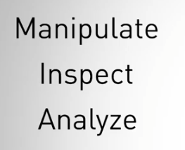


Además de esto, estos casos de uso a menudo requerían que esta categorización de datos cumpla con aplicaciones estrictas, así como acuerdos de nivel de servicio (SLA), 


para permitir interfaces receptivas En MongoDB 3.4, presentamos soporte para navegación por facetas que permite a los desarrolladores crear rápidamente una interfaz que caracteriza los resultados de la consulta a través de múltiples dimensiones o facetas.


Los usuarios de la aplicación pueden reducir sus resultados de consulta seleccionando un valor de faceta como un filtro posterior que proporciona una interfaz intuitiva para explorar un conjunto de datos.

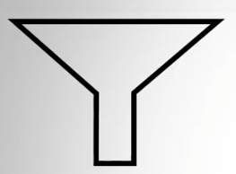

La navegación Facets se usa mucho para navegar por catálogos de datos y agrupar los datos en casos de uso de análisis.

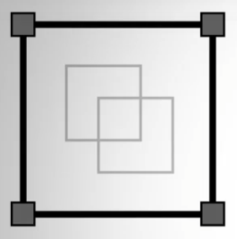

La combinación de la navegación por facetas con la funcionalidad del agregation framework MongoDB proporciona una forma poderosa de manipular datos y analizarlos.

Extender el uso de MongoDB a una gama más amplia de aplicaciones con una sobrecarga mínima.


¿Qué es faceting?


Faceting es una capacidad de análisis popular que permite a los usuarios explorar datos mediante la aplicación de múltiples filtros y caracterizaciones.

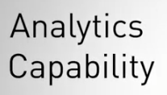


Usando este enfoque, una aplicación clasifica cada elemento de información a lo largo de múltiples dimensiones explícitas, llamadas facetas, lo que permite acceder a las clasificaciones en orden de múltiples maneras.


Por ejemplo, consideremos un catálogo de usuarios para una red social popular; en este ejemplo, sitios como LinkedIn, hagamos una búsqueda en el catálogo.


Esta búsqueda está buscando usuarios con el término MongoDB en algún lugar de su perfil.

El rendimiento inicial del conjunto de resultados es de aproximadamente 200k usuarios.

La ubicación y las facetas actuales de la empresa se pueden utilizar para reducir aún más el conjunto de resultados de acuerdo con ciertos criterios.

Por ejemplo, si un usuario elige limitar los conjuntos de resultados a solo usuarios en los Estados Unidos, entonces el conjunto de resultados se reducirá a cerca de 62k usuarios.

Las facetas en MongoDB se implementan utilizando el aggregation framework y comprenden algunas etapas diferentes.


Cubriremos consultas de una sola faceta, manual, bucketing automático y renderización de múltiples facetas.


Bueno, ocupémonos de trabajar con facetas.

## 2. Tema: Facetas: consulta de una sola faceta

### Notas de lectura

[$sortByCount stage](https://docs.mongodb.com/manual/reference/operator/aggregation/sortByCount/?jmp=university)

### Transcripción

Entonces, comencemos a trabajar con facetas y exploremos esta nueva funcionalidad que 3.4 trae.

Ahora, para tener una mejor idea de lo que vamos a hacer, imaginemos el siguiente escenario.

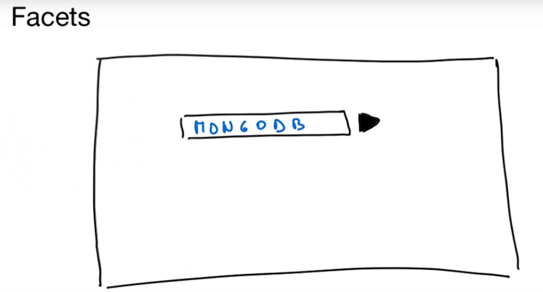

Imaginemos que tenemos una aplicación que tiene algún tipo de barra de búsqueda donde podemos buscar cosas como MongoDB, por ejemplo.

Una vez que presionamos el botón Enter para buscar esta palabra clave o término en particular, generalmente recibimos una lista de resultados.

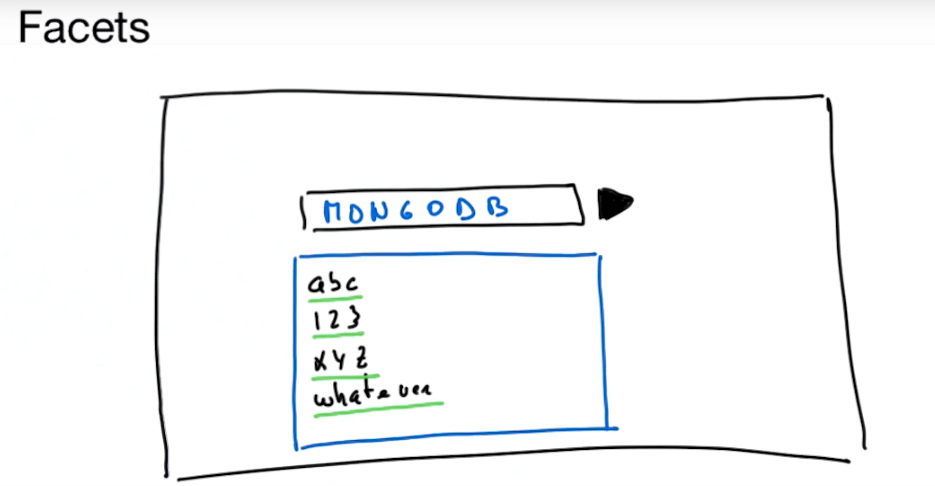

Podríamos tener algunos atributos, alguna indicación de cosas relacionadas con este término dado el catálogo que estamos buscando.

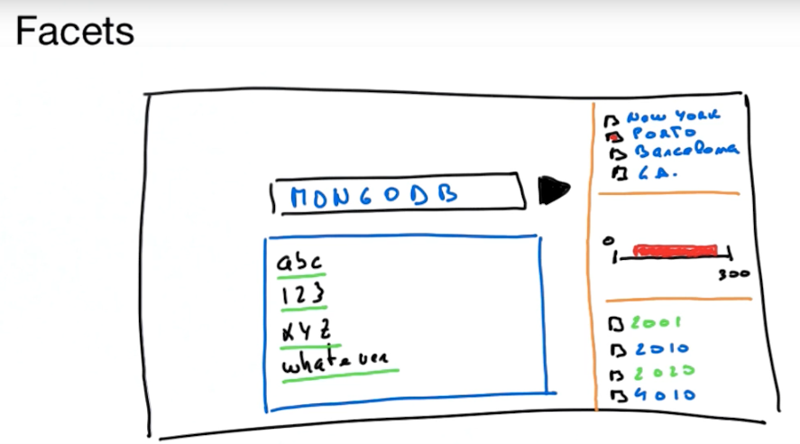

Pero también podríamos tener algún tipo de filtro o caracterización para este término de búsqueda en combinación con varias dimensiones diferentes que podría tener esta información que estamos almacenando en el catálogo de esta aplicación.

Entonces, para explicar esto muy bien, vamos a utilizar un conjunto de datos muy querido para ustedes que hemos estado explorando a lo largo del curso.

El conjunto de datos que analizaremos es el conjunto de datos de `companies` que puede encontrar en nuestra base de datos de `startups`.

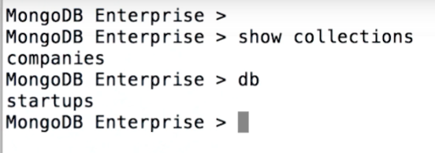

Con esto, exploraremos este conjunto de datos como un catálogo de compañías y cómo podemos organizar, buscar y encontrar información y obtener facetas de los datos almacenados en esa colección en particular.

Entonces, comencemos mirando un solo documento dentro de este conjunto de datos de Empresas.

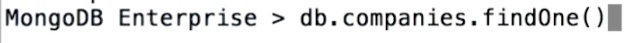

Como de costumbre, puede encontrar un montón de información de enlaces externos a premios, hitos y adquisiciones, y un montón de otra información relacionada con una sola compañía que figura en este conjunto de datos.

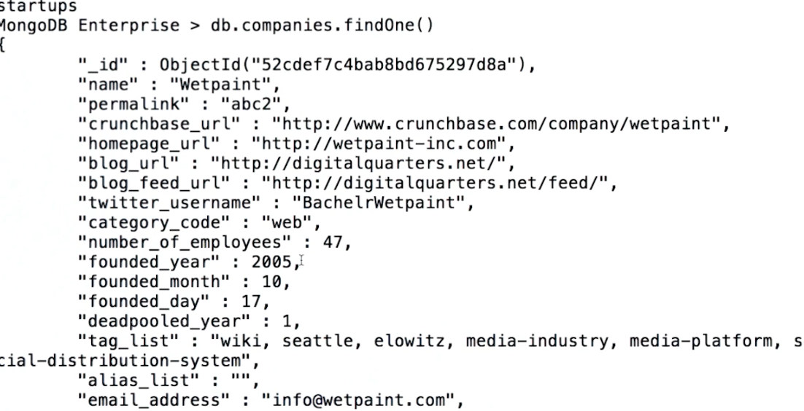

Ahora, lo que podríamos tener es la necesidad de buscar en un montón de diferentes dimensiones.

Y para eso, se utilizarán términos de búsqueda muy sencillos, como por ejemplo, en la descripción y descripción general de las empresas que de alguna manera están relacionadas con la creación de redes.

Para expresar dicha consulta, vamos a crear un índice de texto en la descripción y descripción general.

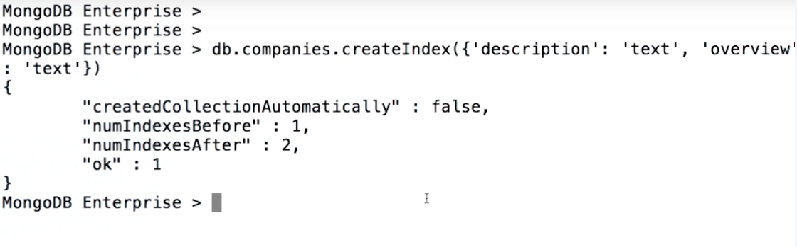

Y si desea encontrar las empresas que tienen la palabra clave "redes" en su campo, ya sea en la descripción o en la descripción general, podemos usarla simplemente emitiendo la consulta donde las empresas pueden agregar y combinar etiquetas en la búsqueda de términos "red". " 

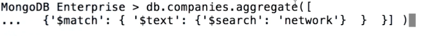

Una vez que hacemos esto, obtenemos una lista de resultados.


Ahora, supongamos que la aplicación de nuestro edificio, nuestro catálogo corporativo, no solo quiere darle al usuario final el conjunto de resultados, sino también presentar una faceta que describa el código de categoría.

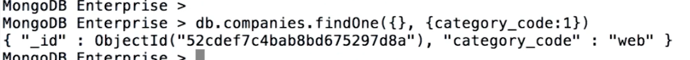

Ahora, este es un campo que nos dirá el tipo de empresa o sector en el que opera esta empresa en particular.

Básicamente, para esa funcionalidad particular, ahora podemos usar `$sortByCount`.

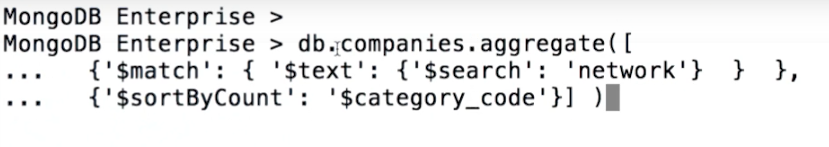

`$sortByCount` nos permitirá crear la faceta por categoría en la lista de resultados que proporcionará la etapa anterior, coincidencia.

Entonces, para todas las compañías que incluirán palabras clave de "network" en su descripción o descripción general, se canalizarán en un `$sortByCount` donde agruparemos el código de categoría `$category_code`.

Una vez que ejecutamos esto, tenemos una lista completa con su recuento y ordenado de los sectores de actividad donde podemos encontrar empresas.

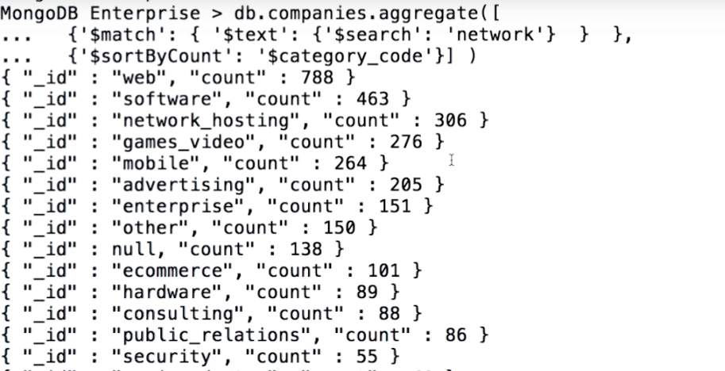

En este caso, vamos a tener web con 788 compañías listadas, software con 463, y así sucesivamente.

Por lo tanto, `$sortByCount` agrupa los documentos entrantes que provienen de nuestra consulta de coincidencia en función de su expresión especificada, `'$search': 'network'`, y luego calcula el recuento de los documentos en qué grupo distinto.

Y ordenar por su cuenta.

Cada grupo es un documento con dos campos, un `_id` que especifica el valor por el cual estamos agrupando, y las cuentas, que determinan la cantidad de documentos que coinciden con ese grupo.

Si queremos el mismo resultado, pero digamos que en lugar de tener el desglose por categoría, lo queremos para la ubicación de la oficina, la ciudad, algo así, podríamos ejecutar el-- aggregation pipeline que es un poco más elaborada que esto uno simple

Digamos, por ejemplo, lo que queremos es seguir buscando todas las empresas que tienen palabras clave de "network" en su descripción o descripción general, pero dado que las oficinas son una variedad de ubicaciones diferentes que podríamos tener, queremos desconectar ese array en particular y luego emparejar las oficinas que tienen una ciudad.

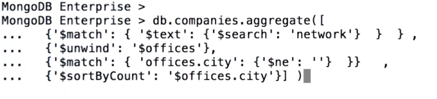

Entonces tienen este valor de ciudad diferente a vacío.

Por todo eso, clasifiquemos `$sortByCount` en los diferentes valores de `office.city` que encontramos.

Entonces ahí vamos.

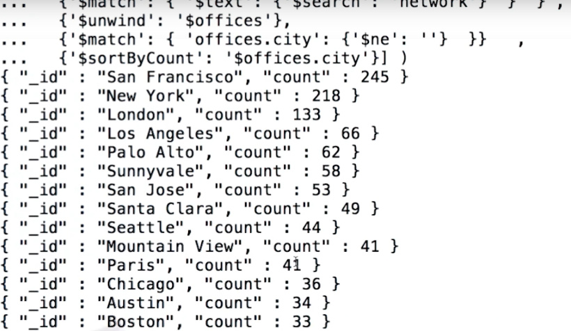

Ahora tenemos una lista de documentos que especifican el valor de la ciudad de la oficina, en este caso, por ejemplo, San Francisco con un recuento de 245.

Nueva York tendrá 218: Londres, Los Ángeles, Palo Alto, etc.

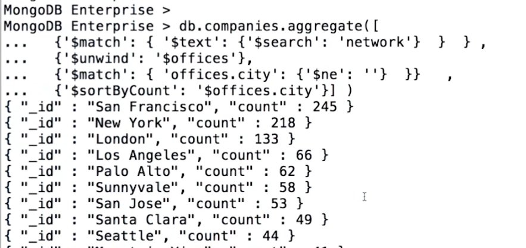

Así que esto también es para demostrar que podemos tener pipelines elaboradas que filtren project, match, group, determinar la lista de documentos que luego puede usar para ordenar y contar dado uno de los atributos que viene con el conjunto de resultados para este último etapa del pipeline.

En esencia, con esta consulta de agregación, podemos tener el desglose de las empresas por ciudad que coinciden con las redes, o en este caso, "network", en su descripción general.

## 3. Examen Facets: Single Facet Query

**Problem:**

Which of the following aggregation pipelines are single facet queries?

Check all answers that apply:

1) :+1:
```sh
[
  {"$match": { "$text": {"$search": "network"}}},
  {"$sortByCount": "$offices.city"}
]
```

2) :+1:
```sh
[
  {"$unwind": "$offices"},
  {"$project": { "_id": "$name", "hq": "$offices.city"}},
  {"$sortByCount": "$hq"},
  {"$sort": {"_id":-1}},
  {"$limit": 100}
]
```

3)
```sh
[
  {"$match": { "$text": {"$search": "network"}}},
  {"$unwind": "$offices"},
  {"$sort": {"_id":-1}}
]
```

### See detailed answer

Single query facets are supported by the new aggregation pipeline stage `$sortByCount`.

As like any other aggregation pipelines, except for `$out`, we can use the output of this stage, as input for downstream stages and operators, manipulating the dataset accordingly.

The **correct** answers are:

```sh
[
  {"$match": { "$text": {"$search": "network"}}},
  {"$sortByCount": "$offices.city"}
]
```

and

```sh
[
  {"$unwind": "$offices"},
  {"$project": { "_id": "$name", "hq": "$offices.city"}},
  {"$sortByCount": "$hq"},
  {"$sort": {"_id":-1}},
  {"$limit": 100}
]
```

The pipeline

```sh
[
  {"$match": { "$text": {"$search": "network"}}},
  {"$unwind": "$offices"},
  {"$sort": {"_id":-1}}
]
```

is **not** a single query **facet** since it does not group any particular data dimension. It simply unwinds an array field and sorts that result set.

## 4. Tema: La Etapa `$bucket`

### Notas de lectura

[$bucket](https://docs.mongodb.com/manual/reference/operator/aggregation/bucket/)

### Transcripción


Aprendamos sobre otras etapas poderosas de análisis de datos y agrupaciones dentro del marco de agregación.

En esta lección, aprenderemos sobre bucket, bucketAuto y sortByCount.

Discutiremos el cubo primero.

El cubo tiene la siguiente forma.

Y como podemos ver, se necesitan algunos argumentos diferentes.

Así que repasemos cada uno.

A medida que avanzamos y cubrimos cada campo, construyamos también una agregación real de forma incremental.

groupBy agrupa documentos en la expresión evaluada, al igual que el argumento _ID en la etapa de grupo.

Una captura: solo podemos especificar un valor para que coincida.

Podríamos usar una expresión que evalúe dos rutas de campo, pero finalmente debe resolverse en un valor.

Especifiquemos una ruta de campo a $ imdb.rating, agrupando documentos en función de su calificación.

Muy bien, límites: aquí es donde los cubos comienzan a ser muy poderosos.

En los límites, especificamos una matriz de valores.

Cada valor es un límite inferior del grupo en el que se colocarán los documentos.

Y los valores sucesivos son el límite superior exclusivo del grupo anterior.

Algunas cosas a tener en cuenta sobre los límites: los valores que especificamos en los límites deben ser todos del mismo tipo, con la excepción de los valores numéricos.

Se pueden mezclar diferentes tipos de números.

Además, debemos especificar al menos dos límites.

Aquí, estoy especificando una matriz de 0, 5, 8 e infinito a los límites.

Eso significa que los documentos con $ imdb.rating de 0 inclusive a 5 exclusivos se colocarán en el grupo 0.

Los documentos con una calificación IMDB entre 5 y 8 se colocarán en el grupo 5, y los documentos con una calificación IMDB entre 8 e infinito se colocarán en el grupo 8.

Llamamos a estos grupos cubos, de ahí el nombre de la etapa.

El campo predeterminado es opcional pero importante.

Si no lo especificamos, la expresión que especificamos a groupBy debe resolverse en un valor que pueda caer dentro de uno de los depósitos especificados en los límites.

De lo contrario, obtendremos un error. El valor predeterminado que especificamos puede ser del mismo tipo que los valores límite, pero debe ser menor que el límite mínimo especificado o mayor que el límite máximo.

Como sabemos que no todos los documentos tienen un valor $ imdb.rating, especificaremos que no está calificado como predeterminado.

Esto capturará todos los documentos.

Antes de repasar el último argumento, probemos el cubo para tener una idea.

Aquí, estamos especificando el argumento para groupBy, por lo tanto, estableciendo nuestros límites.

Sabemos que esto producirá un error porque no todos los documentos tienen un valor de $ imdb.rating.

Pero vamos a ejecutarlo de todos modos para ver cómo se ve eso.

Este es el error que obtendremos.

Ahora que sabemos cómo se ve, si lo encontramos en el futuro, sabremos dónde buscar para arreglar nuestra tubería.

Incluyamos ese argumento predeterminado.

Aquí incluimos el valor predeterminado y especificado no calificado.

Ahora veámoslo en acción.

Podemos ver algunas cosas diferentes.

La etapa $ bucket nos da automáticamente un campo de conteo dentro de cada segmento, contando cuántos documentos se colocaron en ese segmento.

Podemos ver que había 4.992 documentos en el 0 a 5, 35.516 documentos en el segmento de 5 a 8 y 2.284 documentos en el documento de 8 a infinito.

También podemos ver que hubo 1.705 documentos que no están clasificados, lo que significa que no tenían un valor que pudiéramos agrupar en el campo $ imdb.rating.

Esto está muy bien.

Podemos ver que la gran mayoría de las calificaciones de IMDB caen entre 5 y 8.

Esto solo, sin embargo, puede no ser suficiente.

La etapa de depósito transformó fundamentalmente los documentos resultantes.

¿Qué pasaría si quisiéramos encontrar la calificación promedio por cubo?

Aquí es donde entra el último campo, salida.

la salida es muy parecida a los campos adicionales que podemos especificar en la etapa de grupo.

Podemos dar a los campos casi cualquier nombre que nos guste y usar expresiones de acumuladores familiares para calcular sus valores.

Vamos a obtener la calificación promedio por cubo.

Aquí he especificado los mismos argumentos que antes con la adición de un campo de salida y el promedio por clave de cubo.

Increíble.

Podemos ver que obtenemos el promedio de los documentos que se encuentran dentro de nuestros depósitos definidos.

Pero ahora nos falta el campo de conteo.

La razón de esto es porque el conteo es el acumulador predeterminado para la etapa de depósito.

Si no se define ninguna salida, MongoDB inserta el recuento por nosotros.

Si especificamos una salida y también queremos el conteo, debemos especificar eso también usando el mismo método que hacemos en la etapa de grupo.

Aquí, todo es idéntico con la adición del campo de conteo.

Ahora estamos viendo que tenemos las mismas calificaciones promedio que antes por grupo junto con el recuento que esperábamos.

## 5. Tema: Facetas: Buckets manuales

### Notas de lectura

[$bucket stage]()

At minute 4:45 we show the error message for trying to group a value that falls outside the boundaries.

```sh
$switch could not find matching branch for an input, and no default was specified
```

This message might be a bit confusing since we mention *switch* and *branches*. This is related with the internal `$bucket` stage implementation that uses a `$group` and `$switch` stages. We can see that in detail when running the **explain()** command.

```sh
db.coll.explain().aggregate([{ $bucket: {groupBy: "$x", boundaries: [0, 50, 100]}}])
{
  "stages" : [
    {
      "$cursor" : {
        "query" : {

        },
        "fields" : {
          "x" : 1,
          "_id" : 0
        },
        "queryPlanner" : {
          ...
        }
      }
    },
    {
      "$group" : {
        "_id" : {
          "$switch" : {
            "branches" : [
              {
                "case" : {
                  "$and" : [
                    {
                      "$gte" : [
                        "$x",
                        {
                          "$const" : 0
                        }
                      ]
                    },
                    {
                      "$lt" : [
                        "$x",
                        {
                          "$const" : 50
                        }
                      ]
                    }
                  ]
                },
                "then" : {
                  "$const" : 0
                }
              },
              {
                "case" : {
                  "$and" : [
                    {
                      "$gte" : [
                        "$x",
                        {
                          "$const" : 50
                        }
                      ]
                    },
                    {
                      "$lt" : [
                        "$x",
                        {
                          "$const" : 100
                        }
                      ]
                    }
                  ]
                },
                "then" : {
                  "$const" : 50
                }
              }
            ]
          }
        },
        "count" : {
          "$sum" : {
            "$const" : 1
          }
        }
      }
    },
    {
      "$sort" : {
        "sortKey" : {
          "_id" : 1
        }
      }
    }
  ],
  "ok" : 1
}
```

### Transcripción

Así que ahora echemos un vistazo a los cubos, o mejor dicho, mirando a las estrategias de depósito.

Ahora el bucketing es una operación asociada a facetas muy comunes, donde agrupamos los datos por un rango de valores, a diferencia de los valores individuales.

Básicamente, agrupamos tipos de documentos basados ​​en algunos corchetes o límites específicos en los que nuestros documentos encajarán según un valor particular comprendido en esos rangos.

En nuestro ejemplo, es posible que queramos agrupar a las empresas en función del tamaño de su fuerza laboral, el número de empleados.

Ahora, para hacer eso, si analizamos, por ejemplo, el rango de valores que tenemos en nuestros conjuntos de datos, podemos ver que pasamos de la gran fuerza laboral de las empresas a las empresas que ni siquiera tienen un número de empleados establecido o se establecen en 0.

Y esto nos dará los rangos y la oportunidad de establecer límites para esos grupos, si queremos agrupar a las diferentes compañías en función de la cantidad de empleados que tienen.

Pero, de nuevo, no valores individuales, sino rangos de valores.

Para poner esto en su lugar, usemos un ejemplo de agregación simple.

Entonces, en mi caso particular, para este ejemplo, vamos a tener las compañías fundadas después de 1980.

Y vamos a tener en el mismo conjunto de datos solo compañías que tienen una serie de conjuntos de valores de empleados.

Básicamente, no no.

Y luego vamos a agrupar esos resultados usando una nueva etapa de la tubería de agregación llamada cubos, donde vamos a usar un grupo en los campos de límite para definir exactamente cómo se verán nuestros cubos y a qué campo vamos a utilizar para nuestra agrupación, que en este caso es el número de empleados.

Una vez que ejecutamos esto, podemos ver que tendremos un resultado que contiene un campo _id que apunta al nombre del depósito o al valor del depósito en este caso, donde podemos ver un recuento del número de empresas que caen en ese depósito.

Para el siguiente segmento, que es 20, vemos un recuento diferente, 1,172.

Ahora los límites definen los corchetes donde el límite inferior en este caso, aquí 0, es inclusivo, y el límite superior, 20, será exclusivo.

Esto significa que hay 5,447 empresas que se fundaron después de 1980, que tienen de 0 a 19 empleados.

En el caso de 20 a 50, tenemos 1,172, 50 a 100, tenemos 652, y así sucesivamente.

Ahora, un aspecto importante a tener en cuenta es que si tenemos documentos con el número de empleados en este caso, que estamos agrupando por nuestra matriz de límites aquí, estos tipos de campos deben ser los mismos.

Lo que significa que si tenemos un número de empleados que no tiene en este caso, un valor numérico, aquí infinito es un valor doble que estamos utilizando para definir, o incluso si quedan fuera de los cubos, tendremos un error generado .

Veamos un ejemplo de eso.

Digamos que tenemos este documento en particular en esta colección de llamadas donde x es igual a una cadena de a.

Si ejecutamos esta canalización de agregación en esta colección particular donde agrupamos la agrupación por x, y con los límites de 0, 50 y 100, obtendremos un error que indica que el conmutador no encontrará una rama coincidente para una entrada, y No se especificó ningún valor predeterminado.

Básicamente, lo que está tratando de decir aquí es que nuestros límites no tienen un lugar para nuestros documentos.

Dado que nuestro documento se define con un valor x es igual a a, y nuestros límites son de 0 a 50, de 50 a 100, no tenemos un lugar para colocar este documento en particular.

Por lo tanto, nos equivocamos al decir que no podemos encontrar un lugar para colocarlo dentro de los cubos que estamos pidiendo.

Para evitar estos escenarios, la etapa de depósito contiene una opción predeterminada donde podemos definir el campo, o en este caso, el nombre de un depósito, que no se ajusta a los límites descritos.

Entonces, en nuestra consulta de coincidencias, la cambiará ligeramente para incluir nuevamente a todas las empresas fundadas después de 1980.

Pero ahora eliminemos la restricción de que nuestros nots no tengan valores para el número de empleados.

Básicamente, lo que está diciendo es que si una compañía no tiene ese campo en particular, y dado que no encontraríamos un cubo, un cubo manual para colocar ese campo en particular, lo colocaremos en otro.

Una vez que ejecutamos esto, podemos ver que los cubos normales, con su número de documentos previamente proporcionados que se ajustan a esos cubos, se colocan correctamente.

Y para todos los demás valores de campo que no están contenidos dentro de este rango o que tienen un tipo de datos diferente, lo colocaremos en otro y con su recuento [INAUDIBLE].

Otro aspecto importante de la etapa de depósito y con respecto a los límites definidos manualmente, es que todos los valores dentro de la matriz que define nuestros límites deben tener el mismo tipo de datos.

En caso de que no lo hagamos, recibiremos un error que indica que todos los valores en la opción de límites para agrupar deben tener el mismo tipo.

Y en nuestro caso, encontró tipos conflictivos entre string y double.

Así que, jóvenes padawans, tengan cuidado con eso.

Una vez que definimos nuestros límites manuales para nuestros depósitos, asegúrese de que la matriz de nuestros límites solo contenga valores del mismo tipo de datos.

El resultado de salida de t***********La etapa de cubo será este documento simple y simple, donde vamos a tener el ID de subrayado y las cuentas.

Eso es bastante sencillo.

Pero digamos que nos gustaría tener algo un poco más elaborado.

Ahora, la otra opción que la etapa de depósito nos permite establecer es nuestro campo de salida, o cómo se vería la salida.

La forma de nuestro resultado de salida para esta faceta.

En nuestro caso, supongamos que no queremos solo un total.

Esta bien.

Y con la suma 1, está bien.

Pero también queremos recuperar el valor promedio de la cantidad de empleados, o incluso un conjunto de todas las categorías que coincidan con ese segmento en particular.

Eso se puede establecer a través de esta salida de campo opcional, donde definimos exactamente eso.

En este caso, los operadores agregados que me darán esa agrupación particular.

Una vez que ejecutamos esta tubería de agregación particular, de una manera bonita veremos que obtendremos la lista, o en este caso, un conjunto de todas las categorías que coinciden con el otro grupo con un total de 4,522.

Un promedio de no, porque promediar no por no me da un no.

Eso está bastante bien.

Pero en el caso del grupo para empresas de más de 1,000 empleados, tenemos el total de 137.

El promedio está un poco por encima de 13,000 en todo tipo de categorías diferentes para esas compañías.

Lo mismo para los 500 cubos, etc.

Para recapitular, tenemos una nueva etapa de operador o una nueva etapa de agregación de mongodb llamada grupo de dólares que necesitamos para configurar el grupo por elementos que especifican el campo por el que queremos agrupar.

Necesitamos especificar los límites, lo que nos indica los corchetes en los que se agruparán nuestros documentos.

No olvide que deben ser del mismo tipo de datos.

Podemos especificar un depósito predeterminado para todos los documentos que no se ajustan a los límites o los depósitos definidos por los límites que estamos especificando.

Todos se colocarán por defecto con el valor apropiado asociado.

Y también podemos definir una forma de documento diferente para nuestra salida especificando diferentes operadores que nos pueden resultar útiles, dado el tiempo que estamos haciendo.

## 6. Examen Facets: Manual Buckets

**Problem:**

Assuming that `field1` is composed of double values, ranging between 0 and Infinity, and `field2` is of type *string*, which of the following stages are correct?

Choose the best answer:

* `{'$bucket': { 'groupBy': '$field1', 'boundaries': [ "a", 3, 5.5 ]}}`

* `{'$bucket': { 'groupBy': '$field1', 'boundaries': [ 0.4, Infinity ]}}`

* `{'$bucket': { 'groupBy': '$field2', 'boundaries': [ "a", "asdas", "z" ], 'default': 'Others'}}`

## 7. Tema: La Etapa `$bucketAuto`

### Notas de lectura

[$bucketAuto](https://docs.mongodb.com/manual/reference/operator/aggregation/bucketAuto/)

### Transcripción

OK, pasemos a la etapa $ bucketAuto.

$ bucketAuto tiene la siguiente forma.

Como podemos ver, se parece a $ bucket con algunas diferencias clave.

GroupBy funciona exactamente igual que el estado del depósito.

En lugar de definir límites, simplemente dejamos que MongoDB los resuelva especificando cuántos cubos queremos.

$$ bucketAuto intentará distribuir uniformemente los documentos en el número especificado de cubos, calculando los límites para nosotros.

Aquí, debemos especificar cuatro cubos, y $ bucketAuto intentará darnos cuatro cubos con aproximadamente el mismo número de documentos.

Tenga en cuenta que es posible que no recuperemos tantos depósitos como especificamos, especialmente si especificamos un número de depósitos mayor que el número de documentos de entrada o el número de valores únicos en la expresión groupBy.

La salida funciona igual que en la etapa de depósito.

Antes de cubrir el campo, granularidad, veamos $ bucketAuto en acción.

Bien, estamos especificando que nos gustaría agrupar. Por la calificación IMDB, queremos cuatro grupos, y como resultado nos gustaría el promedio por grupo y cuenta.

Vamos a ejecutarlo.

Esto es bastante bueno.

Recuperamos cuatro cubos.

Y podemos ver el recuento por cubo y el promedio por cubo.

Sin embargo, los documentos no parecen distribuidos de manera uniforme.

Y nuestros límites son un poco extraños.

Esto se debe a que a algunos documentos les falta un valor $ imdb.rating.

Limpiemos esto con una etapa de coincidencia para que solo obtengamos documentos con una calificación IMDB.

Aquí, simplemente filtraremos los documentos para que no tengan un valor de calificación IMDB mayor o igual a 0.

Los documentos con los valores faltantes no estropearán nuestros resultados.

Bastante interesante.

Podemos ver el $ bucket Auto hizo casi lo mismo que antes.

Si bien intenta distribuir uniformemente los documentos entre el número especificado de cubos, no se garantiza que lo haga.

Aquí, debido a que la cardinalidad de $ imdb.ratings no es muy única, es imposible distribuir uniformemente los documentos entre los depósitos y mantener rangos contiguos.

Agrupemos por título para ver una distribución mucho más uniforme.

Y aquí vemos una distribución de documentos mucho más uniforme.

OK, lo último de lo que hablar con $ bucketAuto es granularidad.

Es un argumento opcional, y al especificarlo intentará colocar los límites del depósito a lo largo de la serie numérica preferida dada.

¿Qué es una serie de números preferida?

Se utilizan comúnmente en el diseño industrial para estandarizar las dimensiones del producto.

Para las series R, E y 1-2-5, es una forma de subdividir 10 según una especificación estándar.

POWERSOF2 intenta crear límites a lo largo de los poderes de 2.

Tenga en cuenta que especificar una granularidad requiere que especifiquemos un valor numérico en la expresión groupBy.

Puede producir menos depósitos de los especificados si la granularidad especificada tiene menos intervalos o no es lo suficientemente fina como para distribuir documentos de manera uniforme.

Veamos un ejemplo rápido.

Bien, primero voy a abrir un shell Mongo local en mi computadora para probar esto.

Me desconectaré del Class Atlas Cluster y me conectaré a una instancia local de Mongo.

Bien, ahora que tenemos un shell Mongo para una instancia local, usemos una pequeña función de JavaScript para generar algunos valores para nosotros.

Voy a usar una base de datos [?

neo-espacio?] llamado Agg fort este ejemplo.

Entonces, aquí, usamos un bucle de cuatro para generar algunos valores aleatorios que deberían correlacionarse bien con las potencias de 2 y la distribución de Renard y E-series.

Insertamos esos números en una colección llamada prueba de granularidad.

Ejecutamos nuestra función y luego verificamos que la función funcionó llamando a count en nuestra colección.

Bien, echemos un vistazo a los poderes de granularidad 2 y dejemos las series R y E para autocomprobación.

Aquí especificamos que nos gustaría agrupar por los poderes del campo 2.

Queremos 10 cubos, y la granularidad debe caer en la serie de números preferida llamada potencias de 2.

Y ahi vamos.

Podemos ver que nuestros límites de cubo se colocaron a lo largo de las potencias de 2.

## 8. Tema: Facetas: Auto Buckets

### Notas de lectura

[$bucketAuto stage](https://docs.mongodb.com/manual/reference/operator/aggregation/bucketAuto/)

### Transcripción

Hasta ahora en facetas, lo que hemos estado viendo en términos de cubos es la creación manual de estos cubos.

Tenemos un depósito que agrupamos por un campo, y luego especificamos los límites para esos campos, y respectivamente a esos depósitos.

Ahora, con MongoDB, también podemos generar automáticamente esos depósitos.

Así que echemos un vistazo a cómo configurar eso.

Entonces, con MongoDB 3.4, también tenemos $ bucketAuto.

$ bucketAuto es otra etapa de canalización de agregación que es muy similar al operador anterior $ bucket.

También tenemos aquí el grupo Especificando el campo en este conjunto de datos que queremos agrupar.

Pero en lugar de definir los límites, lo que se espera que establezcamos es el número de cubos, en este caso, cinco.

Es muy similar al anterior $ bucket, pero invertimos el orden por el cual especificamos nuestras opciones.

En lugar de definir límites, definimos el número de cubos.

Entonces corremos esto.

Puede ver que el resultado es muy similar al anterior $ bucket one donde, nuevamente, tenemos una ID.

En lugar de tener ahora _id apuntando a un valor de uno de los límites, el inclusivo, lo que vamos a tener es básicamente un subdocumento que define el valor mínimo y máximo de nuestro depósito, y obviamente, el recuento ... el número de documentos que coinciden o caen en este depósito.

Lo mismo para todos los diferentes: cinco cubos diferentes.

La forma en que el depósito automático genera nuestros depósitos es tratar de equilibrar de manera uniforme el número de documentos que se distribuirán entre esos cinco depósitos diferentes.

Similar a $ bucket, también podemos definir una salida diferente definiendo nuestros campos y los acumuladores que calcularán esos campos particulares en nuestros documentos de salida.

Una vez que lo ejecutamos, puede ver que todavía tenemos los mismos límites exactos.

Pero en lugar de tener solo un campo, tendremos los campos que definimos en nuestra opción de salida: total y promedio, en este caso.

Además de esas opciones particulares, $ bucketAuto también tiene la opción de definir la granularidad.

Y la granularidad es básicamente una serie numérica, una que podríamos preferir de estas diferentes opciones que hemos admitido en 3.4, donde los límites de nuestros cubos se adherirán a esa serie numérica específica.

Ahora, tenemos varios diferentes.

Tenemos la serie Renard.

Tenemos la serie E, la serie 1-2-5 y las potencias de dos series, todas ellas bien especificadas en esta página en particular con todos los valores admitidos para la granularidad: R5 a R20, 1-2-5, E6 a E192, y potencias de dos.

Para ver mejor esto en acción, lo que podemos hacer es generar una colección de series donde tendremos valores _id de 1 a 1,000.

Una vez que generamos esa colección, puedo generar mis depósitos automáticos, así que llamar a mi escenario para el depósito automático, agruparlos por _id y generar cinco depósitos.

Este es el comportamiento predeterminado de nuestra etapa bucketAuto.

Y con esto, nuevamente vemos que obtengo partes iguales de 1 a 201 divididas, y que tengo alrededor de 200, o 200 en este caso porque es una combinación fácil, de 200 documentos por cubo.

Y definir la granularidad de la opción aquí para usar la serie Renard R20, que básicamente toma la raíz 20 de 10.

Tendremos un conjunto de límites ligeramente diferente donde los valores de los límites se adherirán a esa serie en particular, pero aún así se intentó distribuir de acuerdo con el número de depósitos que solicitamos el número de documentos entre esos depósitos diferentes.

Y así es como funciona $ bucketAuto.

## 9. Examen Facets: Auto Buckets

**Problem:**

Auto Bucketing will ...

Check all answers that apply:

* given a number of buckets, try to distribute documents evenly accross buckets.

* adhere bucket boundaries to a numerical series set by the **granularity** option.

* randomly distributed documents accross arbitrarily defined bucket boundaries.

* count only documents that contain the **groupBy** field defined in the documents.

## 10. Tema: Facetas: Múltiples Facetas

### Notas de lectura

[$facet stage](https://docs.mongodb.com/manual/reference/operator/aggregation/facet/?jmp=university)

### Transcripción

Hasta este punto, hemos estado buscando cómo determinar las facetas individuales.

Pero como probablemente ya se haya dado cuenta, al crear aplicaciones, podríamos necesitar múltiples facetas diferentes para lograr el tipo de filtros que queremos proporcionar a nuestros usuarios finales.

Un ejemplo inicial

Le he mostrado que, aparte de la lista de resultados que se proporciona a partir de un término de búsqueda o consulta en particular que podríamos hacer contra un catálogo, podríamos tener diferentes filtros para ayudarnos a recortar, reducir los resultados de búsqueda para que podamos ser más interesados, dependiendo de las dimensiones que sean adecuadas para lo que queremos hacer.

Y hemos estado explorando algunos de ellos en las lecciones anteriores.

Al crear aplicaciones, es posible que queramos agrupar nuestros datos y sus propiedades ortogonales.

Al ejecutar todo esto individualmente, podríamos hacer muchos viajes de ida y vuelta a la base de datos.

Con MongoDB 3.4, el soporte de facetas puede calcular varias facetas diferentes en un solo comando.

Debido a esto, tenemos un nuevo operador llamado faceta que nos permite hacer exactamente eso.

Básicamente, tomemos todas las diferentes facetas que hemos ido construyendo a lo largo del curso individualmente.

Digamos que las categorías, los empleados, la faceta de la fuerza laboral y el año de fundación de la compañía se han creado.

Y comencemos a agrupar todo esto en un solo comando en nuestra tubería de agregación.

Entonces, comencemos haciendo coincidir todos los documentos que tienen bases de datos en su descripción o descripción general especificando una consulta de búsqueda de texto.

Pase esa lista de resultados a nuestra etapa facetaria.

Y luego generar las diferentes facetas que hemos estado buscando antes por las categorías, los empleados o las fechas fundadas para proporcionar ese conjunto de diferentes facetas que hemos estado explorando hasta ahora.

Entonces, en esencia, con este comando, estamos recogiendo todas las facetas diferentes con sus condiciones coincidentes y variaciones de salida, trayendo documentos de la base de datos de una vez.

Una vez que lo ejecute, obtendré todo tipo de facetas diferentes, faceta para Fundado, las facetas para Empleados y la faceta para Categorías que proporcionó mi búsqueda de coincidencia inicial.

Cada sub canalización dentro de la faceta pasa exactamente el mismo conjunto de documentos de entrada que esta etapa de coincidencia aquí genera.

Y son completamente independientes entre sí.

La salida de la sub tubería no puede ser utilizada por los siguientes dentro del mismo comando de faceta.

Esto significa que podemos interpretar esto como una sub tubería dentro de nuestra tubería de marco de agregación proporcionada a través de la etapa de faceta del dólar.

Y así es como podemos generar la navegación por facetas usando MongoDB 3.4.

## 11. Examen Facets: Multiple Facets

**Problem:**

Which of the following statement(s) apply to the `$facet` stage?

Check all answers that apply:

* The `$facet` stage allows several sub-pipelines to be executed to produce multiple facets.

* The `$facet` stage allows the application to generate several different facets with one single database request.

* The output of the individual `$facet` sub-pipelines can be shared using the expression `$$FACET.$`.

* We can only use facets stages (`$sortByCount`, `$bucket` and `$bucketAuto`) as sub-pipelines of `$facet` stage.

## 12. Laboratorio - `$facets`

Lab - $facets

**Problem:**

How many movies are in both the top ten highest rated movies according to the `imdb.rating` and the `metacritic` fields? We should get these results with exactly one access to the database.

**Hint:** What is the *intersection*?

Choose the best answer:

* 1

* 5

* 2

* 3

## 13. Tema: La etapa `$sortByCount`

### Notas de lectura

[$sortByCount](https://docs.mongodb.com/manual/reference/operator/aggregation/sortByCount/)

### Transcripción

$ sortByCount toma un argumento, una expresión para agrupar documentos.

Funciona como una etapa grupal, seguida inmediatamente por una dirección de clasificación y descendente.

Aquí, estamos usando una etapa grupal, agrupando en $ imdb.rating, obteniendo un recuento y luego ordenando ese recuento en dirección descendente.

Aquí estamos usando la etapa $ sortByCount, simplemente especificando qué valor nos gustaría ordenar por contar.

Los mismos resultados exactos.

Hemos cubierto mucha información.

Pero recapitulemos algunas cosas importantes.

En $ bucket, siempre debemos especificar al menos dos valores para los límites.

Los límites deben ser todos del mismo tipo general, ya sea numérico, de cadena o booleano, se entiende la idea.

Y la cuenta se inserta por defecto sin salida, pero se elimina cuando se especifica la salida.

En $ bucketAuto, la cardinalidad del grupo por expresión puede afectar incluso la distribución y el número de depósitos.

La especificación de una granularidad requiere que la expresión groupBy se resuelva en un valor numérico.

Y, por último, $ sortByCount es equivalente a una etapa de grupo para contar la ocurrencia, y luego ordenar en orden descendente.

