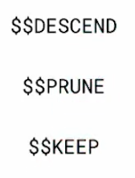

# Capítulo 5: Miscellaneous Aggregation

Lecciones

* Tema: La etapa `$redact`
* Tema: La etapa `$out`
* Examen
* Tema: Vistas
* Examen

## 1. Tema: La etapa `$redact`

### Notas de lectura

Página de documentación de [`$redact`](https://docs.mongodb.com/manual/reference/operator/aggregation/redact/).

### Transcripción


Aprendamos sobre una de las etapas del aggregation framework que puede ayudarnos a proteger la información del acceso no autorizado, la etapa **redact**.

La etapa **redact** tiene la siguiente forma.

```sh
{ $redact: <expression> }
```

La expresión puede ser cualquier expresión o combinación de expresiones, pero finalmente debe resolverse a uno de los tres valores **descend**, **prune** y **keep**.



Bien, al principio estos parecen bastante crípticos.

Así que examinemos qué hace cada uno de ellos.

Primero, veamos **prune** y **keep**.


**prune** y **keep** son inversos entre sí.

**prune** excluirá todos los campos en el nivel de documento actual sin inspección adicional, mientras que **keep** retendrá todos los campos en el nivel de documento actual sin inspección adicional.

Entonces, ¿qué entendemos por inspección adicional?

Veamos este documento de ejemplo de la colección **employees**.


Cada cuadrado de color representa un nivel de documento.

Al especificar **keep** o **prune** en cualquier nivel de documento dado, se realizará la acción asociada y se aplicará automáticamente a todos los niveles de documentos por debajo del nivel especificado.

Bien, veamos descender.


Descender conserva el campo en el nivel de documento actual que se está evaluando, excepto los subdocumentos y los arrays  de documentos.

En su lugar, atravesará hacia abajo, evaluando cada nivel.

Visualicemos cómo operaría **descend** sobre este documento, dada esta expresión condicional `$cond`, determinando si el valor de acceso del usuario `userAccess` está en el array **$acl**.


Comenzamos con todo el documento y comparamos si la administración está en ACL `$in: ["Management", "$acl"]`.


Como es, desciende al subdocumento en compensación de empleados, aquí.


Ahora evaluamos si la administración está en ACL, que es.

Entonces descendemos más.


En este nivel, después de la evaluación, se devuelve la poda `$$PRUNE`, porque la ACL en este nivel no incluye `Management`.

Este nivel y cualquier nivel posterior, si hubiera alguno, no se devolverían.

Para el usuario, es como si este campo no existiera en absoluto.


Miremos esto en acción.

Configuramos nuestra variable de acceso de usuario y luego la canalización, asegurando que solo tengamos los niveles de documentos de acceso que deberíamos.

Excelente.

```sh
MongoDB Enterprise Cluster0-shard-0:PRIMARY> var userAccess = "Management"
MongoDB Enterprise Cluster0-shard-0:PRIMARY> 
MongoDB Enterprise Cluster0-shard-0:PRIMARY> db.employees.aggregate([
... {
... $redact: { $cond: [{ $in: [userAccess, "$acl"] }, "$$DESCEND", "$$PRUNE"] }
... }
... ]
... ).pretty()
{
	"_id" : ObjectId("59d288690e3733b153a9396c"),
	"employee_ID" : "08905606-e8e0-43ef-ad9e-6bcfc7f6c5b3",
	"acl" : [
		"HR",
		"Management",
		"Finance",
		"Executive"
	],
	"employee_compensation" : {
		"acl" : [
			"Management",
			"Finance",
			"Executive"
		],
		"salary" : 150832,
		"stock_award" : 2312
	},
	"employee_grade" : 1,
	"team" : "Yellow",
	"age" : 63,
	"first_name" : "Lucile",
	"last_name" : "Sharpe",
	"gender" : "female",
	"phone" : "+1 (829) 527-2881",
	"address" : "127 Maple Street, Rosewood, Arizona, 87080"
}
{
	"_id" : ObjectId("59d288690e3733b153a9396d"),
	"employee_ID" : "1d320cd5-2410-4876-9f84-6eb3521326c8",
	"acl" : [
		"HR",
		"Management",
		"Finance",
		"Executive"
	],
	"employee_compensation" : {
		"acl" : [
			"Management",
			"Finance",
			"Executive"
		],
		"salary" : 150805,
		"stock_award" : 2837
	},
	"employee_grade" : 1,
	"team" : "Red",
	"age" : 30,
	"first_name" : "Rowena",
	"last_name" : "Mccarthy",
	"gender" : "female",
	"phone" : "+1 (836) 563-3168",
	"address" : "460 Navy Walk, Fingerville, Nebraska, 37381"
}
{
	"_id" : ObjectId("59d288690e3733b153a9396e"),
	"employee_ID" : "d988de52-daf0-4bc7-ab6d-36aef266dadd",
	"acl" : [
		"HR",
		"Management",
		"Finance",
		"Executive"
	],
	"employee_compensation" : {
		"acl" : [
			"Management",
			"Finance",
			"Executive"
		],
		"salary" : 122869,
		"stock_award" : 1636
	},
	"employee_grade" : 3,
	"team" : "Orange",
	"age" : 30,
	"first_name" : "Cheryl",
	"last_name" : "Garcia",
	"gender" : "female",
	"phone" : "+1 (896) 575-3288",
	"address" : "466 Sharon Street, Irwin, Arkansas, 78322"
}
{
	"_id" : ObjectId("59d288690e3733b153a9396f"),
	"employee_ID" : "67708991-7f75-4d81-a813-910f6157b93b",
	"acl" : [
		"HR",
		"Management",
		"Finance",
		"Executive"
	],
	"employee_compensation" : {
		"acl" : [
			"Management",
			"Finance",
			"Executive"
		],
		"salary" : 108955,
		"stock_award" : 4368
	},
	"employee_grade" : 3,
	"team" : "Blue",
	"age" : 35,
	"first_name" : "Powell",
	"last_name" : "Hooper",
	"gender" : "male",
	"phone" : "+1 (926) 480-2166",
	"address" : "759 Orange Street, Riviera, Kentucky, 61632"
}
{
	"_id" : ObjectId("59d288690e3733b153a93970"),
	"employee_ID" : "22d4d4a4-2003-4978-bed4-0e6e5ae4a575",
	"acl" : [
		"HR",
		"Management",
		"Finance",
		"Executive"
	],
	"employee_compensation" : {
		"acl" : [
			"Management",
			"Finance",
			"Executive"
		],
		"salary" : 101450,
		"stock_award" : 3835
	},
	"employee_grade" : 1,
	"team" : "Violet",
	"age" : 42,
	"first_name" : "Sonya",
	"last_name" : "Buchanan",
	"gender" : "female",
	"phone" : "+1 (822) 566-3511",
	"address" : "320 Boerum Street, Vincent, Connecticut, 10860"
}
{
	"_id" : ObjectId("59d288690e3733b153a93971"),
	"employee_ID" : "f8bc1ea5-5acf-4d00-b9b6-253de4091792",
	"acl" : [
		"HR",
		"Management",
		"Finance",
		"Executive"
	],
	"employee_compensation" : {
		"acl" : [
			"Management",
			"Finance",
			"Executive"
		],
		"salary" : 120907,
		"stock_award" : 4336
	},
	"employee_grade" : 2,
	"team" : "Red",
	"age" : 62,
	"first_name" : "Lila",
	"last_name" : "Goodman",
	"gender" : "female",
	"phone" : "+1 (875) 491-2686",
	"address" : "425 Hale Avenue, Brandywine, Michigan, 88171"
}
{
	"_id" : ObjectId("59d288690e3733b153a93972"),
	"employee_ID" : "55884535-7c2c-4bf1-b974-d26c642d38c3",
	"acl" : [
		"HR",
		"Management",
		"Finance",
		"Executive"
	],
	"employee_compensation" : {
		"acl" : [
			"Management",
			"Finance",
			"Executive"
		],
		"salary" : 128722,
		"stock_award" : 2074
	},
	"employee_grade" : 2,
	"team" : "Indigo",
	"age" : 30,
	"first_name" : "Castillo",
	"last_name" : "Barber",
	"gender" : "male",
	"phone" : "+1 (927) 537-2001",
	"address" : "484 Fuller Place, Efland, New Mexico, 14661"
}
{
	"_id" : ObjectId("59d288690e3733b153a93973"),
	"employee_ID" : "8793efae-2189-477f-a309-c572697da63c",
	"acl" : [
		"HR",
		"Management",
		"Finance",
		"Executive"
	],
	"employee_compensation" : {
		"acl" : [
			"Management",
			"Finance",
			"Executive"
		],
		"salary" : 143357,
		"stock_award" : 1858
	},
	"employee_grade" : 1,
	"team" : "Blue",
	"age" : 22,
	"first_name" : "Jewel",
	"last_name" : "Swanson",
	"gender" : "female",
	"phone" : "+1 (888) 566-3895",
	"address" : "864 Baycliff Terrace, Bluffview, Oklahoma, 56789"
}
{
	"_id" : ObjectId("59d288690e3733b153a93974"),
	"employee_ID" : "7a18d418-48df-4015-9ccf-8b6c9f2cef6b",
	"acl" : [
		"HR",
		"Management",
		"Finance",
		"Executive"
	],
	"employee_compensation" : {
		"acl" : [
			"Management",
			"Finance",
			"Executive"
		],
		"salary" : 111355,
		"stock_award" : 1586
	},
	"employee_grade" : 2,
	"team" : "Red",
	"age" : 26,
	"first_name" : "Elise",
	"last_name" : "Wiley",
	"gender" : "female",
	"phone" : "+1 (956) 560-2870",
	"address" : "212 Rost Place, Disautel, Georgia, 50464"
}
{
	"_id" : ObjectId("59d288690e3733b153a93975"),
	"employee_ID" : "a0bc70d3-068d-49ef-b323-7cd8c4a6205c",
	"acl" : [
		"HR",
		"Management",
		"Finance",
		"Executive"
	],
	"employee_compensation" : {
		"acl" : [
			"Management",
			"Finance",
			"Executive"
		],
		"salary" : 115027,
		"stock_award" : 2460
	},
	"employee_grade" : 1,
	"team" : "Red",
	"age" : 19,
	"first_name" : "Glenna",
	"last_name" : "Jefferson",
	"gender" : "female",
	"phone" : "+1 (935) 526-2851",
	"address" : "660 Newel Street, Terlingua, Tennessee, 38965"
}
{
	"_id" : ObjectId("59d288690e3733b153a93976"),
	"employee_ID" : "f9bcd479-978f-47ec-85e5-2ae768ee5d85",
	"acl" : [
		"HR",
		"Management",
		"Finance",
		"Executive"
	],
	"employee_compensation" : {
		"acl" : [
			"Management",
			"Finance",
			"Executive"
		],
		"salary" : 115889,
		"stock_award" : 3903
	},
	"employee_grade" : 3,
	"team" : "Orange",
	"age" : 53,
	"first_name" : "Angie",
	"last_name" : "Lawson",
	"gender" : "female",
	"phone" : "+1 (853) 447-3461",
	"address" : "663 Hinckley Place, Torboy, Texas, 65474"
}
{
	"_id" : ObjectId("59d288690e3733b153a93977"),
	"employee_ID" : "d8282d2b-7703-4dd4-a838-5779e82c4460",
	"acl" : [
		"HR",
		"Management",
		"Finance",
		"Executive"
	],
	"employee_compensation" : {
		"acl" : [
			"Management",
			"Finance",
			"Executive"
		],
		"salary" : 100316,
		"stock_award" : 3600
	},
	"employee_grade" : 1,
	"team" : "Yellow",
	"age" : 55,
	"first_name" : "Etta",
	"last_name" : "Noel",
	"gender" : "female",
	"phone" : "+1 (817) 557-2538",
	"address" : "533 Voorhies Avenue, Alden, New York, 27190"
}
{
	"_id" : ObjectId("59d288690e3733b153a93978"),
	"employee_ID" : "3c39a95b-8f89-4ca8-8656-882c7ab40b21",
	"acl" : [
		"HR",
		"Management",
		"Finance",
		"Executive"
	],
	"employee_compensation" : {
		"acl" : [
			"Management",
			"Finance",
			"Executive"
		],
		"salary" : 103550,
		"stock_award" : 2391
	},
	"employee_grade" : 3,
	"team" : "Green",
	"age" : 42,
	"first_name" : "Janell",
	"last_name" : "Hammond",
	"gender" : "female",
	"phone" : "+1 (808) 583-3646",
	"address" : "737 Pleasant Place, Sugartown, Maryland, 80908"
}
{
	"_id" : ObjectId("59d288690e3733b153a93979"),
	"employee_ID" : "3b2f9818-d0ab-4173-bf37-b8466aa8638d",
	"acl" : [
		"HR",
		"Management",
		"Finance",
		"Executive"
	],
	"employee_compensation" : {
		"acl" : [
			"Management",
			"Finance",
			"Executive"
		],
		"salary" : 112298,
		"stock_award" : 1303
	},
	"employee_grade" : 2,
	"team" : "Red",
	"age" : 56,
	"first_name" : "Pugh",
	"last_name" : "Serrano",
	"gender" : "male",
	"phone" : "+1 (873) 526-3223",
	"address" : "744 Anna Court, Rockhill, Kansas, 55247"
}
{
	"_id" : ObjectId("59d288690e3733b153a9397a"),
	"employee_ID" : "beccd8e5-66c5-4e22-88df-7a4f771d8a21",
	"acl" : [
		"HR",
		"Management",
		"Finance",
		"Executive"
	],
	"employee_compensation" : {
		"acl" : [
			"Management",
			"Finance",
			"Executive"
		],
		"salary" : 149920,
		"stock_award" : 1795
	},
	"employee_grade" : 2,
	"team" : "Indigo",
	"age" : 54,
	"first_name" : "Mcclure",
	"last_name" : "Anderson",
	"gender" : "male",
	"phone" : "+1 (986) 456-3555",
	"address" : "184 Brooklyn Avenue, Juntura, Alabama, 17829"
}
{
	"_id" : ObjectId("59d288690e3733b153a9397b"),
	"employee_ID" : "11004c95-ecb7-4104-a8fe-da123dfced92",
	"acl" : [
		"HR",
		"Management",
		"Finance",
		"Executive"
	],
	"employee_compensation" : {
		"acl" : [
			"Management",
			"Finance",
			"Executive"
		],
		"salary" : 143056,
		"stock_award" : 1844
	},
	"employee_grade" : 1,
	"team" : "Blue",
	"age" : 40,
	"first_name" : "Joseph",
	"last_name" : "Whitfield",
	"gender" : "male",
	"phone" : "+1 (830) 445-2420",
	"address" : "371 Union Street, Ticonderoga, California, 78185"
}
{
	"_id" : ObjectId("59d288690e3733b153a9397c"),
	"employee_ID" : "a1bd75c5-18b3-4284-bb8e-831b5c5f5c55",
	"acl" : [
		"HR",
		"Management",
		"Finance",
		"Executive"
	],
	"employee_compensation" : {
		"acl" : [
			"Management",
			"Finance",
			"Executive"
		],
		"salary" : 137635,
		"stock_award" : 2052
	},
	"employee_grade" : 1,
	"team" : "Green",
	"age" : 42,
	"first_name" : "Ford",
	"last_name" : "Head",
	"gender" : "male",
	"phone" : "+1 (980) 434-3557",
	"address" : "785 Ingraham Street, Shasta, Louisiana, 97136"
}
{
	"_id" : ObjectId("59d288690e3733b153a9397d"),
	"employee_ID" : "8300fa6d-5f5d-4d34-be95-0e5b5ba2b230",
	"acl" : [
		"HR",
		"Management",
		"Finance",
		"Executive"
	],
	"employee_compensation" : {
		"acl" : [
			"Management",
			"Finance",
			"Executive"
		],
		"salary" : 126567,
		"stock_award" : 1281
	},
	"employee_grade" : 3,
	"team" : "Green",
	"age" : 47,
	"first_name" : "Maribel",
	"last_name" : "Burks",
	"gender" : "female",
	"phone" : "+1 (973) 471-2516",
	"address" : "613 Cortelyou Road, Oneida, North Carolina, 12515"
}
{
	"_id" : ObjectId("59d288690e3733b153a9397e"),
	"employee_ID" : "0847ed10-c442-4997-9af0-400706d36f38",
	"acl" : [
		"HR",
		"Management",
		"Finance",
		"Executive"
	],
	"employee_compensation" : {
		"acl" : [
			"Management",
			"Finance",
			"Executive"
		],
		"salary" : 158216,
		"stock_award" : 1509
	},
	"employee_grade" : 2,
	"team" : "Orange",
	"age" : 22,
	"first_name" : "Joyce",
	"last_name" : "Carter",
	"gender" : "female",
	"phone" : "+1 (938) 468-2922",
	"address" : "698 Nevins Street, Kiskimere, Nevada, 95135"
}
{
	"_id" : ObjectId("59d288690e3733b153a9397f"),
	"employee_ID" : "7d735016-4f9e-4322-87cf-54a313038caf",
	"acl" : [
		"HR",
		"Management",
		"Finance",
		"Executive"
	],
	"employee_compensation" : {
		"acl" : [
			"Management",
			"Finance",
			"Executive"
		],
		"salary" : 122519,
		"stock_award" : 4880
	},
	"employee_grade" : 3,
	"team" : "Blue",
	"age" : 50,
	"first_name" : "Brown",
	"last_name" : "Christian",
	"gender" : "male",
	"phone" : "+1 (927) 508-3083",
	"address" : "564 Powers Street, Waumandee, Virgin Islands, 58090"
}
Type "it" for more
MongoDB Enterprise Cluster0-shard-0:PRIMARY> 
```

Podemos ver que de hecho solo estamos recuperando los niveles de documentos donde `management` estaba en el array de ACL.

La etapa **redact** puede ser útil para implementar listas de control de acceso, aunque no es la única forma de limitar el acceso a la información, como lo veremos más adelante en el curso.

Cualquier usuario que tenga acceso a una colección para realizar este tipo de agregación también puede realizar otras operaciones de lectura.

Por lo tanto, la etapa **redact** no es suficiente para las restricciones de recopilación y nivel de campo.

Por último, si se compara con un campo en el documento, el campo debe estar presente en cada nivel de uso descendente, o la expresión debe explicar y decidir qué hacer si falta el campo.

Si no tomamos ninguna de estas precauciones, es probable que la redacción tenga errores.

Resumamos algunos puntos clave.


* `$$KEEP` y `$$PRUNE` se aplica automáticamente a todos los niveles por debajo del nivel evaluado.
* `$$DESCEND` conserva el nivel actual y evalúa el siguiente nivel hacia abajo.
* `$redact` no es para restringir el acceso a una colección.

Recuerde, si un usuario tiene acceso para realizar una agregación en una colección, tiene acceso para leer esa colección.

## 2. Tema: La etapa `$out`

### Transcripción

Aprendamos sobre una etapa útil para persistir los resultados de una agregación, la etapa $ out.

La etapa $ out tiene la siguiente forma.

Especificamos el nombre de la colección de salida que queremos.

La etapa de salida debe ser la última etapa en la tubería.

Como tal, no se puede usar dentro de una faceta.

MongoDB creará la colección con el nombre especificado si no existe ninguno.

De lo contrario, sobrescribirá una colección existente si se especifica un nombre de colección existente.

Ahora hay algunas cosas que debes saber.

Solo creará la nueva colección dentro de la misma base de datos.

Si se reemplaza una colección existente, los índices que existían en la colección original seguirán vigentes.

Si la canalización falla, no creará ni sobrescribirá una colección.

Esto también significa que la salida de out debe cumplir las restricciones de índice, como los índices únicos, puede incluir el campo _id.

Entonces, esta agregación aquí donde hacemos coincidir cada documento, realizamos alguna operación de agrupación, nos desenrollamos para crear muchos documentos y luego intentamos que una salida a una nueva colección fallara porque daría como resultado muchos documentos con el mismo valor _id.

Y eso cubre la etapa de $ out.

Esta etapa es muy útil para realizar una agregación contra los datos existentes para realizar una migración, sembrar una colección con datos útiles o distribuir instantáneas de datos para su análisis.

Aquí hay algunas cosas para recordar sobre la etapa $ out.

Creará una nueva colección o sobrescribirá una colección existente si se especifica.

Honra los índices en colecciones existentes.

No creará ni sobrescribirá datos si hay errores en la tubería.

Y crea colecciones en la misma base de datos que la colección de origen.

## 3. Examen The $out Stage

**Problem:**

Which of the following statements is true regarding the `$out` stage?

Choose the best answer:

* `$out` removes all indexes when it overwrites a collection.

* Using `$out` within many sub-piplines of a $facet stage is a quick way to generate many differently shaped collections.

* If a pipeline with `$out` errors, you must delete the collection specified to the `$out` stage.

* `$out` will overwrite an existing collection if specified.

## 4. Tema: Vistas

### Transcripción

Analicemos ahora una característica poderosa de MongoDB-- Vistas.

MongoDB habilita vistas no materializadas, lo que significa que se calculan cada vez que se realiza una operación de tasa en esa vista.

Hay una manera de utilizar una canalización de agregación como colección.

Desde la perspectiva del usuario, las vistas se perciben como colecciones, con algunas diferencias clave que veremos más adelante en la lección.

Entonces, ¿para qué pueden ser útiles las Vistas?

Supongamos que somos una gran institución financiera con clientes de diferentes niveles.

Recientemente lanzamos una gran promoción y estamos realizando una campaña telefónica.

Hemos contratado una agencia de personal temporal con varias oficinas regionales.

Asignaremos un nivel diferente a cada oficina regional.

Esta es una muestra de un registro de nuestra colección de clientes.

Como podemos ver, hay información sensible y potencialmente sesgada a la que no queremos permitir el acceso.

Las vistas nos permiten crear cortes verticales y horizontales de nuestra colección.

¿Qué queremos decir con un corte horizontal y vertical?

El corte vertical se realiza mediante el uso de una etapa de proyecto y otras etapas similares que cambian la forma del documento que se devuelve.

Aquí hemos cortado verticalmente nuestro documento para retener solo el campo accountType.

Los sectores verticales cambiarán la forma que se devuelve, pero no la cantidad de documentos que se devuelven.

El corte horizontal se realiza mediante el uso de etapas de partido.

Seleccionamos solo un subconjunto de documentos según algunos criterios.

Aquí, dividimos horizontalmente nuestra colección con el valor del tipo de cuenta.

De hecho, los documentos que están atenuados no serían operados en absoluto en la siguiente etapa del proyecto.

Podríamos dividir aún más estos datos horizontalmente, seleccionando solo las cuentas que tenían un saldo mínimo especificado, y están dentro de un rango de edad deseado, y, se entiende la idea.

Incluso puede ser necesario usar una etapa de modelado intermedia para calcular un valor en el que deseamos filtrar los documentos.

Los cortes horizontales afectarán la cantidad de documentos devueltos, no su forma.

Veamos otro ejemplo de esto, con documentos que tienen el siguiente esquema.

Me gustaría dividir verticalmente los documentos para eliminar información confidencial, así como poner a disposición la información de nombre y género, pero presentarla en un formato más formal para los empleados del centro de llamadas.

También me gustaría dividir horizontalmente nuestra colección, filtrando documentos que no tienen un tipo de cuenta de bronce.

Aquí hay un ejemplo de creación de una vista que realiza cortes horizontales y verticales.

Para que los datos estén disponibles para el centro de llamadas, vamos a asignar miembros de nivel bronce.

Especificamos el nombre de la vista, la colección de origen y luego la canalización que se almacenará para calcular esta vista.

Dentro de la tubería, realizamos nuestro corte horizontal inicial con una etapa de coincidencia, seleccionando solo miembros de nivel de bronce.

Luego, dentro de la etapa del proyecto, realizamos nuestro corte vertical, reteniendo los campos que queramos y reasignando el campo de nombre con un nombre con un formato más formal.

Puede ver esta vista en acción usted mismo.

Ejecutemos el comando para obtener información de recopilación para la base de datos actual.

Aquí, vemos información sobre cada colección.

Ya he creado tres vistas: banca de bronce, banca de plata y banca de oro.

Podemos ver que se muestran como colecciones, excepto que su tipo es view.

Y luego, en las opciones, podemos ver la vista en la que se encuentran y la tubería que los financia.

No podrá crear vistas en el clúster de atlas de clase.

Si desea ver estas vistas en acción y cuán restrictivas pueden ser, junto con un control de acceso adecuado basado en roles, las credenciales de inicio de sesión se encuentran en el folleto de esta lección.

Si desea obtener más información sobre el control de acceso basado en roles, consulte nuestro curso de seguridad, que está vinculado debajo de este video.

Las vistas se pueden crear de dos maneras diferentes.

Tenemos el método de ayuda de shell, db.createView, que ya vimos, y el método createCollection aquí.

Una vista consiste en el nombre, una colección de origen, una canalización de agregación y, si es necesario, una clasificación específica.

En esencia, se llamaría una vista y se ejecutará la canalización de agregación que se utiliza para definir la vista.

La nueva metainformación para incluir la canalización que calcula la vista se almacena en la colección system.views.

Miremos esta información.

Nuevamente, podemos ver la misma información que vimos antes con el comando get collection info, pero ahora solo para nuestras vistas.

Con suerte, esto ilustra que la única información almacenada sobre una vista es el nombre, la colección de origen, la canalización que la define y, opcionalmente, la recopilación.

Todas las operaciones de lectura de colección están disponibles como vistas.

Y sí, también podemos realizar agregaciones en las vistas.

Las vistas tienen algunas restricciones: no hay operaciones de escritura.

Las vistas son de solo lectura y se calculan cuando emitimos una operación de tasa contra ellas.

Son un reflejo de la agregación definida en la colección de origen.

Sin operaciones de índice: s******Dado que las vistas utilizan la colección de origen para obtener sus datos, las operaciones de índice deben realizarse en esa colección de origen.

Las vistas utilizarán los índices de las colecciones de origen durante su creación.

Sin cambio de nombre: los nombres de las vistas son inmutables, por lo que no se pueden renombrar.

Dicho esto, siempre podemos soltar una vista y crearla nuevamente, con una nueva tubería, sin afectar la E / S del servidor.

Sin texto en dólares: el operador de consulta de texto solo se puede usar en la primera etapa de una canalización de agregación.

Y una vista ejecutará primero la canalización definida.

Este operador de consulta no se puede usar en una vista.

Sin geoNear o la etapa geoNear.

Al igual que con la prueba, se requiere que junior sea la primera etapa de nuestra cartera.

Restricciones de clasificación: las vistas tienen restricciones de clasificación, como las vistas que no heredan la clasificación predeterminada de la colección de origen como se especifica.

Existen otras inquietudes específicas sobre colaciones que puede leer siguiendo el enlace debajo de este video.

Por último, no se permiten operaciones de búsqueda con los siguientes operadores de proyección.

Se permite eliminar y retener campos, pero fallará intentar utilizar cualquiera de estos operadores.

Las definiciones de vistas son públicas.

Cualquier rol que pueda enumerar colecciones en una base de datos puede ver una definición de vista como vimos anteriormente.

Evite referirse a información confidencial dentro de la tubería de definición.

Todo bien.

Eso resume Vistas.

Aquí hay algunas cosas para recordar.

Las vistas no contienen datos por sí mismas.

Se crean a pedido y reflejan los datos en la colección de origen.

Las vistas son de solo lectura.

Escribir operaciones en Vistas producirá un error.

Las vistas tienen algunas restricciones.

Deben cumplir con las reglas del marco de agregación y no pueden contener operadores de proyección de búsqueda.

El corte horizontal se realiza con la etapa coincidente, lo que reduce la cantidad de documentos que se devuelven.

El corte vertical se realiza con un proyecto u otra etapa de configuración, modificando documentos individuales.

## 5. Examen Views

**Problem:**

Which of the following statements are true regarding MongoDB Views?

Choose the best answer:

* View performance can be increased by creating the appropriate indexes on the source collection.

* Inserting data into a view is slow because MongoDB must perform the pipeline in reverse.

* A view cannot be created that contains both horizontal and vertical slices.

* Views should be used cautiously because the documents they contain can grow incredibly large.
