# Capítulo 6: Aggregation Performance y Pipeline Optimization

### Lecciones

* Tema: Aggregation Performance
* Examen
* Tema: Aggregation Pipeline en un Sharded Cluster
* Examen
* Tema: Pipeline Optimization - Parte 1
* Tema: Pipeline Optimization - Parte 2
* Examen

## 1. Tema: Aggregation Performance

### Transcripción


En esta lección, hablaremos sobre el rendimiento de la agregación.

Y específicamente, vamos a discutir cómo podemos utilizar índices cuando ejecutamos consultas de agregación.

Y también vamos a discutir algunas de las restricciones de memoria que se aplican a la agregación en MongoDB.


Antes de entrar en estos diferentes temas, primero quiero señalar que hay dos categorías de alto nivel de consultas de agregación.


En primer lugar, hay consultas de procesamiento en tiempo real ("Realtime" Processing) y luego hay consultas procesadas por lotes (Batch Processing).

"real time" está entre comillas aquí porque nunca se puede tener un procesamiento en tiempo real.

Siempre habrá algún tipo de retraso entre cuando se ejecuta una consulta y cuando esa consulta responde.

Real time es para que podamos proporcionar datos a las aplicaciones.

Esto significa que el rendimiento es más importante.

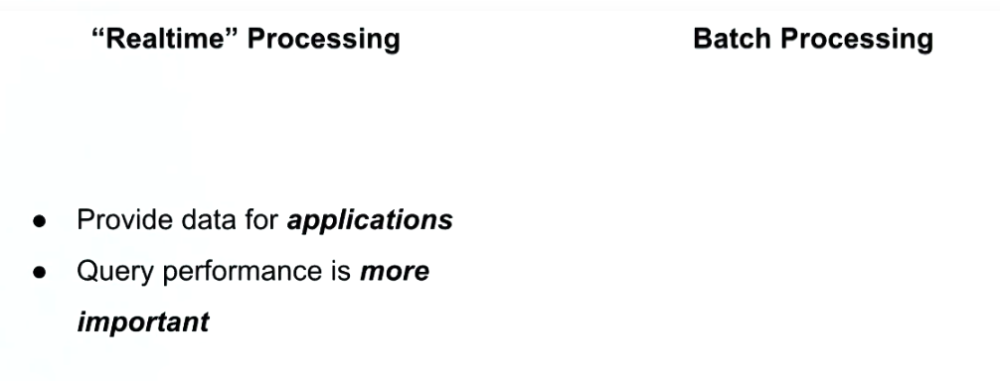

Un usuario va a realizar algún tipo de acción, la acción va a desencadenar una consulta de agregación, y luego los resultados de esa consulta deben devolverse al usuario en un período de tiempo razonable.

Con el procesamiento por lotes, por otro lado, generalmente estamos hablando de hacer agregación para proporcionar análisis.

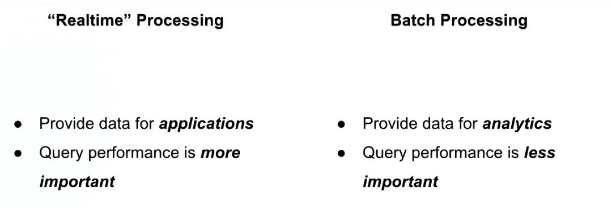

Y dado que proporcionamos análisis, eso significa que estos trabajos generalmente se ejecutan de forma periódica.

Y los resultados no se inspeccionan hasta minutos, horas o incluso días después de cuando se ejecutó esa consulta.

Esto significa que el rendimiento de la consulta es menos importante que con el procesamiento en tiempo real.

A lo largo de esta lección, nos centraremos en el primer tipo, el procesamiento en tiempo real.

Ahora, algunos de estos principios también se aplicarán a la categoría de procesamiento por lotes.

Pero en su mayor parte discutiremos estrategias para optimizar el rendimiento de agregación para el procesamiento en tiempo real.

Ahora con eso fuera del camino, sigamos adelante y discutamos la carne de esta lección, el uso de index para consultas de agregación.


Ahora, a medida que aprende en este curso, los índices son una parte vital del buen rendimiento de las consultas.

Y esta misma idea se aplica a las consultas de agregación.

Básicamente, queremos asegurarnos de que nuestras consultas de agregación puedan usar índices tanto como sea posible.

Ahora, naturalmente, dado que la agregación es un poco diferente a la consulta de búsqueda típica, determinar el uso del índice también es un poco diferente.

Con una consulta de agregación, formamos un pipeline de diferentes operadores de agregación, que transforman nuestros datos en el formato que deseamos.

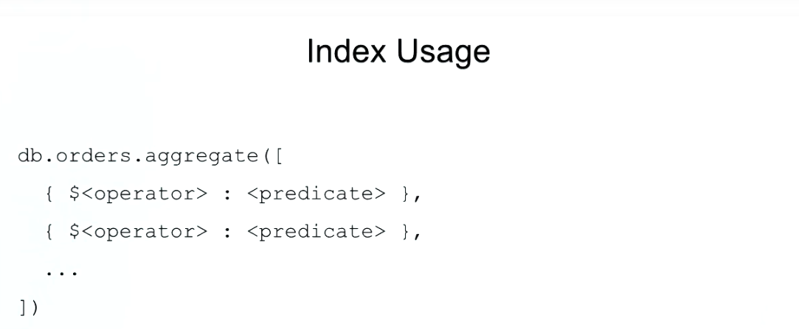

Ahora, algunos de estos operadores de agregación pueden usar índices, y otros no.

Pero lo que es más importante, dado que los datos se mueven a través de nuestra canalización desde el primer operador hasta el último, una vez que el servidor encuentra una etapa que no puede usar índices, todas las etapas siguientes ya no podrán usar índices.

Afortunadamente para nosotros, el optimizador de consultas hace todo lo posible para detectar cuándo se puede avanzar una etapa para que se puedan utilizar los índices.

Pero si comprende los principios subyacentes de cómo funciona esto, puede tener más confianza en el rendimiento de su consulta y tendrá que confiar menos en el optimizador de consultas.

Para que podamos determinar cómo se ejecutan las consultas de agregación y si se utilizan o no los índices, podemos pasar el documento de explicación (explain) verdadera como una opción al método de agregación.

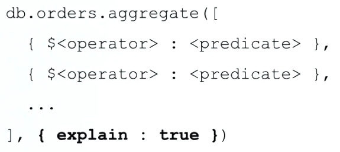

Esto producirá una salida de explicación similar a la que estamos acostumbrados a ver con find.

Ahora, para el resto de estos ejemplos, nos ocuparemos de esta colección de pedidos hipotéticos.

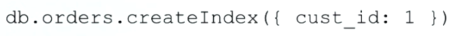

Y vamos a seguir adelante y asumir que tenemos un índice de ID del cliente.

Como era de esperar, el operador `$match` puede utilizar índices.

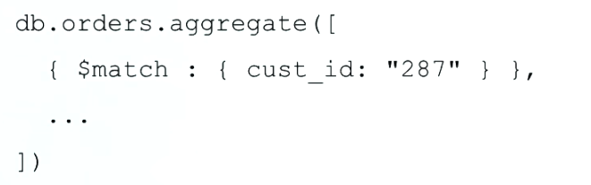

Esto es especialmente cierto si está al comienzo de un pipeline.

Verá un tema natural aquí: queremos ver operadores que usan índices al frente de nuestras pipelines.

Del mismo modo, siempre vamos a querer poner las etapas de clasificación lo más cerca posible del frente.

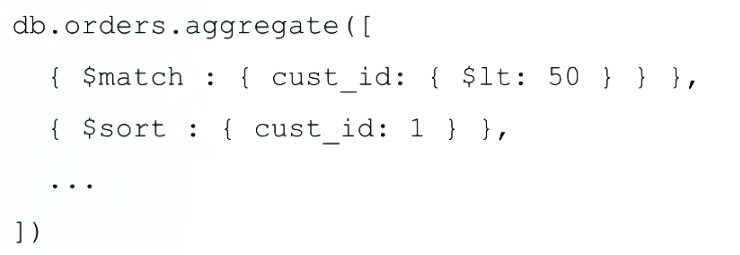

Con las consultas de búsqueda vimos la gravedad de la degradación de nuestro rendimiento cuando la clasificación no puede utilizar un índice.

Por esta razón, queremos asegurarnos de que nuestras etapas de ordenación se realicen antes de cualquier tipo de transformaciones para asegurarnos de que utilizamos índices para la clasificación.

Si está haciendo un límite y está haciendo una clasificación, debe asegurarse de que estén cerca el uno del otro y al frente del pipeline.

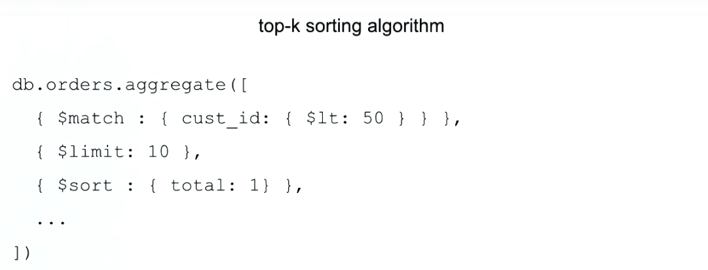

Cuando esto sucede, el servidor puede hacer una ordenación de top-k.

Esto es cuando el servidor solo puede asignar memoria para el número final de documentos, en este caso, 10.

Esto puede suceder incluso sin índices.

Esta es una de las situaciones sin índice de mayor rendimiento en las que puede estar.

Optimizaciones como esta son realizadas por el optimizador de consultas siempre que sea posible.

Pero si existe la posibilidad de que esta optimización pueda cambiar el resultado que resulta, entonces el motor de consulta no realizará este tipo de optimización.

Por eso es importante comprender estos principios subyacentes.

Ahora esas son las optimizaciones de agregación básicas que puede hacer.

Ahora analicemos algunas de las restricciones de memoria que debe tener en cuenta al realizar la agregación.


Primero que nada, tus resultados están sujetos al límite de documentos de 16 megabytes que existe en MongoDB.


La agregación generalmente genera un único documento, y ese único documento será susceptible a este límite.

Ahora este límite no se aplica a los documentos a medida que fluyen a través del pipeline.

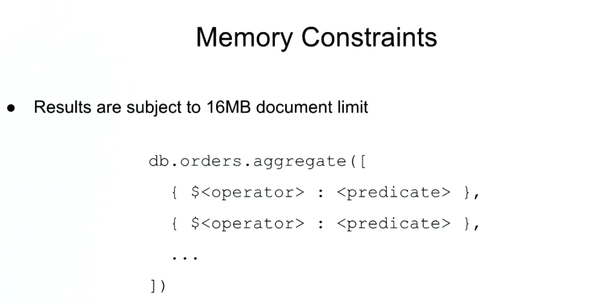

A medida que transforma los documentos, en realidad pueden superar el límite de 16 megabytes, pero todo lo que se devuelva seguirá estando por debajo del límite de 16 megabytes.

La mejor manera de mitigar este problema es mediante el uso de `$limit` y `$project` para reducir el tamaño del documento resultante.


Otra limitación de la que querrá tener en cuenta es que para cada etapa de nuestro pipeline, hay un límite de uso de RAM de 100 megabytes.

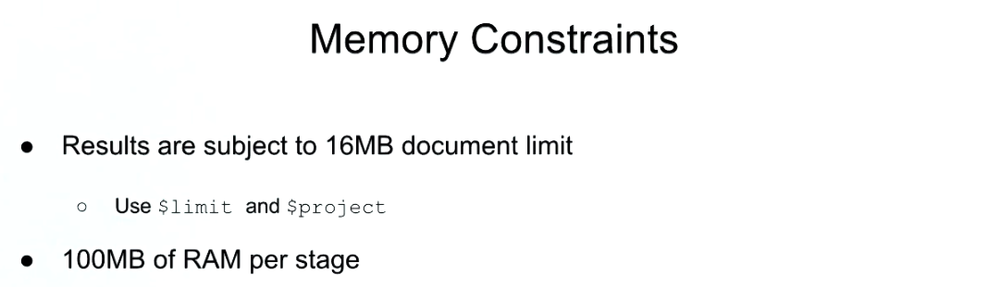

Ahora, la mejor manera absoluta de mitigar esto es garantizar que sus etapas más grandes puedan utilizar índices.

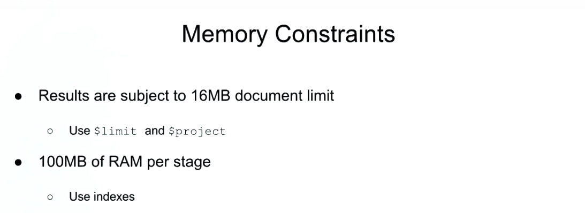

Esto reducirá sus requisitos de memoria, ya que los índices son generalmente mucho más pequeños que los documentos a los que hacen referencia.

Además, con la clasificación, reducen drásticamente los requisitos de memoria, ya que no es necesario asignar memoria adicional para esa clasificación.

Ahora, si todavía se encuentra con este límite de 100 megabytes, incluso si usa índices, entonces hay una forma adicional de evitarlo.

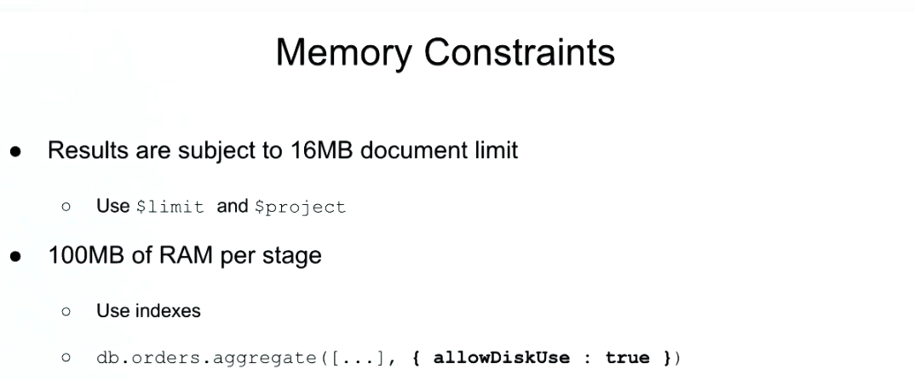

Y eso es especificando allowDiskUse true en su consulta de agregación.

Esto le permitirá verterse en el disco, en lugar de hacer todo en la memoria.

Ahora, es importante comprender que esta es una medida absoluta de último recurso.

El acceso a los discos duros es miles de veces más lento que el de la memoria, por lo que al dividirse en disco, verá una grave degradación del rendimiento.

En algunas situaciones, esto es necesario, pero debe tener en cuenta que esto disminuirá seriamente el rendimiento.

Dado que allowDiskUse true afectará seriamente el rendimiento, lo verá con más frecuencia en el tipo de trabajos de procesamiento por lotes, en lugar del procesamiento en tiempo real.

Y lo último que quiero señalar aquí es que permitir el uso del disco no funciona con `$graphLookup`, y eso es porque `$graphLookup` actualmente no admite la división en disco.

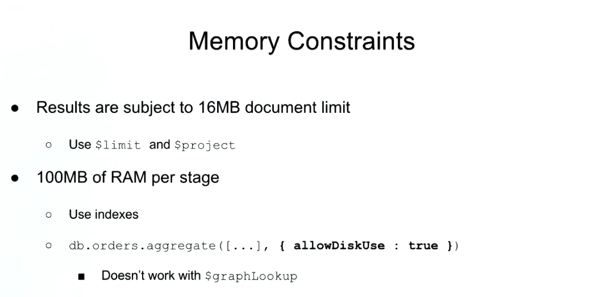

Recapitulemos lo que hemos aprendido.


Entonces, en esta lección, discutimos algunas de las diferentes estrategias de optimización para utilizar índices con sus consultas de agregación, y también discutimos algunas de las restricciones de los miembros que se aplican a la agregación, y cómo puede mitigar y solucionar esos problemas.

## 2. Examen Aggregation Performance

**Problem:**

With regards to aggregation performance, which of the following are true?

Check all answers that apply:

* You can increase index usage by moving `$match` stages to the end of your pipeline

* Passing `allowDiskUsage` to your aggregation queries will seriously increase their performance

* When `$limit` and `$sort` are close together a very performant top-k sort can be performed :+1:

* Transforming data in a pipeline stage prevents us from using indexes in the stages that follow :+1:

### See detailed answer

* **You can increase index usage by moving $match stages to the end of your pipeline**

No, you should move `$match` stages to the beginning of your pipelines!

* **Passing `allowDiskUsage` to your aggregation queries will seriously increase their performance**

No, `allowDiskUsage` will decrease query performance, but it will be necessary to circumvent the 100MB per stage limit.

* **When `$limit` and `$sort` are close together a very performant top-k sort can be performed**

Yes, this is true!

* **Transforming data in a pipeline stage prevents us from using indexes in the stages that follow**

Yes, this is true. That's why it's important to put all your index using operators at the front of your pipelines!

## 3. Tema: Aggregation Pipeline en un Sharded Cluster

### Notas de lectura

**Nota**: A las 3:05, las dos etapas `$limit` se fusionarán en una etapa de límite de `$limit: 5`, no de `$limit: 15` como se muestra en el video.

Puede obtener más información sobre la agregación en un clúster fragmentado visitando la sección [Aggregation Pipeline and Sharded Collections](https://docs.mongodb.com/manual/core/aggregation-pipeline-sharded-collections/?jmp=university) del Manual MongoDB.

### Transcripción

En esta lección, vamos a hablar sobre la aggregation pipeline en un sharded cluster (clúster fragmentado).


Específicamente vamos a discutir cómo funciona, dónde se completan las operaciones, y también veremos cómo se optimizan los pipelines para que funcionen bien en grupos fragmentados.

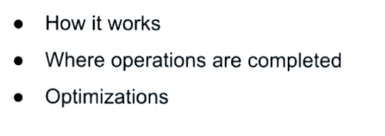

Avancemos y hablemos sobre cómo funciona la agregación en un clúster fragmentado.

Cuando ejecutamos consultas de agregación en un replica set o MongoDB independiente, es mucho más fácil para el servidor razonar porque todos los datos se encuentran en un solo lugar.

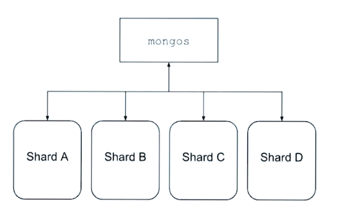

En un clúster fragmentado, dado que nuestros datos se dividen en diferentes fragmentos, esto se vuelve un poco más difícil.

Afortunadamente, MongoDB tiene algunos buenos trucos bajo la manga para abordar estos problemas.

Por ejemplo, aquí tenemos la consulta de agregación simple donde estoy usando match para encontrar todos los restaurantes en el estado de Nueva York.

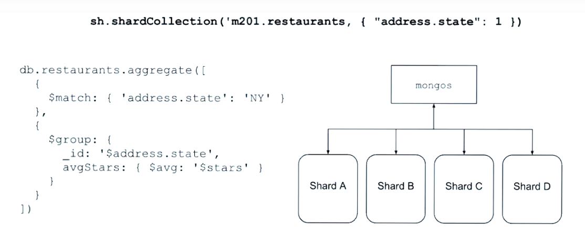

Luego estoy usando group para agrupar por cada estado y luego promedio la cantidad de estrellas para ese estado dado.

Como mi clave de fragmento (shard key) está en estado, todos los restaurantes en Nueva York estarán en el mismo fragmento.

Esto significa que el servidor puede simplemente enrutar la consulta agregada a ese fragmento, donde puede ejecutar la agregación y devolver los resultados al Mongo S y luego al cliente.

Muy sencillo

Ahora mira este ejemplo.

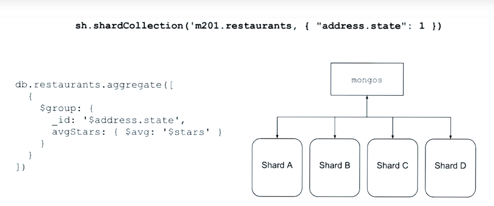

He cambiado ligeramente la consulta para que ya no usemos la etapa de coincidencia.

Así que ahora estamos hablando de todos los documentos en nuestra colección fragmentada.

Ahora, dado que estos documentos se extienden a través de múltiples fragmentos, vamos a necesitar hacer algunos cálculos en cada fragmento, pero luego también tendremos que obtener de alguna manera todos esos resultados en un solo lugar, donde podamos fusionar los resultados juntos.

En este caso, nuestro pipeline necesita ser dividida.

El servidor determinará qué etapas deben ejecutarse en cada fragmento, y luego qué etapas deben ejecutarse en un solo fragmento donde los resultados de los otros fragmentos se fusionarán.

En general, la fusión ocurrirá en un fragmento aleatorio, pero hay ciertas circunstancias en las que este no es el caso.

Este no es el caso cuando usamos `$out` o `$facet` o `$lookup` o `$graphLookup`.

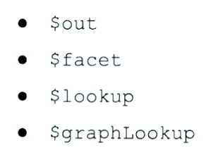

Para estas consultas, el fragmento primario hará el trabajo de fusionar nuestros resultados.

Y esto es importante de entender porque si ejecutamos estas operaciones con mucha frecuencia, uno de nuestros fragmentos, el fragmento primario, estará bajo mucha más carga que el resto de nuestro clúster, lo que degradará los beneficios de nuestro escalado horizontal.

En estas circunstancias específicas, puede mitigar este problema utilizando una máquina con más recursos para su fragmento primario.

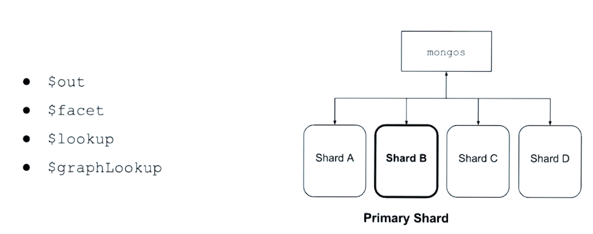

También hay algunas optimizaciones interesantes que el servidor intentará realizar que debe tener en cuenta.


La mayoría de estos también se aplicarán cuando no esté fragmentando, pero aún así son útiles para saber.

Toma este ejemplo.

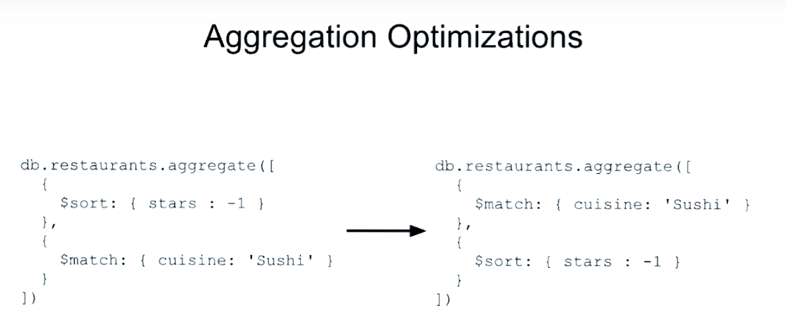

Aquí tenemos un sort seguida de un match.

Ahora el optimizador de consultas moverá la coincidencia delante del orden para reducir la cantidad de documentos que deben ordenarse.

Esto es particularmente útil en clústeres fragmentados cuando tenemos una división en nuestro pipeline y cuando desea reducir la cantidad de datos que se transfieren por cable a nuestro fragmento de fusión.

Del mismo modo, podemos reducir la cantidad de documentos que necesitamos examinar moviendo el límite después de un salto delante de él.

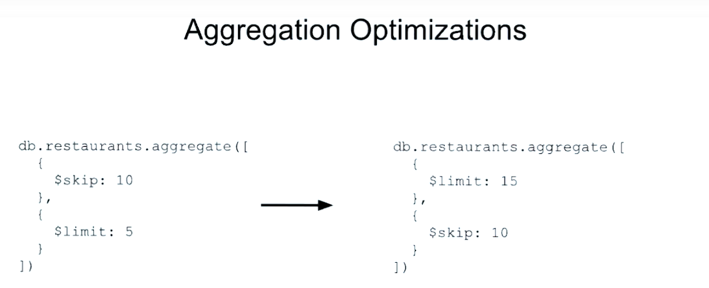

Observe que el planificador de consultas actualiza los valores en consecuencia para admitir esta optimización.

Además de mover etapas, el servidor también puede combinar ciertas etapas juntas.

Aquí veremos dónde combinamos dos límites en uno.

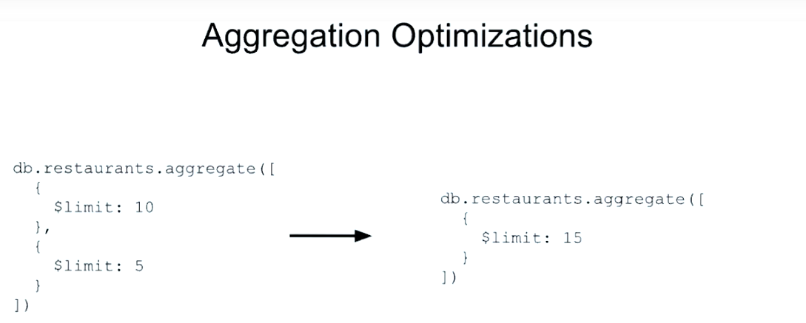

Lo mismo con skip.

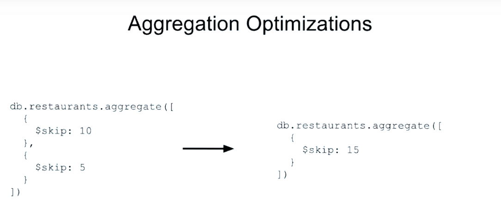

Y finalmente, estamos viendo lo mismo con match.

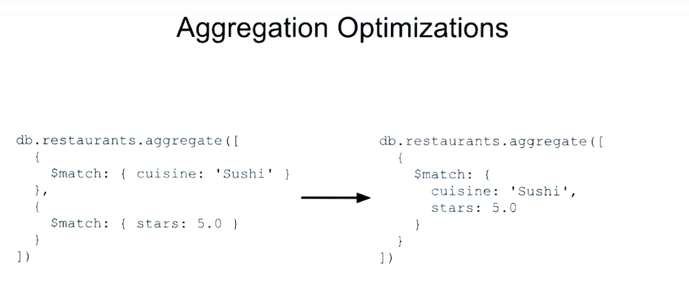

Ahora todas estas optimizaciones serán intentadas automáticamente por el optimizador de consultas.

Dicho esto, creo que es importante señalar estas optimizaciones para que pueda considerar más cuidadosamente sus propios canales de agregación y las implicaciones de rendimiento.

Y eso debería darle una buena visión general del aggregation pipeline en un clúster fragmentado.

Recapitulemos lo que aprendimos.

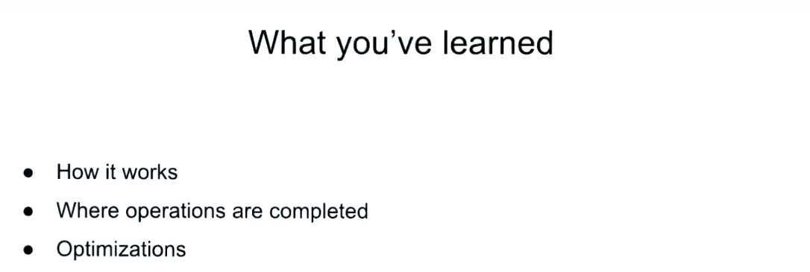

* Discutimos cómo funciona aggregation pipeline en un entorno fragmentado.

* Y específicamente vimos dónde ocurren las diferentes operaciones cuando usamos sharding.

* Y finalmente, observamos algunas optimizaciones que el servidor intentará hacer cuando ejecute consultas de agregación.

## 4. Examen Aggregation Pipeline on a Sharded Cluster

**Problem:**

What operators will cause a merge stage on the primary shard for a database?

Check all answers that apply:

* `$group`

* `$lookup` :+1:

* `$out` :+1:

### See detailed answer

* `$out`

Yes.

* `$group`

No, `$group` can potentially cause a merge stage, but a random shard will be selected for the merging.

* `$lookup`

Yes.

## 5. Tema: Pipeline Optimization - Parte 1

### Transcripción

Hablemos de la optimización de Pipeline.


Ya hemos aprendido sobre el uso temprano de las etapas de match y sort, y el uso de índices que utilizan las etapas limit y sort para producir los mejores resultados de top K, y cómo permitir el uso de más de 100 megabytes de memoria.

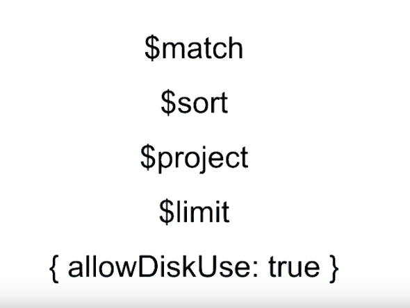

Vamos a sumergirnos más y mirar las pipelines en sí mismas y cómo podrían optimizarse.

Consideremos la siguiente agregación que da la duración de los títulos de películas que comienzan con vocales y las ordena por frecuencia.

```sh
db.movies.aggregate([
  {
    $match: {
      title: /^[aeiou]/i
    }
  },
  {
    $project: {
      title_size: { $size: { $split: ["$title", " "] } }
    }
  },
  {
    $group: {
      _id: "$title_size",
      count: { $sum: 1 }
    }
  },
  {
    $sort: { count: -1 }
  }
])
```

Entonces comenzamos con nuestra etapa match, buscando títulos que comiencen con una vocal, ignorando el case.

Luego proyectamos el tamaño de nuestro título, componiendo el tamaño y dividiéndolo juntos, y dividiendo el título en espacios.

En nuestra etapa group, estamos agrupando documentos similares según el tamaño del título que acabamos de calcular y obteniendo un count.

Finalmente, vamos a ordenar en dirección descendente.

Entonces, la frecuencia más alta debería volver primero.

Ejecutemos esto para tener una idea de los resultados.

```sh
MongoDB Enterprise Cluster0-shard-0:PRIMARY> db.movies.aggregate([
...   {
...     $match: {
...       title: /^[aeiou]/i
...     }
...   },
...   {
...     $project: {
...       title_size: { $size: { $split: ["$title", " "] } }
...     }
...   },
...   {
...     $group: {
...       _id: "$title_size",
...       count: { $sum: 1 }
...     }
...   },
...   {
...     $sort: { count: -1 }
...   }
... ])
{ "_id" : 3, "count" : 1450 }
{ "_id" : 2, "count" : 1372 }
{ "_id" : 1, "count" : 1200 }
{ "_id" : 4, "count" : 1166 }
{ "_id" : 5, "count" : 647 }
{ "_id" : 6, "count" : 285 }
{ "_id" : 7, "count" : 149 }
{ "_id" : 8, "count" : 85 }
{ "_id" : 9, "count" : 39 }
{ "_id" : 10, "count" : 21 }
{ "_id" : 11, "count" : 17 }
{ "_id" : 12, "count" : 6 }
{ "_id" : 15, "count" : 4 }
{ "_id" : 14, "count" : 3 }
{ "_id" : 13, "count" : 2 }
{ "_id" : 17, "count" : 1 }
MongoDB Enterprise Cluster0-shard-0:PRIMARY> 

```

Podemos ver que la longitud más común para el título de una película parece ser de tres palabras y hubo 1,450 documentos que cayeron en este grupo.

También podemos ver que la longitud más poco común para un título de película es de 17 palabras, con solo un documento en este grupo.

Examinemos ahora la explain information para esta agregación.

```sh
db.movies.aggregate(
  [
    {
      $match: {
        title: /^[aeiou]/i
      }
    },
    {
      $project: {
        title_size: { $size: { $split: ["$title", " "] } }
      }
    },
    {
      $group: {
        _id: "$title_size",
        count: { $sum: 1 }
      }
    },
    {
      $sort: { count: -1 }
    }
  ],
  { explain: true }
)
```

Examinemos ahora la información de explicación para esta agregación.

Entonces tenemos la misma pipeline que antes.

Pero esta vez estamos agregando explain true para obtener la salida explain.

Echemos un vistazo a los resultados.

```sh
MongoDB Enterprise Cluster0-shard-0:PRIMARY> db.movies.aggregate(
...   [
...     {
...       $match: {
...         title: /^[aeiou]/i
...       }
...     },
...     {
...       $project: {
...         title_size: { $size: { $split: ["$title", " "] } }
...       }
...     },
...     {
...       $group: {
...         _id: "$title_size",
...         count: { $sum: 1 }
...       }
...     },
...     {
...       $sort: { count: -1 }
...     }
...   ],
...   { explain: true }
... )
{
	"stages" : [
		{
			"$cursor" : {
				"query" : {
					"title" : /^[aeiou]/i
				},
				"fields" : {
					"title" : 1,
					"_id" : 1
				},
				"queryPlanner" : {
					"plannerVersion" : 1,
					"namespace" : "aggregations.movies",
					"indexFilterSet" : false,
					"parsedQuery" : {
						"title" : {
							"$regex" : "^[aeiou]",
							"$options" : "i"
						}
					},
					"winningPlan" : {
						"stage" : "FETCH",
						"inputStage" : {
							"stage" : "IXSCAN",
							"filter" : {
								"title" : {
									"$regex" : "^[aeiou]",
									"$options" : "i"
								}
							},
							"keyPattern" : {
								"title" : 1,
								"year" : 1
							},
							"indexName" : "title_1_year_1",
							"isMultiKey" : false,
							"multiKeyPaths" : {
								"title" : [ ],
								"year" : [ ]
							},
							"isUnique" : false,
							"isSparse" : false,
							"isPartial" : false,
							"indexVersion" : 2,
							"direction" : "forward",
							"indexBounds" : {
								"title" : [
									"[\"\", {})",
									"[/^[aeiou]/i, /^[aeiou]/i]"
								],
								"year" : [
									"[MinKey, MaxKey]"
								]
							}
						}
					},
					"rejectedPlans" : [
						{
							"stage" : "FETCH",
							"inputStage" : {
								"stage" : "IXSCAN",
								"filter" : {
									"title" : {
										"$regex" : "^[aeiou]",
										"$options" : "i"
									}
								},
								"keyPattern" : {
									"title" : 1
								},
								"indexName" : "title_1",
								"isMultiKey" : false,
								"multiKeyPaths" : {
									"title" : [ ]
								},
								"isUnique" : false,
								"isSparse" : false,
								"isPartial" : false,
								"indexVersion" : 2,
								"direction" : "forward",
								"indexBounds" : {
									"title" : [
										"[\"\", {})",
										"[/^[aeiou]/i, /^[aeiou]/i]"
									]
								}
							}
						},
						{
							"stage" : "FETCH",
							"inputStage" : {
								"stage" : "IXSCAN",
								"filter" : {
									"title" : {
										"$regex" : "^[aeiou]",
										"$options" : "i"
									}
								},
								"keyPattern" : {
									"title" : 1,
									"imdb.rating" : 1
								},
								"indexName" : "title_1_imdb.rating_1",
								"isMultiKey" : false,
								"multiKeyPaths" : {
									"title" : [ ],
									"imdb.rating" : [ ]
								},
								"isUnique" : false,
								"isSparse" : false,
								"isPartial" : false,
								"indexVersion" : 2,
								"direction" : "forward",
								"indexBounds" : {
									"title" : [
										"[\"\", {})",
										"[/^[aeiou]/i, /^[aeiou]/i]"
									],
									"imdb.rating" : [
										"[MinKey, MaxKey]"
									]
								}
							}
						}
					]
				}
			}
		},
		{
			"$project" : {
				"_id" : true,
				"title_size" : {
					"$size" : [
						{
							"$split" : [
								"$title",
								{
									"$const" : " "
								}
							]
						}
					]
				}
			}
		},
		{
			"$group" : {
				"_id" : "$title_size",
				"count" : {
					"$sum" : {
						"$const" : 1
					}
				}
			}
		},
		{
			"$sort" : {
				"sortKey" : {
					"count" : -1
				}
			}
		}
	],
	"serverInfo" : {
		"host" : "cluster0-shard-00-00-jxeqq.mongodb.net",
		"port" : 27017,
		"version" : "4.0.16",
		"gitVersion" : "2a5433168a53044cb6b4fa8083e4cfd7ba142221"
	},
	"ok" : 1,
	"operationTime" : Timestamp(1584967337, 1),
	"$clusterTime" : {
		"clusterTime" : Timestamp(1584967337, 1),
		"signature" : {
			"hash" : BinData(0,"WFTM8FrdxLe3N8o8bVD++C7UpFQ="),
			"keyId" : NumberLong("6763648209215553537")
		}
	}
}
MongoDB Enterprise Cluster0-shard-0:PRIMARY> 
```

Hay mucha información interesante aquí.

Podemos ver cuál fue nuestra consulta, los campos que se guardaron, que resultaron ser `title` y `_id`, y luego el planificador de consultas.

Un poco más abajo, también podemos ver el plan ganador `winningPlan` que utilizó una etapa `FETCH` seguida de un escaneo de índice `IXSCAN`.

Probablemente podamos hacerlo un poco mejor que esto, porque sabemos que tenemos un índice que debería admitir esta consulta.

También podemos ver las etapas que se ejecutaron.

Nuestra etapa `$project` convertida donde vemos `_id` true-- esto está implícito, recuerde-- el tamaño del título `title_size` donde calculamos el tamaño de nuestro título, y luego podemos ver nuestro `$group` y nuestra `$sort` junto con la sort key; Información bastante interesante.

Entonces, veamos si podemos hacerlo mejor.

Nuestro objetivo es intentar que esto sea una consulta cubierta, lo que significa que no hay una etapa de recuperación.

Entonces, esta aggregation pipeline es casi idéntica a la primera que teníamos, excepto que me estoy deshaciendo explícitamente del campo `_id`.

```sh
db.movies.aggregate([
  {
    $match: {
      title: /^[aeiou]/i
    }
  },
  {
    $project: {
      _id: 0,
      title_size: { $size: { $split: ["$title", " "] } }
    }
  },
  {
    $group: {
      _id: "$title_size",
      count: { $sum: 1 }
    }
  },
  {
    $sort: { count: -1 }
  }
])
```

Recuerde, la etapa project lo mantiene implícitamente a menos que le indiquemos que no lo haga.

Veamos si obtenemos los mismos resultados.

```sh
MongoDB Enterprise Cluster0-shard-0:PRIMARY> db.movies.aggregate([
...   {
...     $match: {
...       title: /^[aeiou]/i
...     }
...   },
...   {
...     $project: {
...       _id: 0,
...       title_size: { $size: { $split: ["$title", " "] } }
...     }
...   },
...   {
...     $group: {
...       _id: "$title_size",
...       count: { $sum: 1 }
...     }
...   },
...   {
...     $sort: { count: -1 }
...   }
... ])
{ "_id" : 3, "count" : 1450 }
{ "_id" : 2, "count" : 1372 }
{ "_id" : 1, "count" : 1200 }
{ "_id" : 4, "count" : 1166 }
{ "_id" : 5, "count" : 647 }
{ "_id" : 6, "count" : 285 }
{ "_id" : 7, "count" : 149 }
{ "_id" : 8, "count" : 85 }
{ "_id" : 9, "count" : 39 }
{ "_id" : 10, "count" : 21 }
{ "_id" : 11, "count" : 17 }
{ "_id" : 12, "count" : 6 }
{ "_id" : 15, "count" : 4 }
{ "_id" : 14, "count" : 3 }
{ "_id" : 13, "count" : 2 }
{ "_id" : 17, "count" : 1 }
MongoDB Enterprise Cluster0-shard-0:PRIMARY> 
```

Y, de hecho, obtenemos los mismos resultados que antes, donde parece que las películas con una longitud de tres palabras son las más frecuentes con 1.450 documentos.

OK.

Verificamos los mismos resultados.

Verifiquemos el resultado de la explicación para ver si hemos mejorado el rendimiento de nuestra consulta.

Nuevamente, la misma pipeline que acabamos de usar también proyectaba `_id`, simplemente agregando la opción explain true a la función de agregación.

```sh
MongoDB Enterprise Cluster0-shard-0:PRIMARY> db.movies.aggregate(
...   [
...     {
...       $match: {
...         title: /^[aeiou]/i
...       }
...     },
...     {
...       $project: {
...         title_size: { $size: { $split: ["$title", " "] } }
...       }
...     },
...     {
...       $group: {
...         _id: "$title_size",
...         count: { $sum: 1 }
...       }
...     },
...     {
...       $sort: { count: -1 }
...     }
...   ],
...   { explain: true }
... )
{
	"stages" : [
		{
			"$cursor" : {
				"query" : {
					"title" : /^[aeiou]/i
				},
				"fields" : {
					"title" : 1,
					"_id" : 1
				},
				"queryPlanner" : {
					"plannerVersion" : 1,
					"namespace" : "aggregations.movies",
					"indexFilterSet" : false,
					"parsedQuery" : {
						"title" : {
							"$regex" : "^[aeiou]",
							"$options" : "i"
						}
					},
					"winningPlan" : {
						"stage" : "FETCH",
						"inputStage" : {
							"stage" : "IXSCAN",
							"filter" : {
								"title" : {
									"$regex" : "^[aeiou]",
									"$options" : "i"
								}
							},
							"keyPattern" : {
								"title" : 1,
								"year" : 1
							},
							"indexName" : "title_1_year_1",
							"isMultiKey" : false,
							"multiKeyPaths" : {
								"title" : [ ],
								"year" : [ ]
							},
							"isUnique" : false,
							"isSparse" : false,
							"isPartial" : false,
							"indexVersion" : 2,
							"direction" : "forward",
							"indexBounds" : {
								"title" : [
									"[\"\", {})",
									"[/^[aeiou]/i, /^[aeiou]/i]"
								],
								"year" : [
									"[MinKey, MaxKey]"
								]
							}
						}
					},
					"rejectedPlans" : [
						{
							"stage" : "FETCH",
							"inputStage" : {
								"stage" : "IXSCAN",
								"filter" : {
									"title" : {
										"$regex" : "^[aeiou]",
										"$options" : "i"
									}
								},
								"keyPattern" : {
									"title" : 1
								},
								"indexName" : "title_1",
								"isMultiKey" : false,
								"multiKeyPaths" : {
									"title" : [ ]
								},
								"isUnique" : false,
								"isSparse" : false,
								"isPartial" : false,
								"indexVersion" : 2,
								"direction" : "forward",
								"indexBounds" : {
									"title" : [
										"[\"\", {})",
										"[/^[aeiou]/i, /^[aeiou]/i]"
									]
								}
							}
						},
						{
							"stage" : "FETCH",
							"inputStage" : {
								"stage" : "IXSCAN",
								"filter" : {
									"title" : {
										"$regex" : "^[aeiou]",
										"$options" : "i"
									}
								},
								"keyPattern" : {
									"title" : 1,
									"imdb.rating" : 1
								},
								"indexName" : "title_1_imdb.rating_1",
								"isMultiKey" : false,
								"multiKeyPaths" : {
									"title" : [ ],
									"imdb.rating" : [ ]
								},
								"isUnique" : false,
								"isSparse" : false,
								"isPartial" : false,
								"indexVersion" : 2,
								"direction" : "forward",
								"indexBounds" : {
									"title" : [
										"[\"\", {})",
										"[/^[aeiou]/i, /^[aeiou]/i]"
									],
									"imdb.rating" : [
										"[MinKey, MaxKey]"
									]
								}
							}
						}
					]
				}
			}
		},
		{
			"$project" : {
				"_id" : true,
				"title_size" : {
					"$size" : [
						{
							"$split" : [
								"$title",
								{
									"$const" : " "
								}
							]
						}
					]
				}
			}
		},
		{
			"$group" : {
				"_id" : "$title_size",
				"count" : {
					"$sum" : {
						"$const" : 1
					}
				}
			}
		},
		{
			"$sort" : {
				"sortKey" : {
					"count" : -1
				}
			}
		}
	],
	"serverInfo" : {
		"host" : "cluster0-shard-00-00-jxeqq.mongodb.net",
		"port" : 27017,
		"version" : "4.0.16",
		"gitVersion" : "2a5433168a53044cb6b4fa8083e4cfd7ba142221"
	},
	"ok" : 1,
	"operationTime" : Timestamp(1584969527, 1),
	"$clusterTime" : {
		"clusterTime" : Timestamp(1584969527, 1),
		"signature" : {
			"hash" : BinData(0,"p/w2C9rZP+BVo+9dBWxWM/MfHi0="),
			"keyId" : NumberLong("6763648209215553537")
		}
	}
}
MongoDB Enterprise Cluster0-shard-0:PRIMARY> 
```

Y mirando el plan de explicación, vemos nuevamente que tenemos la misma consulta en el cursor.

Esta vez los campos son diferentes.

Mantendremos el título y proyectaremos lejos `_id`.

Sigamos adelante y bajemos al plan ganador `winningPlan` para ver si evitamos esa etapa de recuperación.

Muy bien, así que mirando nuestro plan ganador, podemos ver que es mucho mejor.

Puedo ver que no hay etapa fetch.

Así que nuestra etapa match estaba cubierta.

Cuando vemos una etapa fetch, significa que MongoDB tuvo que ir al documento para obtener más información, en lugar de usar solo la información del índice.

De cierto interés en `$project`, también podemos ver que `_id` ahora se proyectaba como `false`.

Esto se debe a que proporcionamos explícitamente esa información.

Entonces, veamos si podemos hacerlo aún mejor.

Así que aquí está nuestra nueva pipeline modificada, donde tenemos la misma etapa match.

```sh
db.movies.aggregate([
  {
    $match: {
      title: /^[aeiou]/i
    }
  },
  {
    $project: {
      _id: 0,
      title_size: { $size: { $split: ["$title", " "] } }
    }
  },
  {
    $group: {
      _id: "$title_size",
      count: { $sum: 1 }
    }
  },
  {
    $sort: { count: -1 }
  }
])
```

Sin embargo, esta vez no tenemos etapa de proyecto.

En cambio, realizamos la lógica que necesitamos dentro del grupo y luego ordenamos esos resultados.

Vamos a verlo en acción.

```sh
MongoDB Enterprise Cluster0-shard-0:PRIMARY> db.movies.aggregate([
...   {
...     $match: {
...       title: /^[aeiou]/i
...     }
...   },
...   {
...     $project: {
...       _id: 0,
...       title_size: { $size: { $split: ["$title", " "] } }
...     }
...   },
...   {
...     $group: {
...       _id: "$title_size",
...       count: { $sum: 1 }
...     }
...   },
...   {
...     $sort: { count: -1 }
...   }
... ])
{ "_id" : 3, "count" : 1450 }
{ "_id" : 2, "count" : 1372 }
{ "_id" : 1, "count" : 1200 }
{ "_id" : 4, "count" : 1166 }
{ "_id" : 5, "count" : 647 }
{ "_id" : 6, "count" : 285 }
{ "_id" : 7, "count" : 149 }
{ "_id" : 8, "count" : 85 }
{ "_id" : 9, "count" : 39 }
{ "_id" : 10, "count" : 21 }
{ "_id" : 11, "count" : 17 }
{ "_id" : 12, "count" : 6 }
{ "_id" : 15, "count" : 4 }
{ "_id" : 14, "count" : 3 }
{ "_id" : 13, "count" : 2 }
{ "_id" : 17, "count" : 1 }
MongoDB Enterprise Cluster0-shard-0:PRIMARY> 
```

Muy bien, muy bien.

Obtuvimos los mismos resultados, tres palabras, recuento de 1.450 documentos.

Verifiquemos la salida de explicación para ver la diferencia entre esta pipeline y nuestra pipeline anterior.

Muy bien, veamos el resultado de la explicación.

Podemos ver que la consulta es la misma.

Podemos ver que los campos también son los mismos: `"title": 1`, `"_id": 0`.

¿Cómo sabía el aggregation framework hacer esto cuando no especificamos una etapa project?

Cubramos eso en un momento.

En nuestro plan ganador `winningPlan`, podemos ver que no hubo una etapa de recuperación, lo que significa que esta es una consulta cubierta.

Si nos desplazamos hasta el final para ver el resto de nuestras etapas del pipeline, podemos ver la siguiente etapa después de que nuestra consulta sea group, luego nuestra sort y listo.

Una conclusión clave aquí es evitar project innecesarios.

Como vimos, el aggregation pipeline asumió que sabíamos lo que estábamos haciendo con cada proyecto.

Sin embargo, si el aggregation pipeline puede determinar la forma del documento final basándose solo en la entrada inicial, internamente proyectará campos innecesarios.

Eso fue un bocado.

Así que déjenme explicarlo con un poco más de detalle.

```sh
db.movies.aggregate(
  [
    {
      $match: {
        title: /^[aeiou]/i
      }
    },
    {
      $group: {
        _id: {
          $size: { $split: ["$title", " "] }
        },
        count: { $sum: 1 }
      }
    },
    {
      $sort: { count: -1 }
    }
  ],
  { explain: true }
)
```

En la primera etapa match, el único campo que nos importaba era `title`.

En la etapa group, nuevamente, el único campo que nos importa es `title`.

Usamos esta composición de expresiones para obtener el número de palabras en el título.

Pero podemos hacerlo en línea evaluando primero dividir el título de los espacios en un array y luego obtener el tamaño del array.

No hay necesidad de una etapa de project intermedia, porque podemos calcular ese valor en línea aquí.

Esta es una característica muy poderosa.

Siempre debemos esforzarnos por dejar que el optimizador trabaje para nosotros.

Además, esto elimina una etapa que finalmente agrega tiempo al pipeline.

Pensemos en eso.

Digamos que tenemos 100,000 documentos en nuestra colección de películas.

En el match, filtramos hasta 10,000.

Ahora en el group, tenemos 10,000 documentos que nos llegan.

Y en sort, tenemos quizás 15.

Bueno, con esa etapa intermedia project que realmente no necesitábamos, recibimos 100,000, luego tenemos 10,000, y enviamos todos los 10,000 a través de ese project intermediario antes de que llegaran a la etapa grupal.

Eso es 10,000 iteraciones adicionales que acabamos de evitar.

Por lo tanto, como regla general, no proyecte a menos que esté haciendo un trabajo real en esta etapa.

Y recuerde que agregar campos está disponible.

Bien, una última nota antes de continuar, podríamos reemplazar group y sort por ordenar por conteo (sort by count).

Realmente es lo mismo bajo el capó.

Simplemente nos ahorra al escribir.

```sh
db.movies.aggregate([
  {
    $match: {
      title: /^[aeiou]/i
    }
  },
  {
    $sortByCount: {
      $size: { $split: ["$title", " "] }
    }
  }
])
```

Ten eso en mente.

## 6. Tema: Pipeline Optimization - Parte 2

### Transcripción

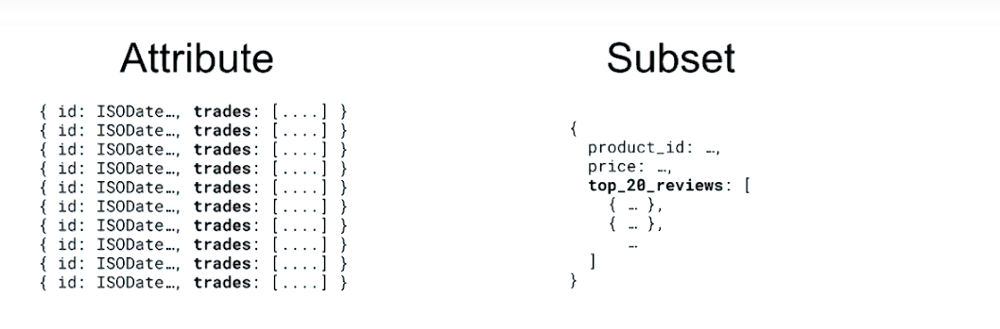

Muy bien, ahora analicemos otra operación común que los desarrolladores encuentran cuando usan un patrón one-to-end, como el atributo o los patrones de subconjunto, como las acciones negociadas en un momento dado o las 20 mejores reseñas de clientes para un producto.

¿Cómo trabajamos eficientemente con esos datos si nos gustaría realizar un análisis de marco de agregación?

Imaginemos que estamos trabajando con documentos de este esquema, que es el seguimiento de todas las transacciones de compra y venta en nuestra plataforma de negociación.

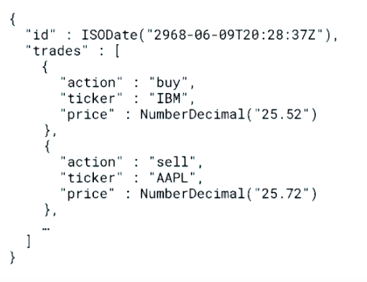

Nos gustaría analizar cuántas transacciones totales tenemos, así como cuántas compras y ventas se realizaron por marca de tiempo, y luego usar estos datos más adelante en nuestra pipeline.

En otras palabras, queremos agrupar datos en el documento, no entre documentos.

Echemos un vistazo a la colección y pensemos cómo podríamos lograr esto.

```sh
MongoDB Enterprise > db.stocks.findOne()
{
	"_id" : ObjectId("59de66b90e3733b1538628ce"),
	"id" : ISODate("3919-02-08T01:48:37Z"),
	"trades" : [
		{
			"action" : "sell",
			"ticker" : "MDB",
			"price" : NumberDecimal("25.96")
		},
		{
			"action" : "buy",
			"ticker" : "GOOG",
			"price" : NumberDecimal("25.94")
		},
		{
			"action" : "sell",
			"ticker" : "IBM",
			"price" : NumberDecimal("25.03")
		},
		{
			"action" : "sell",
			"ticker" : "AAPL",
			"price" : NumberDecimal("25.82")
		},
		{
			"action" : "buy",
			"ticker" : "IBM",
			"price" : NumberDecimal("25.87")
		},
...
```

OK, entonces tenemos nuestra `time stamp`, y luego tenemos nuestro array de intercambios con muchos, muchos documentos.

OK, este podría ser nuestro primer enfoque, donde unwind el array de operaciones y luego agrupamos en el tiempo y la acción, obtenemos la suma.

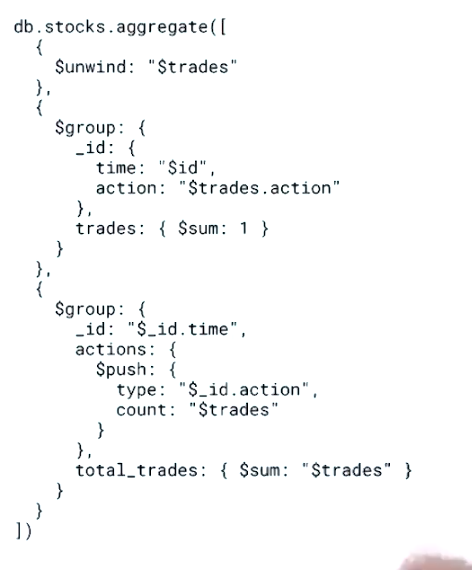

Y luego agrupe nuevamente, justo a tiempo, y empuje la acción y tenga en cuenta ese tipo de acción en un array, y luego obtenga el número total de acciones que realizamos por esa marca de tiempo.

Por lo tanto, deberíamos obtener acciones totales por documento con los números individuales de acciones de compra y venta.

Probémoslo.

OK, podemos ver que es la misma pipeline que la de la diapositiva anterior.

```sh
db.stocks.aggregate([
  {
    $unwind: "$trades"
  },
  {
    $group: {
      _id: {
        time: "$id",
        action: "$trades.action"
      },
      trades: { $sum: 1 }
    }
  },
  {
    $group: {
      _id: "$_id.time",
      actions: {
        $push: {
          type: "$_id.action",
          count: "$trades"
        }
      },
      total_trades: { $sum: "$trades" }
    }
  },
  {
    $sort: { total_trades: -1 }
  }
])
```

Unwind el array de operaciones, agrupamos en la time stamp y la acción, y luego agrupamos nuevamente solo en time stamp.

Hemos agregado la etapa de sort aquí, solo para asegurarnos de obtener pedidos consistentes para la comparación más adelante.

```sh
MongoDB Enterprise > db.stocks.aggregate([
...   {
...     $unwind: "$trades"
...   },
...   {
...     $group: {
...       _id: {
...         time: "$id",
...         action: "$trades.action"
...       },
...       trades: { $sum: 1 }
...     }
...   },
...   {
...     $group: {
...       _id: "$_id.time",
...       actions: {
...         $push: {
...           type: "$_id.action",
...           count: "$trades"
...         }
...       },
...       total_trades: { $sum: "$trades" }
...     }
...   },
...   {
...     $sort: { total_trades: -1 }
...   }
... ]).pretty()
{
	"_id" : ISODate("41628-09-13T05:21:57Z"),
	"actions" : [
		{
			"type" : "buy",
			"count" : 244
		},
		{
			"type" : "sell",
			"count" : 255
		}
	],
	"total_trades" : 499
}
{
	"_id" : ISODate("7087-12-23T11:35:17Z"),
	"actions" : [
		{
			"type" : "sell",
			"count" : 255
		},
		{
			"type" : "buy",
			"count" : 244
		}
	],
	"total_trades" : 499
}
{
	"_id" : ISODate("78704-07-11T21:21:57Z"),
	"actions" : [
		{
			"type" : "buy",
			"count" : 255
		},
		{
			"type" : "sell",
			"count" : 243
		}
	],
	"total_trades" : 498
}
{
	"_id" : ISODate("6137-04-25T06:15:17Z"),
	"actions" : [
		{
			"type" : "buy",
			"count" : 228
		},
		{
			"type" : "sell",
			"count" : 269
		}
	],
	"total_trades" : 497
}
{
	"_id" : ISODate("3602-03-20T08:01:57Z"),
	"actions" : [
		{
			"type" : "buy",
			"count" : 251
		},
		{
			"type" : "sell",
			"count" : 246
		}
	],
	"total_trades" : 497
}
{
	"_id" : ISODate("16277-09-16T23:08:37Z"),
	"actions" : [
		{
			"type" : "buy",
			"count" : 222
		},
		{
			"type" : "sell",
			"count" : 272
		}
	],
	"total_trades" : 494
}
{
	"_id" : ISODate("66979-09-10T11:35:17Z"),
	"actions" : [
		{
			"type" : "buy",
			"count" : 222
		},
		{
			"type" : "sell",
			"count" : 272
		}
	],
	"total_trades" : 494
}
{
	"_id" : ISODate("118949-03-22T23:08:37Z"),
	"actions" : [
		{
			"type" : "buy",
			"count" : 266
		},
		{
			"type" : "sell",
			"count" : 226
		}
	],
	"total_trades" : 492
}
{
	"_id" : ISODate("38776-09-18T13:21:57Z"),
	"actions" : [
		{
			"type" : "sell",
			"count" : 252
		},
		{
			"type" : "buy",
			"count" : 238
		}
	],
	"total_trades" : 490
}
{
	"_id" : ISODate("60958-10-31T09:48:37Z"),
	"actions" : [
		{
			"type" : "sell",
			"count" : 252
		},
		{
			"type" : "buy",
			"count" : 237
		}
	],
	"total_trades" : 489
}
{
	"_id" : ISODate("65395-04-03T18:41:57Z"),
	"actions" : [
		{
			"type" : "sell",
			"count" : 244
		},
		{
			"type" : "buy",
			"count" : 240
		}
	],
	"total_trades" : 484
}
{
	"_id" : ISODate("31805-03-12T06:15:17Z"),
	"actions" : [
		{
			"type" : "sell",
			"count" : 237
		},
		{
			"type" : "buy",
			"count" : 245
		}
	],
	"total_trades" : 482
}
{
	"_id" : ISODate("17228-05-16T04:28:37Z"),
	"actions" : [
		{
			"type" : "buy",
			"count" : 237
		},
		{
			"type" : "sell",
			"count" : 245
		}
	],
	"total_trades" : 482
}
{
	"_id" : ISODate("34974-01-24T16:01:57Z"),
	"actions" : [
		{
			"type" : "buy",
			"count" : 247
		},
		{
			"type" : "sell",
			"count" : 235
		}
	],
	"total_trades" : 482
}
{
	"_id" : ISODate("5503-07-17T18:41:57Z"),
	"actions" : [
		{
			"type" : "sell",
			"count" : 235
		},
		{
			"type" : "buy",
			"count" : 246
		}
	],
	"total_trades" : 481
}
{
	"_id" : ISODate("68247-03-30T10:41:57Z"),
	"actions" : [
		{
			"type" : "buy",
			"count" : 227
		},
		{
			"type" : "sell",
			"count" : 254
		}
	],
	"total_trades" : 481
}
{
	"_id" : ISODate("104055-07-08T03:35:17Z"),
	"actions" : [
		{
			"type" : "buy",
			"count" : 234
		},
		{
			"type" : "sell",
			"count" : 246
		}
	],
	"total_trades" : 480
}
{
	"_id" : ISODate("39093-08-08T07:08:37Z"),
	"actions" : [
		{
			"type" : "sell",
			"count" : 261
		},
		{
			"type" : "buy",
			"count" : 218
		}
	],
	"total_trades" : 479
}
{
	"_id" : ISODate("9939-12-19T03:35:17Z"),
	"actions" : [
		{
			"type" : "sell",
			"count" : 239
		},
		{
			"type" : "buy",
			"count" : 239
		}
	],
	"total_trades" : 478
}
{
	"_id" : ISODate("79972-01-28T20:28:37Z"),
	"actions" : [
		{
			"type" : "sell",
			"count" : 249
		},
		{
			"type" : "buy",
			"count" : 227
		}
	],
	"total_trades" : 476
}
Type "it" for more
MongoDB Enterprise > 

```

Muy bien, nos da los resultados que esperábamos: acciones totales y el número de acciones de compra y venta por documento.

Esta es una representación visual de la tubería anterior.

Los cuadrados negros son nuestros documentos.

Si comenzamos con cuatro documentos y desenrollamos un campo con solo tres entradas por documento, ahora tenemos 12 documentos.

Luego agrupamos nuestros documentos dos veces para producir los resultados deseados, terminando con la misma cantidad de documentos con los que comenzamos.

Esto debería comenzar a sentirse terriblemente ineficiente.

Lamentablemente, empeora.

Examinemos cómo esta ineficiencia impacta las operaciones en el entorno Shard D.

Cada fragmento realiza el desenrollado.

El procesamiento inicial para la primera etapa de grupo se realizará en los fragmentos.

Pero la agrupación final tiene que suceder en una sola ubicación.

Cualquier otra etapa, incluida la totalidad del segundo grupo, tendría lugar en ese lugar.

Imagínese si siguieran otras tres o cuatro etapas.

Cuando no se agrupa entre documentos, esto genera una sobrecarga innecesaria en el tráfico de red y hace que [INAUDIBLE] ,, después del grupo, se ejecute en la ubicación de la fusión, en lugar de permanecer distribuido.

Aquí, se nos muestra que la agrupación está ocurriendo en el fragmento A.

En realidad, podría ocurrir en cualquier lugar al azar en nuestro grupo.

Por lo tanto, realmente necesitamos una forma de iterar sobre la matriz y realizar nuestra lógica deseada dentro del documento.

Afortunadamente, tenemos las expresiones de mapa, reducción, filtro y acumulador disponibles en la etapa del proyecto para remediar este problema.

Examinemos esta tubería.

Obtendremos el tamaño de las matrices resultantes filtrando para eliminar la acción que no queremos para ese campo.

En este caso, solo permitimos documentos que tengan la acción de compra; aquí, la acción de venta.

Por último, solo obtendremos el tamaño de la matriz de intercambios para obtener la cantidad total de intercambios que tuvimos.

Ahora, esto parece casi demasiado simple, así que veámoslo en acción.

Nuevamente, esta es la misma tubería que en la diapositiva anterior.

La etapa de clasificación se agrega solo para garantizar que obtengamos resultados consistentes, de modo que podamos hacer comparaciones más adelante.

Impresionante: resultados funcionalmente idénticos.

Y diría que este formato es más fácil de razonar.

Veamos el resultado anterior para comparar.

Y aquí están los resultados de esa tubería anterior donde usamos el grupo doble.

Podemos ver que la información que aún queremos está incrustada en esta matriz de acciones.

Esta es una visualización de nuestra nueva tubería.

Nuestra nueva tubería produjo resultados funcionalmente idénticos, pero visualmente, podemos ver en la ejecución, es muy diferente.

En lugar de realizar un trabajo innecesario y posiblemente mover y colapsar nuestra tubería a una sola ubicación, lo que provoca una desaceleración en el uso adicional de la red, conservamos la misma cantidad de documentos que realizan el trabajo de manera específica y en su lugar.

Y en el entorno de fragmentos, los beneficios también son tangibles.

Hemos mantenido todo el trabajo distribuido entre los fragmentos.

Está bien, pero espera ... pero espera.

Todo eso está bien para la entrada esencialmente binaria, cuando queremos contar la ocurrencia de algo.

Pero, ¿qué pasa si queremos hacer algo más significativo?

¿Qué pasaría si quisiéramos saber cuántas veces se compró, vendió una acción específica y cuál fue el precio total de cada una?

Busquemos esa información para las acciones de MongoDB.

Nuevamente, las expresiones de mapa, reducción, filtro y acumulador disponibles en la etapa del proyecto son herramientas increíbles.**************Así que este es un ejemplo de canalización que produciría esos resultados para nosotros.

Primero, especificamos la expresión reducida.

Como matriz de entrada, seguiremos adelante y filtraremos la matriz de operaciones, filtrando cualquier ticker de acciones que no sea igual a MongoDB.

El valor inicial y el valor que se utilizará como el valor del acumulador, valor dólar-dólar-- vamos a especificar este documento, con dos claves-- comprar y vender-- que son documentos, con claves de conteo total y valor total.

Aquí, una entrada es nuestra lógica.

Comenzamos con esta expresión condicional, donde verificamos si esta acción de punto es igual a comprar.

Recuerde, dólar-dólar esto se refiere al elemento actual de la matriz de entrada.

Recuerde, filtramos eso, por lo que sabemos que solo obtendremos documentos que tengan MDB como símbolo de ticker.

Entonces, si se trata de una acción de compra, modificamos el recuento total agregando uno al valor dólar-dólar, punto de compra, recuento total de puntos.

Recuerde, el valor dólar-dólar se refiere al acumulador, que inicialmente configuramos como este valor aquí.

También modificamos el valor total agregando este precio de punto al valor dólar-dólar, punto de compra, valor total de punto.

Y si esta fue una acción de compra, no modificamos la venta de ninguna manera.

Simplemente lo reasignamos a sí mismo.

Si se trata de una acción de venta, esencialmente hacemos lo mismo, agregando uno al número total de ventas y agregando el precio de esta acción al valor total de ventas, y finalmente reasignando la recompra a sí mismo, porque esta fue una venta .

Podemos ver que, basado solo en MongoDB, el recuento total de compras fue de 10, y el recuento total de ventas fue de cinco para este documento específico.

También podemos ver el valor en dólares asociado con todas las transacciones.

Nuevamente, vemos 22 y 19 y el valor asociado.

Muy bien, hemos cubierto mucha información en esta lección.

Avancemos y resumamos de lo que hablamos.

Primero, evite etapas innecesarias.

El marco de agregación puede proyectar campos automáticamente si la forma final del documento de salida se puede determinar a partir de la entrada inicial.

En segundo lugar, use expresiones de acumulador, así como expresiones de mapa de dólar, reducción de dólar y filtro de dólar, en las etapas del proyecto antes de un desenrollado, si es posible.

Nuevamente, esto solo se aplica si necesita agrupar dentro de un documento, no entre sus documentos.

Por último, cada función de matriz de alto orden se puede implementar con dollar-reduce si las expresiones proporcionadas no satisfacen sus necesidades.

## 7. Examen Pipeline Optimization - Part 2

**Problem:**

Which of the following statements is/are true?

Check all answers that apply:

* The query in a `$match` stage can be entirely covered by an index

* The Aggregation Framework will automatically reorder stages in certain conditions

* Causing a merge in a sharded deployment will cause all subsequent pipeline stages to be performed in the same location as the merge

* The Aggregation Framework can automatically project fields if the shape of the final document is only dependent upon those fields in the input document.
